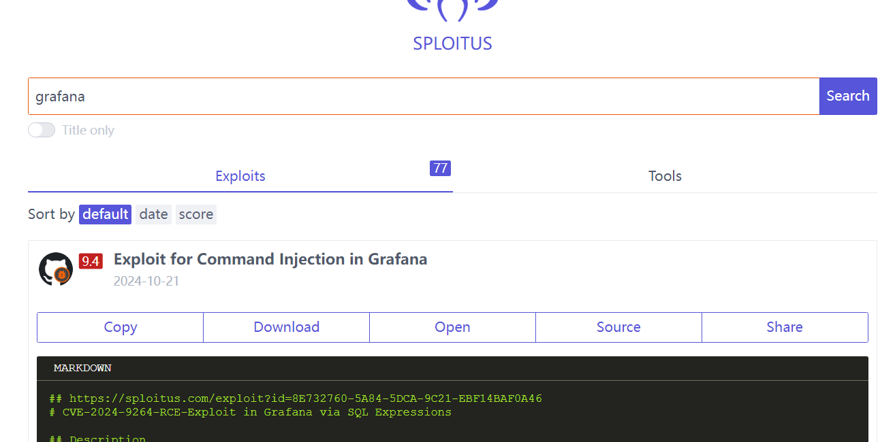
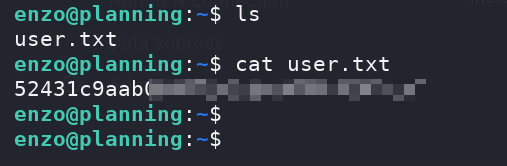
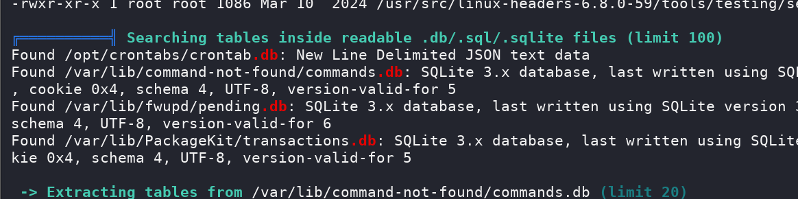
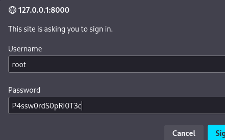
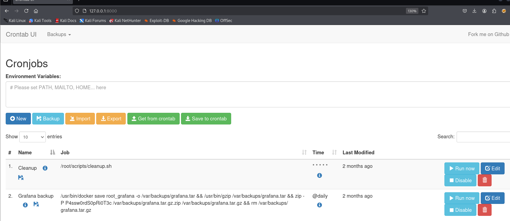
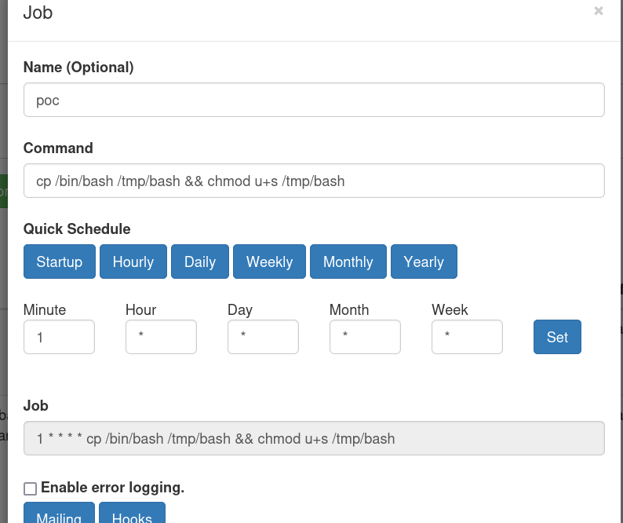
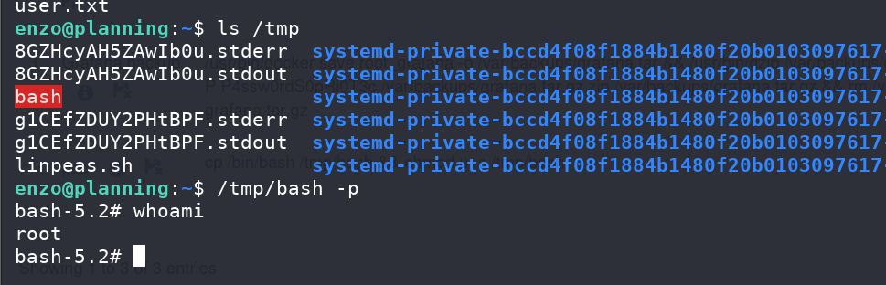

## Box Info

| OS | Linux |
| --- | --- |
| Difficulty | Easy |

As is common in real life pentests, you will start the Planning box with credentials for the following account: `admin` / `0D5oT70Fq13EvB5r`

## Nmap

```bash
[root@kali] /home/kali/Planning  
❯ nmap planning.htb -sV -A                 

PORT   STATE SERVICE VERSION
22/tcp open  ssh     OpenSSH 9.6p1 Ubuntu 3ubuntu13.11 (Ubuntu Linux; protocol 2.0)
| ssh-hostkey: 
|   256 62:ff:f6:d4:57:88:05:ad:f4:d3:de:5b:9b:f8:50:f1 (ECDSA)
|_  256 4c:ce:7d:5c:fb:2d:a0:9e:9f:bd:f5:5c:5e:61:50:8a (ED25519)
80/tcp open  http    nginx 1.24.0 (Ubuntu)
|_http-server-header: nginx/1.24.0 (Ubuntu)
|_http-title: Edukate - Online Education Website
```

`80`端口没有什么可以利用的东西，尝试爆破子域名

## Subdomain Fuzz

```bash
[root@kali] /home/kali/Planning  
❯ ffuf -u http://planning.htb/ -w /usr/share/fuzzDicts/subdomainDicts/main.txt -H "Host:FUZZ.planning.htb"  -fs 178

        /'___\  /'___\           /'___\       
       /\ \__/ /\ \__/  __  __  /\ \__/       
       \ \ ,__\\ \ ,__\/\ \/\ \ \ \ ,__\      
        \ \ \_/ \ \ \_/\ \ \_\ \ \ \ \_/      
         \ \_\   \ \_\  \ \____/  \ \_\       
          \/_/    \/_/   \/___/    \/_/       

       v2.1.0-dev
________________________________________________

 :: Method           : GET
 :: URL              : http://planning.htb/
 :: Wordlist         : FUZZ: /usr/share/fuzzDicts/subdomainDicts/main.txt
 :: Header           : Host: FUZZ.planning.htb
 :: Follow redirects : false
 :: Calibration      : false
 :: Timeout          : 10
 :: Threads          : 40
 :: Matcher          : Response status: 200-299,301,302,307,401,403,405,500
 :: Filter           : Response size: 178
________________________________________________

grafana                 [Status: 302, Size: 29, Words: 2, Lines: 3, Duration: 98ms]
```

添加`grafana.planning.htb`到`/etc/hosts`

## CVE-2024-9264

经过搜索我找到了一个可以拿到`shell`的`cve`



- [z3k0sec/CVE-2024-9264-RCE-Exploit: Grafana RCE exploit (CVE-2024-9264)](https://github.com/z3k0sec/CVE-2024-9264-RCE-Exploit)


当前应该是在`docker`环境中，需要逃逸出去

查看一下`env`环境变量

```text
GF_SECURITY_ADMIN_PASSWORD=RioTecRXXXXXXXXXXXXXXX
GF_SECURITY_ADMIN_USER=enzo
```

可以直接登录`ssh`



## Root



找到一个**json**文件

```bash
❯ cat crontab.db| jq
{
  "name": "Grafana backup",
  "command": "/usr/bin/docker save root_grafana -o /var/backups/grafana.tar && /usr/bin/gzip /var/backups/grafana.tar && zip -P P4ssw0rdS0pRi0T3c /var/backups/grafana.tar.gz.zip /var/backups/grafana.tar.gz && rm /var/backups/grafana.tar.gz",                                                                       
  "schedule": "@daily",
  "stopped": false,
  "timestamp": "Fri Feb 28 2025 20:36:23 GMT+0000 (Coordinated Universal Time)",
  "logging": "false",
  "mailing": {},
  "created": 1740774983276,
  "saved": false,
  "_id": "GTI22PpoJNtRKg0W"
}
{
  "name": "Cleanup",
  "command": "/root/scripts/cleanup.sh",
  "schedule": "* * * * *",
  "stopped": false,
  "timestamp": "Sat Mar 01 2025 17:15:09 GMT+0000 (Coordinated Universal Time)",
  "logging": "false",
  "mailing": {},
  "created": 1740849309992,
  "saved": false,
  "_id": "gNIRXh1WIc9K7BYX"
}
```

里面有一个密码：`P4ssw0rdS0pRi0T3c`，但不是`root`的密码

没有找到能用的东西，查看一下端口开放情况

```
enzo@planning:~$ ss -tuln
Netid         State          Recv-Q         Send-Q                 Local Address:Port                  Peer Address:Port        Process         
udp           UNCONN         0              0                         127.0.0.54:53                         0.0.0.0:*                           
udp           UNCONN         0              0                      127.0.0.53%lo:53                         0.0.0.0:*                           
tcp           LISTEN         0              151                        127.0.0.1:3306                       0.0.0.0:*                           
tcp           LISTEN         0              511                          0.0.0.0:80                         0.0.0.0:*                           
tcp           LISTEN         0              4096                       127.0.0.1:37121                      0.0.0.0:*                           
tcp           LISTEN         0              70                         127.0.0.1:33060                      0.0.0.0:*                           
tcp           LISTEN         0              4096                   127.0.0.53%lo:53                         0.0.0.0:*                           
tcp           LISTEN         0              4096                      127.0.0.54:53                         0.0.0.0:*                           
tcp           LISTEN         0              4096                       127.0.0.1:3000                       0.0.0.0:*                           
tcp           LISTEN         0              511                        127.0.0.1:8000                       0.0.0.0:*                           
tcp           LISTEN         0              4096                               *:22                               *:*     
```

注意到开放了一个`8000`端口，将其转发出来

```
[root@kali] /home/kali/Planning  
❯ ssh enzo@planning.htb -L 8000:127.0.0.1:8000   
```

尝试了一下，可以直接这样登录👇



实际上就是一个定时任务的`web`控制端



可以直接写入设置SUID的命令



运行之后即可看到成功提权



## Summary

User: 子域名爆破，用已知的用户名和密码登录到后台，通过`CVE`拿到`docker`容器的`shell`，在环境变量中拿到`enzo`的登录密码。

Root: 在`/opt/crontabs`目录下拿到一个密码，内网`8000`端口转发出去可以用于`web`登录，设置定时任务设置`bash`的`SUID`。
